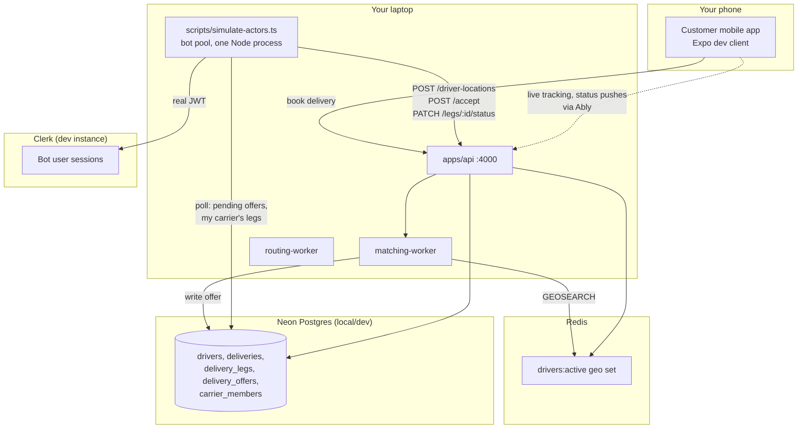

# Design Document: Actor Simulator

## Overview

A local dev/test tool that lets Et test SureWaka as a real customer on a physical mobile device while every other actor in a delivery — on-demand drivers and carrier intercity legs — is played by headless bots. The bots are real, Clerk-authenticated accounts calling the real local API (no auth bypass, no direct-write shortcuts on mutating actions), so what gets exercised is the actual matching, acceptance, leg-status, and location pipelines end to end.

Two pieces:

1. **Bot identity bootstrap** (`apps/api/scripts/seed-bot-actors.ts`) — one-time (idempotent) setup that creates real Clerk users + DB rows for a pool of driver and carrier_driver bots.
2. **Actor simulator** (`scripts/simulate-actors.ts`) — the CLI that runs those bots as concurrent state machines against a live local backend.

This is a dev-only testing tool, not a product feature — it must never run against a production `DATABASE_URL`/Clerk instance.

## Architecture



The bot pool never writes to Postgres or Redis directly for anything that would count as a real actor decision (accept, status change, location). It reads Postgres directly only to *discover* what it should do next — the same information a real driver app would learn from a push notification or an in-app list, just polled instead of pushed. This avoids building new production API surface (an Ably subscription or a "my legs" listing endpoint) purely to serve a test tool.

## Components and Interfaces

### Component 1: Bot Identity Bootstrap (`apps/api/scripts/seed-bot-actors.ts`)

Lives inside `apps/api` (not `packages/db`) specifically so it can import `apps/api/src/services/role-service.ts` (`assignRole`, `syncRolesToAuth`) directly — reusing the same role-assignment path a real admin action goes through, rather than hand-rolling Clerk `publicMetadata` sync. This keeps the script inside one app per the "never import across apps" rule.

For a configured count of driver bots (`--drivers`, default 5) and carrier bots (`--carriers`, default 1, requires at least one seeded carrier to attach to — reuses `seed-carriers.ts` output):

1. Skip creation if an *active* bot with that email already exists (idempotent; safe to re-run after `--drivers` count changes to top up the pool).
2. Create a real Clerk user via the Clerk Backend API: email `bot+driver-{n}@example.com` / `bot+carrier-{n}@example.com` (see "Implementation corrections" below for why not `.test`), a random password, `skipPasswordChecks`, and a real Nigerian mobile prefix phone number (also below).
3. Insert the matching `users` row (`clerkId` = the real Clerk user id, `role` = `'driver'` / `'carrier_driver'`).
4. For driver bots: insert a `drivers` row (`verified: true`, `available: false` initially, `vehicleType` cycled across the enum, a starting `lat`/`lng` from a fixed list of Lagos coordinates spread across zones — Ikeja, Lekki, Yaba, Surulere, VI — so at least one bot is plausibly near wherever the phone books from).
5. For carrier bots: insert a `carrier_members` row against the first active seeded carrier, `role: 'carrier_driver'` and `isActive: true`.
6. Call `assignRole` (→ `syncRolesToAuth`) so Clerk `publicMetadata.roles` carries `driver` / `carrier_driver`, exactly as it would for a real onboarded user.

Bots are identified purely by the `bot+` email convention — no new DB column, no migration. A `--reset` flag **deactivates** (not deletes) every bot — see "Implementation corrections" below for why.

Run: `pnpm --filter @surewaka/api seed:bot-actors -- --drivers 5 --carriers 1`

#### Implementation corrections (learned building this)

Three things in the original design didn't survive contact with the real system:

- **Email domain**: Clerk's live email-format validation rejects the `.test` TLD (RFC 2606-reserved but apparently not allow-listed). Switched to `bot+driver-N@example.com` — same identifying convention, different domain.
- **Phone number**: this Clerk instance requires a phone number at user creation, and validates it against real assigned carrier ranges — an invented prefix like `0900` is rejected. Bots use a real Nigerian mobile prefix (MTN's `803`) with a seed-derived suffix.
- **`--reset` can't hard-delete**: `role_audit_log.user_id` is a `NOT NULL`, non-cascading FK to `users.id` — by design, so audit history outlives the user. Once `assignRole` has run for a bot (which it always has, immediately at creation), the `users` row can never be deleted, only its role revoked. `--reset` was rewritten to revoke the bot's role (which syncs Clerk `publicMetadata` back to `['customer']`) and deactivate its `drivers`/`carrier_members` row, rather than deleting anything. This is fully reversible — a later bootstrap run reactivates a deactivated bot instead of erroring or creating a duplicate — and arguably safer than the original delete-based design anyway.

Two pre-existing bugs in `role-service.ts` surfaced and were fixed as prerequisites (both were blocking, not optional cleanup):

- `syncRolesToAuth` called Clerk's `updateUserMetadata` with the internal `users.id` UUID instead of the resolved `users.clerkId` — Clerk's API is keyed by clerk_id, so every role assignment via the admin API was silently failing to sync to Clerk (error caught and swallowed). Fixed to resolve `clerkId` first, matching the pattern already used in `profile-service.ts`.
- `assignRole` only checked for a duplicate *active* role before inserting, but `uq_user_roles_active` is an unconditional unique constraint on `(userId, role, scopeId)` — not partial on `is_active` despite its name. Reassigning a previously-revoked scoped role (e.g. `carrier_driver`) crashed with a raw Postgres unique-violation; reassigning a revoked unscoped role (e.g. `driver`) silently created a duplicate row instead (Postgres treats each NULL `scopeId` as distinct). Fixed `assignRole` to look up any existing row for the triple (active or not) and reactivate it via `UPDATE` when found, instead of always `INSERT`.

### Component 2: Session Token Provider (shared lib used by the simulator)

At simulator startup, for each bot: use the Clerk Backend API to mint a sign-in token for that user, then exchange it for a session and pull a real session JWT — the same JWT shape `requireAuth` verifies for any other client. Tokens are refreshed on a timer before expiry (Clerk session JWTs are short-lived, ~60s, so this runs continuously in the background per bot, same pattern a real mobile app's Clerk SDK does automatically).

This requires `CLERK_SECRET_KEY` for the same dev Clerk instance the API server verifies against — read via the script's own `dotenv` load (same pattern `seed-drivers.ts` already uses), not by Claude/an agent reading `.env` files.

### Component 3: Driver Bot State Machine

One async loop per driver bot, states:

- **`idle`**: POST `/driver-locations` every 2s at its current position (no `deliveryId`) — this is what makes it visible to `findNearbyDrivers`. Concurrently polls `delivery_offers` (read-only) every 2s for a `pending` row where `driverId` = this bot.
- **`deciding`**: on finding a pending offer, waits a small random beat (0.5–2s, scaled by `--speed`), then per `--accept-rate` either calls `POST /deliveries/:id/accept` or does nothing (lets the offer ride out to tier timeout/another driver, matching real "ignored offer" behavior — no explicit decline endpoint exists, so "ignore" is the only decline).
- **`en_route_pickup` → `delivered`**: on a successful accept, walks the fixed `ALLOWED_LEG_STATUSES` sequence (`accepted → en_route_pickup → arrived_pickup → picked_up → en_route_dropoff → arrived_dropoff → delivered`) via `PATCH /deliveries/:deliveryId/legs/:legId/status`, pacing each transition and interpolating `lat`/`lng` linearly between the leg's pickup and dropoff coordinates, sending a location ping (with `deliveryId` set, so it lands in the Postgres audit trail too) every 2s along the way. Total leg traversal time at `--speed 1` is scaled from the leg's actual distance at a plausible urban driving speed (~25 km/h); higher `--speed` divides that down.
- Back to **`idle`** after `delivered`.

### Component 4: Carrier Bot State Machine

Simpler — no offer/accept step, confirmed from `requireLegActor`: any `carrier_driver`/`carrier_admin` on the carrier can act on any of that carrier's legs.

- Polls `delivery_legs` every 2s for rows where `actorType = 'carrier'`, `actorId` = this bot's carrier, and `status` is not `delivered` and not already claimed by another bot in this run (in-process `Set` of leg ids currently being worked, since multiple carrier bots on the same carrier could otherwise both grab the same leg).
- On finding one, walks the same `ALLOWED_LEG_STATUSES` sequence via the same PATCH endpoint, paced by `--speed`. No GPS interpolation needed (carrier legs aren't rendered on a live map today) — location pings are skipped for carrier bots.

### Component 5: CLI Entry Point (`scripts/simulate-actors.ts`)

```
pnpm sim:actors -- [--drivers 5] [--carriers 1] [--speed 5] [--accept-rate 0.9] [--reset]
```

- Loads bot identities from the DB (by `bot+` email convention); if none exist, runs the bootstrap script first automatically.
- Starts all bot state machines concurrently in one process (plain `Promise.all` of async loops, no worker threads needed at this scale).
- Structured console logging per action: `[driver-bot-3] accepted offer <deliveryId>`, `[carrier-bot-1] leg <legId> → picked_up`, etc.
- `Ctrl+C` stops cleanly: in-flight bots finish their current HTTP call, then exit (no abrupt half-written state).

## Data Models

No schema changes. Reuses existing tables (`users`, `drivers`, `carrier_members`, `delivery_offers`, `delivery_legs`) and existing enums/statuses as-is. Bot rows are ordinary rows distinguished only by the `bot+*@surewaka.test` email convention on `users.email`.

## Error Handling

- **Bootstrap re-run with a changed `--drivers` count**: only tops up the difference; never duplicates or deletes existing bots (deletion is explicit via `--reset` only).
- **Clerk token mint fails for a bot** (network blip, rate limit): that bot logs the error and retries with backoff; other bots are unaffected.
- **Offer accept races and loses** (another driver/bot claimed first): `POST /accept` returns `{ matched: false }` — the bot logs it and returns to `idle`, same as a real driver losing the race.
- **API/worker not running when the simulator starts**: each HTTP call fails fast with a clear "connection refused" log line naming the bot and action; the bot keeps retrying its idle-loop rather than crashing the whole process, so starting the simulator before `pnpm dev` is warmed up degrades gracefully.
- **No seeded carrier exists** when `--carriers > 0`: bootstrap fails fast with a message to run `seed-carriers.ts` first, rather than silently creating zero carrier bots.

## Testing Strategy

This is a dev tool, not shipped product code — CI does not need to run it. Verification is manual:

1. `pnpm dev` locally, `pnpm --filter @surewaka/api tsx scripts/seed-bot-actors.ts` once.
2. `pnpm sim:actors -- --drivers 3 --carriers 1`, confirm console shows bots pinging location and going idle.
3. From the phone (mobile-customer dev client, pointed at the laptop's LAN IP), book an in-city on-demand delivery; confirm a bot logs picking up the offer, accepting, and walking through statuses, and that the customer app's live tracking reflects it.
4. Book (or admin-seed) a delivery with an intercity leg; confirm the carrier bot picks it up and progresses it.
5. Re-run bootstrap with a higher `--drivers` count; confirm only the delta is created. Run `--reset`; confirm all bot users, drivers, and carrier_members rows are gone.

## Security Considerations

- Gate both scripts behind a `NODE_ENV !== 'production'` check that refuses to run (or requires an explicit `--i-know-what-im-doing` flag) if `DATABASE_URL`/Clerk keys resolve to anything that doesn't look like the local/dev environment — this tool must never be able to spawn bot accounts or bot deliveries in production.
- Bot Clerk accounts use randomly generated passwords, never logged.

## Dependencies

- `ably` and `ioredis` are **not** needed by the simulator — discovery is DB polling, not pub/sub.
- Clerk Backend API (`@clerk/backend`, already a dependency via `packages/auth`) for user creation and session token minting.
- Existing `seed-carriers.ts` must have been run at least once before `--carriers > 0`.
