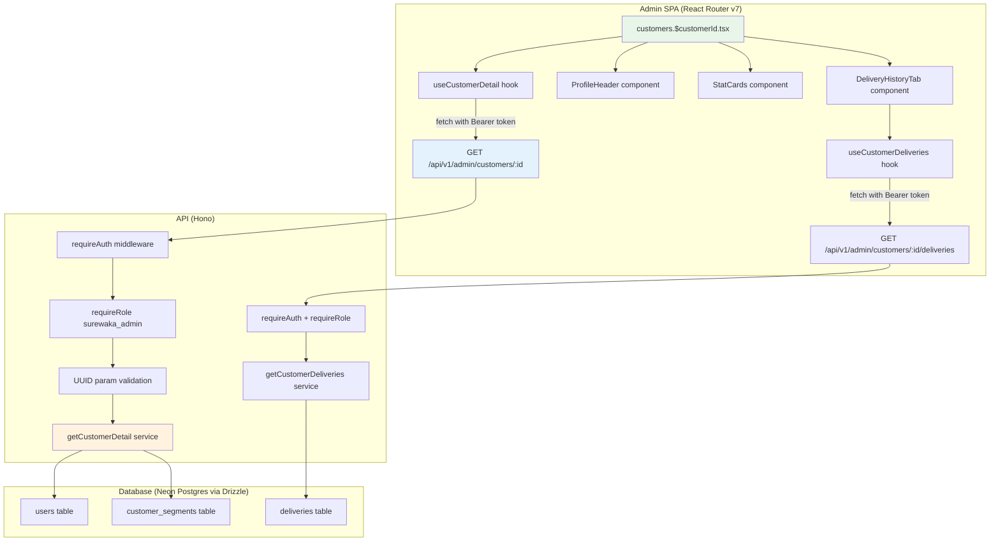
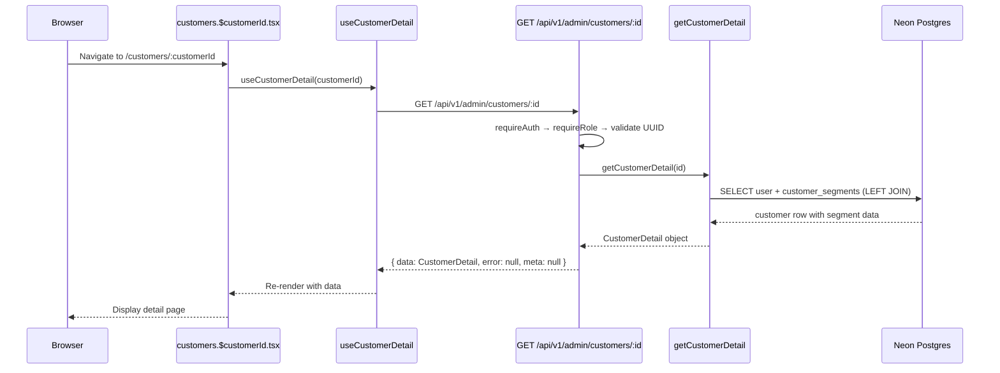
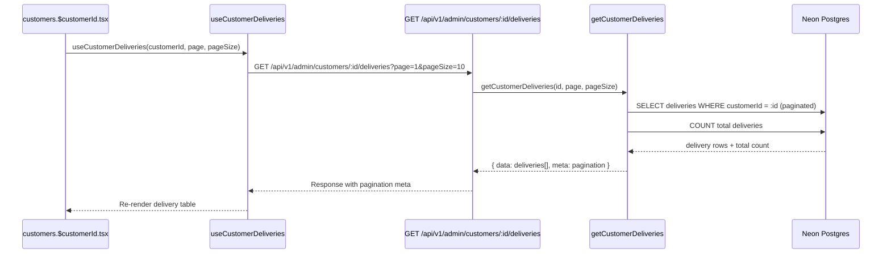

# Design Document: Admin Customer Detail

## Overview

The Admin Customer Detail feature provides a comprehensive `/customers/:customerId` route in the SureWaka admin dashboard. When an admin clicks a customer row in the listing table, they navigate to a detail page showing the customer's full profile, activity metrics, and delivery history.

The page follows a modern dashboard-style layout with a prominent profile header, stat cards for key metrics, and a tabbed content area for delivery history. The architecture mirrors the existing `drivers.$driverId.tsx` pattern: a Hono API endpoint returning joined customer data via Drizzle ORM, a shared `CustomerDetail` type in `@surewaka/shared`, and a React Router v7 page using shadcn/ui components with responsive Tailwind CSS styling.

The API handler is added to the existing `apps/api/src/routes/admin/customers.ts` as a `GET /:id` route. The frontend uses a dedicated `use-customer-detail` hook for data fetching with abort controller support, and the delivery history table supports server-side pagination.

## Architecture



### Data Flow Sequence





## Components and Interfaces

### Frontend Components

| Component | File | Responsibility |
|-----------|------|----------------|
| `CustomerDetailRoute` | `apps/admin/app/routes/customers.$customerId.tsx` | Page layout, error boundary, RoleGate, orchestration |
| `useCustomerDetail` | `apps/admin/app/hooks/use-customer-detail.ts` | Fetch customer profile + segment data from API |
| `useCustomerDeliveries` | `apps/admin/app/hooks/use-customer-deliveries.ts` | Fetch paginated delivery history |
| `ProfileHeader` | `apps/admin/app/components/customers/detail/profile-header.tsx` | Avatar, name, contact info, tier badge, verification status |
| `StatCards` | `apps/admin/app/components/customers/detail/stat-cards.tsx` | Metric cards: deliveries, spend, health score, last active |
| `DeliveryHistoryTable` | `apps/admin/app/components/customers/detail/delivery-history-table.tsx` | Paginated delivery table with status badges |
| `CustomerDetailSkeleton` | `apps/admin/app/components/customers/detail/customer-detail-skeleton.tsx` | Loading skeleton matching page layout |

### Backend Components

| Component | File | Responsibility |
|-----------|------|----------------|
| `GET /:id` handler | `apps/api/src/routes/admin/customers.ts` | Validate UUID, call service, format response |
| `GET /:id/deliveries` handler | `apps/api/src/routes/admin/customers.ts` | Validate UUID + pagination params, return paginated deliveries |
| `getCustomerDetail` | `apps/api/src/services/customer-detail-service.ts` | Build Drizzle query joining users + customer_segments |
| `getCustomerDeliveries` | `apps/api/src/services/customer-detail-service.ts` | Paginated delivery query for a customer |

### Shared Package Exports

| Export | File | Type |
|--------|------|------|
| `CustomerDetail` | `packages/shared/src/types.ts` | TypeScript type |
| `CustomerDeliveryItem` | `packages/shared/src/types.ts` | TypeScript type (delivery row) |
| `customerDetailDeliveryQuerySchema` | `packages/shared/src/validators.ts` | Zod schema for delivery pagination params |

### Hook Interface: `useCustomerDetail`

```typescript
type UseCustomerDetailResult = {
  customer: CustomerDetail | null;
  isLoading: boolean;
  error: string | null;
  refetch: () => void;
};

function useCustomerDetail(customerId: string): UseCustomerDetailResult;
```

### Hook Interface: `useCustomerDeliveries`

```typescript
type UseCustomerDeliveriesResult = {
  deliveries: CustomerDeliveryItem[];
  meta: PaginationMeta | null;
  isLoading: boolean;
  error: string | null;
  refetch: () => void;
};

function useCustomerDeliveries(
  customerId: string,
  page: number,
  pageSize: number,
): UseCustomerDeliveriesResult;
```

Both hooks follow the established pattern from `useDriverDetail` and `useCustomerData`:
- Use `@clerk/react` `useAuth()` for token retrieval
- Manage an `AbortController` to cancel in-flight requests on unmount or param change
- Silently ignore `AbortError`
- Set `error` state for non-2xx responses with the API error message

### API Endpoints

#### GET /api/v1/admin/customers/:id

```
Authorization: Bearer <clerk_token>

Path Parameters:
  id — UUID of the user record (role='customer')

Response 200:
{
  data: CustomerDetail,
  error: null,
  meta: null
}

Response 400 (invalid UUID):
{
  data: null,
  error: { code: "VALIDATION_ERROR", message: "Invalid customer ID format" },
  meta: null
}

Response 404 (customer not found):
{
  data: null,
  error: { code: "NOT_FOUND", message: "Customer not found" },
  meta: null
}
```

#### GET /api/v1/admin/customers/:id/deliveries

```
Authorization: Bearer <clerk_token>

Path Parameters:
  id — UUID of the customer (user record)

Query Parameters:
  page — Page number (default: 1, min: 1)
  pageSize — Items per page (default: 10, min: 1, max: 50)

Response 200:
{
  data: CustomerDeliveryItem[],
  error: null,
  meta: { total: number, page: number, pageSize: number, totalPages: number }
}
```

## Data Models

### CustomerDetail (shared type)

```typescript
export type CustomerDetail = {
  id: string;                          // users.id
  name: string;                        // users.name
  phone: string;                       // users.phone
  email: string | null;                // users.email
  avatarUrl: string | null;            // users.avatarUrl
  gender: string | null;               // users.gender
  verified: boolean;                   // users.verified
  createdAt: string;                   // users.createdAt (ISO string)
  notificationEmail: boolean;          // users.notificationEmail
  notificationSms: boolean;            // users.notificationSms
  // Segment data (nullable — customer may not have a segment row yet)
  tier: 'power' | 'regular' | 'new' | 'dormant' | null;
  totalDeliveries: number;             // customer_segments.totalDeliveries (0 if no segment)
  totalSpent: number;                  // customer_segments.totalSpent in kobo (0 if no segment)
  lastDeliveryAt: string | null;       // customer_segments.lastDeliveryAt (ISO string)
  primaryCity: string | null;          // customer_segments.primaryCity
  healthScore: number;                 // customer_segments.healthScore (0 if no segment)
};
```

### CustomerDeliveryItem (shared type)

```typescript
export type CustomerDeliveryItem = {
  id: string;                          // deliveries.id
  status: string;                      // deliveries.status
  pickupAddress: string;               // deliveries.pickupAddress
  pickupCity: string;                  // deliveries.pickupCity
  dropoffAddress: string;              // deliveries.dropoffAddress
  dropoffCity: string;                 // deliveries.dropoffCity
  packageDescription: string;          // deliveries.packageDescription
  packageCategory: string;             // deliveries.packageCategory
  price: number | null;                // deliveries.price
  amountPaid: number | null;           // deliveries.amountPaid (kobo)
  paymentStatus: string;               // deliveries.paymentStatus
  recipientName: string;               // deliveries.recipientName
  recipientPhone: string;              // deliveries.recipientPhone
  createdAt: string;                   // deliveries.createdAt (ISO string)
};
```

### Database Query Strategy

#### Query 1 — Customer profile with segment data (`getCustomerDetail`):

```sql
SELECT
  u.id, u.name, u.phone, u.email, u.avatar_url, u.gender,
  u.verified, u.created_at, u.notification_email, u.notification_sms,
  cs.tier, cs.total_deliveries, cs.total_spent, cs.last_delivery_at,
  cs.primary_city, cs.health_score
FROM users u
LEFT JOIN customer_segments cs ON cs.user_id = u.id
WHERE u.id = :id AND u.role = 'customer'
LIMIT 1;
```

#### Query 2 — Paginated deliveries (`getCustomerDeliveries`):

```sql
SELECT
  id, status, pickup_address, pickup_city, dropoff_address, dropoff_city,
  package_description, package_category, price, amount_paid,
  payment_status, recipient_name, recipient_phone, created_at
FROM deliveries
WHERE customer_id = :id
ORDER BY created_at DESC
LIMIT :pageSize OFFSET (:page - 1) * :pageSize;
```

#### Query 3 — Total count for pagination:

```sql
SELECT count(*)::int AS total
FROM deliveries
WHERE customer_id = :id;
```

## Algorithmic Pseudocode

### Service: getCustomerDetail

```typescript
import { db } from '@surewaka/db';
import { users, customerSegments } from '@surewaka/db';
import { eq, and } from 'drizzle-orm';
import type { CustomerDetail } from '@surewaka/shared';

export async function getCustomerDetail(id: string): Promise<CustomerDetail | null> {
  const [row] = await db
    .select({
      id: users.id,
      name: users.name,
      phone: users.phone,
      email: users.email,
      avatarUrl: users.avatarUrl,
      gender: users.gender,
      verified: users.verified,
      createdAt: users.createdAt,
      notificationEmail: users.notificationEmail,
      notificationSms: users.notificationSms,
      tier: customerSegments.tier,
      totalDeliveries: customerSegments.totalDeliveries,
      totalSpent: customerSegments.totalSpent,
      lastDeliveryAt: customerSegments.lastDeliveryAt,
      primaryCity: customerSegments.primaryCity,
      healthScore: customerSegments.healthScore,
    })
    .from(users)
    .leftJoin(customerSegments, eq(customerSegments.userId, users.id))
    .where(and(eq(users.id, id), eq(users.role, 'customer')))
    .limit(1);

  if (!row) return null;

  return {
    id: row.id,
    name: row.name,
    phone: row.phone,
    email: row.email,
    avatarUrl: row.avatarUrl,
    gender: row.gender,
    verified: row.verified,
    createdAt: row.createdAt.toISOString(),
    notificationEmail: row.notificationEmail,
    notificationSms: row.notificationSms,
    tier: row.tier ?? null,
    totalDeliveries: row.totalDeliveries ?? 0,
    totalSpent: row.totalSpent ?? 0,
    lastDeliveryAt: row.lastDeliveryAt?.toISOString() ?? null,
    primaryCity: row.primaryCity ?? null,
    healthScore: row.healthScore ?? 0,
  };
}
```

### Service: getCustomerDeliveries

```typescript
import { db } from '@surewaka/db';
import { deliveries } from '@surewaka/db';
import { eq, desc, sql } from 'drizzle-orm';
import type { CustomerDeliveryItem } from '@surewaka/shared';

type PaginatedDeliveries = {
  data: CustomerDeliveryItem[];
  total: number;
};

export async function getCustomerDeliveries(
  customerId: string,
  page: number,
  pageSize: number,
): Promise<PaginatedDeliveries> {
  const offset = (page - 1) * pageSize;

  const [countResult] = await db
    .select({ total: sql<number>`count(*)::int` })
    .from(deliveries)
    .where(eq(deliveries.customerId, customerId));

  const total = countResult?.total ?? 0;

  const rows = await db
    .select({
      id: deliveries.id,
      status: deliveries.status,
      pickupAddress: deliveries.pickupAddress,
      pickupCity: deliveries.pickupCity,
      dropoffAddress: deliveries.dropoffAddress,
      dropoffCity: deliveries.dropoffCity,
      packageDescription: deliveries.packageDescription,
      packageCategory: deliveries.packageCategory,
      price: deliveries.price,
      amountPaid: deliveries.amountPaid,
      paymentStatus: deliveries.paymentStatus,
      recipientName: deliveries.recipientName,
      recipientPhone: deliveries.recipientPhone,
      createdAt: deliveries.createdAt,
    })
    .from(deliveries)
    .where(eq(deliveries.customerId, customerId))
    .orderBy(desc(deliveries.createdAt))
    .limit(pageSize)
    .offset(offset);

  return {
    data: rows.map((r) => ({
      id: r.id,
      status: r.status,
      pickupAddress: r.pickupAddress,
      pickupCity: r.pickupCity,
      dropoffAddress: r.dropoffAddress,
      dropoffCity: r.dropoffCity,
      packageDescription: r.packageDescription,
      packageCategory: r.packageCategory,
      price: r.price,
      amountPaid: r.amountPaid,
      paymentStatus: r.paymentStatus,
      recipientName: r.recipientName,
      recipientPhone: r.recipientPhone,
      createdAt: r.createdAt.toISOString(),
    })),
    total,
  };
}
```

### UUID Validation

```typescript
const UUID_RE = /^[0-9a-f]{8}-[0-9a-f]{4}-[0-9a-f]{4}-[0-9a-f]{4}-[0-9a-f]{12}$/i;
```

### Route Handler

```typescript
// Added to apps/api/src/routes/admin/customers.ts

customerRoutes.get('/:id', async (c) => {
  const id = c.req.param('id');

  if (!UUID_RE.test(id)) {
    return c.json(
      { data: null, error: { code: 'VALIDATION_ERROR', message: 'Invalid customer ID format' }, meta: null },
      400,
    );
  }

  const customer = await getCustomerDetail(id);

  if (!customer) {
    return c.json(
      { data: null, error: { code: 'NOT_FOUND', message: 'Customer not found' }, meta: null },
      404,
    );
  }

  return c.json({ data: customer, error: null, meta: null }, 200);
});

customerRoutes.get('/:id/deliveries', async (c) => {
  const id = c.req.param('id');

  if (!UUID_RE.test(id)) {
    return c.json(
      { data: null, error: { code: 'VALIDATION_ERROR', message: 'Invalid customer ID format' }, meta: null },
      400,
    );
  }

  const query = c.req.query();
  const parsed = customerDetailDeliveryQuerySchema.safeParse(query);

  if (!parsed.success) {
    return c.json(
      { data: null, error: { code: 'VALIDATION_ERROR', message: parsed.error.errors[0].message }, meta: null },
      400,
    );
  }

  const { page, pageSize } = parsed.data;
  const result = await getCustomerDeliveries(id, page, pageSize);
  const totalPages = Math.ceil(result.total / pageSize);

  return c.json(
    { data: result.data, error: null, meta: { total: result.total, page, pageSize, totalPages } },
    200,
  );
});
```

## Key Functions with Formal Specifications

### Function: getCustomerDetail(id)

```typescript
function getCustomerDetail(id: string): Promise<CustomerDetail | null>
```

**Preconditions:**
- `id` is a valid UUID v4 string
- Database connection is available

**Postconditions:**
- Returns `CustomerDetail` object if a user with the given `id` exists and has `role = 'customer'`
- Returns `null` if no matching customer exists
- Segment fields default to zero/null when no `customer_segments` row exists for the user
- No side effects on the database (read-only)

### Function: getCustomerDeliveries(customerId, page, pageSize)

```typescript
function getCustomerDeliveries(customerId: string, page: number, pageSize: number): Promise<PaginatedDeliveries>
```

**Preconditions:**
- `customerId` is a valid UUID v4 string
- `page` >= 1
- `pageSize` >= 1 and <= 50
- Database connection is available

**Postconditions:**
- Returns `data` array with at most `pageSize` items
- Items are sorted by `createdAt` descending (most recent first)
- `total` reflects the exact count of all deliveries for the customer
- If customer has no deliveries, returns `{ data: [], total: 0 }`
- No side effects on the database (read-only)

**Loop Invariants:** N/A (single query, no iteration)

### Function: formatCurrency(kobo)

```typescript
function formatCurrency(kobo: number): string
```

**Preconditions:**
- `kobo` is a non-negative integer (amount in kobo/cents)

**Postconditions:**
- Returns a string in format `₦X,XXX` (Nigerian Naira)
- Divides by 100 to convert kobo to naira before formatting
- Uses `Intl.NumberFormat` with `en-NG` locale
- Never throws an exception for valid input

### Function: getHealthScoreColor(score)

```typescript
function getHealthScoreColor(score: number): { bg: string; text: string; label: string }
```

**Preconditions:**
- `score` is an integer between 0 and 100

**Postconditions:**
- Returns green styling for score >= 70 (label: "Healthy")
- Returns yellow styling for score >= 40 (label: "At Risk")
- Returns red styling for score < 40 (label: "Critical")
- Never throws an exception

## Frontend Layout & UI/UX Design

The page uses a clean, information-dense dashboard layout optimized for admin workflows. The design employs a vertical stack with clear information hierarchy.

### Page Structure

```
┌─────────────────────────────────────────────────────────────────────┐
│ ← Back to Customers                                                 │
├─────────────────────────────────────────────────────────────────────┤
│ ┌────────────────────────────────────────────────────────────────┐  │
│ │  PROFILE HEADER                                                │  │
│ │  ┌──────┐  Name             Tier Badge    Verified Badge       │  │
│ │  │Avatar│  email@example.com                                   │  │
│ │  │ 64px │  +234 803 XXX XXXX                                   │  │
│ │  └──────┘  Member since: Jan 2024 · Lagos                     │  │
│ └────────────────────────────────────────────────────────────────┘  │
├─────────────────────────────────────────────────────────────────────┤
│ ┌─────────────┐ ┌─────────────┐ ┌─────────────┐ ┌─────────────┐   │
│ │ Total       │ │ Total       │ │ Health      │ │ Last        │   │
│ │ Deliveries  │ │ Spent       │ │ Score       │ │ Active      │   │
│ │    42       │ │  ₦185,000   │ │   78/100    │ │  3 days ago │   │
│ │             │ │             │ │  ● Healthy  │ │             │   │
│ └─────────────┘ └─────────────┘ └─────────────┘ └─────────────┘   │
├─────────────────────────────────────────────────────────────────────┤
│  [Delivery History]  [Customer Info]                                │
├─────────────────────────────────────────────────────────────────────┤
│                                                                     │
│  ┌───────────────────────────────────────────────────────────────┐  │
│  │ Paginated Delivery Table                                      │  │
│  │ Status | Package | Route | Price | Date                       │  │
│  │ ─────────────────────────────────────────                     │  │
│  │ Delivered | Electronics | Lekki → VI | ₦4,500 | 2 Jan 2025   │  │
│  │ Cancelled | Documents  | Yaba → Ikeja| ₦2,800 | 28 Dec 2024  │  │
│  │ ...                                                           │  │
│  └───────────────────────────────────────────────────────────────┘  │
│                                                                     │
│  Showing 1-10 of 42          [← Previous]  [Next →]                │
└─────────────────────────────────────────────────────────────────────┘
```

### UI/UX Design Principles

1. **Information Hierarchy**: Profile header → Stats → Detail content. Users scan top-down.
2. **Stat Cards**: 4 cards in a responsive grid (4 cols on desktop, 2 on tablet, 1 on mobile). Each card shows a label, primary value, and optional contextual indicator.
3. **Health Score Visualization**: Color-coded progress indicator (green/yellow/red) with a text label for accessibility.
4. **Tier Badge**: Colored pill matching existing listing page styles (power=green, regular=blue, new=purple, dormant=gray).
5. **Delivery Table**: Clean, scannable rows with status pills, truncated addresses, and formatted dates. Pagination at the bottom.
6. **Responsive Design**: Full-width on mobile, comfortable max-width on desktop with appropriate spacing.
7. **Navigation**: Clear back link to customer listing. Row clicks in delivery table could link to delivery detail (future feature).
8. **Empty States**: Friendly message when customer has no deliveries yet.
9. **Loading States**: Skeleton loaders matching exact page layout to prevent layout shift.

### Tab Implementation

```typescript
import { Tabs, TabsList, TabsTrigger, TabsContent } from '~/components/ui/tabs';

<Tabs defaultValue="deliveries">
  <TabsList>
    <TabsTrigger value="deliveries">Delivery History</TabsTrigger>
    <TabsTrigger value="info">Customer Info</TabsTrigger>
  </TabsList>
  <TabsContent value="deliveries">
    <DeliveryHistoryTable customerId={customer.id} />
  </TabsContent>
  <TabsContent value="info">
    <CustomerInfoPanel customer={customer} />
  </TabsContent>
</Tabs>
```

### Stat Cards Component

```typescript
function StatCards({ customer }: { customer: CustomerDetail }) {
  const healthColor = getHealthScoreColor(customer.healthScore);

  return (
    <div className="grid grid-cols-1 gap-4 sm:grid-cols-2 lg:grid-cols-4">
      <Card>
        <CardHeader className="pb-2">
          <CardTitle className="text-sm font-medium text-muted-foreground">
            Total Deliveries
          </CardTitle>
        </CardHeader>
        <CardContent>
          <p className="text-2xl font-bold tabular-nums">{customer.totalDeliveries}</p>
        </CardContent>
      </Card>

      <Card>
        <CardHeader className="pb-2">
          <CardTitle className="text-sm font-medium text-muted-foreground">
            Total Spent
          </CardTitle>
        </CardHeader>
        <CardContent>
          <p className="text-2xl font-bold tabular-nums">
            {formatCurrency(customer.totalSpent)}
          </p>
        </CardContent>
      </Card>

      <Card>
        <CardHeader className="pb-2">
          <CardTitle className="text-sm font-medium text-muted-foreground">
            Health Score
          </CardTitle>
        </CardHeader>
        <CardContent>
          <p className="text-2xl font-bold tabular-nums">{customer.healthScore}/100</p>
          <span className={`text-xs font-medium ${healthColor.text}`}>
            ● {healthColor.label}
          </span>
        </CardContent>
      </Card>

      <Card>
        <CardHeader className="pb-2">
          <CardTitle className="text-sm font-medium text-muted-foreground">
            Last Active
          </CardTitle>
        </CardHeader>
        <CardContent>
          <p className="text-2xl font-bold">
            {customer.lastDeliveryAt ? formatRelativeTime(customer.lastDeliveryAt) : '—'}
          </p>
        </CardContent>
      </Card>
    </div>
  );
}
```

### Profile Header Component

```typescript
function ProfileHeader({ customer }: { customer: CustomerDetail }) {
  const initials = customer.name
    .split(' ')
    .map((n) => n[0])
    .join('')
    .slice(0, 2)
    .toUpperCase();

  return (
    <div className="flex items-start gap-6 rounded-lg border bg-card p-6">
      {/* Avatar */}
      {customer.avatarUrl ? (
        
      ) : (
        <div className="flex h-16 w-16 items-center justify-center rounded-full bg-muted text-lg font-semibold text-muted-foreground">
          {initials}
        </div>
      )}

      {/* Info */}
      <div className="flex-1 space-y-1">
        <div className="flex items-center gap-3">
          <h1 className="text-2xl font-bold tracking-tight">{customer.name}</h1>
          <TierBadge tier={customer.tier} />
          {customer.verified ? (
            <span className="inline-flex items-center gap-1 rounded-full bg-green-100 px-2 py-0.5 text-xs font-medium text-green-800 dark:bg-green-900/30 dark:text-green-400">
              <CheckCircle2 className="h-3 w-3" /> Verified
            </span>
          ) : (
            <span className="inline-flex items-center gap-1 rounded-full bg-gray-100 px-2 py-0.5 text-xs font-medium text-gray-600 dark:bg-gray-800/50 dark:text-gray-400">
              <XCircle className="h-3 w-3" /> Unverified
            </span>
          )}
        </div>

        <div className="flex flex-wrap items-center gap-4 text-sm text-muted-foreground">
          {customer.email && (
            <span className="flex items-center gap-1">
              <Mail className="h-4 w-4" /> {customer.email}
            </span>
          )}
          <span className="flex items-center gap-1">
            <Phone className="h-4 w-4" /> {customer.phone}
          </span>
        </div>

        <p className="text-xs text-muted-foreground">
          Member since {formatDate(customer.createdAt)}
          {customer.primaryCity && ` · ${customer.primaryCity}`}
        </p>
      </div>
    </div>
  );
}
```

### Delivery Status Badge

```typescript
const statusStyles: Record<string, string> = {
  delivered: 'bg-green-100 text-green-800 dark:bg-green-900/30 dark:text-green-400',
  cancelled: 'bg-red-100 text-red-800 dark:bg-red-900/30 dark:text-red-400',
  failed: 'bg-red-100 text-red-800 dark:bg-red-900/30 dark:text-red-400',
  returned: 'bg-orange-100 text-orange-800 dark:bg-orange-900/30 dark:text-orange-400',
  pending: 'bg-yellow-100 text-yellow-800 dark:bg-yellow-900/30 dark:text-yellow-400',
  en_route_pickup: 'bg-blue-100 text-blue-800 dark:bg-blue-900/30 dark:text-blue-400',
  en_route_dropoff: 'bg-blue-100 text-blue-800 dark:bg-blue-900/30 dark:text-blue-400',
  picked_up: 'bg-indigo-100 text-indigo-800 dark:bg-indigo-900/30 dark:text-indigo-400',
  draft: 'bg-gray-100 text-gray-600 dark:bg-gray-800/50 dark:text-gray-400',
};

function DeliveryStatusBadge({ status }: { status: string }) {
  const style = statusStyles[status] ?? statusStyles.draft;
  const label = status.replace(/_/g, ' ').replace(/\b\w/g, (c) => c.toUpperCase());

  return (
    <span className={`inline-flex items-center rounded-full px-2 py-0.5 text-xs font-medium ${style}`}>
      {label}
    </span>
  );
}
```

### Navigation from Customer Listing

The customer listing table rows become clickable links:

```typescript
// In customer-data-table.tsx, wrap row in a Link:
import { Link } from 'react-router';

<Link
  to={`/customers/${row.original.id}`}
  className="contents cursor-pointer"
>
  {/* existing row cells */}
</Link>
```

## Example Usage

```typescript
// Route file: apps/admin/app/routes/customers.$customerId.tsx
import { useParams, Link } from 'react-router';
import { useCustomerDetail } from '~/hooks/use-customer-detail';
import { ProfileHeader } from '~/components/customers/detail/profile-header';
import { StatCards } from '~/components/customers/detail/stat-cards';
import { DeliveryHistoryTable } from '~/components/customers/detail/delivery-history-table';
import { CustomerDetailSkeleton } from '~/components/customers/detail/customer-detail-skeleton';
import { ArrowLeft } from 'lucide-react';

function CustomerDetailPage() {
  const { customerId } = useParams();
  const { customer, isLoading, error, refetch } = useCustomerDetail(customerId!);

  if (isLoading) return <CustomerDetailSkeleton />;

  if (error) {
    return (
      <div className="flex flex-col items-center justify-center rounded-lg border py-16">
        <p className="mb-4 text-sm text-muted-foreground">{error}</p>
        <Button variant="outline" size="sm" onClick={refetch}>Retry</Button>
      </div>
    );
  }

  if (!customer) {
    return (
      <div className="flex flex-col items-center justify-center rounded-lg border py-16">
        <h2 className="mb-2 text-lg font-semibold">Customer not found</h2>
        <Link to="/customers" className="text-sm text-primary hover:underline">
          Back to customers
        </Link>
      </div>
    );
  }

  return (
    <div className="flex flex-col gap-6">
      {/* Back navigation */}
      <Link
        to="/customers"
        className="inline-flex items-center gap-1 text-sm text-muted-foreground hover:text-foreground"
      >
        <ArrowLeft className="h-4 w-4" /> Back to Customers
      </Link>

      {/* Profile header */}
      <ProfileHeader customer={customer} />

      {/* Stat cards */}
      <StatCards customer={customer} />

      {/* Tabbed content */}
      <Tabs defaultValue="deliveries">
        <TabsList>
          <TabsTrigger value="deliveries">Delivery History</TabsTrigger>
          <TabsTrigger value="info">Customer Info</TabsTrigger>
        </TabsList>
        <TabsContent value="deliveries">
          <DeliveryHistoryTable customerId={customer.id} />
        </TabsContent>
        <TabsContent value="info">
          <CustomerInfoPanel customer={customer} />
        </TabsContent>
      </Tabs>
    </div>
  );
}
```

## Correctness Properties

### Property 1: Valid customer returns complete response envelope

*For any* valid user ID that exists in the database with `role = 'customer'`, the API response SHALL have status 200, a non-null `data` field containing all required `CustomerDetail` fields (id, name, phone, email, avatarUrl, gender, verified, createdAt, notificationEmail, notificationSms, tier, totalDeliveries, totalSpent, lastDeliveryAt, primaryCity, healthScore), a null `error` field, and a null `meta` field.

**Validates: Requirements 1.1, 1.2, 3.1**

### Property 2: Segment data defaults when no segment row exists

*For any* customer without a corresponding `customer_segments` row, the API SHALL still return a valid `CustomerDetail` with `tier = null`, `totalDeliveries = 0`, `totalSpent = 0`, `lastDeliveryAt = null`, `primaryCity = null`, and `healthScore = 0`.

**Validates: Requirements 1.4**

### Property 3: Non-customer users are not returned

*For any* valid user ID where the user's `role` is NOT `'customer'`, the API SHALL return a 404 response. The detail endpoint never exposes driver, admin, or other role users.

**Validates: Requirements 1.3**

### Property 4: Delivery pagination correctness

*For any* valid customer ID and pagination parameters (page, pageSize), the deliveries endpoint SHALL return at most `pageSize` items, sorted by `createdAt` descending. The `meta.total` SHALL equal the exact count of all deliveries for that customer, and `meta.totalPages` SHALL equal `ceil(total / pageSize)`.

**Validates: Requirements 2.2, 2.3, 2.4**

### Property 5: Invalid UUID rejection

*For any* string that is not a valid UUID v4, both API endpoints SHALL return a 400 response with error code `VALIDATION_ERROR`.

**Validates: Requirements 1.5, 2.8**

### Property 6: Currency formatting consistency

*For any* non-negative integer (kobo amount), the `formatCurrency` function SHALL produce a string containing the Nigerian Naira symbol (₦) and the value divided by 100, formatted with thousand separators. It SHALL never throw an exception.

**Validates: Requirements 6.3**

### Property 7: Health score classification boundaries

*For any* integer score 0-100, `getHealthScoreColor` SHALL return: green/"Healthy" for score >= 70, yellow/"At Risk" for 40 <= score < 70, and red/"Critical" for score < 40. The function SHALL be total (no exceptions for valid input).

**Validates: Requirements 6.4**

## Error Handling

| Layer | Error | Handling |
|-------|-------|----------|
| API middleware | Missing/invalid auth token | Return 401 `{ data: null, error: { code: 'UNAUTHORIZED' }, meta: null }` |
| API middleware | User lacks `surewaka_admin` role | Return 403 `{ data: null, error: { code: 'FORBIDDEN' }, meta: null }` |
| API route | `:id` is not a valid UUID | Return 400 `{ data: null, error: { code: 'VALIDATION_ERROR', message: 'Invalid customer ID format' }, meta: null }` |
| API route | No customer found for valid UUID | Return 404 `{ data: null, error: { code: 'NOT_FOUND', message: 'Customer not found' }, meta: null }` |
| API route | Invalid pagination params | Return 400 with validation error |
| Service | Database query failure | Throw → Hono global error handler returns 500 |
| Frontend hook | Network failure / non-2xx | Set `error` state string, render error UI with Retry button |
| Frontend hook | Request aborted (navigation) | Silently ignore AbortError, do not update state |
| Frontend route | Unhandled exception | Error boundary class component catches, renders fallback |
| Frontend route | Non-admin user | `RoleGate` renders "Access Denied" fallback |

## Testing Strategy

### Unit Tests (Example-based)

- **Route registration**: Verify `customers/:customerId` exists in `app/routes.ts`
- **404 state**: Verify "Customer not found" message renders when API returns 404
- **Error state**: Verify error message + Retry button renders on API failure
- **Loading state**: Verify skeleton renders during loading
- **RoleGate**: Verify "Access Denied" renders for non-admin users
- **ProfileHeader**: Verify avatar (image or initials), name, badges, contact info render
- **StatCards**: Verify all 4 cards display correct values and health score color coding
- **DeliveryHistoryTable**: Verify table columns, pagination, empty state, status badges
- **CustomerInfoPanel**: Verify notification preferences, gender, joined date display

### Property-Based Tests (fast-check)

- **Property 1 (Response envelope)**: Generate random valid customer data, verify all fields present and correctly typed
- **Property 2 (Segment defaults)**: Generate customers without segments, verify default values
- **Property 3 (Role filtering)**: Generate users with various roles, verify only customers return 200
- **Property 4 (Pagination)**: Generate varying delivery counts, verify bounds and ordering
- **Property 5 (UUID validation)**: Generate random non-UUID strings, verify 400 rejection
- **Property 6 (Currency formatting)**: Generate random non-negative integers, verify Naira format
- **Property 7 (Health score)**: Generate scores 0-100, verify color classification boundaries

**Configuration**: Minimum 100 iterations per property test using `fast-check`.

### Integration Tests

- **Auth enforcement**: Verify 401 without token, 403 with non-admin token
- **End-to-end**: Seed DB with customer + segments + deliveries, hit API, verify full response
- **Pagination edge cases**: Empty deliveries, single page, last page partial

## Performance Considerations

- **Customer detail query**: Single query with LEFT JOIN to `customer_segments`. The `customer_segments` table has a unique index on `user_id`, making the join efficient (index scan).
- **Delivery pagination**: The `deliveries` table is indexed on `customer_id` (FK index). Adding `ORDER BY created_at DESC` benefits from a composite index `(customer_id, created_at DESC)` — if delivery volume grows, this index should be added.
- **Count query optimization**: For pagination total, a separate COUNT query is used. This is fast for reasonable delivery volumes per customer (<10,000 rows). If a customer has extreme volume, consider caching the count in `customer_segments.totalDeliveries`.
- **Frontend data fetching**: Delivery history uses its own hook with separate abort controller, so navigating between tabs doesn't re-fetch the profile. Profile data is fetched once on mount.
- **No waterfall**: Profile and initial delivery page load in parallel (the delivery hook fires on mount alongside the profile hook).

## Security Considerations

- **Authorization**: Both endpoints require `surewaka_admin` role via `requireRole` middleware. No customer can view another customer's data.
- **Data exposure**: The detail endpoint exposes customer PII (email, phone) only to authenticated admins. No sensitive data (passwords, Clerk IDs) is included in the response.
- **UUID validation**: Prevents injection attacks via the `:id` parameter by validating format before passing to the database query.
- **Rate limiting**: Inherits the global API rate limiting configuration.

## Dependencies

| Dependency | Purpose | Already in project |
|------------|---------|--------------------|
| `react-router` | Client routing and navigation | Yes |
| `@clerk/react` | Auth token retrieval | Yes |
| `@tanstack/react-table` | Delivery history table (optional) | Yes |
| `lucide-react` | Icons (ArrowLeft, Mail, Phone, CheckCircle2, etc.) | Yes |
| `shadcn/ui (Tabs, Card, Badge, Skeleton, Button)` | UI components | Yes |
| `drizzle-orm` | Database queries | Yes |
| `zod` | Pagination param validation | Yes |
| `@surewaka/shared` | Shared types and validators | Yes |
| `@surewaka/db` | Database client and schema | Yes |
