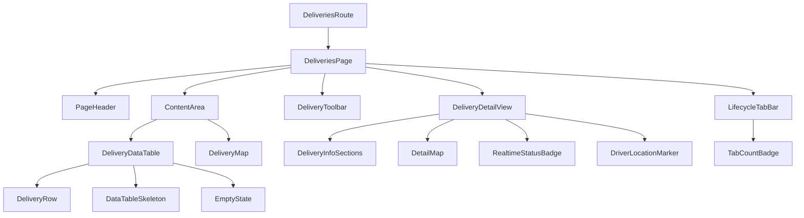
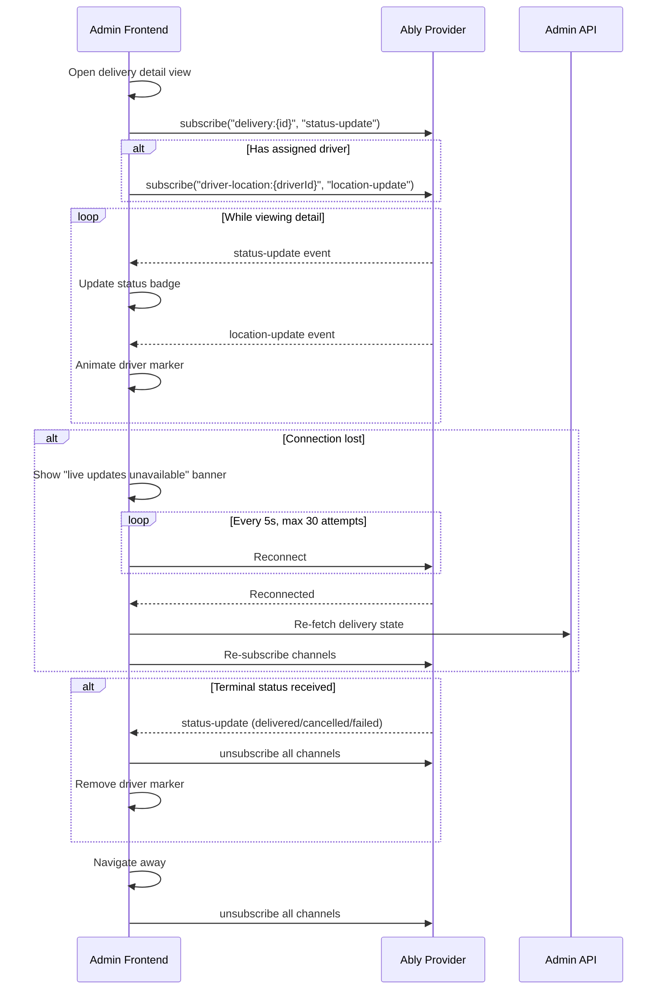

# Design Document: Admin Deliveries

## Overview

The Admin Deliveries feature replaces the current placeholder page at `/deliveries` in the admin dashboard with a fully functional delivery management interface. It introduces:

- A paginated, filterable, sortable data table displaying all delivery records
- Lifecycle tabs (All, Requests, Active, Completed) for quick phase-based filtering
- A detail view with full delivery information and route map visualization
- Real-time status updates and driver location tracking via Ably
- Dedicated admin API endpoints with joins, pagination, and validation
- An idempotent seed script generating realistic Nigerian delivery data

The system follows the existing monorepo architecture: the admin SPA (`apps/admin`) communicates with Hono API routes (`apps/api/src/routes/admin/`), which query Neon Postgres via Drizzle ORM (`packages/db`), and subscribe to Ably channels via the realtime provider (`packages/realtime`).

## Architecture

### High-Level Data Flow

```mermaid
graph TD
    subgraph "Admin Frontend (apps/admin)"
        A[Deliveries Page] --> B[Data Table]
        A --> C[Map View]
        A --> D[Detail View]
        D --> E[Realtime Subscriptions]
    end

    subgraph "API Layer (apps/api)"
        F[GET /api/v1/admin/deliveries]
        G[GET /api/v1/admin/deliveries/:id]
        H[requireAuth + requireRole middleware]
    end

    subgraph "Data Layer (packages/db)"
        I[(Neon Postgres)]
        J[Drizzle ORM Queries]
    end

    subgraph "Realtime (packages/realtime)"
        K[Ably Provider]
        L[delivery:{id} channel]
        M[driver-location:{driverId} channel]
    end

    A -->|HTTP GET| F
    A -->|HTTP GET| G
    F --> H --> J --> I
    G --> H --> J --> I
    E -->|WebSocket| K
    K --> L
    K --> M
```

### Request/Response Lifecycle

1. Admin navigates to `/deliveries` → frontend fetches `GET /api/v1/admin/deliveries?page=1&pageSize=20`
2. `requireAuth` verifies Clerk JWT → `requireRole('surewaka_admin')` checks admin access
3. Drizzle query joins `deliveries` with `users` (customer), `drivers`, and `carriers`
4. API returns paginated response with `{ data, error, meta }` shape
5. For detail view: frontend fetches `GET /api/v1/admin/deliveries/:id` and subscribes to Ably channels
6. Ably pushes `status-update` and `location-update` events to the frontend in real time

## Components and Interfaces

### API Routes

#### `GET /api/v1/admin/deliveries`

**Purpose:** List deliveries with pagination, filtering, sorting, and search.

**Request Query Parameters:**

| Parameter | Type | Default | Constraints |
|-----------|------|---------|-------------|
| `page` | integer | 1 | min 1 |
| `pageSize` | integer | 20 | min 1, max 100 |
| `search` | string | — | max 200 chars, matches customer name, customer phone, recipient name, recipient phone, pickup address, dropoff address |
| `status` | string | — | one of 12 delivery status enum values |
| `tab` | string | `all` | one of: all, requests, active, completed |
| `sortBy` | string | `createdAt` | one of: createdAt, status, customerName, price |
| `sortDir` | string | `desc` | one of: asc, desc |

**Response (200):**

```json
{
  "data": [
    {
      "id": "uuid",
      "status": "en_route_pickup",
      "pickupAddress": "12 Broad Street, Lagos Island",
      "pickupCity": "Lagos",
      "dropoffAddress": "45 Adeola Odeku, Victoria Island",
      "dropoffCity": "Lagos",
      "packageCategory": "parcel",
      "price": 2500,
      "createdAt": "2025-01-15T10:30:00Z",
      "updatedAt": "2025-01-15T11:00:00Z",
      "customerName": "Adewale Johnson",
      "customerPhone": "+2348012345678",
      "driverName": "Chinedu Okafor",
      "carrierName": "FastDeliver NG",
      "recipientName": "Ngozi Eze",
      "recipientPhone": "+2348098765432"
    }
  ],
  "error": null,
  "meta": {
    "total": 156,
    "page": 1,
    "pageSize": 20,
    "totalPages": 8,
    "tabCounts": {
      "all": 156,
      "requests": 23,
      "active": 45,
      "completed": 88
    }
  }
}
```

**Error Responses:**
- `400` — invalid query parameters
- `401` — missing or invalid token
- `403` — non-admin user

#### `GET /api/v1/admin/deliveries/:id`

**Purpose:** Fetch a single delivery with full related entity data.

**Response (200):**

```json
{
  "data": {
    "id": "uuid",
    "status": "en_route_dropoff",
    "pickupAddress": "12 Broad Street, Lagos Island",
    "pickupCity": "Lagos",
    "pickupLat": 6.4541,
    "pickupLng": 3.4015,
    "dropoffAddress": "45 Adeola Odeku, Victoria Island",
    "dropoffCity": "Lagos",
    "dropoffLat": 6.4281,
    "dropoffLng": 3.4219,
    "packageDescription": "Laptop and accessories",
    "packageWeight": 3.5,
    "packageCategory": "fragile",
    "deliveryNotes": "Handle with care, call on arrival",
    "price": 4500,
    "amountPaid": 4500,
    "paymentStatus": "escrowed",
    "createdAt": "2025-01-15T10:30:00Z",
    "updatedAt": "2025-01-15T14:22:00Z",
    "customer": {
      "id": "uuid",
      "name": "Adewale Johnson",
      "phone": "+2348012345678"
    },
    "driver": {
      "id": "uuid",
      "userId": "uuid",
      "name": "Chinedu Okafor",
      "vehicleType": "motorcycle",
      "licensePlate": "LAG-234-XY"
    },
    "carrier": {
      "id": "uuid",
      "name": "FastDeliver NG",
      "slug": "fastdeliver-ng"
    },
    "recipientName": "Ngozi Eze",
    "recipientPhone": "+2348098765432",
    "senderPhone": "+2348012345678"
  },
  "error": null,
  "meta": null
}
```

**Error Responses:**
- `400` — invalid UUID format
- `404` — delivery not found
- `401` / `403` — auth errors

### Frontend Component Hierarchy



**Component Responsibilities:**

| Component | File | Purpose |
|-----------|------|---------|
| `DeliveriesRoute` | `routes/deliveries.tsx` | Route entry, error boundary, meta |
| `DeliveriesPage` | `components/deliveries/deliveries-page.tsx` | Layout orchestrator, state management |
| `LifecycleTabBar` | `components/deliveries/lifecycle-tab-bar.tsx` | Tab navigation (All/Requests/Active/Completed) with count badges |
| `DeliveryToolbar` | `components/deliveries/delivery-toolbar.tsx` | Search input, status filter dropdown, sort controls |
| `DeliveryDataTable` | `components/deliveries/delivery-data-table.tsx` | Sortable data table with column headers |
| `DeliveryRow` | `components/deliveries/delivery-row.tsx` | Individual row with hover interactions |
| `DeliveryMap` | `components/deliveries/delivery-map.tsx` | Map with pickup/dropoff markers |
| `DeliveryDetailView` | `components/deliveries/delivery-detail-view.tsx` | Full detail panel with sections |
| `DetailMap` | `components/deliveries/detail-map.tsx` | Detail view map with route line + driver marker |
| `RealtimeStatusBadge` | `components/deliveries/realtime-status-badge.tsx` | Live-updating status indicator |
| `DriverLocationMarker` | `components/deliveries/driver-location-marker.tsx` | Animated driver position on map |

### Map Integration

**Library Choice: Mapbox GL JS**

Rationale:
- Superior vector tile performance for rendering 50+ markers simultaneously
- Built-in animated marker transitions (needed for driver location updates)
- GeoJSON source API simplifies adding/removing markers on filter changes
- Flyto/fitBounds APIs for viewport adjustments within 500ms requirement
- Free tier (50,000 map loads/month) sufficient for admin dashboard usage

**Alternative considered:** Leaflet — lighter but lacks smooth animated transitions for driver markers and has less performant marker clustering for the density expected.

**Implementation approach:**
- Use `react-map-gl` (v7) — the React wrapper around Mapbox GL JS, provides declarative `<Marker>`, `<Popup>`, and `<Source>/<Layer>` components
- Route lines drawn as GeoJSON LineString layers between pickup and dropoff coordinates
- Driver marker uses a custom icon with CSS transitions for position animation (300ms ease-in-out)
- Marker colors: Green (#16a34a) for pickup, Red (#dc2626) for dropoff, Blue (#2563eb) for driver
- Legend component overlaid on the map

### Realtime Integration

**Subscription Lifecycle:**



**Channel Management:**
- Use `CHANNELS.deliveryTracking(deliveryId)` and `CHANNELS.driverLocation(driverId)` from `@surewaka/realtime`
- Store unsubscribe functions in a React ref, clean up on unmount or navigation
- Reconnection logic uses exponential backoff capped at 5s intervals, max 30 attempts

### Seed Data Script

**Location:** `packages/db/src/seeds/seed-deliveries.ts`

**Strategy:**
- Uses a deterministic marker: creates records with a `delivery_notes` field containing `[SEED]` prefix
- Before seeding, deletes any existing records with the `[SEED]` marker (idempotent)
- Generates 60 deliveries across 3 cities (Lagos, Abuja, Port Harcourt) with realistic street-level addresses
- Distributes statuses: minimum 2 per status, weighted toward active statuses for better testing
- Creates 5 test customer users and 3 test drivers if they don't exist (marked with `[SEED]` in name)
- Timestamps distributed across the past 30 days using deterministic offsets

**Nigerian Address Data:**
- Lagos: Victoria Island, Lekki, Ikeja, Surulere, Yaba, Lagos Island
- Abuja: Garki, Wuse, Maitama, Asokoro, Gwarinpa
- Port Harcourt: GRA, Trans Amadi, Rumuokwurushi, Eliozu

## Data Models

### Delivery List Item (API Response)

```typescript
type DeliveryListItem = {
  id: string;
  status: DeliveryStatus;
  pickupAddress: string;
  pickupCity: string;
  dropoffAddress: string;
  dropoffCity: string;
  packageCategory: PackageCategory;
  price: number | null;
  createdAt: string;
  updatedAt: string;
  customerName: string;
  customerPhone: string;
  driverName: string | null;
  carrierName: string | null;
  recipientName: string;
  recipientPhone: string;
};
```

### Delivery Detail (API Response)

```typescript
type DeliveryDetail = {
  id: string;
  status: DeliveryStatus;
  pickupAddress: string;
  pickupCity: string;
  pickupLat: number;
  pickupLng: number;
  dropoffAddress: string;
  dropoffCity: string;
  dropoffLat: number;
  dropoffLng: number;
  packageDescription: string;
  packageWeight: number;
  packageCategory: PackageCategory;
  deliveryNotes: string | null;
  price: number | null;
  amountPaid: number | null;
  paymentStatus: string;
  createdAt: string;
  updatedAt: string;
  recipientName: string;
  recipientPhone: string;
  senderPhone: string | null;
  customer: {
    id: string;
    name: string;
    phone: string;
  };
  driver: {
    id: string;
    userId: string;
    name: string;
    vehicleType: string;
    licensePlate: string;
  } | null;
  carrier: {
    id: string;
    name: string;
    slug: string;
  } | null;
};
```

### Tab Count Response

```typescript
type TabCounts = {
  all: number;
  requests: number;
  active: number;
  completed: number;
};
```

### Realtime Event Payloads

```typescript
type StatusUpdatePayload = {
  deliveryId: string;
  previousStatus: DeliveryStatus;
  newStatus: DeliveryStatus;
  timestamp: string;
};

type LocationUpdatePayload = {
  driverId: string;
  lat: number;
  lng: number;
  heading: number;
  timestamp: string;
};
```

### Query Parameters Schema (Zod)

```typescript
import { z } from 'zod';

const deliveryStatusValues = [
  'draft', 'pending', 'accepted', 'en_route_pickup', 'arrived_pickup',
  'picked_up', 'en_route_dropoff', 'arrived_dropoff', 'delivered',
  'cancelled', 'failed', 'returned'
] as const;

const tabValues = ['all', 'requests', 'active', 'completed'] as const;

export const adminDeliveryListQuerySchema = z.object({
  page: z.coerce.number().int().min(1).default(1),
  pageSize: z.coerce.number().int().min(1).max(100).default(20),
  search: z.string().max(200).optional(),
  status: z.enum(deliveryStatusValues).optional(),
  tab: z.enum(tabValues).default('all'),
  sortBy: z.enum(['createdAt', 'status', 'customerName', 'price']).default('createdAt'),
  sortDir: z.enum(['asc', 'desc']).default('desc'),
});
```


## Correctness Properties

*A property is a characteristic or behavior that should hold true across all valid executions of a system — essentially, a formal statement about what the system should do. Properties serve as the bridge between human-readable specifications and machine-verifiable correctness guarantees.*

### Property 1: API pagination response correctness

*For any* valid page and pageSize query parameters, the API response SHALL return at most `pageSize` items in the data array, the meta.page SHALL equal the requested page, meta.totalPages SHALL equal `ceil(meta.total / pageSize)`, and the data array SHALL be ordered by the default sort (createdAt descending) when no explicit sort is provided.

**Validates: Requirements 1.1, 6.1**

### Property 2: API filtering and sorting correctness

*For any* valid combination of search, status, tab, sortBy, and sortDir query parameters, every item in the API response data array SHALL: (a) match the status filter if provided, (b) belong to the tab's lifecycle phase if tab is not "all", (c) contain the search string in at least one of customerName, customerPhone, recipientName, recipientPhone, pickupAddress, or dropoffAddress if search is provided, and (d) be ordered according to the sortBy field in the sortDir direction.

**Validates: Requirements 1.3, 1.4, 1.5, 6.2**

### Property 3: API detail response completeness

*For any* existing delivery ID, the detail endpoint response SHALL contain a non-null `customer` object with `id`, `name`, and `phone` fields, and SHALL contain a `driver` object (with `id`, `name`, `vehicleType`, `licensePlate`) when `driverId` is assigned or `null` when unassigned, and SHALL contain a `carrier` object (with `id`, `name`, `slug`) when `carrierId` is assigned or `null` when unassigned.

**Validates: Requirements 6.3, 6.4**

### Property 4: Invalid or non-existent delivery ID returns 404

*For any* string that is not a valid UUID format, or any valid UUID that does not correspond to an existing delivery record, the detail endpoint SHALL return a 404 status code with an error response.

**Validates: Requirements 6.5**

### Property 5: Invalid query parameters return 400

*For any* request to the list endpoint with query parameters that violate validation constraints (page < 1, pageSize > 100, invalid status value, invalid sortBy value, search exceeding 200 characters), the API SHALL return a 400 status code with an error response indicating which parameters are invalid.

**Validates: Requirements 6.8**

### Property 6: Tab lifecycle filter correctness

*For any* delivery dataset, when the tab parameter is "requests" all returned items SHALL have status in [draft, pending, accepted] ordered by createdAt ascending; when tab is "active" all returned items SHALL have status in [en_route_pickup, arrived_pickup, picked_up, en_route_dropoff, arrived_dropoff] ordered by updatedAt descending; when tab is "completed" all returned items SHALL have status in [delivered, cancelled, failed, returned] ordered by createdAt descending.

**Validates: Requirements 9.3, 9.4, 9.5**

### Property 7: Tab count badge accuracy

*For any* delivery dataset, the tabCounts in the API response SHALL satisfy: `tabCounts.requests + tabCounts.active + tabCounts.completed == tabCounts.all`, where requests counts records with status in [draft, pending, accepted], active counts records with status in [en_route_pickup, arrived_pickup, picked_up, en_route_dropoff, arrived_dropoff], and completed counts records with status in [delivered, cancelled, failed, returned].

**Validates: Requirements 9.6**

### Property 8: Coordinate validation for map markers

*For any* delivery record, if pickupLat is outside [4.0, 14.0] or pickupLng is outside [2.5, 14.5] or either is null, the pickup marker SHALL be omitted from the map and counted as unavailable; the same rule applies to dropoff coordinates. The unavailable count SHALL equal the number of deliveries with at least one invalid or missing coordinate.

**Validates: Requirements 3.6, 5.3**

### Property 9: Seed script idempotence

*For any* number of consecutive executions of the seed script (N >= 1), the total count of seed-marked delivery records in the database SHALL be identical after each execution — running the script N times produces the same result as running it once.

**Validates: Requirements 5.6**

### Property 10: Seed data field validity

*For any* record created by the seed script, the following constraints SHALL hold: recipientPhone matches the pattern `/^\+234[0-9]{10}$/`, packageDescription has length between 1 and 200, packageWeight is between 0.1 and 500.0, price is between 100 and 50000, pickupLat is between 4.0 and 14.0, pickupLng is between 2.5 and 14.5, and for any record with status beyond "accepted" (in active or completed phase), driverId SHALL be non-null.

**Validates: Requirements 5.7, 5.8**

### Property 11: Realtime channel subscription lifecycle

*For any* delivery detail view, when the delivery has an assigned driver the system SHALL subscribe to both the delivery channel (`delivery:{id}`) and driver location channel (`driver-location:{driverId}`); when the delivery has no assigned driver, only the delivery channel SHALL be subscribed. Upon receiving a terminal status event (delivered, cancelled, or failed) or upon navigation away from the detail view, all active channel subscriptions SHALL be unsubscribed.

**Validates: Requirements 8.1, 8.8, 8.10**

### Property 12: Elapsed time formatting

*For any* delivery createdAt timestamp, the elapsed time display SHALL format as "Xh Ym" when the elapsed duration is less than 24 hours (where X is whole hours and Y is remaining minutes), and SHALL format as "Xd Yh" when the elapsed duration is 24 hours or more (where X is whole days and Y is remaining hours).

**Validates: Requirements 9.13**

## Error Handling

### API Layer

| Scenario | HTTP Status | Error Code | Message |
|----------|-------------|------------|---------|
| Missing/invalid JWT token | 401 | `UNAUTHORIZED` | "Missing token" / "Invalid token" |
| No DB user for Clerk ID | 401 | `PROFILE_REQUIRED` | "User profile not found" |
| Non-admin role | 403 | `FORBIDDEN` | "Requires one of: surewaka_admin" |
| Invalid query params | 400 | `VALIDATION_ERROR` | Zod error messages joined |
| Invalid UUID format | 400 | `VALIDATION_ERROR` | "Invalid delivery ID format" |
| Delivery not found | 404 | `NOT_FOUND` | "Delivery not found" |
| Database error | 500 | `INTERNAL_ERROR` | "An unexpected error occurred" |

### Frontend Layer

| Scenario | Behavior |
|----------|----------|
| API returns error | Show error message with retry button (per resilience standards) |
| Network timeout | Show "Connection issue" with retry |
| Empty results (no filters) | Show empty state: icon + heading + body text |
| Empty results (with filters) | Show "No matching deliveries" + clear filters button |
| Realtime disconnection | Non-dismissible banner, auto-reconnect every 5s (30 max attempts) |
| Reconnection exhausted | Banner changes to "Reconnection failed" with manual retry button |
| Re-fetch after reconnect fails | Retain last known data, show error message, offer manual retry |
| Invalid coordinates | Omit marker, display unavailable count on map |

### Seed Script

| Scenario | Behavior |
|----------|----------|
| No existing users | Creates test users with `[SEED]` marker |
| No existing drivers | Creates test drivers with `[SEED]` marker |
| Previously seeded data exists | Deletes old seed records before re-seeding |
| Database connection failure | Logs error and exits with non-zero exit code |

## Testing Strategy

### Unit Tests

Focus on specific examples and edge cases:
- Detail view renders "Unassigned" when driver/carrier is null
- Empty state messages per lifecycle tab
- 404 page for non-existent delivery
- Status badge color mapping
- Search debounce fires only after 2+ characters
- Tab switching resets status filter but preserves search
- Reconnection banner state transitions

### Property-Based Tests

**Library:** [fast-check](https://github.com/dubzzz/fast-check) (TypeScript PBT library)

**Configuration:** Minimum 100 iterations per property test.

Each property test references its design document property:

```typescript
// Tag format example:
// Feature: admin-deliveries, Property 1: API pagination response correctness
```

Properties to implement:
1. **Pagination correctness** — generate random page/pageSize, verify response invariants
2. **Filtering/sorting correctness** — generate random filter combos, verify result invariants
3. **Detail response completeness** — generate random delivery with/without driver/carrier, verify structure
4. **404 for invalid IDs** — generate random non-UUID strings and non-existent UUIDs
5. **400 for invalid params** — generate random invalid query values
6. **Tab filter correctness** — generate random delivery arrays, apply tab filter, verify status constraints and ordering
7. **Tab count accuracy** — generate random delivery arrays, verify count arithmetic
8. **Coordinate validation** — generate random lat/lng including out-of-bounds, verify marker inclusion
9. **Seed idempotence** — run seed twice, verify no duplicates
10. **Seed field validity** — verify all generated records pass field constraints
11. **Channel subscription lifecycle** — generate delivery with/without driver, verify subscribe/unsubscribe behavior
12. **Elapsed time formatting** — generate random timestamps, verify format output

### Integration Tests

- API endpoints with real database (test environment)
- Seed script execution against test database
- Realtime event propagation (mocked Ably)
- Map marker rendering with Mapbox GL JS

### Test File Organization

```
apps/api/src/routes/admin/__tests__/
  deliveries.test.ts          # API unit + property tests
  deliveries.integration.ts   # Full API integration tests

apps/admin/app/components/deliveries/__tests__/
  delivery-data-table.test.tsx
  lifecycle-tab-bar.test.tsx
  delivery-map.test.tsx
  delivery-detail-view.test.tsx
  elapsed-time.test.ts        # Property test for formatting

packages/db/src/seeds/__tests__/
  seed-deliveries.test.ts     # Seed idempotence + field validity property tests
```
