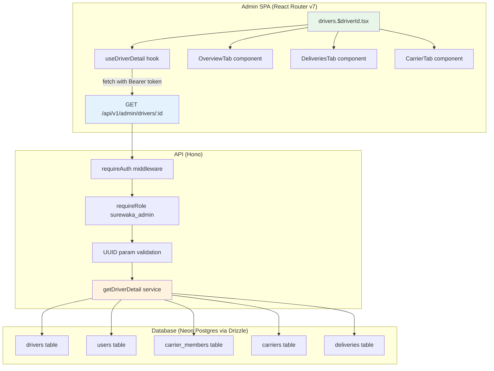
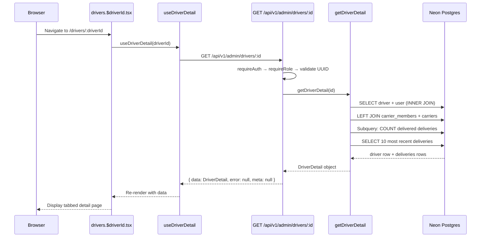

# Design Document: Admin Driver Detail

## Overview

The Admin Driver Detail feature provides a read-only `/drivers/:driverId` route in the SureWaka admin dashboard. It follows the same architecture as the existing user detail page (`users.$userId.tsx`): a Hono API endpoint returning full driver data via Drizzle ORM joins, a shared `DriverDetail` type in `@surewaka/shared`, and a React Router v7 page with tabbed layout (Overview, Deliveries, Carrier) using shadcn/ui components.

The API handler is added to the existing `apps/api/src/routes/admin/drivers.ts` as a `GET /:id` route. The frontend uses a dedicated `use-driver-detail` hook for data fetching with abort controller support.

## Architecture



### Data Flow Sequence



## Components and Interfaces

### Frontend Components

| Component | File | Responsibility |
|-----------|------|----------------|
| `DriverDetailRoute` | `apps/admin/app/routes/drivers.$driverId.tsx` | Page layout, error boundary, RoleGate, tab container |
| `useDriverDetail` | `apps/admin/app/hooks/use-driver-detail.ts` | Fetch driver detail from API with abort controller |
| `OverviewTab` | `apps/admin/app/components/drivers/detail/overview-tab.tsx` | Personal info, vehicle, status badges, performance metrics |
| `DeliveriesTab` | `apps/admin/app/components/drivers/detail/deliveries-tab.tsx` | Table of 10 most recent deliveries |
| `CarrierTab` | `apps/admin/app/components/drivers/detail/carrier-tab.tsx` | Carrier affiliation or independent status |

### Backend Components

| Component | File | Responsibility |
|-----------|------|----------------|
| `GET /:id` handler | `apps/api/src/routes/admin/drivers.ts` | Validate UUID param, call service, format response |
| `getDriverDetail` | `apps/api/src/services/driver-detail-service.ts` | Build Drizzle query with joins, fetch recent deliveries |

### Shared Package Exports

| Export | File | Type |
|--------|------|------|
| `DriverDetail` | `packages/shared/src/types.ts` | TypeScript type |
| `DriverDetailDelivery` | `packages/shared/src/types.ts` | TypeScript type (nested delivery item) |

### Hook Interface: `useDriverDetail`

```typescript
type UseDriverDetailResult = {
  driver: DriverDetail | null;
  isLoading: boolean;
  error: string | null;
  refetch: () => void;
};

function useDriverDetail(driverId: string): UseDriverDetailResult;
```

The hook follows the same pattern as `useEmployeeDetail`:
- Uses `@clerk/react` `useAuth()` for token retrieval
- Manages an `AbortController` to cancel in-flight requests on unmount or ID change
- Silently ignores `AbortError` (does not update state)
- Sets `error` state for non-2xx responses with the API error message

### API Endpoint

```
GET /api/v1/admin/drivers/:id
Authorization: Bearer <clerk_token>

Path Parameters:
  id — UUID of the driver record

Response 200:
{
  data: DriverDetail,
  error: null,
  meta: null
}

Response 400 (invalid UUID):
{
  data: null,
  error: { code: "VALIDATION_ERROR", message: "Invalid driver ID format" },
  meta: null
}

Response 404 (driver not found):
{
  data: null,
  error: { code: "NOT_FOUND", message: "Driver not found" },
  meta: null
}
```

### Service Interface

```typescript
function getDriverDetail(id: string): Promise<DriverDetail | null>;
```

Returns `null` when no matching driver exists. The route handler translates `null` to a 404 response.

## Data Models

### DriverDetail (shared type)

```typescript
export type DriverDetailDelivery = {
  id: string;
  status: string;
  pickupAddress: string;
  dropoffAddress: string;
  date: string;       // ISO string of deliveries.createdAt
  price: number;      // deliveries.price (0 if null)
};

export type DriverDetail = {
  id: string;                         // drivers.id
  name: string;                       // users.name
  phone: string;                      // users.phone
  email: string | null;               // users.email
  avatarUrl: string | null;           // users.avatarUrl
  vehicleType: 'motorcycle' | 'car' | 'van' | 'truck';
  vehicleModel: string;               // drivers.vehicleModel
  licensePlate: string;               // drivers.licensePlate
  verified: boolean;                  // drivers.verified
  available: boolean;                 // drivers.available
  rating: number;                     // drivers.rating
  totalDeliveries: number;            // COUNT(deliveries) WHERE status='delivered'
  createdAt: string;                  // drivers.createdAt (ISO string)
  carrierName: string | null;         // carriers.name via carrier_members
  carrierId: string | null;           // carrier_members.carrierId
  carrierRole: string | null;         // carrier_members.role
  carrierJoinedAt: string | null;     // carrier_members.joinedAt (ISO string)
  recentDeliveries: DriverDetailDelivery[];
};
```

### Database Query Strategy

The `getDriverDetail` service executes two queries:

**Query 1 — Driver profile with joins:**

```sql
SELECT
  d.id,
  u.name, u.phone, u.email, u.avatar_url,
  d.vehicle_type, d.vehicle_model, d.license_plate,
  d.verified, d.available, d.rating, d.created_at,
  cm.carrier_id, cm.role AS carrier_role, cm.joined_at AS carrier_joined_at,
  c.name AS carrier_name,
  (SELECT count(*)::int FROM deliveries WHERE driver_id = d.id AND status = 'delivered') AS total_deliveries
FROM drivers d
INNER JOIN users u ON d.user_id = u.id
LEFT JOIN carrier_members cm ON cm.user_id = d.user_id AND cm.is_active = true
LEFT JOIN carriers c ON c.id = cm.carrier_id
WHERE d.id = :id
LIMIT 1;
```

**Query 2 — Recent deliveries:**

```sql
SELECT id, status, pickup_address, dropoff_address, created_at, price
FROM deliveries
WHERE driver_id = :id
ORDER BY created_at DESC
LIMIT 10;
```

### Drizzle Implementation

```typescript
import { db } from '@surewaka/db';
import { drivers, users, carrierMembers, carriers, deliveries } from '@surewaka/db';
import { eq, and, sql, desc } from 'drizzle-orm';
import type { DriverDetail } from '@surewaka/shared';

export async function getDriverDetail(id: string): Promise<DriverDetail | null> {
  const totalDeliveriesSq = sql<number>`(
    SELECT count(*)::int FROM deliveries
    WHERE deliveries.driver_id = ${drivers.id}
    AND deliveries.status = 'delivered'
  )`;

  const [row] = await db
    .select({
      id: drivers.id,
      name: users.name,
      phone: users.phone,
      email: users.email,
      avatarUrl: users.avatarUrl,
      vehicleType: drivers.vehicleType,
      vehicleModel: drivers.vehicleModel,
      licensePlate: drivers.licensePlate,
      verified: drivers.verified,
      available: drivers.available,
      rating: drivers.rating,
      createdAt: drivers.createdAt,
      carrierId: carrierMembers.carrierId,
      carrierRole: carrierMembers.role,
      carrierJoinedAt: carrierMembers.joinedAt,
      carrierName: carriers.name,
      totalDeliveries: totalDeliveriesSq,
    })
    .from(drivers)
    .innerJoin(users, eq(drivers.userId, users.id))
    .leftJoin(
      carrierMembers,
      and(eq(carrierMembers.userId, drivers.userId), eq(carrierMembers.isActive, true)),
    )
    .leftJoin(carriers, eq(carriers.id, carrierMembers.carrierId))
    .where(eq(drivers.id, id))
    .limit(1);

  if (!row) return null;

  // Fetch 10 most recent deliveries
  const recentRows = await db
    .select({
      id: deliveries.id,
      status: deliveries.status,
      pickupAddress: deliveries.pickupAddress,
      dropoffAddress: deliveries.dropoffAddress,
      date: deliveries.createdAt,
      price: deliveries.price,
    })
    .from(deliveries)
    .where(eq(deliveries.driverId, id))
    .orderBy(desc(deliveries.createdAt))
    .limit(10);

  return {
    id: row.id,
    name: row.name,
    phone: row.phone,
    email: row.email,
    avatarUrl: row.avatarUrl,
    vehicleType: row.vehicleType,
    vehicleModel: row.vehicleModel,
    licensePlate: row.licensePlate,
    verified: row.verified,
    available: row.available,
    rating: row.rating ?? 0,
    totalDeliveries: row.totalDeliveries ?? 0,
    createdAt: row.createdAt.toISOString(),
    carrierName: row.carrierName ?? null,
    carrierId: row.carrierId ?? null,
    carrierRole: row.carrierRole ?? null,
    carrierJoinedAt: row.carrierJoinedAt?.toISOString() ?? null,
    recentDeliveries: recentRows.map((d) => ({
      id: d.id,
      status: d.status,
      pickupAddress: d.pickupAddress,
      dropoffAddress: d.dropoffAddress,
      date: d.date.toISOString(),
      price: d.price ?? 0,
    })),
  };
}
```

### UUID Validation

The route handler validates the `:id` param using a simple UUID regex before calling the service:

```typescript
const UUID_RE = /^[0-9a-f]{8}-[0-9a-f]{4}-[0-9a-f]{4}-[0-9a-f]{4}-[0-9a-f]{12}$/i;
```

## Error Handling

| Layer | Error | Handling |
|-------|-------|----------|
| API middleware | Missing/invalid auth token | Return 401 `{ data: null, error: { code: 'UNAUTHORIZED' }, meta: null }` |
| API middleware | User lacks `surewaka_admin` role | Return 403 `{ data: null, error: { code: 'FORBIDDEN' }, meta: null }` |
| API route | `:id` is not a valid UUID | Return 400 `{ data: null, error: { code: 'VALIDATION_ERROR', message: 'Invalid driver ID format' }, meta: null }` |
| API route | No driver found for valid UUID | Return 404 `{ data: null, error: { code: 'NOT_FOUND', message: 'Driver not found' }, meta: null }` |
| Service | Database query failure | Throw → Hono global error handler returns 500 |
| Frontend hook | Network failure / non-2xx | Set `error` state string, render error UI with Retry button |
| Frontend hook | Request aborted (navigation) | Silently ignore AbortError, do not update state |
| Frontend route | Unhandled exception | Error boundary class component catches, renders fallback |
| Frontend route | Non-admin user | `RoleGate` renders "Access Denied" fallback |

## Frontend Layout

The page follows the same structural pattern as `users.$userId.tsx`:

```
┌─────────────────────────────────────────────┐
│ ← Back to Drivers                           │
├─────────────────────────────────────────────┤
│ Driver Name                                 │
│ Driver detail profile                       │
├─────────────────────────────────────────────┤
│  [Overview]  [Deliveries]  [Carrier]        │
├─────────────────────────────────────────────┤
│                                             │
│  Tab content (sectional cards)              │
│                                             │
└─────────────────────────────────────────────┘
```

### Tab Implementation

Uses shadcn/ui `Tabs`, `TabsList`, `TabsTrigger`, `TabsContent` components. Tab state is managed locally (not URL-synced) since there are only three tabs and no deep-linking requirement.

```typescript
import { Tabs, TabsList, TabsTrigger, TabsContent } from '~/components/ui/tabs';

<Tabs defaultValue="overview">
  <TabsList>
    <TabsTrigger value="overview">Overview</TabsTrigger>
    <TabsTrigger value="deliveries">Deliveries</TabsTrigger>
    <TabsTrigger value="carrier">Carrier</TabsTrigger>
  </TabsList>
  <TabsContent value="overview"><OverviewTab driver={driver} /></TabsContent>
  <TabsContent value="deliveries"><DeliveriesTab deliveries={driver.recentDeliveries} /></TabsContent>
  <TabsContent value="carrier"><CarrierTab driver={driver} /></TabsContent>
</Tabs>
```

### Formatting Utilities

```typescript
// Date formatting — used in Overview (join date) and Deliveries (delivery date)
function formatDate(isoDate: string): string {
  return new Date(isoDate).toLocaleDateString('en-NG', {
    month: 'short',
    day: 'numeric',
    year: 'numeric',
  });
}

// Currency formatting — Nigerian Naira
function formatNaira(amount: number): string {
  return new Intl.NumberFormat('en-NG', {
    style: 'currency',
    currency: 'NGN',
    minimumFractionDigits: 0,
    maximumFractionDigits: 0,
  }).format(amount);
}
```

## Correctness Properties

*A property is a characteristic or behavior that should hold true across all valid executions of a system — essentially, a formal statement about what the system should do. Properties serve as the bridge between human-readable specifications and machine-verifiable correctness guarantees.*

### Property 1: Valid driver returns complete response envelope

*For any* valid driver ID that exists in the database, the API response SHALL have status 200, a non-null `data` field containing all required `DriverDetail` fields (id, name, phone, email, avatarUrl, vehicleType, vehicleModel, licensePlate, verified, available, rating, totalDeliveries, createdAt, carrierName, carrierId, carrierRole, carrierJoinedAt, recentDeliveries), a null `error` field, and a null `meta` field.

**Validates: Requirements 1.1, 1.2, 1.7**

### Property 2: Carrier affiliation consistency

*For any* returned `DriverDetail`, if `carrierName` is non-null then `carrierId`, `carrierRole`, and `carrierJoinedAt` must also be non-null (and vice versa: if `carrierId` is null, all carrier fields must be null). Additionally, the carrier fields must correspond to an active `carrier_members` record for that driver's user.

**Validates: Requirements 1.3**

### Property 3: Total deliveries aggregation accuracy

*For any* returned `DriverDetail`, the `totalDeliveries` field SHALL equal the count of records in the `deliveries` table where `driverId` equals the driver's id and `status` equals `'delivered'`.

**Validates: Requirements 1.4**

### Property 4: Recent deliveries bounded and ordered

*For any* returned `DriverDetail`, the `recentDeliveries` array SHALL contain at most 10 items, and the items SHALL be sorted by date in descending order (most recent first). Each item SHALL contain a valid `id`, `status`, `pickupAddress`, `dropoffAddress`, `date`, and `price` field.

**Validates: Requirements 1.6**

### Property 5: Invalid UUID rejection

*For any* string that is not a valid UUID v4, the API SHALL return a 400 response with error code `VALIDATION_ERROR`.

**Validates: Requirements 1.9**

### Property 6: Date formatting produces human-readable output

*For any* valid ISO 8601 date string, the `formatDate` function SHALL produce a string containing a recognizable month abbreviation, a numeric day, and a four-digit year, and SHALL never throw an exception.

**Validates: Requirements 4.7, 5.5**

### Property 7: Price formatting produces Naira currency string

*For any* non-negative number, the `formatNaira` function SHALL produce a string containing the Nigerian Naira symbol (₦) and the numeric value formatted with appropriate thousand separators, and SHALL never throw an exception.

**Validates: Requirements 5.6**

## Testing Strategy

### Unit Tests (Example-based)

- **Route registration**: Verify `drivers/:driverId` exists in `app/routes.ts`
- **404 state**: Verify "Driver not found" message renders when API returns 404
- **Error state**: Verify error message + Retry button renders on API failure
- **Loading state**: Verify skeleton renders during loading
- **RoleGate**: Verify "Access Denied" renders for non-admin users
- **OverviewTab**: Verify all fields render (avatar/placeholder, name, phone, email, vehicle details, badges, metrics)
- **DeliveriesTab**: Verify table columns, empty state, and status badges
- **CarrierTab**: Verify carrier info renders for affiliated driver, "Independent" label for unaffiliated

### Property-Based Tests (fast-check)

- **Property 1 (Response envelope)**: Generate random valid driver data, seed DB, call `getDriverDetail`, verify all fields present and non-null where required
- **Property 2 (Carrier consistency)**: Generate drivers with/without carrier memberships, verify null-consistency of carrier fields
- **Property 3 (Total deliveries)**: Generate random delivery counts per driver, verify aggregation matches direct count
- **Property 4 (Recent deliveries bounded)**: Generate drivers with varying delivery counts (0, 5, 15, 50), verify array length ≤ 10 and descending order
- **Property 5 (UUID validation)**: Generate random non-UUID strings, verify 400 rejection
- **Property 6 (Date formatting)**: Generate random valid ISO date strings, verify output structure
- **Property 7 (Price formatting)**: Generate random non-negative numbers, verify Naira symbol presence and no exceptions

**Configuration**: Minimum 100 iterations per property test using `fast-check`.

**Tag format**: `Feature: admin-driver-detail, Property {N}: {title}`

### Integration Tests

- **Auth enforcement**: Verify 401 without token, 403 with non-admin token (Requirements 8.1, 8.2)
- **End-to-end**: Seed DB with driver + deliveries + carrier, hit API, verify full response (Requirements 1.1–1.6)
