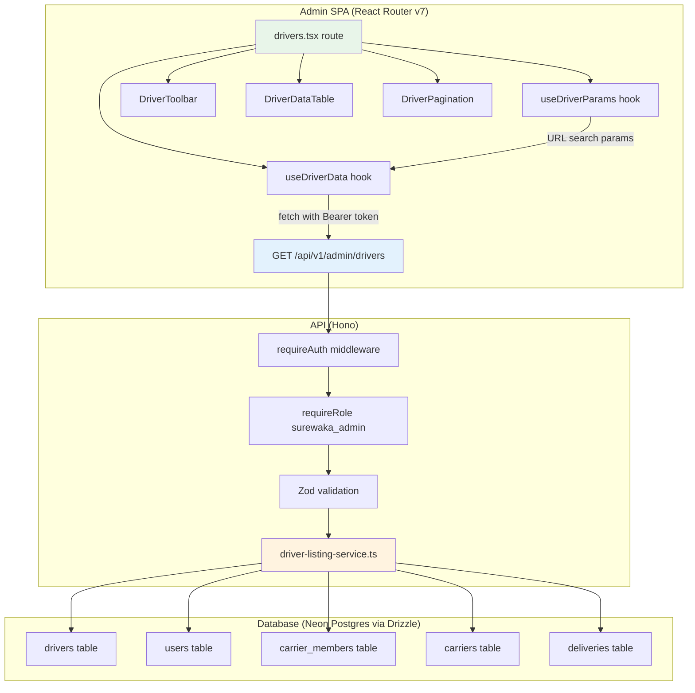
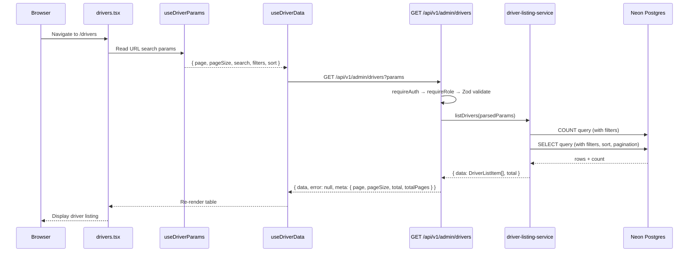

# Design Document: Admin Driver Listing

## Overview

The Admin Driver Listing feature provides a fully functional `/drivers` route in the SureWaka admin dashboard. It follows the exact architectural pattern established by the customer listing (`/customers`), adapted for driver-specific data: vehicle details, verification/availability status, performance metrics (rating, total deliveries), and carrier affiliation.

The stack mirrors the customer listing: a Hono API route with Drizzle ORM queries, a shared Zod schema + TypeScript type in `@surewaka/shared`, and a React Router v7 page composed of reusable hooks (`use-driver-params`, `use-driver-data`) and components (`driver-toolbar`, `driver-columns`, `driver-data-table`, `driver-pagination`).

## Architecture



### Data Flow Sequence



## Components and Interfaces

### Frontend Components

| Component | File | Responsibility |
|-----------|------|----------------|
| `DriversRoute` | `apps/admin/app/routes/drivers.tsx` | Page layout, error boundary, role gate, export handler |
| `useDriverParams` | `apps/admin/app/hooks/use-driver-params.ts` | Parse/write URL search params for filters, sort, pagination |
| `useDriverData` | `apps/admin/app/hooks/use-driver-data.ts` | Fetch driver data from API with abort controller |
| `DriverToolbar` | `apps/admin/app/components/drivers/driver-toolbar.tsx` | Search input + filter dropdowns + export button |
| `DriverDataTable` | `apps/admin/app/components/drivers/driver-data-table.tsx` | TanStack Table with server-side sort, skeleton, empty, error states |
| `DriverPagination` | `apps/admin/app/components/drivers/driver-pagination.tsx` | Page navigation + page size selector |
| `columns` | `apps/admin/app/components/drivers/driver-columns.tsx` | TanStack column definitions for DriverListItem |

### Backend Components

| Component | File | Responsibility |
|-----------|------|----------------|
| `driverRoutes` | `apps/api/src/routes/admin/drivers.ts` | Hono route handler: validate, call service, format response |
| `listDrivers` | `apps/api/src/services/driver-listing-service.ts` | Build Drizzle query with joins, filters, sort, pagination |

### Shared Package Exports

| Export | File | Type |
|--------|------|------|
| `driverListQuerySchema` | `packages/shared/src/validators.ts` | Zod schema |
| `DriverListQuery` | `packages/shared/src/validators.ts` | Inferred type from schema |
| `DriverListItem` | `packages/shared/src/types.ts` | TypeScript type |

### Hook Interface: `useDriverParams`

```typescript
type DriverParams = {
  page: number;
  pageSize: number;
  search: string;
  vehicleType: string | undefined;
  verified: string | undefined;
  available: string | undefined;
  carrierId: string | undefined;
  affiliation: string | undefined;
  sortBy: string;
  sortDir: 'asc' | 'desc';
};

type UseDriverParamsResult = {
  params: DriverParams;
  setPage: (page: number) => void;
  setPageSize: (size: number) => void;
  setSearch: (term: string) => void;
  setVehicleType: (type: string | undefined) => void;
  setVerified: (verified: string | undefined) => void;
  setAvailable: (available: string | undefined) => void;
  setCarrierId: (id: string | undefined) => void;
  setAffiliation: (affiliation: string | undefined) => void;
  toggleSort: (column: string) => void;
};
```

### Hook Interface: `useDriverData`

```typescript
type UseDriverDataResult = {
  data: DriverListItem[];
  meta: PaginationMeta | null;
  isLoading: boolean;
  error: string | null;
  refetch: () => void;
};
```

### API Endpoint

```
GET /api/v1/admin/drivers
Authorization: Bearer <clerk_token>

Query Parameters: (validated by driverListQuerySchema)
  page, pageSize, search, vehicleType, verified, available,
  carrierId, affiliation, sortBy, sortDir

Response 200:
{
  data: DriverListItem[],
  error: null,
  meta: { page, pageSize, total, totalPages }
}

Response 400:
{
  data: null,
  error: { code: "VALIDATION_ERROR", message: string },
  meta: null
}
```

### Service Interface

```typescript
type ListDriversResult = {
  data: DriverListItem[];
  total: number;
};

function listDrivers(params: DriverListQuery): Promise<ListDriversResult>;
```

## Data Models

### DriverListItem (shared type)

```typescript
type DriverListItem = {
  id: string;              // drivers.id
  name: string;            // users.name
  phone: string;           // users.phone
  email: string | null;    // users.email
  avatarUrl: string | null;// users.avatarUrl
  vehicleType: 'motorcycle' | 'car' | 'van' | 'truck'; // drivers.vehicleType
  licensePlate: string;    // drivers.licensePlate
  vehicleModel: string;    // drivers.vehicleModel
  verified: boolean;       // drivers.verified
  available: boolean;      // drivers.available
  rating: number;          // drivers.rating
  totalDeliveries: number; // COUNT(deliveries) WHERE status='delivered'
  carrierName: string | null;  // carriers.name via carrier_members
  carrierId: string | null;    // carrier_members.carrierId
  createdAt: string;       // drivers.createdAt (ISO string)
};
```

### DriverListQuery (Zod schema → type)

```typescript
// Zod schema
const driverListQuerySchema = z.object({
  page: z.coerce.number().int().min(1).default(1),
  pageSize: z.coerce.number().int().min(1).max(100).default(20),
  search: z.string().max(200).default(''),
  vehicleType: z.enum(['motorcycle', 'car', 'van', 'truck']).optional(),
  verified: z.enum(['true', 'false']).optional(),
  available: z.enum(['true', 'false']).optional(),
  carrierId: z.string().uuid().optional(),
  affiliation: z.enum(['independent', 'carrier']).optional(),
  sortBy: z.enum(['createdAt', 'rating', 'name', 'totalDeliveries']).default('createdAt'),
  sortDir: z.enum(['asc', 'desc']).default('desc'),
});

type DriverListQuery = z.infer<typeof driverListQuerySchema>;
```

### Database Query Strategy

The service function performs:

1. **Main FROM**: `drivers` table
2. **JOIN users**: `INNER JOIN users ON drivers.userId = users.id`
3. **LEFT JOIN carrier_members**: `LEFT JOIN carrier_members ON carrier_members.userId = drivers.userId AND carrier_members.isActive = true`
4. **LEFT JOIN carriers**: `LEFT JOIN carriers ON carriers.id = carrier_members.carrierId`
5. **Subquery for totalDeliveries**: `LEFT JOIN LATERAL (SELECT COUNT(*) FROM deliveries WHERE driverId = drivers.id AND status = 'delivered') AS delivery_counts`

Alternatively, use a correlated subquery in the SELECT for `totalDeliveries`:
```sql
(SELECT COUNT(*)::int FROM deliveries WHERE driver_id = drivers.id AND status = 'delivered') AS total_deliveries
```

The Drizzle implementation will use `sql<number>` for the subquery:

```typescript
const totalDeliveriesSq = sql<number>`(
  SELECT count(*)::int FROM deliveries
  WHERE deliveries.driver_id = ${drivers.id}
  AND deliveries.status = 'delivered'
)`;
```

### Sort Column Mapping

```typescript
const sortColumnMap = {
  createdAt: drivers.createdAt,
  rating: drivers.rating,
  name: users.name,
  totalDeliveries: totalDeliveriesSq,
} as const;
```

### Filter Logic

| Filter | SQL Condition |
|--------|---------------|
| `search` | `users.name ILIKE '%term%' OR users.phone ILIKE '%term%'` |
| `vehicleType` | `drivers.vehicle_type = :value` |
| `verified` | `drivers.verified = :boolean` |
| `available` | `drivers.available = :boolean` |
| `carrierId` | `carrier_members.carrier_id = :uuid` |
| `affiliation=independent` | `carrier_members.id IS NULL` |
| `affiliation=carrier` | `carrier_members.id IS NOT NULL` |

## Correctness Properties

*A property is a characteristic or behavior that should hold true across all valid executions of a system — essentially, a formal statement about what the system should do. Properties serve as the bridge between human-readable specifications and machine-verifiable correctness guarantees.*

### Property 1: Response envelope structure

*For any* valid query parameters sent to the Driver API, the response SHALL always contain a `data` array, `error` (null on success), and `meta` object with `page`, `pageSize`, `total`, and `totalPages` fields where `totalPages = Math.ceil(total / pageSize)`.

**Validates: Requirements 1.1, 1.13**

### Property 2: Filter correctness

*For any* combination of filter parameters (vehicleType, verified, available, carrierId, affiliation, search), all items in the returned `data` array SHALL satisfy every active filter constraint simultaneously. Specifically: if `vehicleType` is set, all items have that vehicleType; if `verified` is set, all items match that boolean; if `search` is set, all items have a name or phone containing the search term (case-insensitive).

**Validates: Requirements 1.5, 1.6, 1.7, 1.8, 1.9, 1.10, 1.11**

### Property 3: Sort ordering

*For any* valid `sortBy` column and `sortDir` direction, the returned `data` array SHALL be ordered according to that column and direction. For consecutive items `data[i]` and `data[i+1]`, the sort column value of `data[i]` precedes or equals `data[i+1]` in the specified direction.

**Validates: Requirements 1.12**

### Property 4: Carrier affiliation consistency

*For any* returned DriverListItem, if `carrierName` is non-null then `carrierId` must also be non-null (and vice versa). Additionally, if a driver has an active `carrier_members` record, their `carrierName` must equal the corresponding carrier's name from the `carriers` table.

**Validates: Requirements 1.3**

### Property 5: Total deliveries aggregation accuracy

*For any* returned DriverListItem, the `totalDeliveries` field SHALL equal the count of records in the `deliveries` table where `driverId` equals the driver's id and `status` equals `'delivered'`.

**Validates: Requirements 1.4**

### Property 6: URL params round-trip

*For any* set of driver filter/sort/pagination values written via the `useDriverParams` setters, reading the params back from the URL search params SHALL produce the same values that were set.

**Validates: Requirements 3.8**

### Property 7: Filter and page-size changes reset page

*For any* filter setter call (setVehicleType, setVerified, setAvailable, setAffiliation, setCarrierId, setSearch) or page-size change (setPageSize), the resulting URL params SHALL have page reset to 1 (or the `page` param removed from the URL).

**Validates: Requirements 3.7, 4.4**

### Property 8: CSV export contains all required columns

*For any* non-empty array of DriverListItem objects passed to the CSV export function, the generated CSV string SHALL contain all required column headers (Name, Phone, Email, Vehicle Type, License Plate, Vehicle Model, Verified, Available, Rating, Total Deliveries, Carrier, Joined) and each row SHALL contain the corresponding field values.

**Validates: Requirements 5.3**

### Property 9: Schema validation constraints

*For any* input object, the `driverListQuerySchema` SHALL: accept `page` values that are positive integers and reject non-positive; accept `pageSize` values in [1, 100] and reject values outside; accept `search` strings of length ≤ 200 and reject longer; accept only valid enum values for `vehicleType`, `verified`, `available`, `affiliation`, and `sortBy`/`sortDir`; and accept `carrierId` only when it is a valid UUID.

**Validates: Requirements 6.2, 6.3, 6.4, 6.5, 6.6, 6.7, 6.8, 6.9, 6.10, 6.11**

## Error Handling

| Layer | Error | Handling |
|-------|-------|----------|
| API middleware | Missing/invalid auth token | Return 401 `{ data: null, error: { code: 'UNAUTHORIZED' }, meta: null }` |
| API middleware | User lacks `surewaka_admin` role | Return 403 `{ data: null, error: { code: 'FORBIDDEN' }, meta: null }` |
| API route | Zod validation failure | Return 400 `{ data: null, error: { code: 'VALIDATION_ERROR', message }, meta: null }` |
| Service | Database query failure | Throw → Hono global error handler returns 500 |
| Frontend hook | Network failure / non-2xx | Set `error` state string, render error UI with Retry button |
| Frontend hook | Request aborted (param change) | Silently ignore AbortError, do not update state |
| Frontend route | Unhandled exception | `CustomersErrorBoundary`-style class component catches, renders fallback |
| Frontend route | Non-admin user | `RoleGate` renders "Access Denied" fallback |

## Testing Strategy

### Unit Tests (Example-based)

- **driver-columns**: Verify all 9 columns are defined with correct IDs and sorting config
- **DriverToolbar**: Verify search input, filter dropdowns, and export button render correctly
- **DriverDataTable**: Verify loading/empty/error states render appropriate UI
- **DriverPagination**: Verify disabled states on first/last page
- **Route**: Verify RoleGate renders access denied for non-admin

### Property-Based Tests (fast-check)

- **Property 2 (Filter correctness)**: Generate random filter combinations + seed data, call `listDrivers`, assert all returned items match all active filters
- **Property 3 (Sort ordering)**: Generate random sortBy/sortDir + seed data, verify ordering invariant
- **Property 5 (Total deliveries)**: Generate random drivers with varying delivery counts, verify aggregation matches direct count
- **Property 6 (URL round-trip)**: Generate random param objects, set via hook, read back, compare
- **Property 7 (Page reset)**: Generate random current params + filter change, verify page=1 after
- **Property 8 (CSV columns)**: Generate random DriverListItem arrays, verify CSV output structure
- **Property 9 (Schema validation)**: Generate random valid/invalid inputs, verify schema accept/reject behavior

**Configuration**: Minimum 100 iterations per property test using `fast-check`.

**Tag format**: `Feature: admin-driver-listing, Property {N}: {title}`

### Integration Tests

- **Auth enforcement**: Verify 401 without token, 403 with non-admin token (Requirements 8.1, 8.2)
- **End-to-end query**: Seed DB, hit API, verify response shape and content (Requirements 1.1, 1.15)
