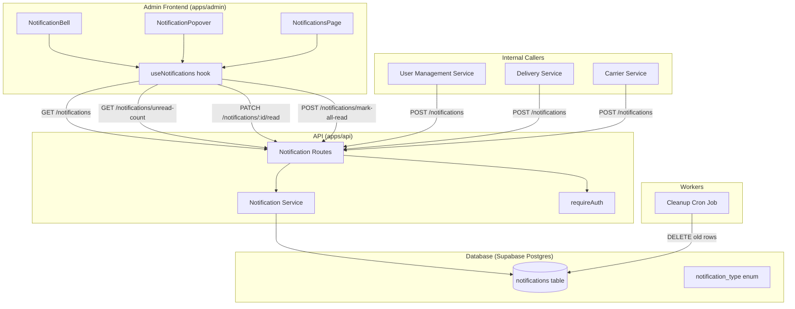
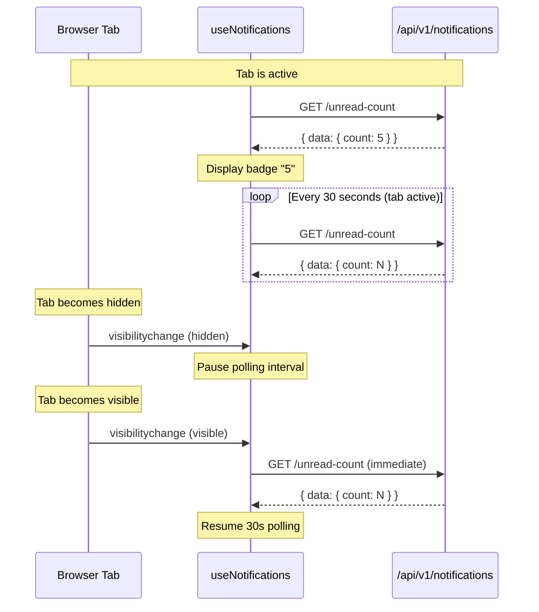
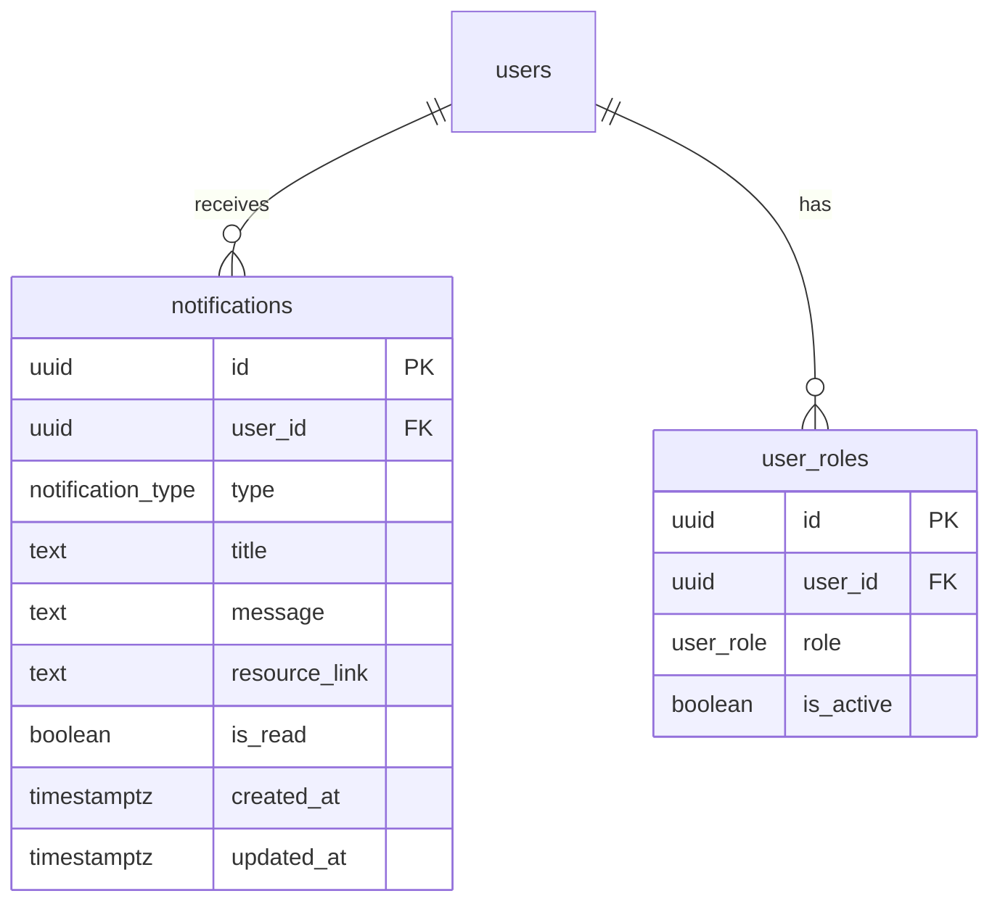
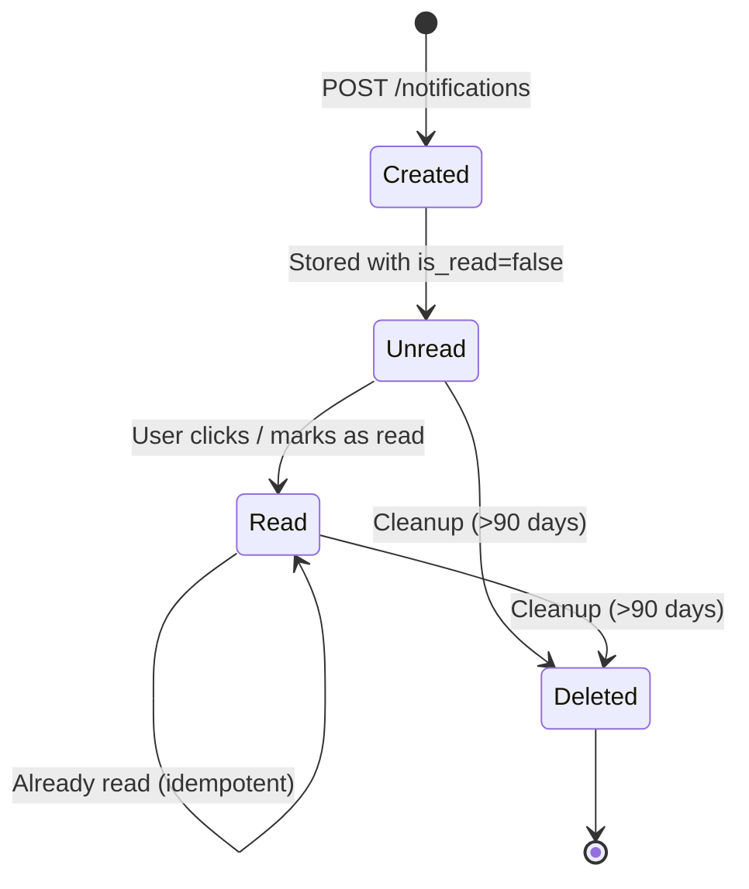

# Design Document: Admin Notifications

## Overview

The Admin Notifications feature adds an in-app notification system to the SureWaka admin dashboard. It provides real-time awareness of key platform events (new signups, delivery issues, verification requests, disputes) through a bell icon with unread badge in the header, a popover for quick review, and a dedicated full-page view for notification history.

The system follows a polling-based architecture (30s intervals with tab visibility awareness) rather than WebSocket/Realtime to keep complexity low and align with the existing REST API patterns. Notifications are stored per-user in Postgres, created by internal services, and automatically cleaned up after 90 days.

### Key Design Decisions

| Decision | Choice | Rationale |
|----------|--------|-----------|
| Delivery mechanism | Polling (30s) | Simpler than Supabase Realtime; notifications are not latency-critical; reduces infrastructure complexity |
| Storage | Postgres table with Drizzle ORM | Consistent with existing data layer; supports efficient queries with indexes |
| Notification targeting | Per-user rows + "all_admins" broadcast | Simple model; avoids pub/sub complexity; each user has independent read state |
| Cleanup | Daily cron job | Prevents unbounded table growth; 90-day retention is sufficient for ops context |
| Frontend state | Custom hook with optimistic updates | Matches existing patterns (use-profile.ts); provides responsive UX |

---

## Architecture



### Polling Flow with Tab Visibility



---

## Components and Interfaces

### Database Layer

#### Migration SQL

```sql
-- Create notification_type enum
CREATE TYPE notification_type AS ENUM (
  'new_user_signup',
  'delivery_issue',
  'carrier_verification_request',
  'carrier_verified',
  'dispute_opened',
  'driver_verification_request',
  'system_alert'
);

-- Create notifications table
CREATE TABLE notifications (
  id UUID PRIMARY KEY DEFAULT gen_random_uuid(),
  user_id UUID NOT NULL REFERENCES users(id) ON DELETE CASCADE,
  type notification_type NOT NULL,
  title TEXT NOT NULL,
  message TEXT NOT NULL,
  resource_link TEXT,
  is_read BOOLEAN NOT NULL DEFAULT false,
  created_at TIMESTAMPTZ NOT NULL DEFAULT now(),
  updated_at TIMESTAMPTZ NOT NULL DEFAULT now()
);

-- Indexes for common query patterns
CREATE INDEX idx_notifications_user_unread
  ON notifications (user_id, is_read)
  WHERE is_read = false;

CREATE INDEX idx_notifications_user_created
  ON notifications (user_id, created_at DESC);

CREATE INDEX idx_notifications_cleanup
  ON notifications (created_at)
  WHERE created_at < now() - INTERVAL '90 days';

-- Auto-update updated_at on row changes
CREATE OR REPLACE FUNCTION update_notifications_updated_at()
RETURNS TRIGGER AS $$
BEGIN
  NEW.updated_at = now();
  RETURN NEW;
END;
$$ LANGUAGE plpgsql;

CREATE TRIGGER trg_notifications_updated_at
  BEFORE UPDATE ON notifications
  FOR EACH ROW
  EXECUTE FUNCTION update_notifications_updated_at();

-- RLS policy: users can only read/modify their own notifications
ALTER TABLE notifications ENABLE ROW LEVEL SECURITY;

CREATE POLICY notifications_select_own ON notifications
  FOR SELECT USING (auth.uid() = user_id);

CREATE POLICY notifications_update_own ON notifications
  FOR UPDATE USING (auth.uid() = user_id);

CREATE POLICY notifications_insert_service ON notifications
  FOR INSERT WITH CHECK (true);  -- Service role inserts (via API, not client)

CREATE POLICY notifications_delete_service ON notifications
  FOR DELETE USING (true);  -- Service role deletes (cleanup cron)
```

#### Drizzle Schema Addition (`packages/db/src/schema.ts`)

```typescript
export const notificationTypeEnum = pgEnum('notification_type', [
  'new_user_signup',
  'delivery_issue',
  'carrier_verification_request',
  'carrier_verified',
  'dispute_opened',
  'driver_verification_request',
  'system_alert',
]);

export const notifications = pgTable('notifications', {
  id: uuid('id').primaryKey().defaultRandom(),
  userId: uuid('user_id')
    .notNull()
    .references(() => users.id, { onDelete: 'cascade' }),
  type: notificationTypeEnum('type').notNull(),
  title: text('title').notNull(),
  message: text('message').notNull(),
  resourceLink: text('resource_link'),
  isRead: boolean('is_read').notNull().default(false),
  createdAt: timestamp('created_at', { withTimezone: true }).notNull().defaultNow(),
  updatedAt: timestamp('updated_at', { withTimezone: true }).notNull().defaultNow(),
});
```

### API Layer

#### Route Registration (`apps/api/src/index.ts`)

```typescript
import notificationRoutes from './routes/notifications';

// Under API routes section:
app.route('/api/v1/notifications', notificationRoutes);
```

#### Route Handlers (`apps/api/src/routes/notifications.ts`)

```typescript
import { Hono } from 'hono';
import { requireAuth } from '../middleware/auth';
import {
  createNotificationSchema,
  notificationQuerySchema,
} from '@surewaka/shared';
import type { SupabaseUser } from '@surewaka/supabase';
import * as notificationService from '../services/notification-service';

type NotificationRoutesEnv = {
  Variables: {
    user: SupabaseUser;
    accessToken: string;
  };
};

const notificationRoutes = new Hono<NotificationRoutesEnv>();
notificationRoutes.use('*', requireAuth);
```

**Endpoints:**

| Method | Path | Description | Auth |
|--------|------|-------------|------|
| `GET` | `/api/v1/notifications` | List paginated notifications for user | Required |
| `GET` | `/api/v1/notifications/unread-count` | Get unread count | Required |
| `POST` | `/api/v1/notifications` | Create notification (internal) | Required (admin) |
| `PATCH` | `/api/v1/notifications/:id/read` | Mark single as read | Required |
| `POST` | `/api/v1/notifications/mark-all-read` | Mark all as read | Required |

#### GET `/api/v1/notifications`

**Query Parameters:**
- `page` (number, default: 1) — page number
- `pageSize` (number, default: 20, max: 50) — items per page
- `type` (notification_type, optional) — filter by type
- `isRead` (boolean, optional) — filter by read status

**Response:**
```json
{
  "data": [
    {
      "id": "uuid",
      "type": "new_user_signup",
      "title": "New user registered",
      "message": "John Doe signed up as a sender",
      "resourceLink": "/users/uuid",
      "isRead": false,
      "createdAt": "2024-01-15T10:30:00Z"
    }
  ],
  "error": null,
  "meta": {
    "page": 1,
    "pageSize": 20,
    "total": 45,
    "totalPages": 3
  }
}
```

#### GET `/api/v1/notifications/unread-count`

**Response:**
```json
{
  "data": { "count": 7 },
  "error": null,
  "meta": null
}
```

#### POST `/api/v1/notifications`

**Request Body:**
```json
{
  "userId": "uuid" | "all_admins",
  "type": "new_user_signup",
  "title": "New user registered",
  "message": "John Doe signed up as a sender",
  "resourceLink": "/users/uuid"
}
```

**Response (201):**
```json
{
  "data": { "created": 1 },
  "error": null,
  "meta": null
}
```

When `userId` is `"all_admins"`, the service queries all users with `surewaka_admin` role from the `user_roles` table and creates individual notification records for each.

#### PATCH `/api/v1/notifications/:id/read`

**Response:**
```json
{
  "data": { "id": "uuid", "isRead": true },
  "error": null,
  "meta": null
}
```

Returns 404 if notification doesn't exist or doesn't belong to the authenticated user.

#### POST `/api/v1/notifications/mark-all-read`

**Response:**
```json
{
  "data": { "updated": 12 },
  "error": null,
  "meta": null
}
```

### Service Layer (`apps/api/src/services/notification-service.ts`)

```typescript
export async function getNotifications(
  userId: string,
  options: { page: number; pageSize: number; type?: string; isRead?: boolean }
): Promise<ServiceResult<Notification[], PaginationMeta>>;

export async function getUnreadCount(
  userId: string
): Promise<ServiceResult<{ count: number }>>;

export async function createNotification(
  input: CreateNotificationInput
): Promise<ServiceResult<{ created: number }>>;

export async function markAsRead(
  userId: string,
  notificationId: string
): Promise<ServiceResult<{ id: string; isRead: boolean }>>;

export async function markAllAsRead(
  userId: string
): Promise<ServiceResult<{ updated: number }>>;

export async function cleanupOldNotifications(): Promise<{ deleted: number }>;
```

**ServiceResult type pattern** (consistent with existing services):
```typescript
type ServiceResult<T, M = null> = {
  data: T | null;
  error: { code: string; message: string } | null;
  meta?: M | null;
};
```

### Frontend Components

#### Component Tree

```
Header
├── Breadcrumb
└── HeaderActions (new wrapper)
    ├── NotificationBell
    │   └── NotificationPopover
    └── HeaderUser (existing avatar dropdown)
```

#### `NotificationBell` (`apps/admin/app/components/notifications/notification-bell.tsx`)

Renders the bell icon button with unread badge. Controls the popover open/close state.

```typescript
type NotificationBellProps = {
  // No props needed - uses useNotifications hook internally
};
```

**Behavior:**
- Renders a `<button>` with `aria-label="N unread notifications"` (or "No unread notifications")
- Shows `<Bell />` icon from lucide-react (h-5 w-5)
- Overlays a badge when unread count > 0
- Badge shows count for 1-99, "99+" for > 99, hidden for 0
- Clicking toggles the NotificationPopover

#### `NotificationPopover` (`apps/admin/app/components/notifications/notification-popover.tsx`)

Dropdown panel showing recent notifications.

```typescript
type NotificationPopoverProps = {
  open: boolean;
  onOpenChange: (open: boolean) => void;
};
```

**Structure:**
- Uses shadcn/ui `Popover` component
- Header: "Notifications" title + "Mark all as read" button
- Body: Scrollable list (max-h-96) of `NotificationItem` components
- Footer: "View all" link to `/notifications`
- Fetches latest notifications when opened

#### `NotificationItem` (`apps/admin/app/components/notifications/notification-item.tsx`)

Single notification row in the popover or full page.

```typescript
type NotificationItemProps = {
  notification: NotificationData;
  onRead: (id: string) => void;
  onClick?: (notification: NotificationData) => void;
  variant: 'popover' | 'page';
};
```

**Behavior:**
- Renders type icon (mapped from notification type to lucide icon)
- Shows title, relative timestamp (using a `formatRelativeTime` utility)
- Shows message (truncated in popover variant, full in page variant)
- Unread: left blue dot indicator + slightly highlighted background
- Clickable if `resourceLink` is present (renders as link/button)
- Clicking triggers `onRead` + navigation

#### `NotificationsPage` (`apps/admin/app/routes/notifications.tsx`)

Full-page notification history with filtering.

**Features:**
- Paginated list (20 per page)
- Filter bar: type dropdown + read/unread toggle
- "Mark all as read" bulk action
- Each item shows full message text
- Pagination controls at bottom

#### `useNotifications` Hook (`apps/admin/app/hooks/use-notifications.ts`)

Central hook managing notification state, polling, and API calls.

```typescript
type UseNotificationsReturn = {
  // State
  unreadCount: number;
  notifications: NotificationData[];
  isLoading: boolean;
  error: string | null;

  // Pagination (for full page)
  meta: PaginationMeta | null;

  // Actions
  fetchNotifications: (options?: FetchOptions) => Promise<void>;
  markAsRead: (id: string) => Promise<void>;
  markAllAsRead: () => Promise<void>;
  refetchUnreadCount: () => Promise<void>;
};
```

**Polling logic:**
```typescript
// Simplified polling implementation
useEffect(() => {
  const POLL_INTERVAL = 30_000; // 30 seconds
  let intervalId: ReturnType<typeof setInterval> | null = null;

  function startPolling() {
    refetchUnreadCount();
    intervalId = setInterval(refetchUnreadCount, POLL_INTERVAL);
  }

  function stopPolling() {
    if (intervalId) clearInterval(intervalId);
    intervalId = null;
  }

  function handleVisibilityChange() {
    if (document.hidden) {
      stopPolling();
    } else {
      startPolling(); // Immediately fetches + resumes interval
    }
  }

  document.addEventListener('visibilitychange', handleVisibilityChange);
  startPolling();

  return () => {
    stopPolling();
    document.removeEventListener('visibilitychange', handleVisibilityChange);
  };
}, []);
```

**Optimistic updates:**
- `markAsRead(id)`: Immediately decrements `unreadCount` and sets item `isRead=true` in local state, then fires API call. On failure, reverts.
- `markAllAsRead()`: Immediately sets `unreadCount=0` and all items to `isRead=true`, then fires API call. On failure, reverts.

### Notification Type Icon Mapping

```typescript
const NOTIFICATION_ICONS: Record<NotificationType, LucideIcon> = {
  new_user_signup: UserPlus,
  delivery_issue: AlertTriangle,
  carrier_verification_request: ShieldCheck,
  carrier_verified: CheckCircle,
  dispute_opened: MessageSquareWarning,
  driver_verification_request: IdCard,
  system_alert: Info,
};
```

### Shared Types and Validators (`packages/shared`)

```typescript
// Types
export type NotificationType =
  | 'new_user_signup'
  | 'delivery_issue'
  | 'carrier_verification_request'
  | 'carrier_verified'
  | 'dispute_opened'
  | 'driver_verification_request'
  | 'system_alert';

export type NotificationData = {
  id: string;
  type: NotificationType;
  title: string;
  message: string;
  resourceLink: string | null;
  isRead: boolean;
  createdAt: string;
};

export type PaginationMeta = {
  page: number;
  pageSize: number;
  total: number;
  totalPages: number;
};

// Validators
export const NOTIFICATION_TYPES = [
  'new_user_signup',
  'delivery_issue',
  'carrier_verification_request',
  'carrier_verified',
  'dispute_opened',
  'driver_verification_request',
  'system_alert',
] as const;

export const createNotificationSchema = z.object({
  userId: z.union([z.string().uuid(), z.literal('all_admins')]),
  type: z.enum(NOTIFICATION_TYPES),
  title: z.string().min(1).max(200),
  message: z.string().min(1).max(500),
  resourceLink: z.string().regex(/^\//).max(500).optional(),
});

export const notificationQuerySchema = z.object({
  page: z.coerce.number().int().positive().default(1),
  pageSize: z.coerce.number().int().min(1).max(50).default(20),
  type: z.enum(NOTIFICATION_TYPES).optional(),
  isRead: z.enum(['true', 'false']).transform((v) => v === 'true').optional(),
});
```

---

## Data Models

### Entity Relationship



### Notification Lifecycle



### Query Patterns

| Query | Index Used | Frequency |
|-------|-----------|-----------|
| Unread count for user | `idx_notifications_user_unread` | Every 30s per active tab |
| List notifications for user (paginated) | `idx_notifications_user_created` | On popover open / page load |
| Mark single as read | Primary key lookup | On notification click |
| Mark all as read for user | `idx_notifications_user_unread` | On "Mark all" click |
| Delete old notifications | `idx_notifications_cleanup` | Daily cron |

### Future Optimization: Redis Caching

When the admin team grows or polling load becomes a concern, the unread count can be moved to a Redis counter (Upstash) to eliminate repeated Postgres COUNT queries:

- Store `notifications:unread:{userId}` as an integer counter
- Increment on notification create, decrement on mark-as-read, reset to 0 on mark-all-read
- Poll endpoint reads from Redis with DB fallback (cache TTL 60s)
- This change is isolated to the service layer — no frontend changes needed

**Not implemented now** — the partial indexes and tab visibility pausing are sufficient for the current small ops team. Revisit when active admin count exceeds ~20 or polling frequency needs to increase.

---

### Cleanup Cron Job

Located in `workers/cron/` (or as a Supabase Edge Function / pg_cron):

```typescript
async function cleanupNotifications(): Promise<void> {
  const cutoffDate = new Date();
  cutoffDate.setDate(cutoffDate.getDate() - 90);

  const result = await db
    .delete(notifications)
    .where(lt(notifications.createdAt, cutoffDate));

  console.log(`[NotificationCleanup] Deleted ${result.rowCount} notifications older than 90 days`);
}
```

**Schedule:** Runs daily at 02:00 UTC via `pg_cron` or an external scheduler (Fly.io cron / GitHub Actions).

---

## Future Considerations

### Audit Logging

When the "Add audit logging for admin actions" task (P2) is implemented, notification-related admin actions (mark-all-read, bulk operations) should produce audit log entries. The notification service is structured to make this straightforward — add audit calls alongside the existing service functions.

### Notification Trigger Integration

The creation endpoint is ready, but trigger calls need to be wired into the respective services as they're built:

| Event | Trigger Location | Status |
|-------|-----------------|--------|
| New user signup | User registration flow / webhook | Pending |
| Delivery issue | Delivery service (status change handler) | Pending |
| Carrier verification request | Carrier onboarding flow | Pending |
| Carrier verified | Admin user management (approve action) | Pending |
| Dispute opened | Dispute service | Pending |
| Driver verification request | Driver onboarding flow | Pending |
| System alert | Monitoring / manual | Pending |

### Notification Preferences

The existing `NotificationSettings` component (email/SMS toggles) controls external delivery channels. In-app notifications are always-on for the admin portal — they cannot be disabled since they're the primary awareness mechanism for ops events. If per-type muting is needed later, add a `notification_preferences` table mapping user_id + type → enabled/disabled.

---

## Correctness Properties

*A property is a characteristic or behavior that should hold true across all valid executions of a system — essentially, a formal statement about what the system should do. Properties serve as the bridge between human-readable specifications and machine-verifiable correctness guarantees.*

### Property 1: Badge Formatting Correctness

*For any* non-negative integer count, the badge formatting function SHALL:
- Return the empty string (hidden) when count is 0
- Return the exact numeric string when count is between 1 and 99 inclusive
- Return "99+" when count is greater than 99

And the aria-label SHALL always accurately reflect the current count.

**Validates: Requirements 1.3, 1.4, 1.5, 1.7**

### Property 2: Notification List Sorting and Pagination

*For any* set of notifications belonging to a user and any valid page/pageSize parameters, the returned list SHALL be sorted in strictly descending order by `created_at`, and the number of items returned SHALL be at most `pageSize`.

**Validates: Requirements 2.2, 4.2, 7.2**

### Property 3: Notification Rendering Completeness

*For any* notification object with valid type, title, message, and createdAt fields, the rendered output SHALL contain: a type-appropriate icon, the title text, a relative timestamp string, and the message text.

**Validates: Requirements 2.3, 7.4**

### Property 4: Mark-All-Read Correctness

*For any* set of notifications (mixed read/unread) belonging to a user, after executing mark-all-read, every notification for that user SHALL have `is_read = true`, and the unread count SHALL be 0.

**Validates: Requirements 2.7, 4.5**

### Property 5: Clickability Determined by Resource Link

*For any* notification, the rendered item SHALL be clickable if and only if `resourceLink` is non-null. Notifications without a resource link SHALL be rendered as non-interactive informational elements.

**Validates: Requirements 3.1, 3.4**

### Property 6: Mark-As-Read Idempotence

*For any* notification belonging to a user, calling mark-as-read SHALL set `is_read = true`. Calling mark-as-read on an already-read notification SHALL succeed without error (idempotent).

**Validates: Requirements 3.3, 4.4**

### Property 7: Unread Count Accuracy

*For any* set of notifications belonging to a user with varying `is_read` values, the unread count endpoint SHALL return a number exactly equal to the count of notifications where `is_read = false`.

**Validates: Requirements 4.3**

### Property 8: Response Shape Invariant

*For any* request to any notification endpoint (valid or invalid), the response body SHALL conform to the shape `{ data, error, meta }` where exactly one of `data` or `error` is non-null for success/failure cases respectively.

**Validates: Requirements 4.7**

### Property 9: Notification Creation Validation

*For any* input payload, the create notification endpoint SHALL accept the payload if and only if it passes the Zod schema validation (valid UUID or "all_admins" for userId, valid enum for type, title 1-200 chars, message 1-500 chars, optional relative URL for resourceLink). Invalid payloads SHALL receive HTTP 400 with error code `VALIDATION_ERROR`.

**Validates: Requirements 5.3, 5.5**

### Property 10: Broadcast to All Admins

*For any* set of users where N users hold the `surewaka_admin` role, creating a notification with `userId = "all_admins"` SHALL produce exactly N individual notification records, one per admin user, each with identical type, title, message, and resourceLink.

**Validates: Requirements 5.4, 5.6**

### Property 11: Filter Correctness

*For any* filter combination (type and/or isRead status) applied to a notification query, every notification in the returned results SHALL match all applied filter criteria. No notification matching the criteria SHALL be excluded from results (completeness).

**Validates: Requirements 7.3**

### Property 12: Retention Cleanup Correctness

*For any* set of notifications with varying `created_at` timestamps, the cleanup function SHALL delete all notifications older than 90 days and SHALL NOT delete any notification that is 90 days old or newer.

**Validates: Requirements 8.1, 8.2**

---

## Error Handling

### API Error Codes

| Code | HTTP Status | When |
|------|-------------|------|
| `VALIDATION_ERROR` | 400 | Invalid request body or query params |
| `UNAUTHORIZED` | 401 | Missing or invalid auth token |
| `NOT_FOUND` | 404 | Notification doesn't exist or doesn't belong to user |
| `FORBIDDEN` | 403 | Non-admin attempting to create notifications |
| `INTERNAL_ERROR` | 500 | Unexpected server error |

### Frontend Error Handling

- **Network errors**: Show toast notification with retry option; maintain last known state
- **401 responses**: Redirect to login (handled by existing auth guard)
- **Optimistic update failures**: Revert local state, show error toast
- **Polling failures**: Silently retry on next interval; don't show error for background polls
- **Empty state**: Show friendly "No notifications yet" message with illustration

### Cleanup Job Error Handling

- Log errors but don't crash the process
- Report cleanup metrics (deleted count, duration, errors) to stdout for log aggregation
- If cleanup fails, it will retry on the next daily run (no data loss risk)

---

## Testing Strategy

### Property-Based Tests (fast-check)

The project will use `fast-check` for property-based testing, consistent with existing property tests in the codebase (see `apps/api/src/__tests__/*.property.test.ts`).

**Configuration:**
- Minimum 100 iterations per property test
- Each test tagged with: `Feature: admin-notifications, Property {N}: {title}`

**Properties to implement:**
1. Badge formatting (Property 1) — pure function, ideal for PBT
2. Notification list sorting (Property 2) — generate random notification arrays, verify sort invariant
3. Rendering completeness (Property 3) — generate random notification objects, verify output
4. Mark-all-read (Property 4) — generate mixed read/unread sets, verify post-condition
5. Unread count accuracy (Property 7) — generate sets with random is_read values, verify count
6. Validation acceptance/rejection (Property 9) — generate valid/invalid payloads, verify behavior
7. Broadcast count (Property 10) — generate random admin user sets, verify notification count
8. Filter correctness (Property 11) — generate notifications + filters, verify results match
9. Retention cleanup (Property 12) — generate notifications with various ages, verify deletion boundary

### Unit Tests (Vitest)

- NotificationBell rendering (badge visibility, aria-label)
- NotificationPopover open/close behavior
- NotificationItem click handling and navigation
- Optimistic update and revert logic
- Polling start/stop on visibility change
- API route handler responses for specific scenarios
- Empty state rendering

### Integration Tests

- Full API flow: create → list → mark read → verify count
- Authentication enforcement on all endpoints
- Pagination boundary conditions
- "all_admins" broadcast with actual role queries
- Cleanup cron with test data

### Test File Locations

```
apps/api/src/__tests__/notification-validation.property.test.ts
apps/api/src/__tests__/notification-service.property.test.ts
apps/api/src/__tests__/notification-routes.test.ts
apps/admin/app/__tests__/notification-badge.property.test.ts
apps/admin/app/__tests__/notification-filter.property.test.ts
apps/admin/app/__tests__/notification-components.test.ts
```
