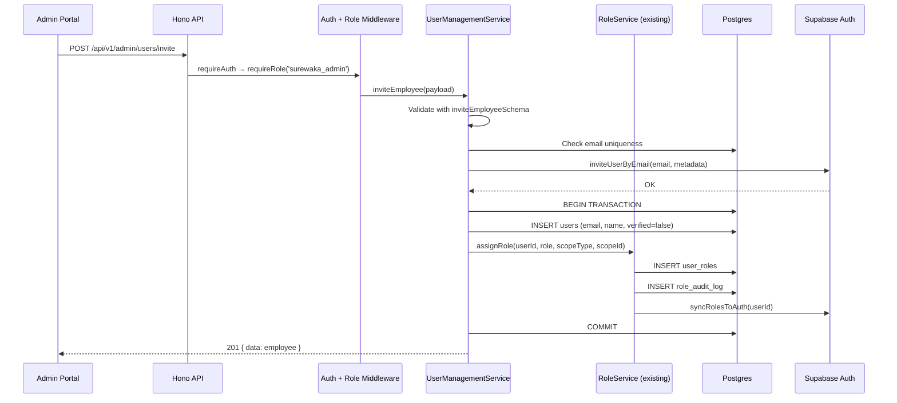

# Design Document: Admin User Management

## Overview

The Admin User Management feature provides a comprehensive employee lifecycle management interface within the `apps/admin` portal. It enables `surewaka_admin` users to invite new team members, manage employee profiles, control account status, and administer roles — all backed by the existing RBAC system.

The feature adds:
- A **User Management Service** (`apps/api/src/services/user-management-service.ts`) handling invitation, listing, editing, and deactivation logic
- New **API routes** under `/api/v1/admin/users` protected by `requireAuth` + `requireRole('surewaka_admin')`
- **Frontend pages** in `apps/admin` for the employee list, detail view, and invitation flow
- **Zod validators** in `@surewaka/shared` for invitation and update request validation

The design delegates role assignment/revocation to the existing `RoleService` and reuses existing middleware, validators, and UI patterns (shadcn/ui, data tables, pagination).

## Architecture

```mermaid
graph TD
    subgraph "Admin Portal (apps/admin)"
        EL[Employee List Page]
        ED[Employee Detail Page]
        INV[Invite Employee Dialog]
        RAP[Role Assignment Panel]
    end

    subgraph "API Layer (apps/api)"
        MW[requireAuth + requireRole]
        UR[User Management Routes<br/>/api/v1/admin/users]
        UMS[User Management Service]
        RS[Role Service<br/>(existing)]
    end

    subgraph "External Services"
        SUPA[Supabase Auth<br/>inviteUserByEmail]
    end

    subgraph "Database (Drizzle ORM)"
        USERS[(users)]
        ROLES[(user_roles)]
        AUDIT[(role_audit_log)]
        CARRIERS[(carriers)]
    end

    EL --> MW
    ED --> MW
    INV --> MW
    RAP --> MW

    MW --> UR
    UR --> UMS
    UMS --> RS
    UMS --> SUPA

    UMS --> USERS
    RS --> ROLES
    RS --> AUDIT
    UMS --> CARRIERS
```

### Request Flow



## Components and Interfaces

### Component 1: User Management Service

**File:** `apps/api/src/services/user-management-service.ts`

**Purpose:** Business logic for employee invitation, listing, editing, deactivation/reactivation.

```typescript
// apps/api/src/services/user-management-service.ts

import type { UserRole } from '@surewaka/shared';

export type InviteEmployeeParams = {
  email: string;
  fullName: string;
  role: UserRole;
  scopeType?: 'carrier' | null;
  scopeId?: string | null;
  invitedBy: string;
  invitedByRoles: UserRole[];
};

export type ListEmployeesParams = {
  page: number;
  pageSize: number;
  search?: string;
  role?: UserRole;
  status?: 'active' | 'inactive';
  sortBy: 'name' | 'email' | 'createdAt' | 'updatedAt';
  sortDir: 'asc' | 'desc';
};

export type UpdateEmployeeParams = {
  userId: string;
  fullName?: string;
  phone?: string;
  email?: string;
};

export type DeactivateEmployeeParams = {
  userId: string;
  performedBy: string;
};

export type ReactivateEmployeeParams = {
  userId: string;
  performedBy: string;
};

export type EmployeeListItem = {
  id: string;
  name: string;
  email: string;
  phone: string | null;
  verified: boolean;
  roles: { role: UserRole; scopeType: string | null; scopeId: string | null }[];
  createdAt: Date;
  updatedAt: Date;
};

export type EmployeeDetail = EmployeeListItem & {
  avatarUrl: string | null;
  carriers: { id: string; name: string; role: UserRole }[];
};

type ServiceResult<T> = {
  data: T | null;
  error: { code: string; message: string } | null;
  meta: Record<string, unknown> | null;
};

// ─── Service Functions ────────────────────────────────────────────────

export async function inviteEmployee(params: InviteEmployeeParams): Promise<ServiceResult<EmployeeDetail>>;
export async function listEmployees(params: ListEmployeesParams): Promise<{ data: EmployeeListItem[]; total: number }>;
export async function getEmployee(userId: string): Promise<ServiceResult<EmployeeDetail>>;
export async function updateEmployee(params: UpdateEmployeeParams): Promise<ServiceResult<EmployeeDetail>>;
export async function deactivateEmployee(params: DeactivateEmployeeParams): Promise<ServiceResult<void>>;
export async function reactivateEmployee(params: ReactivateEmployeeParams): Promise<ServiceResult<void>>;
export async function getEmployeeAuditLog(userId: string, page: number, pageSize: number): Promise<{ data: AuditLogEntry[]; total: number }>;
```

### Component 2: User Management Routes

**File:** `apps/api/src/routes/admin/users.ts`

**Purpose:** HTTP route handlers for all user management endpoints.

```typescript
// apps/api/src/routes/admin/users.ts

import { Hono } from 'hono';
import { requireAuth } from '../../middleware/auth';
import { requireRole } from '../../middleware/role';

const userManagement = new Hono();

// All routes require surewaka_admin
userManagement.use('*', requireAuth);
userManagement.use('*', requireRole('surewaka_admin'));

// POST   /invite              — Invite new employee
// GET    /                    — List employees (paginated, searchable)
// GET    /:userId             — Get employee detail
// PATCH  /:userId             — Update employee details
// POST   /:userId/deactivate  — Deactivate employee
// POST   /:userId/reactivate  — Reactivate employee
// GET    /:userId/audit-log   — Get role audit history

export default userManagement;
```

### Component 3: Zod Validators (additions to @surewaka/shared)

**File:** `packages/shared/src/validators.ts` (additions)

```typescript
// ─── Admin User Management Validators ────────────────────────────────

export const inviteEmployeeSchema = z
  .object({
    email: z.string().email('Must be a valid email address'),
    fullName: z.string().min(2, 'Name must be at least 2 characters').max(100),
    role: userRoleSchema,
    scopeType: z.enum(['carrier']).nullable().optional(),
    scopeId: z.string().uuid().nullable().optional(),
  })
  .refine(
    (data) => {
      if (data.role === 'carrier_admin' || data.role === 'carrier_driver') {
        return data.scopeType === 'carrier' && !!data.scopeId;
      }
      return true;
    },
    { message: 'Org-scoped roles require scopeType and scopeId' }
  );

export const updateEmployeeSchema = z.object({
  fullName: z.string().min(2).max(100).optional(),
  phone: z.string().min(10).max(15).optional(),
  email: z.string().email().optional(),
});

export const employeeListQuerySchema = z.object({
  page: z.coerce.number().int().min(1).default(1),
  pageSize: z.coerce.number().int().min(1).max(100).default(20),
  search: z.string().max(200).default(''),
  role: userRoleSchema.optional(),
  status: z.enum(['active', 'inactive']).optional(),
  sortBy: z.enum(['name', 'email', 'createdAt', 'updatedAt']).default('createdAt'),
  sortDir: z.enum(['asc', 'desc']).default('desc'),
});

export const auditLogQuerySchema = z.object({
  page: z.coerce.number().int().min(1).default(1),
  pageSize: z.coerce.number().int().min(1).max(100).default(20),
});

export type InviteEmployeeInput = z.infer<typeof inviteEmployeeSchema>;
export type UpdateEmployeeInput = z.infer<typeof updateEmployeeSchema>;
export type EmployeeListQuery = z.infer<typeof employeeListQuerySchema>;
export type AuditLogQuery = z.infer<typeof auditLogQuerySchema>;
```

### Component 4: Frontend Pages

**Files:**
- `apps/admin/app/routes/users.tsx` — Employee list page
- `apps/admin/app/routes/users.$userId.tsx` — Employee detail page

**Pattern:** Follows the same pattern as `waitlist.tsx` — custom hooks for data fetching, toolbar for search/filter, data table, pagination.

```typescript
// apps/admin/app/routes/users.tsx (Employee List)
// - useEmployeeParams() hook for URL search params
// - useEmployeeData() hook for API fetching
// - EmployeeToolbar (search, role filter, status filter)
// - EmployeeDataTable (sortable columns)
// - EmployeePagination
// - InviteEmployeeDialog (modal form)

// apps/admin/app/routes/users.$userId.tsx (Employee Detail)
// - useEmployeeDetail() hook
// - ProfileSection (name, email, phone, status, dates)
// - RoleAssignmentPanel (list roles, assign/revoke)
// - AuditHistorySection (paginated audit log)
// - DeactivateButton / ReactivateButton
```

### Component 5: Frontend Hooks

**Files:**
- `apps/admin/app/hooks/use-employee-params.ts`
- `apps/admin/app/hooks/use-employee-data.ts`
- `apps/admin/app/hooks/use-employee-detail.ts`

```typescript
// apps/admin/app/hooks/use-employee-data.ts
export function useEmployeeData(params: EmployeeListQuery) {
  // Fetches GET /api/v1/admin/users with query params
  // Returns { data, meta, isLoading, error, refetch }
}

// apps/admin/app/hooks/use-employee-detail.ts
export function useEmployeeDetail(userId: string) {
  // Fetches GET /api/v1/admin/users/:userId
  // Returns { employee, roles, auditLog, isLoading, error, refetch }
}
```

## API Endpoints

| Method | Path | Description | Request Body / Query | Response |
|--------|------|-------------|---------------------|----------|
| `POST` | `/api/v1/admin/users/invite` | Invite new employee | `inviteEmployeeSchema` | `201 { data: EmployeeDetail }` |
| `GET` | `/api/v1/admin/users` | List employees | `employeeListQuerySchema` (query) | `200 { data: EmployeeListItem[], meta: { total, page, pageSize, totalPages } }` |
| `GET` | `/api/v1/admin/users/:userId` | Get employee detail | — | `200 { data: EmployeeDetail }` |
| `PATCH` | `/api/v1/admin/users/:userId` | Update employee | `updateEmployeeSchema` | `200 { data: EmployeeDetail }` |
| `POST` | `/api/v1/admin/users/:userId/deactivate` | Deactivate account | — | `200 { data: null }` |
| `POST` | `/api/v1/admin/users/:userId/reactivate` | Reactivate account | — | `200 { data: null }` |
| `GET` | `/api/v1/admin/users/:userId/audit-log` | Get audit history | `auditLogQuerySchema` (query) | `200 { data: AuditLogEntry[], meta: { total, page, pageSize, totalPages } }` |

All endpoints require `Authorization: Bearer <token>` with `surewaka_admin` role.

## Data Models

### Existing Tables Used (no schema changes needed)

The feature operates on existing tables — no new migrations required:

- **`users`** — Employee profile data (name, email, phone, verified, timestamps)
- **`user_roles`** — Role assignments with scope (userId, role, scopeType, scopeId, isActive)
- **`role_audit_log`** — Immutable audit trail (action, role, performedBy, reason, timestamp)
- **`carriers`** — Carrier names for resolving org-scoped role display

### Response Types

```typescript
// Employee list item (returned by GET /admin/users)
type EmployeeListItem = {
  id: string;
  name: string;
  email: string;
  phone: string | null;
  verified: boolean;  // true = active, false = inactive
  roles: {
    role: UserRole;
    scopeType: string | null;
    scopeId: string | null;
  }[];
  createdAt: string;  // ISO 8601
  updatedAt: string;  // ISO 8601
};

// Employee detail (returned by GET /admin/users/:userId)
type EmployeeDetail = EmployeeListItem & {
  avatarUrl: string | null;
  carriers: {
    id: string;
    name: string;
    role: UserRole;  // carrier_admin or carrier_driver
  }[];
};

// Audit log entry (returned by GET /admin/users/:userId/audit-log)
type AuditLogEntry = {
  id: string;
  action: 'assigned' | 'revoked' | 'upgraded';
  role: UserRole;
  scopeType: string | null;
  scopeId: string | null;
  performedBy: {
    id: string;
    name: string;
  };
  reason: string | null;
  createdAt: string;  // ISO 8601
};
```

### Query Patterns

**Employee List Query (Drizzle):**
```typescript
// Join users with user_roles to get employees (users with at least one role record)
// Filter by search (ILIKE on name, email, phone)
// Filter by role (EXISTS in user_roles)
// Filter by status (verified = true/false)
// Sort by specified field
// Paginate with LIMIT/OFFSET

const employees = await db
  .select({ /* user fields */ })
  .from(users)
  .innerJoin(userRoles, eq(users.id, userRoles.userId))
  .where(and(...filters))
  .groupBy(users.id)
  .orderBy(sortExpression)
  .limit(pageSize)
  .offset((page - 1) * pageSize);
```

**Audit Log Query:**
```typescript
// Join role_audit_log with users (for performedBy name)
const auditEntries = await db
  .select({
    ...roleAuditLog,
    performerName: users.name,
  })
  .from(roleAuditLog)
  .leftJoin(users, eq(roleAuditLog.performedBy, users.id))
  .where(eq(roleAuditLog.userId, targetUserId))
  .orderBy(desc(roleAuditLog.createdAt))
  .limit(pageSize)
  .offset((page - 1) * pageSize);
```

## File Structure

```
apps/api/src/
├── routes/admin/
│   ├── users.ts                    # NEW — User management routes
│   ├── roles.ts                    # Existing — Role admin routes
│   └── waitlist.ts                 # Existing
├── services/
│   ├── user-management-service.ts  # NEW — Business logic
│   ├── role-service.ts             # Existing — Delegated to
│   └── ...
└── middleware/
    ├── auth.ts                     # Existing
    └── role.ts                     # Existing

apps/admin/app/
├── routes/
│   ├── users.tsx                   # NEW — Employee list page
│   ├── users.$userId.tsx           # NEW — Employee detail page
│   └── ...
├── hooks/
│   ├── use-employee-params.ts      # NEW
│   ├── use-employee-data.ts        # NEW
│   └── use-employee-detail.ts      # NEW
├── components/
│   └── users/
│       ├── employee-toolbar.tsx    # NEW — Search/filter bar
│       ├── employee-data-table.tsx # NEW — Sortable table
│       ├── employee-pagination.tsx # NEW — Pagination controls
│       ├── invite-dialog.tsx       # NEW — Invitation modal
│       ├── role-assignment-panel.tsx # NEW — Role management
│       ├── audit-history.tsx       # NEW — Audit log display
│       └── employee-actions.tsx    # NEW — Deactivate/reactivate
└── lib/
    └── api.ts                      # Existing — API client helpers

packages/shared/src/
└── validators.ts                   # MODIFIED — Add new schemas
```

## Correctness Properties

*A property is a characteristic or behavior that should hold true across all valid executions of a system — essentially, a formal statement about what the system should do. Properties serve as the bridge between human-readable specifications and machine-verifiable correctness guarantees.*

### Property 1: Invitation creates correct user and role records

*For any* valid invitation input (email, fullName, role, optional scopeType/scopeId), when the invitation succeeds, the created user record SHALL have the provided email, name, `verified = false`, and the user SHALL have exactly one active role matching the requested role with correct scope.

**Validates: Requirements 1.1, 1.2, 1.3**

### Property 2: Duplicate email invitation is rejected

*For any* email that already exists in the users table, attempting to invite with that email SHALL return a CONFLICT error and SHALL NOT create any new records in the users or user_roles tables.

**Validates: Requirements 1.4**

### Property 3: Invitation validation rejects invalid inputs

*For any* invitation request where the email is invalid, fullName is outside 2-100 chars, role is not a valid enum value, or an org-scoped role is missing scopeType/scopeId, the service SHALL reject the request with a VALIDATION_ERROR and SHALL NOT create any records.

**Validates: Requirements 1.5, 1.6**

### Property 4: Failed Supabase invitation creates no records

*For any* valid invitation input, if the Supabase Auth `inviteUserByEmail` call fails, the service SHALL NOT create any user record or role assignment in the database (transactional rollback).

**Validates: Requirements 1.7**

### Property 5: Employee list search returns only matching results

*For any* search query string and set of employees, all returned employees SHALL have the search string as a case-insensitive substring of their name, email, or phone. Additionally, when role or status filters are applied, all returned employees SHALL match those filters.

**Validates: Requirements 2.2, 2.3**

### Property 6: Pagination respects page size bounds

*For any* page and pageSize parameters (1 ≤ pageSize ≤ 100), the number of returned items SHALL be ≤ pageSize, and when no pageSize is specified, the default SHALL be 20. The meta.total SHALL equal the total count of matching records regardless of pagination.

**Validates: Requirements 2.4, 2.6, 6.4**

### Property 7: Employee list only returns users with role assignments

*For any* query to the employee list endpoint, every returned user SHALL have at least one record (active or historical) in the user_roles table. Users with zero role records SHALL never appear in results.

**Validates: Requirements 2.7**

### Property 8: Employee list sorting is correct

*For any* sortBy field (name, email, createdAt, updatedAt) and sortDir (asc, desc), the returned employee list SHALL be ordered according to the specified field and direction.

**Validates: Requirements 2.5**

### Property 9: Update preserves unmodified fields and sets updated_at

*For any* valid partial update (subset of fullName, phone, email), only the specified fields SHALL change on the user record. All unspecified fields SHALL remain unchanged. The `updated_at` timestamp SHALL be ≥ the time immediately before the update.

**Validates: Requirements 3.1, 3.2, 3.6**

### Property 10: Update validation rejects invalid inputs

*For any* update request where fullName is outside 2-100 chars, phone is outside 10-15 chars, or email is not a valid format, the service SHALL reject with VALIDATION_ERROR and SHALL NOT modify the user record.

**Validates: Requirements 3.3**

### Property 11: Update rejects duplicate email or phone

*For any* update that sets an email or phone already belonging to a different user, the service SHALL return CONFLICT (409) and SHALL NOT modify the target user record.

**Validates: Requirements 3.4, 3.5**

### Property 12: Deactivation revokes all roles and creates audit entries

*For any* active employee with N active roles (N ≥ 1), deactivation SHALL set `verified = false`, set `isActive = false` on all N role records, and create exactly N entries in role_audit_log with action='revoked' and reason='Account deactivated by admin'.

**Validates: Requirements 4.1, 4.3**

### Property 13: Self-deactivation is rejected

*For any* surewaka_admin user, attempting to deactivate their own account (where performedBy === userId) SHALL return SELF_DEACTIVATION_NOT_ALLOWED error and SHALL NOT modify any records.

**Validates: Requirements 4.6**

### Property 14: Reactivation sets verified to true

*For any* deactivated employee (verified = false), reactivation SHALL set `verified = true` on the user record. The user's role set SHALL remain empty (roles must be re-assigned separately).

**Validates: Requirements 4.4**

### Property 15: Audit records filtered by user and sorted descending

*For any* user ID, the audit log endpoint SHALL return only records where `userId` matches the requested user, and results SHALL be sorted by `createdAt` in descending order (most recent first).

**Validates: Requirements 6.1, 6.3**

### Property 16: Access control rejects non-admin users

*For any* authenticated user who does NOT hold the `surewaka_admin` role, ALL user management endpoints SHALL return HTTP 403 with error code FORBIDDEN.

**Validates: Requirements 7.1, 7.3**

## Error Handling

### Error Response Format

All errors follow the standard API response shape:

```typescript
{
  data: null,
  error: { code: string; message: string },
  meta: null
}
```

### Error Codes and HTTP Status Mapping

| Error Code | HTTP Status | Trigger |
|-----------|-------------|---------|
| `UNAUTHORIZED` | 401 | Missing or invalid JWT token |
| `MFA_REQUIRED` | 403 | Session lacks AAL2 (MFA not verified) |
| `FORBIDDEN` | 403 | User lacks `surewaka_admin` role |
| `NOT_FOUND` | 404 | Target user does not exist |
| `CONFLICT` | 409 | Duplicate email/phone, duplicate role, existing user on invite |
| `VALIDATION_ERROR` | 400 | Request body/query fails Zod validation |
| `SELF_DEACTIVATION_NOT_ALLOWED` | 400 | Admin attempting to deactivate themselves |
| `INVITATION_FAILED` | 502 | Supabase Auth `inviteUserByEmail` returned an error |
| `INTERNAL_ERROR` | 500 | Unexpected server error |

### Transaction Safety

- **Invitation:** User creation + role assignment wrapped in a DB transaction. If Supabase invitation fails, the transaction is not started (invitation is called first).
- **Deactivation:** User update + all role revocations + audit log entries wrapped in a single transaction. If any step fails, all changes roll back.
- **Role sync failures:** Non-fatal. The `syncRolesToAuth` function logs errors but does not throw (existing behavior from RoleService). JWT claims will self-correct on next token refresh.

### Retry Strategy

- Supabase Auth calls: No automatic retry. Return 502 to the client on failure.
- Database operations: Rely on Drizzle/pg connection pool retry behavior.
- Frontend: Hooks expose `refetch()` for manual retry. Error states show retry buttons.

## Testing Strategy

### Property-Based Tests (Vitest + fast-check)

Property-based testing is appropriate for this feature because:
- The service layer contains pure business logic with clear input/output behavior
- Universal properties hold across a wide input space (any valid email, name, role combination)
- Validation, filtering, pagination, and deactivation logic all have properties that should hold for all inputs

**Library:** `fast-check` with Vitest
**Configuration:** Minimum 100 iterations per property test
**Tag format:** `Feature: admin-user-management, Property {N}: {description}`

Each correctness property (1–16) maps to a single property-based test that:
1. Generates random valid/invalid inputs using fast-check arbitraries
2. Exercises the service function (with mocked DB/Supabase where needed)
3. Asserts the universal property holds

### Unit Tests (Vitest)

- **Zod schema validation:** Specific examples of valid/invalid inputs for each schema
- **Edge cases:** Empty strings, boundary lengths, special characters in names/emails
- **Error paths:** Non-existent users (404), self-deactivation guard
- **Response shape:** Verify all required fields present in API responses

### Integration Tests

- **Transaction atomicity:** Force failures mid-transaction, verify rollback
- **Middleware chain:** Verify `requireAuth` + `requireRole` applied to all routes
- **Role service delegation:** Verify `assignRole`/`revokeRole` called with correct params
- **Supabase Auth mock:** Verify `inviteUserByEmail` called with correct email and metadata

### Frontend Tests

- **Component tests (Vitest + Testing Library):**
  - InviteDialog form validation and submission
  - EmployeeDataTable renders correct columns
  - RoleAssignmentPanel shows active roles and carrier dropdown for org-scoped
  - DeactivateButton shows confirmation dialog
- **Example-based UI tests:**
  - Empty state messages when no employees/audit records
  - Navigation hidden for non-admin users (RoleGate)
  - Carrier name resolution in role display

### Test File Structure

```
apps/api/src/services/__tests__/
├── user-management-service.property.test.ts  # Properties 1-15
├── user-management-service.test.ts           # Unit tests + edge cases

apps/api/src/routes/admin/__tests__/
├── users.test.ts                             # Route integration tests
├── users.access-control.test.ts              # Property 16

apps/admin/app/__tests__/
├── users.property.test.ts                    # Frontend property tests (if applicable)

apps/admin/app/components/users/__tests__/
├── invite-dialog.test.tsx
├── employee-data-table.test.tsx
├── role-assignment-panel.test.tsx
```
