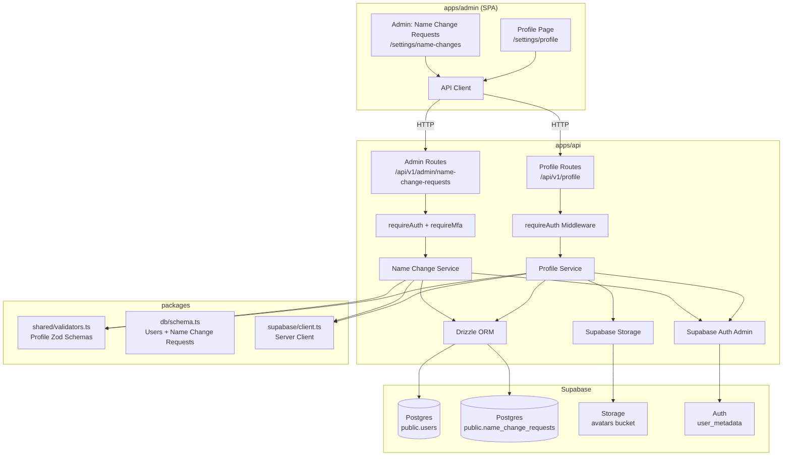

# Design Document: User Profile Management

## Overview

This feature adds profile management capabilities to the SureWaka admin portal (`apps/admin`). Internal users (ops team, support agents, admins) — who are added/invited by administrators — can view their enrolled details (name, email, phone, role) as read-only, upload/manage an avatar photo, and configure notification preferences. Name changes (spelling corrections, marriage, etc.) are handled via a request/approval workflow requiring admin sign-off.

The implementation extends the existing `public.users` table with profile columns (`avatar_url`, `notification_email`, `notification_sms`), introduces a new `name_change_requests` table for the approval workflow, adds API endpoints under `/api/v1/profile` and `/api/v1/admin/name-change-requests`, and creates a `/settings/profile` page in the admin portal.

The design follows existing patterns: Hono routes with `requireAuth` middleware, Drizzle ORM for database access, Zod validators in `@surewaka/shared`, and Supabase Storage for file uploads. Auth metadata sync is limited to `avatar_url` only (name changes go through the approval workflow and are synced upon approval).

## Architecture



### Request Flow

1. Frontend sends request with Bearer token to `/api/v1/profile/*` or `/api/v1/admin/name-change-requests/*`
2. `requireAuth` middleware validates JWT, attaches `user` and `accessToken` to context
3. For admin endpoints: `requireMfa` additionally verifies AAL2 (MFA)
4. Route handler extracts `user.id` from context (never from request body)
5. Request body validated against Zod schema from `@surewaka/shared`
6. Service performs DB operations via Drizzle ORM
7. For avatar uploads: file validated → uploaded to Supabase Storage → URL stored in DB → auth metadata synced (avatar_url only)
8. For name change approvals: admin updates request status → `name` column updated → auth metadata synced
9. Response returned in standard `{ data, error, meta }` shape

## Components and Interfaces

### API Endpoints

#### User Profile Endpoints (self-service)

| Method | Path | Description |
|--------|------|-------------|
| GET | `/api/v1/profile` | Retrieve authenticated user's profile |
| PATCH | `/api/v1/profile` | Update avatar_url and/or notification preferences |
| POST | `/api/v1/profile/avatar` | Upload new avatar image |
| DELETE | `/api/v1/profile/avatar` | Remove current avatar |
| POST | `/api/v1/profile/name-change-request` | Submit a name change request |

#### Admin Endpoints (name change approval)

| Method | Path | Description |
|--------|------|-------------|
| GET | `/api/v1/admin/name-change-requests` | List pending name change requests |
| PATCH | `/api/v1/admin/name-change-requests/:id` | Approve or reject a request |

### File Structure

```
apps/api/src/
├── routes/
│   ├── profile.ts                    # User self-service profile routes
│   └── admin/
│       └── name-change-requests.ts   # Admin approval routes
├── services/
│   ├── profile-service.ts            # Profile business logic, storage, auth sync
│   └── name-change-service.ts        # Name change request workflow

packages/shared/src/
└── validators.ts                     # + profile validators, name change validators

packages/db/src/
└── schema.ts                         # + new columns on users, + name_change_requests table

apps/admin/app/
├── routes.ts                         # + settings/profile route
├── routes/
│   └── settings/
│       ├── profile.tsx               # Profile page component
│       └── name-changes.tsx          # Admin: name change request list (admin-only)
├── components/
│   └── profile/
│       ├── avatar-upload.tsx         # Avatar upload with preview
│       ├── notification-settings.tsx # Notification preference toggles
│       └── name-change-form.tsx      # Name change request form
└── hooks/
    └── use-profile.ts               # Profile data fetching hook
```

### Validators (packages/shared/src/validators.ts)

```typescript
// ─── Profile Validators ──────────────────────────────────────────────────────

export const ALLOWED_AVATAR_TYPES = ['image/jpeg', 'image/png', 'image/webp'] as const;
export const ALLOWED_AVATAR_EXTENSIONS = ['jpg', 'jpeg', 'png', 'webp'] as const;
export const MAX_AVATAR_SIZE_BYTES = 2 * 1024 * 1024; // 2 MB

export const profilePreferencesUpdateSchema = z.object({
  notificationEmail: z.boolean().optional(),
  notificationSms: z.boolean().optional(),
});

export const avatarFileSchema = z.object({
  filename: z
    .string()
    .refine(
      (name) => !name.includes('..') && !name.includes('/') && !name.includes('\\'),
      'Invalid filename'
    ),
  mimeType: z.enum(ALLOWED_AVATAR_TYPES),
  size: z.number().max(MAX_AVATAR_SIZE_BYTES, 'File must be 2 MB or smaller'),
});

export const nameChangeRequestSchema = z.object({
  requestedName: z
    .string()
    .min(2, 'Name must be at least 2 characters')
    .max(100, 'Name must be at most 100 characters')
    .refine((val) => val.trim().length > 0, 'Name cannot be only whitespace'),
  reason: z.string().min(3, 'Reason must be at least 3 characters').max(500),
});

export const nameChangeReviewSchema = z.object({
  status: z.enum(['approved', 'rejected']),
  reviewNote: z.string().max(500).optional(),
});

export type ProfilePreferencesUpdate = z.infer<typeof profilePreferencesUpdateSchema>;
export type NameChangeRequest = z.infer<typeof nameChangeRequestSchema>;
export type NameChangeReview = z.infer<typeof nameChangeReviewSchema>;
```

### Profile Service Interface

```typescript
// apps/api/src/services/profile-service.ts

export type ProfileResponse = {
  id: string;
  name: string;
  email: string;
  phone: string;           // masked: "+234****5678"
  role: string;
  avatarUrl: string | null;
  notificationEmail: boolean;
  notificationSms: boolean;
  verified: boolean;
  updatedAt: string;
  pendingNameChange: {
    id: string;
    requestedName: string;
    reason: string;
    status: 'pending';
    createdAt: string;
  } | null;
};

export class ProfileService {
  getProfile(userId: string): Promise<ProfileResponse>;
  updatePreferences(userId: string, data: ProfilePreferencesUpdate): Promise<ProfileResponse>;
  uploadAvatar(userId: string, file: File): Promise<ProfileResponse>;
  removeAvatar(userId: string): Promise<ProfileResponse>;
  submitNameChangeRequest(userId: string, data: NameChangeRequest): Promise<{ id: string }>;
}
```

### Name Change Service Interface

```typescript
// apps/api/src/services/name-change-service.ts

export type NameChangeRequestRecord = {
  id: string;
  userId: string;
  userName: string;        // current name for display
  currentName: string;
  requestedName: string;
  reason: string;
  status: 'pending' | 'approved' | 'rejected';
  reviewedBy: string | null;
  reviewedAt: string | null;
  createdAt: string;
};

export class NameChangeService {
  listPending(): Promise<NameChangeRequestRecord[]>;
  review(requestId: string, adminId: string, decision: NameChangeReview): Promise<NameChangeRequestRecord>;
}
```

### Phone Masking Logic

```typescript
function maskPhone(phone: string): string {
  if (phone.length <= 4) return '****';
  return phone.slice(0, phone.length - 4).replace(/\d/g, '*') + phone.slice(-4);
}
// "+2348012345678" → "+***********5678"
```

### Avatar Storage Path Generation

```typescript
function generateAvatarPath(userId: string, extension: string): string {
  const timestamp = Date.now();
  const safeExt = ALLOWED_AVATAR_EXTENSIONS.includes(extension) ? extension : 'jpg';
  return `${userId}/${timestamp}.${safeExt}`;
}
```

### Auth Metadata Sync

After successful avatar updates (upload or removal), the service syncs `avatar_url` to Supabase Auth `user_metadata`. Name is NOT synced here — it is synced only when an admin approves a name change request.

```typescript
async function syncAvatarMetadata(userId: string, avatarUrl: string | null) {
  try {
    const supabase = createServiceClient();
    await supabase.auth.admin.updateUserById(userId, {
      user_metadata: { avatar_url: avatarUrl },
    });
  } catch (error) {
    console.error('[ProfileService] Auth metadata sync failed:', { userId, error });
    // Do not throw — DB write already succeeded
  }
}

async function syncNameMetadata(userId: string, name: string) {
  try {
    const supabase = createServiceClient();
    await supabase.auth.admin.updateUserById(userId, {
      user_metadata: { name },
    });
  } catch (error) {
    console.error('[NameChangeService] Auth metadata sync failed:', { userId, error });
  }
}
```

## Data Models

### Users Table (Extended)

```sql
-- Migration: add profile columns to public.users
ALTER TABLE public.users
  ADD COLUMN avatar_url text,
  ADD COLUMN notification_email boolean NOT NULL DEFAULT true,
  ADD COLUMN notification_sms boolean NOT NULL DEFAULT true;
```

### Name Change Requests Table (New)

```sql
-- Migration: create name_change_requests table
CREATE TYPE name_change_status AS ENUM ('pending', 'approved', 'rejected');

CREATE TABLE public.name_change_requests (
  id uuid PRIMARY KEY DEFAULT gen_random_uuid(),
  user_id uuid NOT NULL REFERENCES public.users(id) ON DELETE CASCADE,
  current_name text NOT NULL,
  requested_name text NOT NULL,
  reason text NOT NULL,
  status name_change_status NOT NULL DEFAULT 'pending',
  reviewed_by uuid REFERENCES public.users(id),
  reviewed_at timestamptz,
  created_at timestamptz NOT NULL DEFAULT now()
);

CREATE INDEX idx_name_change_requests_status ON public.name_change_requests(status);
CREATE INDEX idx_name_change_requests_user ON public.name_change_requests(user_id);
```

### Drizzle Schema Update (packages/db/src/schema.ts)

```typescript
export const nameChangeStatusEnum = pgEnum('name_change_status', [
  'pending',
  'approved',
  'rejected',
]);

export const users = pgTable('users', {
  id: uuid('id').primaryKey().defaultRandom(),
  email: text('email').notNull().unique(),
  phone: text('phone').notNull(),
  name: text('name').notNull(),
  role: userRoleEnum('role').notNull().default('customer'),
  verified: boolean('verified').notNull().default(false),
  // New profile columns
  avatarUrl: text('avatar_url'),
  notificationEmail: boolean('notification_email').notNull().default(true),
  notificationSms: boolean('notification_sms').notNull().default(true),
  createdAt: timestamp('created_at').notNull().defaultNow(),
  updatedAt: timestamp('updated_at').notNull().defaultNow(),
});

export const nameChangeRequests = pgTable('name_change_requests', {
  id: uuid('id').primaryKey().defaultRandom(),
  userId: uuid('user_id')
    .notNull()
    .references(() => users.id, { onDelete: 'cascade' }),
  currentName: text('current_name').notNull(),
  requestedName: text('requested_name').notNull(),
  reason: text('reason').notNull(),
  status: nameChangeStatusEnum('status').notNull().default('pending'),
  reviewedBy: uuid('reviewed_by').references(() => users.id),
  reviewedAt: timestamp('reviewed_at'),
  createdAt: timestamp('created_at').notNull().defaultNow(),
});
```

### Supabase Storage Bucket

- Bucket name: `avatars`
- Public access: Yes (public URLs for avatar display)
- File path pattern: `{user_id}/{timestamp}.{extension}`
- RLS policy: Users can only upload/delete files in their own `{user_id}/` prefix

### RLS Policies

```sql
-- Users can read their own profile
CREATE POLICY "Users can read own profile"
  ON public.users FOR SELECT
  USING (auth.uid() = id);

-- Users can update own profile (limited to avatar_url, notification_email, notification_sms)
CREATE POLICY "Users can update own profile preferences"
  ON public.users FOR UPDATE
  USING (auth.uid() = id)
  WITH CHECK (auth.uid() = id);

-- Users can read their own name change requests
CREATE POLICY "Users can read own name change requests"
  ON public.name_change_requests FOR SELECT
  USING (auth.uid() = user_id);

-- Users can insert their own name change requests
CREATE POLICY "Users can create own name change requests"
  ON public.name_change_requests FOR INSERT
  WITH CHECK (auth.uid() = user_id);

-- Admins can read all name change requests (via service role in API)
-- Admins can update name change requests (via service role in API)
```

Note: The API uses the server client with the user's JWT for user-scoped operations. Admin operations (listing/reviewing name change requests) use the service-role client, gated by `requireAuth` + `requireMfa` + role check in the route handler.


## Correctness Properties

*A property is a characteristic or behavior that should hold true across all valid executions of a system — essentially, a formal statement about what the system should do. Properties serve as the bridge between human-readable specifications and machine-verifiable correctness guarantees.*

### Property 1: Name Change Request Validation

*For any* string input, the name change request validator SHALL accept it if and only if it has a trimmed length between 2 and 100 characters (inclusive) and is not composed entirely of whitespace.

**Validates: Requirements 2.1, 2.2**

### Property 2: Read-Only Fields Invariant

*For any* sequence of user-initiated profile operations (preference updates, avatar uploads, avatar removals, name change request submissions), the `name`, `email`, `phone`, and `role` columns in the Users_Table SHALL remain unchanged.

**Validates: Requirements 1.2, 2.4**

### Property 3: Preference Update Round-Trip with Partial Preservation

*For any* valid partial preference update containing a subset of `{notificationEmail, notificationSms}`, after the update is applied: (a) all fields included in the payload SHALL match the submitted values when the profile is retrieved, and (b) all fields NOT included in the payload SHALL remain at their previous values.

**Validates: Requirements 4.2, 4.3**

### Property 4: Avatar File Validation

*For any* file metadata (mimeType, size), the avatar validator SHALL accept it if and only if the mimeType is one of `image/jpeg`, `image/png`, or `image/webp` AND the size is less than or equal to 2,097,152 bytes (2 MB).

**Validates: Requirements 3.1, 3.2**

### Property 5: Avatar Storage Path Format and Sanitization

*For any* valid user ID (UUID) and any input file extension string, the generated storage path SHALL match the pattern `{userId}/{timestamp}.{extension}` where timestamp is a positive integer and extension is always one of `jpg`, `jpeg`, `png`, `webp` — regardless of what extension string was provided as input.

**Validates: Requirements 3.3, 8.3**

### Property 6: Avatar Filename Path Traversal Rejection

*For any* filename string containing path traversal characters (`..`, `/`, or `\`), the avatar filename validator SHALL reject it.

**Validates: Requirements 8.2**

### Property 7: Phone Number Masking

*For any* phone number string of length > 4, the masking function SHALL preserve the last 4 characters unchanged and replace all other digit characters with `*`, while preserving non-digit characters (like `+`) in their original positions.

**Validates: Requirements 5.3**

### Property 8: Profile Operations Scoped to JWT User

*For any* authenticated request to profile endpoints, regardless of any `userId` field in the request body or query parameters, all database operations SHALL use exclusively the user ID extracted from the JWT token.

**Validates: Requirements 6.2, 6.3**

### Property 9: Avatar Content Round-Trip

*For any* valid image file (correct MIME type, ≤ 2 MB, safe filename), uploading the file and then fetching the resulting `avatar_url` SHALL return content identical to the original file.

**Validates: Requirements 8.1**

### Property 10: Name Change Approval Updates Name

*For any* approved name change request, after admin approval the user's `name` column in the Users_Table SHALL equal the `requested_name` from the approved request.

**Validates: Requirements 2.5**

### Property 11: Storage Failure Atomicity

*For any* avatar upload where the storage operation fails, the `avatar_url` column in the Users_Table SHALL remain unchanged from its value prior to the upload attempt.

**Validates: Requirements 3.8**

## Error Handling

| Scenario | HTTP Status | Error Code | Behavior |
|----------|-------------|------------|----------|
| Missing/invalid auth token | 401 | `UNAUTHORIZED` | Handled by `requireAuth` middleware |
| Non-admin accessing admin endpoints | 403 | `FORBIDDEN` | Role check in route handler |
| MFA not verified (admin endpoints) | 403 | `MFA_REQUIRED` | Handled by `requireMfa` middleware |
| Invalid request body (validation) | 400 | `VALIDATION_ERROR` | Return Zod error messages |
| Avatar file too large | 400 | `VALIDATION_ERROR` | "File must be 2 MB or smaller" |
| Avatar invalid MIME type | 400 | `VALIDATION_ERROR` | "Only JPEG, PNG, and WebP images are allowed" |
| Avatar filename with path traversal | 400 | `VALIDATION_ERROR` | "Invalid filename" |
| Name change request: invalid name | 400 | `VALIDATION_ERROR` | Zod error (too short, too long, whitespace-only) |
| Name change request: already pending | 409 | `CONFLICT` | "A name change request is already pending" |
| Storage upload failure | 500 | `STORAGE_ERROR` | "Failed to upload avatar" — DB not modified |
| Storage delete failure (old avatar) | — | — | Log error, new avatar URL still saved |
| Auth metadata sync failure | — | — | Return success (200), log for reconciliation |
| User not found in DB | 404 | `NOT_FOUND` | "Profile not found" |
| Name change request not found | 404 | `NOT_FOUND` | "Name change request not found" |
| Database write failure | 500 | `INTERNAL_ERROR` | "Failed to update profile" |

### Error Response Shape

```json
{
  "data": null,
  "error": {
    "code": "VALIDATION_ERROR",
    "message": "Name must be at least 2 characters"
  },
  "meta": null
}
```

## Testing Strategy

### Property-Based Tests (fast-check)

The project will use **fast-check** for property-based testing in TypeScript. Each property test runs a minimum of 100 iterations.

Properties to implement:
1. Name change request validation (Property 1)
2. Read-only fields invariant (Property 2) — uses in-memory mock DB
3. Preference update round-trip with partial preservation (Property 3) — uses in-memory mock DB
4. Avatar file validation (Property 4)
5. Avatar storage path format and sanitization (Property 5)
6. Avatar filename path traversal rejection (Property 6)
7. Phone number masking (Property 7)
8. JWT user scoping (Property 8) — verifies service always uses context user ID
9. Avatar content round-trip (Property 9) — uses mocked storage
10. Name change approval updates name (Property 10) — uses in-memory mock DB
11. Storage failure atomicity (Property 11) — uses mock that throws on upload

Each test is tagged with: `Feature: user-profile-management, Property {N}: {title}`

### Unit Tests (Vitest)

- Validator schemas: specific examples and edge cases (empty string, exactly 2 chars, exactly 100 chars, unicode names, whitespace variations)
- Profile service: mock DB and storage, test specific flows (update preferences, upload avatar, remove avatar, submit name change request)
- Name change service: mock DB, test approval and rejection flows
- Auth metadata sync: mock Supabase Auth, test success and failure paths
- Error handling: verify correct HTTP status codes and error shapes
- Conflict detection: verify 409 when a pending name change request already exists

### Integration Tests

- Full API endpoint tests with test database
- Avatar upload/download with Supabase Storage (test bucket)
- Name change request lifecycle: submit → list pending → approve/reject → verify name updated
- Auth middleware rejection for unauthenticated requests
- Admin role enforcement on admin endpoints
- RLS policy verification (user can only access own profile and own name change requests)

### Frontend Tests

- Component rendering: verify all form elements present, read-only fields displayed correctly
- Avatar upload preview before submission
- Notification preference toggles
- Name change request form: validation, submission, status display
- Loading/error/success states
- Admin name change request list: approve/reject actions
