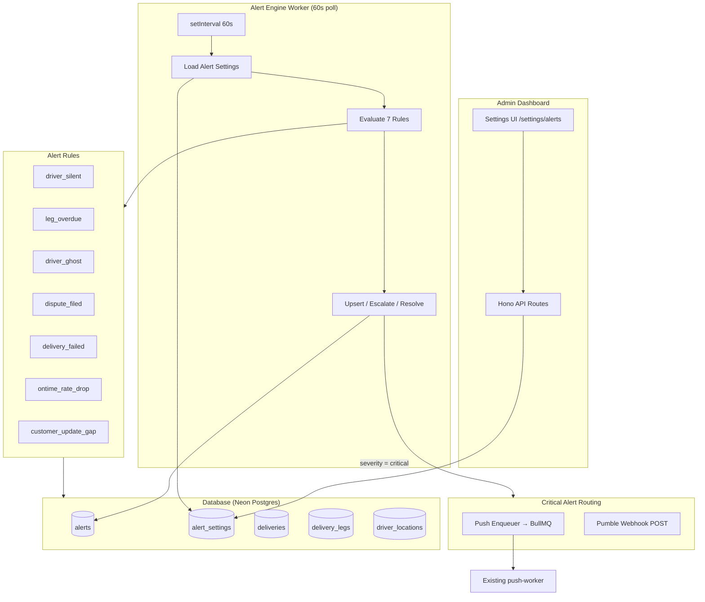
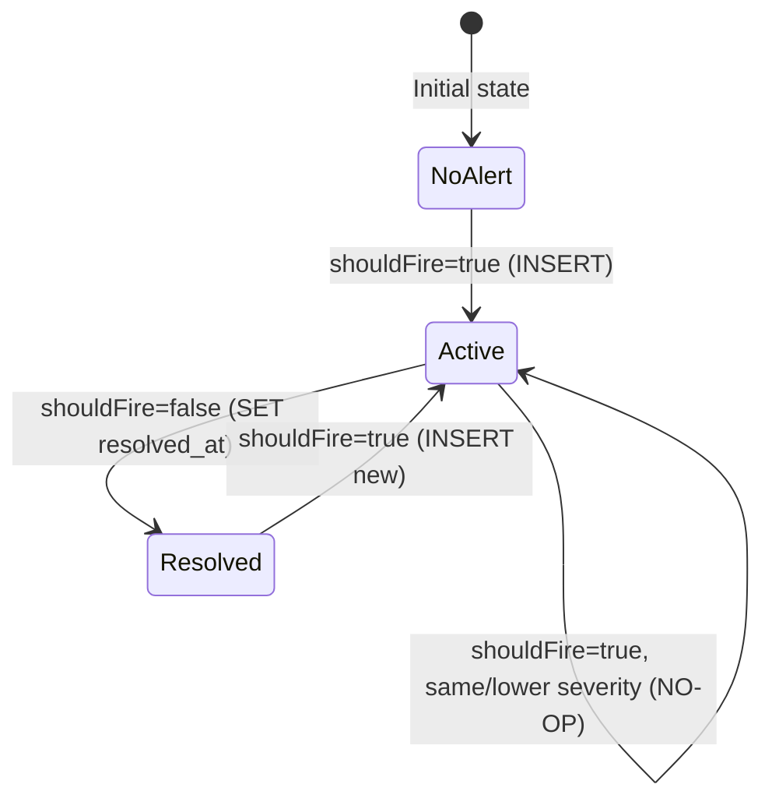

# Design Document: Alert System

## Overview

The Alert System is a background monitoring engine that continuously evaluates delivery operations against configurable thresholds and routes critical incidents to admin push notifications and a Pumble webhook channel. It consists of four major components:

1. **Alert Engine Worker** — A standalone Node.js process (`workers/alert-engine/`) running a 60-second `setInterval` polling loop that evaluates 7 alert rules against live database state each tick.
2. **Alert Lifecycle Manager** — Upsert logic that inserts new alerts, escalates existing alerts in-place when conditions worsen, and auto-resolves alerts when conditions clear.
3. **Notification Router** — Routes Critical-severity alerts to admin Expo push notifications (via BullMQ) and Pumble incoming webhooks; Warning/Info alerts remain in-app only.
4. **Settings API & UI** — Admin endpoints and a `/settings/alerts` dashboard page for configuring thresholds and notification routing.

The system is designed for Nigerian network conditions where GPS connectivity drops are common in Lagos traffic, so default thresholds are intentionally generous (15-min driver silent warning).

## Architecture



### Key Architecture Decisions

| Decision | Rationale |
|----------|-----------|
| Polling (60s setInterval) over event-driven | Simpler to reason about, self-healing (missed events get caught next tick), no external realtime dependency for the worker |
| Upsert pattern (escalate in-place) | Prevents duplicate alert rows; single source of truth for current alert state per rule+delivery+leg combination |
| BullMQ for push enqueue | Reuses existing push-worker infrastructure; provides retry with exponential backoff out of the box |
| Pumble webhook (Slack-compatible) | Zero additional infrastructure; POST JSON `{ text: "..." }` to an incoming webhook URL |
| Singleton `alert_settings` row | Atomic reads/writes; no cache invalidation needed; DB-level single-row constraint |
| `Promise.allSettled` for rule evaluation | One failing rule cannot abort the entire tick; fault isolation without try/catch per rule |

## Components and Interfaces

### 1. Alert Engine Worker (`workers/alert-engine/`)

**Entry point:** `src/index.ts`

```typescript
// Startup flow
1. Initialize DB client (Drizzle + Neon HTTP)
2. Run first tick immediately
3. Register setInterval(runTick, 60_000)
4. Register SIGTERM/SIGINT handlers for graceful shutdown
```

**`runTick()` function:**
```typescript
async function runTick(): Promise<void> {
  const [settings, adminUserIds] = await Promise.all([loadSettings(), getAdminUserIds()]);
  const results = await Promise.allSettled([...7 rule evaluators...]);
  for (const result of flattenFulfilled(results)) {
    await upsertAlert(result, settings, adminUserIds);
  }
}
```

### 2. Rule Evaluators (`src/rules/*.ts`)

Each rule exports a single function:

```typescript
export async function evaluate(settings: AlertSettings): Promise<EvaluationResult[]>
```

| Rule | Query Pattern | Severity Logic |
|------|--------------|----------------|
| `driver_silent` | Active legs + MAX(driver_locations.recorded_at) | elapsed ≥ critical → critical; ≥ warning → warning; else resolve |
| `leg_overdue` | Active legs with non-null ETA | (now − ETA) thresholds |
| `driver_ghost` | delivery_events within 10 min, pre-pickup → cancelled/failed, not customer-triggered | Always critical |
| `dispute_filed` | escrow_holds.status = 'disputed' without unresolved alert | Always warning |
| `delivery_failed` | deliveries.status = 'failed' within 2 min without unresolved alert | Always warning |
| `ontime_rate_drop` | Today's delivered ÷ on-time (Africa/Lagos TZ), min 5 deliveries | Rate thresholds |
| `customer_update_gap` | Active deliveries + MAX(customer-facing event) | elapsed thresholds |

### 3. Alert Lifecycle Manager (`upsertAlert()`)

State machine for each (rule, delivery_id, leg_id) combination:



**Severity ordinal:** `info` (0) < `warning` (1) < `critical` (2)

### 4. Notification Router

```typescript
// Only triggered for severity === 'critical'
async function routeCritical(result, settings, adminUserIds): Promise<void> {
  if (settings.pumbleEnabled && settings.pumbleWebhookUrl) {
    await sendPumbleAlert(settings.pumbleWebhookUrl, result.rule, result.context);
  }
  if (settings.pushEnabled) {
    await enqueueAdminPush(result.rule, result.context, adminUserIds);
  }
}
```

**Pumble payload:**
```json
{ "text": "🔴 CRITICAL — Driver Silent\nDelivery #SW-1234 | Driver: Emeka N. | Silent for 35 min | Zone: Lekki\n→ View: https://admin.surewaka.ng/deliveries/SW-1234" }
```

**Push job shape (BullMQ):**
```typescript
{
  userId: string,
  targetApp: 'admin',
  payload: { title: '🔴 Driver Silent', body: 'Delivery #SW-1234 needs attention', data: { alertRule, deliveryId } },
  priority: 'high'
}
// Queue options: attempts: 3, backoff: { type: 'exponential', delay: 1000 }, maxDelay: 30000
```

### 5. Settings API (`apps/api/src/routes/admin/alert-settings.ts`)

| Endpoint | Method | Auth | Body | Response |
|----------|--------|------|------|----------|
| `/api/v1/admin/alert-settings` | GET | `requireAuth` + `requireRole('surewaka_admin')` | — | `{ data: AlertSettings, error: null, meta: null }` |
| `/api/v1/admin/alert-settings` | PUT | Same | Partial `AlertSettings` | `{ data: AlertSettings, error: null, meta: null }` or 400 |
| `/api/v1/admin/alert-settings/test` | POST | Same | — | `{ data: { sent: boolean, channels: string[], failedChannels?: string[] }, error: null, meta: null }` |

### 6. Settings UI (`apps/admin/app/routes/settings/alerts.tsx`)

- Threshold sliders for all 8 configurable values
- Pumble toggle + webhook URL input (HTTPS validation)
- Push notification toggle
- "Send test alert" button with success/error toast
- WhatsApp Business placeholder section
- Loading skeletons on initial fetch
- Error state with retry action

## Data Models

### `alerts` table

| Column | Type | Constraints |
|--------|------|-------------|
| `id` | UUID | PK, default `gen_random_uuid()` |
| `delivery_id` | UUID | Nullable FK → `deliveries.id` ON DELETE CASCADE |
| `leg_id` | UUID | Nullable FK → `delivery_legs.id` ON DELETE SET NULL |
| `rule` | text | NOT NULL |
| `severity` | text | NOT NULL, CHECK IN ('info', 'warning', 'critical') |
| `original_severity` | text | Nullable, same CHECK |
| `context` | JSONB | NOT NULL, default `'{}'` |
| `fired_at` | timestamptz | NOT NULL, default `now()` |
| `escalated_at` | timestamptz | Nullable |
| `resolved_at` | timestamptz | Nullable |
| `ack_by` | UUID | Nullable FK → `users.id` ON DELETE SET NULL |

**Indexes:**
- Partial index on `fired_at DESC` WHERE `resolved_at IS NULL` (unresolved alert queries)
- Partial index on `delivery_id` WHERE `delivery_id IS NOT NULL`

### `alert_settings` table (singleton)

| Column | Type | Default |
|--------|------|---------|
| `id` | UUID | PK |
| `driver_silent_warning_min` | integer | 15 |
| `driver_silent_critical_min` | integer | 30 |
| `leg_overdue_warning_min` | integer | 30 |
| `leg_overdue_critical_min` | integer | 60 |
| `customer_update_gap_warning_min` | integer | 45 |
| `customer_update_gap_critical_min` | integer | 90 |
| `ontime_rate_warning_pct` | integer | 80 |
| `ontime_rate_critical_pct` | integer | 60 |
| `pumble_webhook_url` | text | NULL |
| `push_enabled` | boolean | true |
| `pumble_enabled` | boolean | false |
| `updated_at` | timestamptz | `now()` |

**Constraint:** Single-row enforcement (one INSERT in migration, application-level guard).

### `EvaluationResult` type

```typescript
type EvaluationResult = {
  deliveryId: string | null;
  legId: string | null;
  rule: AlertRule;
  severity: AlertSeverity;
  context: Record<string, unknown>;
  shouldFire: boolean;
};
```

### `AlertSettings` type

```typescript
type AlertSettings = {
  driverSilentWarningMin: number;
  driverSilentCriticalMin: number;
  legOverdueWarningMin: number;
  legOverdueCriticalMin: number;
  customerUpdateGapWarningMin: number;
  customerUpdateGapCriticalMin: number;
  ontimeRateWarningPct: number;
  ontimeRateCriticalPct: number;
  pumbleWebhookUrl: string | null;
  pushEnabled: boolean;
  pumbleEnabled: boolean;
};
```

### Shared Types (`packages/shared/src/types.ts`)

```typescript
type AlertRule = 'driver_silent' | 'leg_overdue' | 'driver_ghost' | 'dispute_filed' | 'delivery_failed' | 'ontime_rate_drop' | 'customer_update_gap';
type AlertSeverity = 'info' | 'warning' | 'critical';
type Alert = {
  id: string;
  deliveryId: string | null;
  legId: string | null;
  rule: AlertRule;
  severity: AlertSeverity;
  originalSeverity: AlertSeverity | null;
  context: Record<string, unknown>;
  firedAt: string;
  escalatedAt: string | null;
  resolvedAt: string | null;
  ackBy: string | null;
};
```

## Correctness Properties

*A property is a characteristic or behavior that should hold true across all valid executions of a system — essentially, a formal statement about what the system should do. Properties serve as the bridge between human-readable specifications and machine-verifiable correctness guarantees.*

### Property 1: Driver Silent Threshold Classification

*For any* elapsed silence duration (in minutes) and any valid pair of threshold settings (warningMin, criticalMin where warningMin < criticalMin), the `driver_silent` rule SHALL produce:
- `severity: 'critical'` and `shouldFire: true` when elapsed ≥ criticalMin
- `severity: 'warning'` and `shouldFire: true` when warningMin ≤ elapsed < criticalMin
- `shouldFire: false` when elapsed < warningMin

**Validates: Requirements 2.2, 2.3, 2.4**

### Property 2: Leg Overdue Threshold Classification

*For any* elapsed minutes past ETA and any valid pair of threshold settings (warningMin, criticalMin where warningMin < criticalMin), the `leg_overdue` rule SHALL produce:
- `severity: 'critical'` and `shouldFire: true` when elapsed ≥ criticalMin
- `severity: 'warning'` and `shouldFire: true` when warningMin ≤ elapsed < criticalMin
- `shouldFire: false` when elapsed ≤ 0

**Validates: Requirements 3.2, 3.3, 3.4**

### Property 3: On-Time Rate Threshold Classification

*For any* computed on-time rate percentage (0–100) and any valid pair of percentage thresholds (warningPct, criticalPct where warningPct > criticalPct), the `ontime_rate_drop` rule SHALL produce:
- `severity: 'critical'` and `shouldFire: true` when rate < criticalPct
- `severity: 'warning'` and `shouldFire: true` when criticalPct ≤ rate < warningPct
- `shouldFire: false` when rate ≥ warningPct

**Validates: Requirements 7.2, 7.3, 7.6**

### Property 4: Customer Update Gap Threshold Classification

*For any* elapsed minutes since last customer-facing event and any valid pair of threshold settings (warningMin, criticalMin where warningMin < criticalMin), the `customer_update_gap` rule SHALL produce:
- `severity: 'critical'` and `shouldFire: true` when elapsed ≥ criticalMin
- `severity: 'warning'` and `shouldFire: true` when warningMin ≤ elapsed < criticalMin
- `shouldFire: false` when elapsed < warningMin

**Validates: Requirements 8.2, 8.3, 8.5**

### Property 5: Alert Lifecycle State Machine

*For any* evaluation result and any existing alert state (none, active-info, active-warning, active-critical, resolved), the `upsertAlert` function SHALL produce the correct state transition:
- (shouldFire=true, no existing) → INSERT new alert
- (shouldFire=true, existing with lower severity) → UPDATE severity, set escalated_at, store original_severity
- (shouldFire=true, existing with equal or higher severity) → NO-OP
- (shouldFire=false, existing unresolved) → SET resolved_at
- (shouldFire=false, no existing) → NO-OP

**Validates: Requirements 9.1, 9.2, 9.3, 9.4, 9.5**

### Property 6: Fault-Tolerant Rule Evaluation

*For any* subset of the 7 registered alert rules that throw errors during evaluation, all non-throwing rules SHALL still produce their evaluation results, and the tick SHALL complete without aborting.

**Validates: Requirements 1.3, 1.6**

### Property 7: Critical-Only External Routing

*For any* alert with severity `warning` or `info`, the system SHALL NOT invoke the Push_Enqueuer or Pumble_Sender. External routing (push + Pumble) SHALL only occur for alerts with severity `critical`.

**Validates: Requirements 10.1, 10.5**

### Property 8: On-Time Rate Computation Accuracy

*For any* set of deliveries with known `updated_at` and `system_eta_at` timestamps, the computed on-time rate SHALL equal `(count where updated_at ≤ system_eta_at) / (total delivered count) * 100`, rounded to 1 decimal place, and the result context SHALL contain `ratePct`, `delivered`, and `onTime` fields.

**Validates: Requirements 7.1, 7.5**

### Property 9: Validation Schema Bounds

*For any* integer value submitted for a threshold field in `updateAlertSettingsSchema`:
- Values within the defined [min, max] range SHALL pass validation
- Values outside the range SHALL fail with a Zod validation error identifying the field

Field bounds: `driverSilentWarningMin` [5,60], `driverSilentCriticalMin` [10,120], `legOverdueWarningMin` [10,120], `legOverdueCriticalMin` [20,240], `customerUpdateGapWarningMin` [15,120], `customerUpdateGapCriticalMin` [30,240], `ontimeRateWarningPct` [50,100], `ontimeRateCriticalPct` [30,90].

**Validates: Requirements 15.1, 15.2, 15.3, 15.4, 15.5, 15.6, 15.7, 15.8, 15.9, 15.10**

### Property 10: Cross-Field Threshold Ordering

*For any* update payload containing both a warning and its corresponding critical field:
- Time-based pairs: validation SHALL reject if warning ≥ critical (`driverSilentWarningMin` < `driverSilentCriticalMin`, `legOverdueWarningMin` < `legOverdueCriticalMin`, `customerUpdateGapWarningMin` < `customerUpdateGapCriticalMin`)
- Percentage pair: validation SHALL reject if warning ≤ critical (`ontimeRateWarningPct` > `ontimeRateCriticalPct`)

**Validates: Requirements 15.11, 11.5**

### Property 11: One Evaluation Result Per Matched Entity

*For any* N deliveries matching the `dispute_filed` or `delivery_failed` rule query, the evaluator SHALL produce exactly N `EvaluationResult` objects, each with a distinct `deliveryId` and `shouldFire: true`.

**Validates: Requirements 5.2, 6.2, 6.4**

### Property 12: Driver Silent Context Completeness

*For any* active leg evaluated by the `driver_silent` rule that produces `shouldFire: true`, the `EvaluationResult.context` SHALL contain non-null values for `deliveryId`, `driverName`, `minutesSilent` (integer), and `zone`.

**Validates: Requirements 2.6**

### Property 13: Push Enqueue Fan-Out

*For any* set of N active admin users with registered device tokens, when a critical alert fires and `pushEnabled` is true, the Push_Enqueuer SHALL enqueue exactly N jobs into the BullMQ push-worker queue, each with `targetApp: 'admin'` and `priority: 'high'`.

**Validates: Requirements 10.1**

## Error Handling

| Scenario | Handling | Recovery |
|----------|----------|----------|
| DB unreachable at tick start | Log to stderr, skip entire tick | Auto-retry next interval (60s) |
| Individual rule evaluation throws | Log rule name + error, skip rule | Remaining rules continue; retry next tick |
| `upsertAlert` DB write fails | Log alert ID + error, continue to next result | Retry next tick (idempotent upsert) |
| Pumble webhook POST fails (timeout, non-2xx, network) | Log Alert_Record ID + HTTP status + reason | Alert is already persisted in DB; Pumble failure is non-blocking |
| Push enqueue fails (Redis connection, serialization) | Log Alert_Record ID + user ID, continue remaining users | Push failure is non-blocking; admin sees alert in-app regardless |
| Settings API PUT fails validation | Return HTTP 400 with Zod error details | Client displays inline error, slider reverts |
| Settings UI initial load fails | Display error message with retry button | User clicks retry to re-fetch |
| Test alert POST fails | Return 200 with `failedChannels` array | UI shows which channels failed |

**Design principle:** The alert engine is designed to be crash-resistant. No single failure (DB, network, external service) should crash the process. The polling loop is self-healing — any condition missed in one tick will be caught in the next.

## Testing Strategy

### Property-Based Tests (Vitest + fast-check)

The alert system's core logic is primarily threshold classification and state machine transitions — ideal for property-based testing. Each property test runs **minimum 100 iterations** with randomly generated inputs.

**Library:** `fast-check` (TypeScript-native, integrates with Vitest)

**Configuration:**
```typescript
import fc from 'fast-check';
// Each property test: fc.assert(fc.property(...), { numRuns: 100 })
```

**Property tests to implement:**
- Threshold classification for all 4 time/rate-based rules (Properties 1–4)
- Alert lifecycle state machine transitions (Property 5)
- Fault-tolerant evaluation with random rule failures (Property 6)
- Critical-only routing invariant (Property 7)
- On-time rate computation (Property 8)
- Validation schema bounds (Property 9)
- Cross-field ordering constraint (Property 10)
- One result per entity invariant (Property 11)
- Context completeness (Property 12)
- Push fan-out count (Property 13)

**Tag format:** Each test includes a comment:
```typescript
// Feature: alert-system, Property 1: Driver Silent Threshold Classification
```

### Unit Tests (Vitest)

Example-based tests for specific scenarios:
- Graceful shutdown on SIGTERM (Requirement 1.2)
- DB unreachable skips tick without crash (Requirement 1.5)
- No GPS ping fallback to `started_at` (Requirement 2.5)
- Null ETA legs are skipped (Requirement 3.5)
- Driver ghost always produces critical (Requirement 4.2)
- On-time rate skips when < 5 deliveries (Requirement 7.4)
- Pumble POST format matches Slack webhook spec
- Push job shape matches existing push-worker expectations
- API auth guard returns 401/403 for unauthorized requests (Requirement 12.5)
- Test endpoint reports failed channels (Requirement 12.6)

### Integration Tests

- Migration creates correct schema, indexes, constraints
- Singleton row enforcement (second INSERT rejected)
- Alert upsert atomicity under concurrent access
- Full tick cycle: settings load → rule eval → upsert → routing
- API endpoints against real DB (Neon branch or test DB)

### UI Component Tests

- Settings page renders sliders with correct min/max
- Slider interaction triggers PUT request
- Failed PUT reverts slider to previous value
- Loading state shows skeletons
- Error state shows retry action
- Test button shows success/error toast
