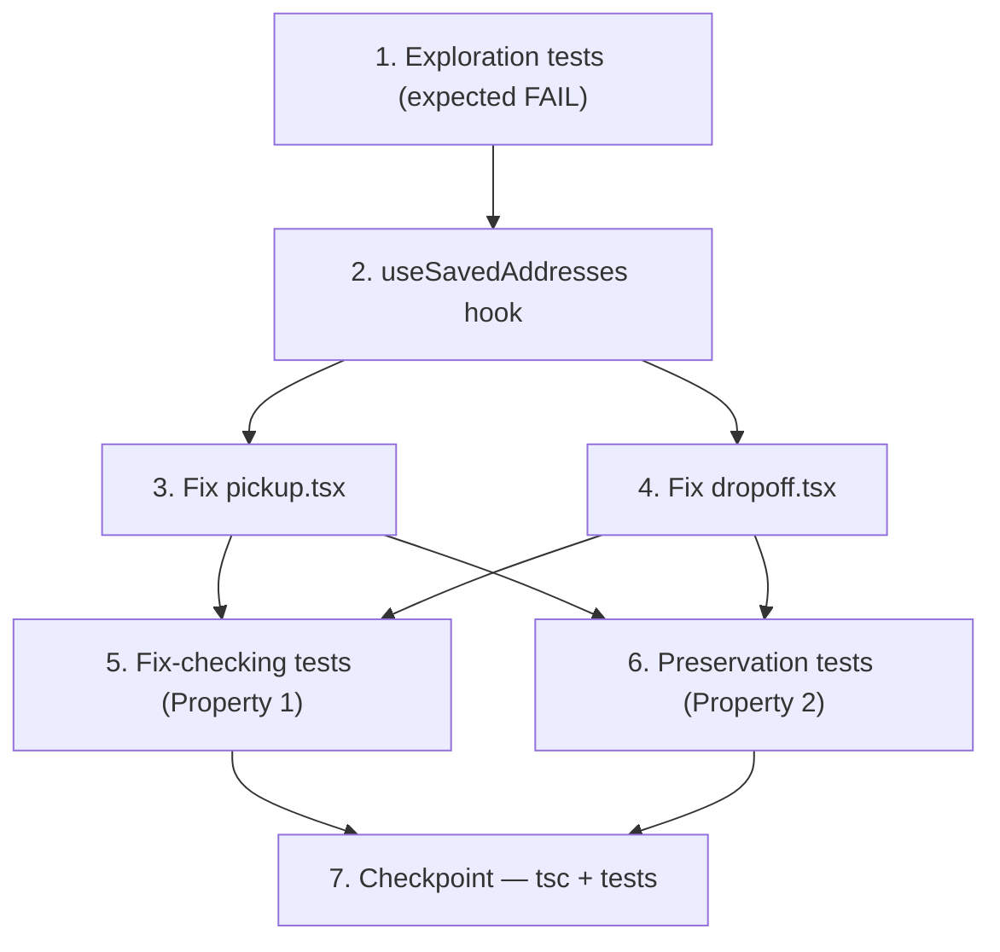

# Implementation Plan — Booking Address Resilience

## Overview

This bugfix follows the exploratory bug-condition methodology from the design's Testing Strategy
(Exploratory Bug Condition Checking → Fix → Fix Checking → Preservation Checking). Work is ordered so
the defects are proven first, the fix is applied second, and the fix-checking + preservation
properties are validated last.

- **Task 1 (exploration, expected to FAIL on unfixed code)** drives all four bug inputs against the
  current `pickup.tsx` / `dropoff.tsx` and asserts the missing correct behavior — proving the four
  defects in the design's Bug Condition (`isBugCondition`) and the Exploratory Bug Condition Checking
  section.
- **Tasks 2–4** implement the minimal, additive fix: the shared `useSavedAddresses` hook, then the
  symmetric `pickup.tsx` and `dropoff.tsx` screen changes.
- **Tasks 5–6** encode the two Correctness Properties: **Property 1: Bug Condition** (fix checking,
  Req 2.1–2.7) and **Property 2: Preservation** (Req 3.1–3.7, fast-check, 100+ iterations).
- **Task 7** is the verification checkpoint (`tsc --noEmit` + test suite).

All work is mobile-client-only: `packages/mobile-shared` and `apps/mobile-customer`. No API, server,
schema, or package additions. Test sub-tasks are marked with `*`.

## Tasks

- [ ] 1. Write bug-condition exploration tests (EXPECTED TO FAIL on unfixed code)
  - **Property 1: Bug Condition** - Address Resilience And Reporting (exploration phase)
  - **CRITICAL**: These tests MUST FAIL on the current, unfixed `pickup.tsx` / `dropoff.tsx` —
    failure confirms the four defects exist. **DO NOT fix the test or the code when it fails.**
  - **NOTE**: These tests encode the expected behavior and become the fix-checking tests once they
    pass after implementation (see task 5).
  - **GOAL**: Surface counterexamples for each bug input from the design's Exploratory Bug Condition
    Checking section, driving the CURRENT screens with a mocked `createAddressesClient`.
  - Set up: render each screen with a mocked addresses client; spy `Sentry.captureException`, spy
    `router.push` and the booking store setters; use RN Testing Library.
  - Drive each bug input (`isBugCondition` = true) and assert the missing correct behavior:
    - `list()` in flight → assert a loading affordance in the saved-address chip region (fails today:
      nothing renders) — Req 2.1
    - `list()` resolves `{ data: null, error }` → assert inline error + Retry affordance AND one
      `captureException` tagged `app:mobile-customer` (fails today: silent empty, no report) — Req 2.2
    - `listRecent()` rejects → assert Recent-section error + Retry AND `captureException` (fails today:
      swallowed by bare `.then`) — Req 2.3, 2.4
    - tap a save-nudge label with `create()` resolving `{ error }` → assert a visible failure message
      AND `captureException` (fails today: no-op, no feedback) — Req 2.5
    - Confirm with `upsertRecent()` rejecting → assert NO unhandled promise rejection, a
      `captureException`, AND that `router.push` was still called synchronously (fails today: unhandled
      rejection, no report) — Req 2.6
  - Run tests on UNFIXED code.
  - **EXPECTED OUTCOME**: Tests FAIL (this is correct — it proves the bugs exist).
  - Document the observed counterexamples (no loading state; silent empty + no Sentry on error; no
    save message + no Sentry; unhandled rejection + no Sentry) to confirm the root-cause analysis.
  - Mark complete when the tests are written, run, and the failures are documented.
  - **Validates: Requirements 2.1, 2.2, 2.3, 2.4, 2.5, 2.6, 2.7**
  - _Requirements: 2.1, 2.2, 2.3, 2.4, 2.5, 2.6, 2.7_

- [ ] 2. Create the shared `useSavedAddresses` hook
  - Create `packages/mobile-shared/src/hooks/use-saved-addresses.ts`.
  - Export `type AddrLoadState = 'loading' | 'error' | 'ready'`.
  - Implement `useSavedAddresses(token: string, route: string)` returning
    `{ savedAddresses, recentLocations, state, reload, addSaved }` per the design's Fix Implementation.
  - `reload()`: set `state = 'loading'`, run `client.list()` and `client.listRecent()` together via
    `Promise.all`; on settle, if either result has a non-null `error` or the combined promise rejects,
    set `state = 'error'` and call `Sentry.captureException(...)` ONCE, tagged
    `{ app: 'mobile-customer' }` with `extra: { route, op: 'load' }` (wrap non-`Error` values in an
    `Error`); otherwise populate both arrays and set `state = 'ready'`.
  - Run `reload()` in a `useEffect` keyed on `token`, gated on non-empty `token` (preserving today's
    `if (!token) return;` timing).
  - `addSaved(addr)`: append to `savedAddresses` (used by the screens' save-nudge success branch).
  - Import Sentry via `import * as Sentry from '@sentry/react-native';` (optional peer dep of
    `packages/mobile-shared`).
  - Add `export { useSavedAddresses }` and `export type { AddrLoadState }` to
    `packages/mobile-shared/src/index.ts`.
  - No PII in `extra` (route + op only).
  - _Bug_Condition: isBugCondition(input) for op IN ['list','listRecent'] — in-flight OR rejected OR error not null_
  - _Expected_Behavior: loading while in flight; on failure state='error' + single Sentry capture; on success populate + state='ready'; reload re-runs both calls_
  - _Preservation: successful loads still populate savedAddresses/recentLocations; token gate + timing unchanged (Req 3.1, 3.2)_
  - _Requirements: 2.1, 2.2, 2.3, 2.4, 2.7, 3.1, 3.2_

- [ ] 3. Fix `pickup.tsx` (route `booking/pickup`)
  - Adopt the hook: replace the local `savedAddresses` / `recentLocations` `useState` + on-mount
    `useEffect` with
    `const { savedAddresses, recentLocations, state: addrLoadState, reload, addSaved } = useSavedAddresses(token, 'booking/pickup');`
    (the `if (!token) return;` gate moves into the hook).
  - Loading affordance: while `addrLoadState === 'loading'`, render a lightweight `animate-pulse`
    placeholder row matching the chip-row shape, and a matching muted placeholder under the
    "Recent"/"Saved" header when the search panel is open. Keep the device-location full-screen
    `loading` gate unchanged (Req 2.1, 2.3).
  - Error + retry affordance: while `addrLoadState === 'error'`, render a small inline error (icon +
    "Couldn't load your addresses") with a `Retry` control whose `onPress` calls `reload()`; it must
    NOT cover or disable the search `TextInput` or the map (Req 2.2, 2.4, 2.7).
  - Save-nudge failure branch: wrap `handleSaveNudge` in try/catch; success branch sets `savedLabel`
    and calls `addSaved(result.data!)`; failure/`error` branch and the `catch` set a `saveError`
    inline message ("Couldn't save — try again") near the nudge pills and call
    `Sentry.captureException(...)` tagged `{ app: 'mobile-customer', screen: 'booking/pickup' }`,
    `extra: { op: 'create' }`; clear `saveError` at the existing `setSavedLabel(null)` reset points
    (Req 2.5, 3.3).
  - `upsertRecent` rejection handling: attach `.catch((e) => Sentry.captureException(e, { tags: { app: 'mobile-customer', screen: 'booking/pickup' }, extra: { op: 'upsertRecent' } }))`
    to the fire-and-forget call WITHOUT awaiting it; keep `router.push('/booking/dropoff')` synchronous
    and after the call, and leave the store setter / step advance unchanged (Req 2.6, 3.4).
  - Add `import * as Sentry from '@sentry/react-native';` (no re-init).
  - _Bug_Condition: isBugCondition(input) for ops list/listRecent (load), create (save-nudge), upsertRecent (background write)_
  - _Expected_Behavior: loading placeholder / inline error+Retry+Sentry / visible save message+Sentry / caught+Sentry+silent+non-blocking upsertRecent_
  - _Preservation: successful chip/search population; "Saved as {label}" + append; store set + step advance + non-blocking upsertRecent + synchronous navigation (Req 3.1, 3.3, 3.4)_
  - _Requirements: 2.1, 2.2, 2.3, 2.4, 2.5, 2.6, 2.7, 3.1, 3.3, 3.4_

- [ ] 4. Fix `dropoff.tsx` (route `booking/dropoff`) — symmetric to task 3
  - Apply the identical changes as task 3, with route/screen `'booking/dropoff'`:
    - Adopt `useSavedAddresses(token, 'booking/dropoff')`.
    - Loading placeholder for the chip row + Recent/Saved section (Req 2.1, 2.3).
    - Inline error + `Retry` calling `reload()`, not blocking search/map (Req 2.2, 2.4, 2.7).
    - `handleSaveNudge` try/catch with visible `saveError` message + `Sentry.captureException`
      (`screen: 'booking/dropoff'`, `op: 'create'`); success path unchanged incl. `addSaved` (Req 2.5, 3.3).
    - `upsertRecent(...).catch(Sentry.captureException ... op: 'upsertRecent')` with navigation still
      synchronous and non-blocking (Req 2.6, 3.4).
  - Add `import * as Sentry from '@sentry/react-native';` (no re-init).
  - _Bug_Condition: isBugCondition(input) for ops list/listRecent (load), create (save-nudge), upsertRecent (background write)_
  - _Expected_Behavior: loading placeholder / inline error+Retry+Sentry / visible save message+Sentry / caught+Sentry+silent+non-blocking upsertRecent_
  - _Preservation: successful chip/search population; "Saved as {label}" + append; store set + step advance + non-blocking upsertRecent + synchronous navigation (Req 3.1, 3.3, 3.4)_
  - _Requirements: 2.1, 2.2, 2.3, 2.4, 2.5, 2.6, 2.7, 3.1, 3.3, 3.4_

- [ ] 5. * Fix-checking tests — verify Property 1 for all bug inputs
  - **Property 1: Expected Behavior** - Address Resilience And Reporting (fix-checking phase)
  - **IMPORTANT**: Re-run the SAME tests written in task 1 — do NOT write new ones. Task 1's tests
    encode the expected behavior; passing them confirms the fix.
  - For every input where `isBugCondition(input)` holds, assert the design's `expectedBehavior`:
    - in-flight `list`/`listRecent` → loading affordance shown (Req 2.1, 2.3)
    - failed/rejected `list`/`listRecent` → inline error + Retry that re-triggers the load AND one
      `captureException` tagged `app:mobile-customer` with route context (Req 2.2, 2.4)
    - failed/rejected `create` → visible failure message AND `captureException` with route context (Req 2.5)
    - rejected/errored `upsertRecent` → rejection caught (assert NO unhandled promise rejection),
      `captureException` with route context, no user error surfaced, navigation not blocked (Req 2.6)
    - Retry after a failed load succeeds → error affordance cleared and data rendered (Req 2.7)
  - Assert across both `pickup.tsx` and `dropoff.tsx`.
  - **EXPECTED OUTCOME**: Tests PASS (confirms the bugs are fixed).
  - **Validates: Requirements 2.1, 2.2, 2.3, 2.4, 2.5, 2.6, 2.7**
  - _Requirements: 2.1, 2.2, 2.3, 2.4, 2.5, 2.6, 2.7_

- [ ] 6. * Preservation tests — verify Property 2 for all non-bug inputs (fast-check)
  - **Property 2: Preservation** - Happy Path And Out-Of-Scope Paths Unchanged
  - **IMPORTANT**: Follow the observation-first methodology — first observe the happy-path behavior on
    UNFIXED code (successful chip/search population; "Saved as {label}" + append; non-blocking recent
    write + navigation), then encode property-based tests asserting the fixed screens match for all
    non-bug inputs (`isBugCondition` = false).
  - Use **fast-check** with 100+ iterations; tag each property
    `"Feature: booking-address-resilience, Property 2: Preservation ..."`.
  - Generate arbitrary successful `{ data }` outcomes and datasets, and assert Property-2 equivalence
    `F(X) = F'(X)`:
    - successful `list`/`listRecent` → chip row + Recent/Saved sections render identically (Req 3.1, 3.2)
    - successful save-nudge → "Saved as {label}" confirmation + `savedAddresses` append, no error
      message, no Sentry call (Req 3.3)
    - `handleConfirm` with a valid location → store setter, step advance, non-blocking `upsertRecent`
      fire, and synchronous `router.push` all occur as before; navigation does not await the write (Req 3.4)
    - `searchAddress` autocomplete, `reverseGeocode`/map-press, and the profile addresses screen are
      untouched (Req 3.5, 3.6, 3.7)
  - Verify these pass on UNFIXED code first (baseline), then still pass after the fix (no regressions),
    across both screens.
  - **EXPECTED OUTCOME**: Tests PASS on both unfixed and fixed code (confirms no regressions).
  - **Validates: Requirements 3.1, 3.2, 3.3, 3.4, 3.5, 3.6, 3.7**
  - _Requirements: 3.1, 3.2, 3.3, 3.4, 3.5, 3.6, 3.7_

- [ ] 7. Checkpoint — type-check and run the test suite
  - Run `pnpm --filter @surewaka/mobile-shared exec tsc --noEmit`.
  - Run `pnpm --filter @surewaka/mobile-customer exec tsc --noEmit`.
  - Run the mobile test suite (single run, no watch) and ensure Task 1's tests now PASS (fix checking),
    the preservation properties PASS, and no unhandled promise rejection is emitted for any failure path.
  - Ensure all tests pass; ask the user if questions arise.
  - _Requirements: 2.1, 2.2, 2.3, 2.4, 2.5, 2.6, 2.7, 3.1, 3.2, 3.3, 3.4, 3.5, 3.6, 3.7_

## Task Dependency Graph

```json
{
  "waves": [
    { "wave": 1, "tasks": ["1"] },
    { "wave": 2, "tasks": ["2"] },
    { "wave": 3, "tasks": ["3", "4"] },
    { "wave": 4, "tasks": ["5", "6"] },
    { "wave": 5, "tasks": ["7"] }
  ]
}
```



## Notes

- **Ordering rationale**: Task 1 is the bug-condition exploration test and is EXPECTED TO FAIL on the
  current code — this proves the four defects before any fix. The same tests become the fix-checking
  tests in task 5 once they pass.
- **Property mapping**: Property 1 (Bug Condition / Expected Behavior) → task 1 (fail) then task 5
  (pass), validating Req 2.1–2.7. Property 2 (Preservation) → task 6, validating Req 3.1–3.7 with
  fast-check.
- **Requirement families**: 2.x = fix checking (correct behavior for bug inputs), 3.x = preservation
  (non-bug inputs unchanged).
- **Scope guard**: mobile-client-only. No changes to `createAddressesClient`, the API, the DB schema,
  or `@surewaka/shared`. The LocationIQ `searchAddress`, map `reverseGeocode`/map-press, device-location
  full-screen `loading` gate, and the profile addresses screen stay byte-for-byte unchanged.
- **Shared-hook fallback**: if the shared hook adds integration risk (e.g. token-timing differences),
  the design's fallback is to apply the identical fix inline in both screens symmetrically; the
  properties and tests apply equally to either layout.
- **Sentry**: no re-initialization (`Sentry.init` already runs in `_layout.tsx`); these tasks only
  call `captureException`, always tagged `app: 'mobile-customer'` with route + `op` and never PII.
