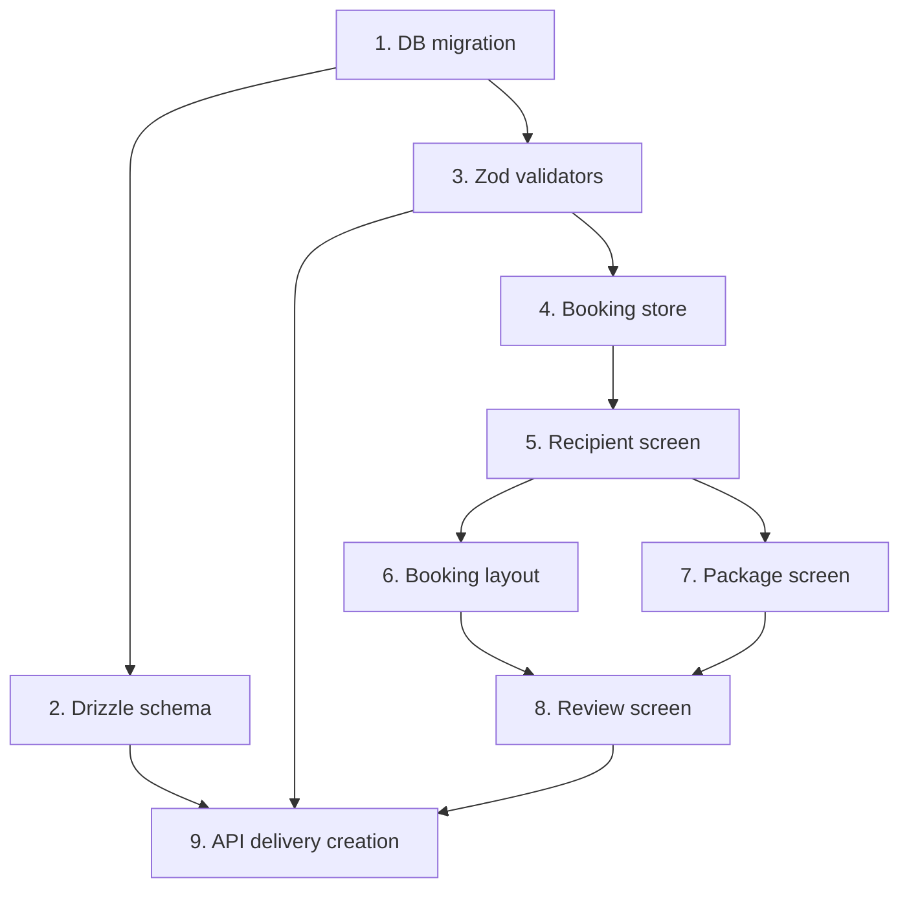

# Implementation Plan — Booking Recipient Contact Info

## Overview

Implementation order: schema → validators → store → screen → layout wiring → API.

> **Status:** Implemented and shipped. Retained as an implementation record;
> reconciled with the shipped one-file-per-table schema location.

## Tasks

- [x] 1. **DB migration** — alter `deliveries` table: add `recipient_name` (text not null default ''), `recipient_phone` (text not null default ''), `delivery_notes` (text nullable), `sender_phone` (text nullable); then drop the defaults from `recipient_name` and `recipient_phone`
  - Run `pnpm db:generate new add_delivery_contact_fields`
  - Run `pnpm db:generate fetch --yes` to apply

- [x] 2. **Drizzle schema** — add `recipientName`, `recipientPhone`, `deliveryNotes`, `senderPhone` fields to the `deliveries` table definition in `packages/db/src/schema/deliveries.ts` (one-file-per-table; exported via `packages/db/src/schema/index.ts` — not a monolithic `schema.ts`)

- [x] 3. **Zod validators** — create `packages/shared/src/validators/recipient-details.ts` with `recipientDetailsSchema` (Nigerian phone regex validation); export from package index; add `recipientDetails` field to the delivery creation schema

- [x] 4. **Booking store** — add `recipientDetails: Partial<RecipientDetails> | null` and `setRecipientDetails` action to `useBookingStore` in `packages/mobile-shared/src/store/booking-store.ts`; include in `reset()`

- [x] 5. **Recipient screen** — create `apps/mobile-customer/app/booking/recipient.tsx`; react-hook-form + zodResolver; fields: recipientName, recipientPhone (numeric keyboard, +234 hint), deliveryNotes (multiline, optional); on submit: `setRecipientDetails` → push `/booking/carriers`

- [x] 6. **Booking layout** — add `'Recipient'` to the steps array in `_layout.tsx` between Package and Carriers; add `Stack.Screen` for `recipient` as Step 4 of 7; update Carriers → Step 5, Review → Step 6

- [x] 7. **Package screen** — change `onSubmit` navigation from `/booking/carriers` to `/booking/recipient`

- [x] 8. **Review screen** — read `recipientDetails` from booking store; add Recipient card to the summary UI; include `recipientDetails` in the `POST /deliveries` request body

- [x] 9. **API delivery creation** — update `POST /deliveries` in `apps/api/src/routes/deliveries.ts` to accept and validate `recipientDetails`; look up `sender_phone` from the `users` table using `user.id`; persist all four new fields on the delivery record

## Task Dependency Graph

```json
{
  "waves": [
    { "wave": 1, "tasks": ["1"] },
    { "wave": 2, "tasks": ["2", "3"] },
    { "wave": 3, "tasks": ["4"] },
    { "wave": 4, "tasks": ["5"] },
    { "wave": 5, "tasks": ["6", "7"] },
    { "wave": 6, "tasks": ["8"] },
    { "wave": 7, "tasks": ["9"] }
  ]
}
```



## Notes

- This spec is shipped; the task list is retained as an implementation record.
- Delivery contact fields live on the `deliveries` table in
  `packages/db/src/schema/deliveries.ts` (one-file-per-table), exported via
  `packages/db/src/schema/index.ts` — not a monolithic `schema.ts`.
- Recipient details are stored as a per-delivery snapshot. Reusable recipient
  contacts are covered by the separate `saved-recipients-contact-book` spec.
