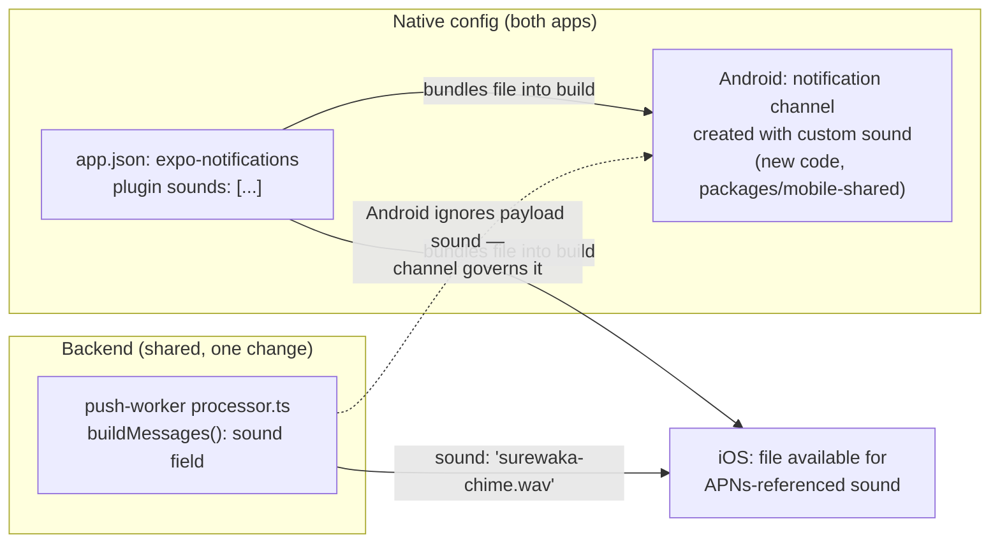

# Design Document: Custom Notification Sound

## Overview

One signature "SureWaka sound" replacing the OS default notification chime, across both `mobile-customer` and `mobile-driver`, for every push notification the platform sends — not per-event-type, one brand sound everywhere. Goal is brand recognition: a user hears it and knows it's SureWaka before looking at the phone.

No asset exists yet. Sourcing/producing it is in scope for this spec's early tasks, not assumed as a prerequisite.

## Sound Asset Requirements

Documented here so whoever sources/produces the asset knows the constraints up front:

- **Format**: `.wav` — works for both platforms; iOS also accepts `.caf` but `.wav` avoids a second conversion step
- **Length**: ≤ 5 seconds — iOS silently ignores a longer custom sound and falls back to the system default. This is a hard platform limit, not a stylistic preference.
- **Licensing**: fully original/commissioned, or explicitly licensed for commercial use with proof retained — a brand sound played at production scale needs to be legally clean
- **Reuse**: the same single asset is used for both apps (one sound, one brand — not a customer variant and a driver variant)

## Architecture



The two platforms need genuinely different mechanisms, verified against Expo's current docs (not assumed from memory):

- **Android**: sound is governed entirely by the notification **channel** the push lands in. There is no existing channel setup anywhere in either app today (`grep` for `setNotificationChannelAsync` across `apps/mobile-customer`, `apps/mobile-driver`, `packages/mobile-shared` returns nothing) — a channel must be created from scratch, once, client-side, with the custom sound attached at creation time. Whatever the server puts in a push message's `sound` field is irrelevant on Android once a channel is configured — channels take precedence.
- **iOS**: has no channel concept for remote push. The sound must be named in the outgoing APNs payload for *every* message — this is a backend change, not client-side.

Both mechanisms require the sound file to actually be bundled into each native binary, which happens through the `expo-notifications` config plugin's `sounds` array in `app.json`. That's a native config change — same class of change as the FCM credentials fix earlier — so it requires a fresh EAS dev/production build for both apps, not just a JS change.

## Components

### Component 1: Asset Registration (`app.json`, both apps)

Add the `expo-notifications` config plugin (if not already present — verify during implementation) with:
```json
["expo-notifications", { "sounds": ["./assets/sounds/surewaka-chime.wav"] }]
```
in both `apps/mobile-customer/app.json` and `apps/mobile-driver/app.json`. The asset file itself lives at that path in each app (or a shared location both apps' build process can reach — confirm during implementation which is cleaner given the existing asset layout).

### Component 2: Android Notification Channel (new code, `packages/mobile-shared`)

A new setup call, run once at app start, alongside where `usePushNotifications` already runs (both apps already share this hook, so this is the natural shared location rather than duplicating per-app):

```ts
await Notifications.setNotificationChannelAsync('default', {
  name: 'SureWaka notifications',
  importance: Notifications.AndroidImportance.HIGH,
  sound: 'surewaka-chime.wav', // base filename only, per Expo's docs
});
```

Open implementation question: reconfigure the implicit `'default'` channel Android/Expo creates automatically, or create a distinctly-named channel and ensure all outgoing pushes target it via `channelId`? Reconfiguring `'default'` is simpler (no server-side `channelId` needed) and is the recommended approach unless a reason emerges during implementation to separate channels by notification type in the future.

### Component 3: Backend Sound Field (`workers/push-worker/src/processor.ts`)

One line in `buildMessages()` (currently line 139):
```diff
- sound: 'default' as const,
+ sound: 'surewaka-chime.wav' as const,
```
This is what makes iOS actually play the custom sound. Android ignores this field once its channel is configured (Component 2), but it's harmless to set for both — Expo's push API accepts the field regardless of destination platform.

## Testing

Manual only, matching how push notifications were just verified working end-to-end this session — there's no existing automated coverage of `buildMessages()`'s sound field or channel setup, and this is a one-line change plus native config, not complex logic that benefits from new test infrastructure. Verify: a real push arrives with the custom sound audible on both a real Android device and a real iOS device, after both apps are rebuilt via EAS with the new config.

## Rollout

1. Source/produce the sound asset (blocks everything else)
2. Wire up Components 1–3
3. New EAS dev build for both apps (native config change)
4. Manual verification on real Android + iOS devices
5. Production build once verified in dev
