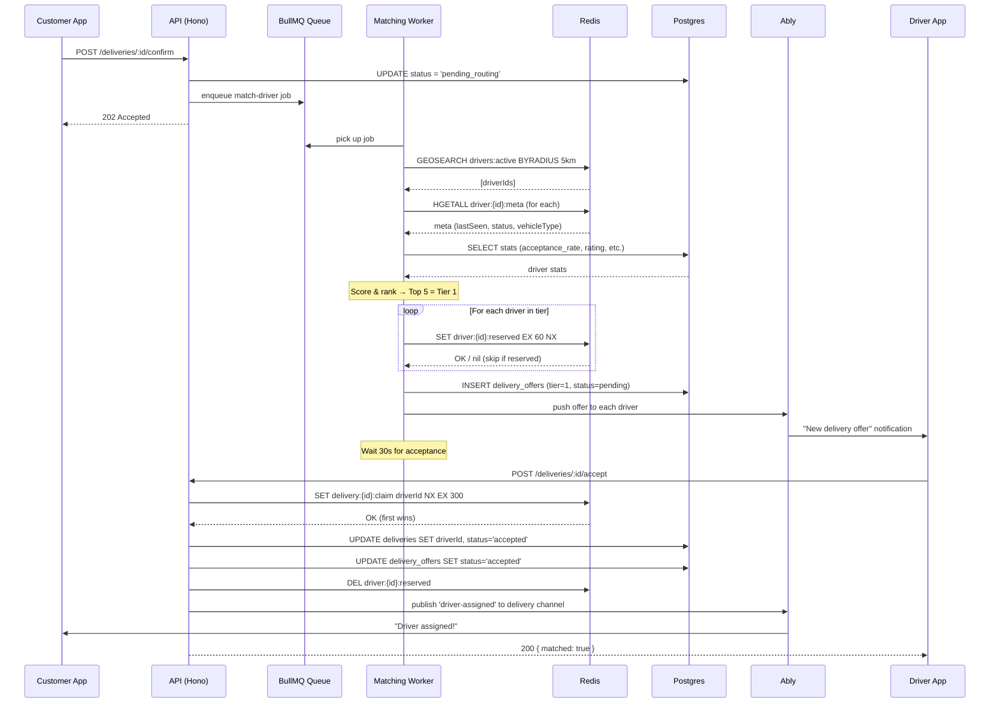
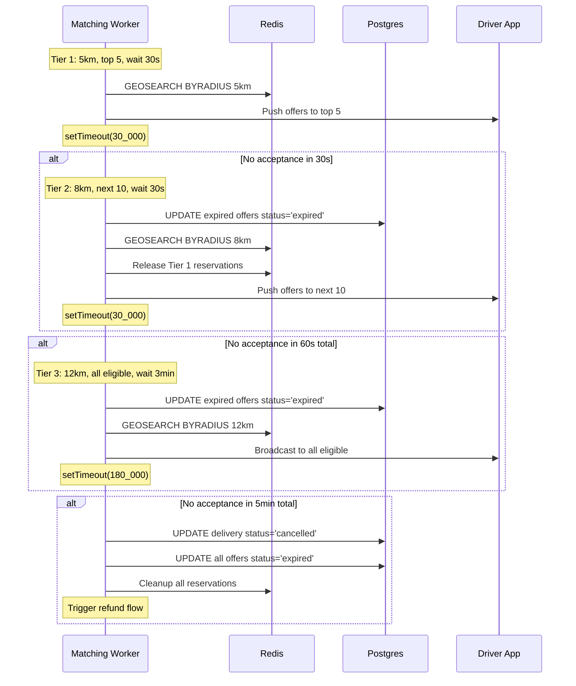
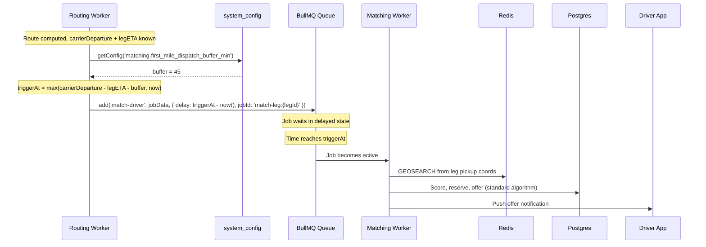
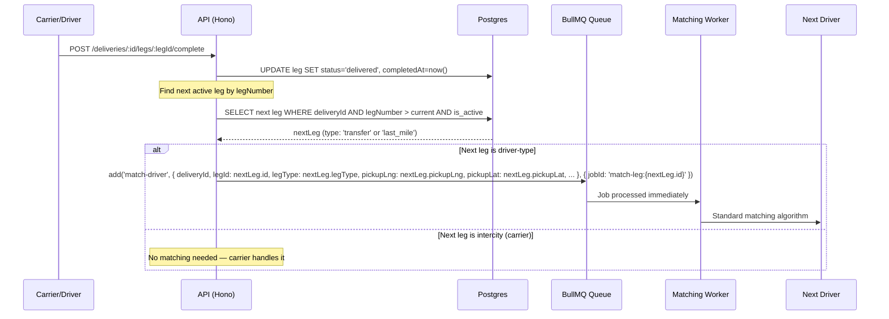

# Design Document: Driver Matching & Routing

## Overview

This system handles real-time driver matching for on-demand deliveries within SureWaka. When a customer confirms a delivery booking (mode: `on_demand`), the platform finds the best available driver nearby, offers them the job through a tiered broadcast strategy, and handles acceptance atomically to prevent double-assignment.

The design separates concerns into three layers: a **location store** (Redis Geospatial) for high-frequency ephemeral GPS data, a **matching worker** (BullMQ job in `workers/routing-worker`) for orchestrating the tiered broadcast algorithm, and an **acceptance handler** (API route) for atomic claim resolution. Ably provides real-time push to customer and driver apps. Postgres stores the audit trail via a new `delivery_offers` table.

## Architecture

```mermaid
graph TD
    subgraph "Driver App (Expo)"
        DA[Driver Mobile App]
    end

    subgraph "Customer App"
        CA[Customer Mobile App]
    end

    subgraph "API (Hono)"
        LOC[POST /driver/location]
        ACCEPT[POST /deliveries/:id/accept]
        BOOK[POST /deliveries/:id/confirm]
    end

    subgraph "Redis (Upstash)"
        GEO[drivers:active<br/>Geo Sorted Set]
        META[driver:{id}:meta<br/>Hash]
        RESERVE[driver:{id}:reserved<br/>String + TTL]
        CLAIM[delivery:{id}:claim<br/>String + NX]
    end

    subgraph "BullMQ Worker"
        MW[Matching Worker<br/>workers/routing-worker]
    end

    subgraph "Ably"
        CH_DL[driver-location:{driverId}]
        CH_DT[delivery:{deliveryId}]
    end

    subgraph "Neon Postgres"
        DB_DEL[deliveries]
        DB_OFF[delivery_offers]
        DB_DRV[drivers]
    end

    DA -->|POST every 3s| LOC
    LOC --> GEO
    LOC --> META
    LOC -->|if on active delivery| DB_DEL
    LOC --> CH_DL

    CA -->|confirm booking| BOOK
    BOOK -->|enqueue| MW

    MW -->|GEOSEARCH| GEO
    MW -->|read meta| META
    MW -->|atomic reserve| RESERVE
    MW -->|score + rank| DB_DRV
    MW -->|insert offers| DB_OFF
    MW -->|push notification| DA

    DA -->|tap Accept| ACCEPT
    ACCEPT -->|SET NX| CLAIM
    ACCEPT -->|update| DB_DEL
    ACCEPT -->|cancel others| DB_OFF
    ACCEPT -->|publish| CH_DT

    CH_DL -->|live tracking| CA
    CH_DT -->|status updates| CA
```


## Sequence Diagrams

### Main Flow: Customer Booking → Driver Matched




### Tier Escalation Flow



## Components and Interfaces

### Component 1: Location Store

**Purpose**: Manages real-time driver GPS positions in Redis for sub-millisecond spatial queries.

**Interface**:
```typescript
// packages/realtime/src/location-store.ts

type DriverMeta = {
  lastSeen: string;   // unix timestamp ms
  lat: string;
  lng: string;
  status: 'available' | 'busy' | 'offline';
  vehicleType: 'motorcycle' | 'car' | 'van' | 'truck';
};

type NearbyDriver = {
  driverId: string;
  distanceKm: number;
  meta: DriverMeta;
};

export function updateDriverLocation(
  driverId: string,
  lng: number,
  lat: number,
  meta: Partial<DriverMeta>,
): Promise<void>;

export function findNearbyDrivers(
  lng: number,
  lat: number,
  radiusKm: number,
  filters?: { vehicleType?: string; maxStaleMs?: number },
): Promise<NearbyDriver[]>;

export function removeDriver(driverId: string): Promise<void>;

export function getDriverMeta(driverId: string): Promise<DriverMeta | null>;
```

**Responsibilities**:
- Store/update driver positions via `GEOADD drivers:active`
- Store driver metadata via `HSET driver:{id}:meta`
- Query nearby drivers via `GEOSEARCH`
- Filter stale drivers (lastSeen > 30s)
- Remove drivers on logout/disconnect


### Component 2: Driver Reservation (Atomicity Layer)

**Purpose**: Prevents double-assignment using Redis atomic operations and Lua scripts.

**Interface**:
```typescript
// workers/routing-worker/src/lib/reservation.ts

type ReservationResult = { reserved: true } | { reserved: false; reason: string };
type ClaimResult = { claimed: true } | { claimed: false; claimedBy: string };

/** Atomically reserve a driver for a delivery (Lua script). */
export function reserveDriver(
  driverId: string,
  deliveryId: string,
  ttlSeconds: number,
): Promise<ReservationResult>;

/** Release a driver reservation. */
export function releaseReservation(driverId: string): Promise<void>;

/** Atomic first-accept-wins claim for a delivery. */
export function claimDelivery(
  deliveryId: string,
  driverId: string,
  ttlSeconds: number,
): Promise<ClaimResult>;

/** Release all reservations for a batch of drivers. */
export function releaseReservations(driverIds: string[]): Promise<void>;
```

**Responsibilities**:
- Atomic check-and-set via Redis Lua script (driver not already reserved)
- TTL-based auto-release for zombie reservations (60s)
- First-accept-wins delivery claim via `SET NX`
- Batch release on tier expiration

### Component 3: Scoring Engine

**Purpose**: Ranks candidate drivers by weighted factors to determine offer priority.

**Interface**:
```typescript
// workers/routing-worker/src/lib/scoring.ts

type DriverCandidate = {
  driverId: string;
  distanceKm: number;
  acceptanceRate: number;    // 0.0–1.0
  completionRate: number;    // 0.0–1.0
  rating: number;            // 1.0–5.0
  lastJobCompletedAt: number; // unix ms
  headingTowardPickup: boolean;
};

type ScoredDriver = DriverCandidate & { score: number };

export function scoreDrivers(
  candidates: DriverCandidate[],
  weights?: Partial<ScoringWeights>,
): ScoredDriver[];

type ScoringWeights = {
  distancePerKm: number;      // default: -10
  acceptanceRate: number;     // default: +20
  completionRate: number;     // default: +15
  highRatingBonus: number;    // default: +10
  lowRatingPenalty: number;   // default: -15
  idleBonus30min: number;     // default: +10
  idleBonus60min: number;     // default: +5
  headingBonus: number;       // default: +8
};
```

**Responsibilities**:
- Calculate composite score per driver
- Distance weighted heaviest (Lagos traffic = distance matters)
- Reward reliability (acceptance rate, completion rate)
- Fairness boost for idle drivers (prevents monopolization)
- Heading direction bonus (already moving toward pickup)
- Return sorted array descending by score


### Component 4: Matching Orchestrator

**Purpose**: BullMQ job handler that executes the tiered broadcast algorithm.

**Interface**:
```typescript
// workers/routing-worker/src/jobs/match-driver.ts

type MatchDriverJobData = {
  deliveryId: string;
  legId?: string;              // Specific leg being matched (undefined for on_demand single-leg)
  legType?: 'first_mile' | 'transfer' | 'last_mile';  // Leg type for surewaka_way deliveries
  pickupLng: number;
  pickupLat: number;
  dropoffLng?: number;         // Driver's destination (park or customer address)
  dropoffLat?: number;
  vehicleType: 'motorcycle' | 'car' | 'van' | 'truck';
  customerId: string;
};

type MatchResult =
  | { matched: true; driverId: string; tier: number }
  | { matched: false; reason: 'no_drivers' | 'all_declined' | 'timeout' };

export function handleMatchDriver(job: Job<MatchDriverJobData>): Promise<MatchResult>;
```

**Responsibilities**:
- Execute tiered search (5km → 8km → 12km)
- Score and rank candidates per tier
- Reserve drivers atomically before offering
- Send push notifications via Ably
- Wait for acceptance within tier timeout
- Escalate to next tier on timeout
- Auto-cancel after 5 min total elapsed
- Record all offers in `delivery_offers` table

### Component 5: Acceptance Handler (API Route)

**Purpose**: Handles driver's "Accept" tap with atomic first-wins resolution.

**Interface**:
```typescript
// apps/api/src/routes/delivery-accept.ts

// POST /api/v1/deliveries/:deliveryId/accept
// Auth: requireAuth (driver role)
// Response: { data: { matched: boolean }, error: null, meta: null }
//   matched=true  → driver assigned successfully
//   matched=false → another driver already claimed
```

**Responsibilities**:
- Validate driver owns the offer (delivery_offers record exists, status=pending)
- Atomic claim via Redis `SET delivery:{id}:claim driverId NX EX 300`
- If claimed: update delivery (driverId, status='accepted'), update offer status
- If lost race: return `matched: false`
- Postgres safety net: `WHERE driver_id IS NULL` on UPDATE
- Cancel all other pending offers for this delivery
- Release all driver reservations for this delivery
- Publish 'driver-assigned' event via Ably
- Push notification to customer

### Component 6: Matching Trigger Safety Net (Cron Sweeper)

**Purpose**: Catches missed BullMQ delayed jobs for driver matching. If a delayed job is lost (Redis restart, worker crash during enqueue, code bug), this cron job detects and re-enqueues it.

**Interface**:
```typescript
// workers/cron/src/jobs/rescue-missed-matching.ts

import { getConfig } from '@surewaka/shared/config/client';

const CRON_INTERVAL_MINUTES = 5;
const MAX_RESCUE_BATCH = 20;

/**
 * Scans for driver-type legs that should have matching triggered but don't
 * have a job in the queue. Runs every 5 minutes via cron scheduler.
 *
 * ADR-010 safety net logic:
 * A leg needs rescue if `systemEtaAt - buffer <= now` (i.e., we're within
 * buffer-minutes of the deadline and no driver is assigned).
 *
 * Note: The routing worker already factored in legETA when computing
 * systemEtaAt, so `systemEtaAt - buffer` is a valid approximation of
 * the trigger time without needing legETA per-leg at cron time.
 *
 * Idempotent: matching worker skips if leg/delivery status has changed.
 * JobId deduplication prevents double-enqueue.
 */
export async function rescueMissedMatching(): Promise<void>;
```

**Responsibilities**:
- Run every 5 minutes (same pattern as `rescue-stale-routing.ts`)
- Read buffer from `system_config` via `getConfig('matching.first_mile_dispatch_buffer_min')` (default: 45)
- Scan `delivery_legs` for rows matching ALL conditions:
  1. `is_active = true` AND `status = 'pending'`
  2. `actor_type = 'driver'` AND `actor_id = NIL_UUID` (no driver assigned)
  3. `system_eta_at - buffer <= now` (should have triggered by now per ADR-010)
  4. Parent delivery `status = 'pending'` (confirmed, not cancelled)
- For each match, check if a BullMQ job already exists via `matchingQueue.getJob(jobId)`
- If no job exists, enqueue matching job immediately (`delayMs = 0`)
- Use deterministic jobId format: `match-leg:{legId}` for deduplication
- Log count of rescued jobs for monitoring

**Query** (Drizzle):
```typescript
const NIL_UUID = '00000000-0000-0000-0000-000000000000';
const buffer = await getConfig('matching.first_mile_dispatch_buffer_min'); // from system_config, default 45
const bufferMs = buffer * 60 * 1000;

// A leg needs rescue if: systemEtaAt - buffer <= now
// i.e., now >= systemEtaAt - buffer (the trigger time has passed)
const triggerThreshold = new Date(Date.now() + bufferMs);

const missedLegs = await db
  .select({
    id: deliveryLegs.id,
    deliveryId: deliveryLegs.deliveryId,
    legType: deliveryLegs.legType,
    pickupLng: deliveryLegs.pickupLng,
    pickupLat: deliveryLegs.pickupLat,
    dropoffLng: deliveryLegs.dropoffLng,
    dropoffLat: deliveryLegs.dropoffLat,
  })
  .from(deliveryLegs)
  .innerJoin(deliveries, eq(deliveries.id, deliveryLegs.deliveryId))
  .where(
    and(
      eq(deliveryLegs.isActive, true),
      eq(deliveryLegs.status, 'pending'),
      eq(deliveryLegs.actorType, 'driver'),
      eq(deliveryLegs.actorId, NIL_UUID),
      lte(deliveryLegs.systemEtaAt, triggerThreshold), // systemEtaAt - buffer <= now
      eq(deliveries.status, 'pending'),
    ),
  )
  .limit(MAX_RESCUE_BATCH);
```

**Explanation of the query logic**: `systemEtaAt` represents the deadline for the leg (e.g., carrier departure time for first_mile). The routing worker already computed this at route time. A leg needs rescue if `systemEtaAt - buffer <= now`, which is equivalent to `systemEtaAt <= now + buffer`. So we query for legs where `systemEtaAt <= triggerThreshold` where `triggerThreshold = now + buffer`.

---

## Multi-Leg Matching Triggers (surewaka_way)

### Overview

`surewaka_way` deliveries have multiple legs: `first_mile → intercity → [transfer →] intercity → ... → last_mile`. Each driver-type leg (`first_mile`, `transfer`, `last_mile`) requires driver matching. The matching algorithm itself is identical for all leg types — same GEOSEARCH, scoring, tiered broadcast. Only the **trigger mechanism** differs.

### Trigger Mechanisms by Leg Type

| Leg Type | Trigger Mechanism | Trigger Formula | Source |
|----------|-------------------|-----------------|--------|
| `first_mile` | BullMQ delayed job (scheduled at route computation time) | `max(carrierDeparture - legETA - buffer, now)` | Routing worker enqueues after computing route |
| `transfer` | Event-driven: previous intercity leg marked `delivered` | `max(nextCarrierDeparture - legETA - buffer, now)` | Carrier delivery confirmation webhook/API |
| `last_mile` | Event-driven: final intercity leg marked `delivered` | `max(nextBusinessHourStart, customerWindow - legETA - buffer, now)` | Carrier delivery confirmation webhook/API |

### ADR-010 Trigger Formula (Timed Dispatch)

Per [ADR-010](../../docs/decisions/010-timed-dispatch-for-driver-matching.md), matching is triggered at a computed time relative to a downstream deadline, not a fixed offset.

**Variables:**
- `buffer` = configurable, default 45 min. Stored in `system_config` as `matching.first_mile_dispatch_buffer_min` (read via `getConfig()`). Breakdown: 5 min matching + 10 min driver-to-pickup + 30 min Lagos traffic headroom.
- `legETA` = computed road distance ETA for that leg (from Mapbox Directions, already integrated at route computation time)
- `carrierDeparture` / `nextCarrierDeparture` = scheduled departure time of the carrier at the relevant park
- `nextBusinessHourStart` = next 7am (or park-specific opening hour) if current time is outside operating window
- `customerWindow` = optional customer-specified delivery window start (last-mile only)

**Timeline:**

```
  triggerAt                     deadline
     │                            │
     ▼                            ▼
  matching ─── driver ETA ─── buffer ─── CARRIER DEPARTURE
  starts       (legETA)      (45min)
```

**Buffer breakdown:**
```
buffer (45 min default)
├── 5 min   matching (tiered broadcast)
├── 10 min  driver-to-pickup travel
└── 30 min  Lagos traffic headroom
```

**Clamp rule:** If `triggerAt <= now` (late booking, system catching up), dispatch immediately.

### Last-Mile Business Hours

Last-mile matching respects operating hours to avoid dispatching drivers overnight:

- **Default operating window**: 7am–9pm (or per-park opening hours if configured)
- **Overnight completion**: If an intercity leg completes at e.g. 2am, last-mile matching delays until `max(nextBusinessHourStart - legETA - buffer, nextBusinessHourStart)`
- **Customer delivery window**: Customer can optionally specify a preferred delivery window at booking. If set, matching triggers at `customerWindow - legETA - buffer` (still clamped to business hours and `now`)
- **Formula with business hours**: `max(nextBusinessHourStart, customerWindow - legETA - buffer, now)`

Example: Intercity arrives at Kano park at 2:00am. `legETA` for last-mile is 25 min. Buffer is 45 min.
- `triggerAt = max(7:00am, now) = 7:00am` — matching fires at 7am, driver arrives by ~7:25am, package delivered by ~7:30am.

### Sequence Diagram: First-Mile Trigger (Delayed Job)



### Sequence Diagram: Transfer/Last-Mile Trigger (Event-Driven)



### Delayed Job Scheduling (at Route Computation Time)

```typescript
// workers/routing-worker/src/jobs/compute-route.ts (addition to existing)

import { getConfig } from '@surewaka/shared/config/client';

async function scheduleFirstMileMatching(
  delivery: Delivery,
  firstMileLeg: DeliveryLeg,
  carrierDeparture: Date,
  legETA: number, // minutes — computed road distance ETA from Mapbox Directions
): Promise<void> {
  // ADR-010: buffer is admin-configurable via system_config
  const buffer = await getConfig('matching.first_mile_dispatch_buffer_min'); // default: 45
  const bufferMs = buffer * 60 * 1000;
  const legETAMs = legETA * 60 * 1000;

  // ADR-010 formula: max(carrierDeparture - legETA - buffer, now)
  const triggerAt = new Date(carrierDeparture.getTime() - legETAMs - bufferMs);
  const delayMs = Math.max(0, triggerAt.getTime() - Date.now()); // clamp to 0 for late bookings

  await matchingQueue.add(
    'match-driver',
    {
      deliveryId: delivery.id,
      legId: firstMileLeg.id,
      legType: 'first_mile',
      pickupLng: firstMileLeg.pickupLng,
      pickupLat: firstMileLeg.pickupLat,
      dropoffLng: firstMileLeg.dropoffLng,  // the park
      dropoffLat: firstMileLeg.dropoffLat,
      vehicleType: delivery.vehicleMode ?? 'motorcycle',
      customerId: delivery.customerId,
    },
    {
      delay: delayMs,
      jobId: `match-leg:${firstMileLeg.id}`,  // idempotent — prevents double-enqueue
      attempts: 3,
      backoff: { type: 'exponential', delay: 5000 },
    },
  );
}

/**
 * Buffer is read via getConfig('matching.first_mile_dispatch_buffer_min') from
 * the system_config table (5-min TTL in-memory cache). Returns registry default
 * of 45 if no DB row exists. See docs/superpowers/specs/2026-07-27-system-config-design.md.
 */
```

### Event-Driven Trigger (Transfer/Last-Mile)

```typescript
// apps/api/src/routes/delivery-legs.ts (leg completion handler)

import { getConfig } from '@surewaka/shared/config/client';

const BUSINESS_HOUR_START = 7; // 7am
const BUSINESS_HOUR_END = 21;  // 9pm

async function triggerNextLegMatching(
  deliveryId: string,
  completedLegNumber: number,
): Promise<void> {
  // Find the next active leg after the one just completed
  const [nextLeg] = await db
    .select()
    .from(deliveryLegs)
    .where(
      and(
        eq(deliveryLegs.deliveryId, deliveryId),
        gt(deliveryLegs.legNumber, completedLegNumber),
        eq(deliveryLegs.isActive, true),
      ),
    )
    .orderBy(asc(deliveryLegs.legNumber))
    .limit(1);

  if (!nextLeg) return; // No more legs

  // Only trigger matching for driver-type legs
  if (nextLeg.actorType !== 'driver') return;

  const delivery = await db
    .select({
      customerId: deliveries.customerId,
      vehicleMode: deliveries.vehicleMode,
      customerDeliveryWindow: deliveries.customerDeliveryWindow,
    })
    .from(deliveries)
    .where(eq(deliveries.id, deliveryId))
    .limit(1)
    .then(rows => rows[0]);

  const buffer = await getConfig('matching.first_mile_dispatch_buffer_min'); // default: 45
  let delayMs = 0; // default: immediate

  if (nextLeg.legType === 'transfer' && nextLeg.systemEtaAt) {
    // ADR-010: max(nextCarrierDeparture - legETA - buffer, now)
    // systemEtaAt for transfer legs = nextCarrierDeparture
    const legETAMs = (nextLeg.legEtaMinutes ?? 0) * 60 * 1000;
    const bufferMs = buffer * 60 * 1000;
    const triggerAt = nextLeg.systemEtaAt.getTime() - legETAMs - bufferMs;
    delayMs = Math.max(0, triggerAt - Date.now());
  }

  if (nextLeg.legType === 'last_mile') {
    // ADR-010: max(nextBusinessHourStart, customerWindow - legETA - buffer, now)
    const legETAMs = (nextLeg.legEtaMinutes ?? 0) * 60 * 1000;
    const bufferMs = buffer * 60 * 1000;
    const now = new Date();
    const nextBusinessStart = getNextBusinessHourStart(now);

    let triggerAt = nextBusinessStart.getTime(); // floor: earliest is next business hour

    if (delivery.customerDeliveryWindow) {
      const windowTrigger = new Date(delivery.customerDeliveryWindow).getTime() - legETAMs - bufferMs;
      triggerAt = Math.max(triggerAt, windowTrigger);
    } else if (nextLeg.systemEtaAt) {
      // No customer window: use systemEtaAt as proxy deadline
      const etaTrigger = nextLeg.systemEtaAt.getTime() - legETAMs - bufferMs;
      triggerAt = Math.max(triggerAt, etaTrigger);
    }

    delayMs = Math.max(0, triggerAt - Date.now());
  }

  await matchingQueue.add(
    'match-driver',
    {
      deliveryId,
      legId: nextLeg.id,
      legType: nextLeg.legType as 'transfer' | 'last_mile',
      pickupLng: nextLeg.pickupLng,
      pickupLat: nextLeg.pickupLat,
      dropoffLng: nextLeg.dropoffLng,
      dropoffLat: nextLeg.dropoffLat,
      vehicleType: delivery.vehicleMode ?? 'motorcycle',
      customerId: delivery.customerId,
    },
    {
      delay: delayMs,
      jobId: `match-leg:${nextLeg.id}`,  // deduplication
      attempts: 3,
      backoff: { type: 'exponential', delay: 5000 },
    },
  );
}

function getNextBusinessHourStart(now: Date): Date {
  const hour = now.getHours();
  if (hour >= BUSINESS_HOUR_START && hour < BUSINESS_HOUR_END) {
    return now; // within business hours, no delay
  }
  // Next day at BUSINESS_HOUR_START
  const next = new Date(now);
  if (hour >= BUSINESS_HOUR_END) {
    next.setDate(next.getDate() + 1);
  }
  next.setHours(BUSINESS_HOUR_START, 0, 0, 0);
  return next;
}
```

### Cancellation Handling

```typescript
// When customer cancels before first-mile match triggers
async function cancelScheduledMatching(legId: string): Promise<void> {
  const jobId = `match-leg:${legId}`;
  const job = await matchingQueue.getJob(jobId);

  if (job) {
    await job.remove(); // Remove delayed job before it fires
  }
}
```

### Multi-Hop Transfer Chains

For deliveries with multiple intercity hops (e.g., Lagos → Ibadan → Abuja → Kano), each transfer leg triggers independently using the ADR-010 formula:

```
first_mile → intercity₁ → transfer₁ → intercity₂ → transfer₂ → intercity₃ → last_mile
    ↑              ↓            ↑            ↓            ↑            ↓          ↑
 delayed      completes →   triggers    completes →   triggers    completes → triggers
 job           (event)     (formula)     (event)     (formula)     (event)   (formula +
(formula)                                                                   biz hours)
```

- **first_mile**: `triggerAt = max(carrierDeparture - legETA - buffer, now)` — scheduled at route time
- **transfer**: `triggerAt = max(nextCarrierDeparture - legETA - buffer, now)` — computed when preceding intercity completes
- **last_mile**: `triggerAt = max(nextBusinessHourStart, customerWindow - legETA - buffer, now)` — respects 7am–9pm window

Each `transfer` or `last_mile` trigger only fires when its immediately preceding intercity leg is marked `delivered`. This guarantees sequential execution without needing a central orchestrator.

---

## Data Models

### New Table: `delivery_offers`

```typescript
// packages/db/src/schema/delivery-offers.ts
import {
  pgTable, uuid, text, timestamp, integer, real, index, foreignKey,
} from 'drizzle-orm/pg-core';
import { deliveries } from './deliveries';
import { drivers } from './drivers';

export const deliveryOfferStatus = pgEnum('delivery_offer_status', [
  'pending',
  'accepted',
  'declined',
  'expired',
  'cancelled',
]);

export const deliveryOffers = pgTable(
  'delivery_offers',
  {
    id: uuid().defaultRandom().primaryKey().notNull(),
    deliveryId: uuid('delivery_id').notNull(),
    driverId: uuid('driver_id').notNull(),
    tier: integer('tier').notNull(),           // 1, 2, or 3
    score: real('score').notNull(),            // computed priority score
    distanceKm: real('distance_km').notNull(), // distance at time of offer
    status: deliveryOfferStatus('status').default('pending').notNull(),
    offeredAt: timestamp('offered_at').defaultNow().notNull(),
    respondedAt: timestamp('responded_at'),
    createdAt: timestamp('created_at').defaultNow().notNull(),
    updatedAt: timestamp('updated_at').defaultNow().notNull(),
  },
  (table) => [
    index('idx_delivery_offers_delivery_id').using('btree', table.deliveryId),
    index('idx_delivery_offers_driver_id').using('btree', table.driverId),
    index('idx_delivery_offers_status').using('btree', table.status),
    foreignKey({
      columns: [table.deliveryId],
      foreignColumns: [deliveries.id],
      name: 'delivery_offers_delivery_id_fk',
    }),
    foreignKey({
      columns: [table.driverId],
      foreignColumns: [drivers.id],
      name: 'delivery_offers_driver_id_fk',
    }),
  ],
);
```


### Postgres Safety Constraints

```sql
-- Prevent a driver from holding two active deliveries simultaneously
CREATE UNIQUE INDEX idx_deliveries_active_driver
  ON deliveries (driver_id)
  WHERE driver_id IS NOT NULL
    AND status IN ('accepted', 'en_route_pickup', 'arrived_pickup',
                   'picked_up', 'en_route_dropoff', 'arrived_dropoff');
```

### Redis Key Schema (Upstash Compatible)

| Key Pattern | Type | TTL | Purpose |
|-------------|------|-----|---------|
| `drivers:active` | Geo Sorted Set | None (pruned by staleness check) | Live driver positions |
| `driver:{id}:meta` | Hash | None (deleted on logout) | Driver metadata (lastSeen, status, vehicleType) |
| `driver:{id}:reserved` | String (deliveryId) | 60s | Reservation lock during offer window |
| `delivery:{id}:claim` | String (driverId) | 300s | First-accept-wins claim lock |

**Upstash hash tag compatibility**: Keys use `{id}` pattern naturally. The Lua reservation script operates on `driver:{id}:reserved` and `driver:{id}:meta` which share the same hash slot due to the `{id}` portion.

### Updated `drivers` Table (New Columns)

```typescript
// Add to packages/db/src/schema/drivers.ts
acceptanceRate: real('acceptance_rate').default(1.0).notNull(),
completionRate: real('completion_rate').default(1.0).notNull(),
totalOffersReceived: integer('total_offers_received').default(0).notNull(),
totalOffersAccepted: integer('total_offers_accepted').default(0).notNull(),
totalDeliveriesCompleted: integer('total_deliveries_completed').default(0).notNull(),
lastJobCompletedAt: timestamp('last_job_completed_at'),
```

## Algorithmic Pseudocode

### Main Matching Algorithm

```typescript
ALGORITHM matchDriver(job: MatchDriverJobData): MatchResult

INPUT: job containing deliveryId, pickupLng, pickupLat, vehicleType, customerId
OUTPUT: MatchResult (matched with driverId + tier, or not matched with reason)

PRECONDITIONS:
  - delivery exists with status 'pending_routing'
  - pickupLng/pickupLat are valid coordinates within Lagos metro
  - vehicleType is a valid enum value

POSTCONDITIONS:
  - If matched: delivery.status = 'accepted', delivery.driverId = result.driverId
  - If not matched: delivery.status = 'cancelled', refund triggered
  - All delivery_offers records created for audit trail
  - All driver reservations released on completion

BEGIN
  const TIERS = [
    { radius: 5,  count: 5,  waitMs: 30_000  },  // Tier 1
    { radius: 8,  count: 10, waitMs: 30_000  },  // Tier 2
    { radius: 12, count: 50, waitMs: 180_000 },  // Tier 3
  ];
  const MAX_TOTAL_MS = 300_000; // 5 min absolute timeout
  const startTime = Date.now();
  let offeredDriverIds = new Set<string>();

  FOR tierIndex = 0 TO TIERS.length - 1 DO
    INVARIANT: elapsed < MAX_TOTAL_MS
    INVARIANT: no driver in offeredDriverIds has been offered twice
    INVARIANT: all reservations from previous tiers are released

    const tier = TIERS[tierIndex];

    // 1. Find nearby candidates
    const nearby = await findNearbyDrivers(
      job.pickupLng, job.pickupLat, tier.radius,
      { vehicleType: job.vehicleType, maxStaleMs: 30_000 }
    );

    // 2. Exclude already-offered drivers
    const fresh = nearby.filter(d => !offeredDriverIds.has(d.driverId));
    IF fresh.length === 0 THEN CONTINUE;

    // 3. Enrich with DB stats
    const candidates = await enrichWithStats(fresh);

    // 4. Score and rank, take top N
    const ranked = scoreDrivers(candidates).slice(0, tier.count);

    // 5. Reserve atomically (skip if already reserved by another delivery)
    const reserved: ScoredDriver[] = [];
    FOR each driver IN ranked DO
      const result = await reserveDriver(driver.driverId, job.deliveryId, 60);
      IF result.reserved THEN reserved.push(driver);
    END FOR

    IF reserved.length === 0 THEN CONTINUE;

    // 6. Record offers in Postgres
    await insertOffers(job.deliveryId, reserved, tierIndex + 1);

    // 7. Send push notifications
    await sendOfferNotifications(reserved, job.deliveryId);
    reserved.forEach(d => offeredDriverIds.add(d.driverId));

    // 8. Wait for acceptance (event-driven with timeout)
    const accepted = await waitForAcceptance(job.deliveryId, tier.waitMs);

    IF accepted THEN
      await releaseReservations([...offeredDriverIds].filter(id => id !== accepted));
      RETURN { matched: true, driverId: accepted, tier: tierIndex + 1 };
    END IF

    // 9. Expire offers, release reservations for this tier
    await expireOffers(job.deliveryId, tierIndex + 1);
    await releaseReservations(reserved.map(d => d.driverId));

    // 10. Check absolute timeout
    IF Date.now() - startTime >= MAX_TOTAL_MS THEN BREAK;
  END FOR

  // No match found
  await cancelDelivery(job.deliveryId, job.customerId);
  RETURN { matched: false, reason: 'timeout' };
END
```


### Reservation Lua Script (Atomic Check + Set)

```typescript
// Redis Lua script for atomic driver reservation
const RESERVE_DRIVER_LUA = `
  local metaKey = KEYS[1]     -- driver:{id}:meta
  local reserveKey = KEYS[2]  -- driver:{id}:reserved
  local deliveryId = ARGV[1]
  local ttl = tonumber(ARGV[2])

  -- Check if driver is available
  local status = redis.call('HGET', metaKey, 'status')
  if status ~= 'available' then
    return {0, 'not_available'}
  end

  -- Check if already reserved
  local existing = redis.call('GET', reserveKey)
  if existing then
    return {0, 'already_reserved'}
  end

  -- Reserve atomically
  redis.call('SET', reserveKey, deliveryId, 'EX', ttl)
  return {1, 'ok'}
`;
```

**Preconditions**:
- `metaKey` exists with a `status` field
- `reserveKey` does not exist (or has expired)

**Postconditions**:
- If `{1, 'ok'}`: `reserveKey` is set with TTL, driver is exclusively reserved
- If `{0, reason}`: no state changed, driver unavailable for reservation

### Scoring Algorithm

```typescript
ALGORITHM scoreDriver(driver: DriverCandidate): number

INPUT: driver with distanceKm, acceptanceRate, completionRate, rating,
       lastJobCompletedAt, headingTowardPickup
OUTPUT: score (number, higher = better)

PRECONDITIONS:
  - driver.distanceKm >= 0
  - driver.acceptanceRate in [0.0, 1.0]
  - driver.completionRate in [0.0, 1.0]
  - driver.rating in [1.0, 5.0]

POSTCONDITIONS:
  - score >= 0
  - closer drivers score higher (all else equal)
  - more reliable drivers score higher (all else equal)

BEGIN
  let score = 100;

  // Distance: each km reduces score by 10 (heaviest weight)
  score -= driver.distanceKm * 10;

  // Acceptance rate: reward reliable drivers
  score += driver.acceptanceRate * 20;

  // Completion rate: penalize cancel-after-accept
  score += driver.completionRate * 15;

  // Rating bonus/penalty
  IF driver.rating >= 4.5 THEN score += 10;
  ELSE IF driver.rating < 4.0 THEN score -= 15;

  // Idle time: fairness boost (prevent monopolization)
  const idleMinutes = (Date.now() - driver.lastJobCompletedAt) / 60_000;
  IF idleMinutes > 30 THEN score += 10;
  IF idleMinutes > 60 THEN score += 5;  // diminishing returns

  // Heading direction: already moving toward pickup
  IF driver.headingTowardPickup THEN score += 8;

  RETURN Math.max(0, score);
END
```

### Acceptance Algorithm (First-Accept-Wins)

```typescript
ALGORITHM acceptDelivery(driverId: string, deliveryId: string): ClaimResult

INPUT: driverId (authenticated driver), deliveryId (delivery being claimed)
OUTPUT: { claimed: true } or { claimed: false, claimedBy: string }

PRECONDITIONS:
  - Driver has a pending offer for this delivery in delivery_offers
  - Delivery status is 'pending_routing' (not yet assigned)

POSTCONDITIONS:
  - If claimed: exactly one driver assigned, all other offers cancelled
  - If not claimed: no state change for this driver
  - Postgres unique partial index prevents double-assignment at DB level

BEGIN
  // 1. Verify offer exists
  const offer = await db.select()
    .from(deliveryOffers)
    .where(and(
      eq(deliveryOffers.deliveryId, deliveryId),
      eq(deliveryOffers.driverId, driverId),
      eq(deliveryOffers.status, 'pending'),
    ))
    .limit(1);

  IF !offer THEN RETURN { claimed: false, claimedBy: 'unknown' };

  // 2. Atomic Redis claim (SET NX)
  const claimKey = `delivery:${deliveryId}:claim`;
  const result = await redis.set(claimKey, driverId, 'NX', 'EX', 300);

  IF result === null THEN
    const winner = await redis.get(claimKey);
    RETURN { claimed: false, claimedBy: winner };
  END IF

  // 3. Postgres update with safety net
  const [updated] = await db.update(deliveries)
    .set({ driverId, status: 'accepted', updatedAt: new Date() })
    .where(and(
      eq(deliveries.id, deliveryId),
      isNull(deliveries.driverId),  // safety: only if no driver yet
    ))
    .returning({ id: deliveries.id });

  IF !updated THEN
    // Edge case: Redis said OK but Postgres already assigned
    await redis.del(claimKey);
    RETURN { claimed: false, claimedBy: 'db_conflict' };
  END IF

  // 4. Update offer status
  await db.update(deliveryOffers)
    .set({ status: 'accepted', respondedAt: new Date(), updatedAt: new Date() })
    .where(and(
      eq(deliveryOffers.deliveryId, deliveryId),
      eq(deliveryOffers.driverId, driverId),
    ));

  // 5. Cancel all other pending offers
  await db.update(deliveryOffers)
    .set({ status: 'cancelled', updatedAt: new Date() })
    .where(and(
      eq(deliveryOffers.deliveryId, deliveryId),
      ne(deliveryOffers.driverId, driverId),
      eq(deliveryOffers.status, 'pending'),
    ));

  // 6. Release all reservations
  await releaseAllReservationsForDelivery(deliveryId);

  // 7. Publish events
  await ably.publish(`delivery:${deliveryId}`, 'driver-assigned', { driverId });
  await pushNotification(customerId, 'Driver is on the way!');

  RETURN { claimed: true };
END
```


## Key Functions with Formal Specifications

### Function: updateDriverLocation()

```typescript
async function updateDriverLocation(
  driverId: string,
  lng: number,
  lat: number,
  meta: { status: string; vehicleType: string },
): Promise<void>
```

**Preconditions:**
- `driverId` is a valid UUID referencing an existing driver
- `lng` in range [-180, 180], `lat` in range [-90, 90]
- `meta.status` is one of 'available', 'busy', 'offline'
- `meta.vehicleType` is a valid vehicle_type enum value

**Postconditions:**
- `drivers:active` geo set contains driverId at (lng, lat)
- `driver:{driverId}:meta` hash contains lastSeen (current timestamp), status, vehicleType, lat, lng
- Previous position overwritten (GEOADD is upsert)

**Side Effects:**
- Ably publish to `driver-location:{driverId}` channel
- If driver has active delivery: INSERT into `driver_locations` table in Postgres

### Function: findNearbyDrivers()

```typescript
async function findNearbyDrivers(
  lng: number,
  lat: number,
  radiusKm: number,
  filters?: { vehicleType?: string; maxStaleMs?: number },
): Promise<NearbyDriver[]>
```

**Preconditions:**
- `lng` in range [-180, 180], `lat` in range [-90, 90]
- `radiusKm` > 0
- If `filters.maxStaleMs` provided, must be > 0

**Postconditions:**
- Returns only drivers whose `lastSeen` is within `maxStaleMs` (default 30_000)
- Returns only drivers with `status === 'available'`
- Returns only drivers matching `vehicleType` if filter provided
- Results sorted by distance ascending
- No mutations to Redis state

**Loop Invariants:**
- For filter loop: all previously returned drivers satisfy all filter criteria

### Function: reserveDriver()

```typescript
async function reserveDriver(
  driverId: string,
  deliveryId: string,
  ttlSeconds: number,
): Promise<ReservationResult>
```

**Preconditions:**
- `driverId` is a valid UUID
- `deliveryId` is a valid UUID
- `ttlSeconds` > 0

**Postconditions:**
- If `{ reserved: true }`: `driver:{driverId}:reserved` key exists with value `deliveryId` and TTL of `ttlSeconds`
- If `{ reserved: false }`: no Redis state changed
- Operation is atomic (Lua script) — no race conditions

### Function: claimDelivery()

```typescript
async function claimDelivery(
  deliveryId: string,
  driverId: string,
  ttlSeconds: number,
): Promise<ClaimResult>
```

**Preconditions:**
- `deliveryId` references a delivery in 'pending_routing' status
- `driverId` has a pending offer for this delivery
- `ttlSeconds` > 0

**Postconditions:**
- If `{ claimed: true }`: `delivery:{deliveryId}:claim` key set to `driverId` with TTL
- If `{ claimed: false }`: key already exists with another driverId
- Exactly one driver can ever claim a given delivery (SET NX guarantee)

### Function: scoreDrivers()

```typescript
function scoreDrivers(
  candidates: DriverCandidate[],
  weights?: Partial<ScoringWeights>,
): ScoredDriver[]
```

**Preconditions:**
- `candidates` is a non-empty array
- Each candidate has valid numeric fields within documented ranges

**Postconditions:**
- Returns array of same length as input
- Each element has a `score` field >= 0
- Array is sorted descending by `score`
- Pure function — no side effects, no mutations to input

## Example Usage

### Location Update (Driver App → API)

```typescript
// apps/api/src/routes/driver-locations.ts
driverLocationRoutes.post('/', async (c) => {
  const user = c.get('user');
  const { lat, lng, deliveryId } = await parseBody(c);
  const driver = await resolveDriver(user.id);

  // 1. Redis: live position for matching
  await updateDriverLocation(driver.id, lng, lat, {
    status: 'available',
    vehicleType: driver.vehicleType,
  });

  // 2. Ably: broadcast to tracking subscribers
  await getRealtime().publish(
    CHANNELS.driverLocation(driver.id),
    EVENTS.locationUpdate,
    { lat, lng, timestamp: Date.now() },
  );

  // 3. Postgres: audit trail (only during active delivery)
  if (deliveryId) {
    await db.insert(driverLocations).values({ driverId: driver.id, deliveryId, lat, lng });
  }

  return c.json({ data: { ok: true }, error: null, meta: null });
});
```

### Triggering the Match (Booking Confirmation)

```typescript
// apps/api/src/routes/deliveries.ts (confirm endpoint)
deliveryRoutes.post('/:id/confirm', async (c) => {
  const deliveryId = c.req.param('id');
  const delivery = await getDelivery(deliveryId);

  // Update status
  await db.update(deliveries)
    .set({ status: 'pending_routing', updatedAt: new Date() })
    .where(eq(deliveries.id, deliveryId));

  // Enqueue matching job
  await matchingQueue.add('match-driver', {
    deliveryId,
    pickupLng: delivery.pickupLng,
    pickupLat: delivery.pickupLat,
    vehicleType: delivery.vehicleMode ?? 'motorcycle',
    customerId: delivery.customerId,
  }, { attempts: 3, backoff: { type: 'exponential', delay: 5000 } });

  return c.json({ data: { status: 'matching' }, error: null, meta: null });
});
```

### Driver Accepting an Offer

```typescript
// apps/api/src/routes/delivery-accept.ts
acceptRoutes.post('/:deliveryId/accept', async (c) => {
  const deliveryId = c.req.param('deliveryId');
  const driver = await resolveDriver(c.get('user').id);

  const result = await claimDelivery(deliveryId, driver.id, 300);

  if (!result.claimed) {
    return c.json({
      data: { matched: false },
      error: { code: 'ALREADY_CLAIMED', message: 'Another driver accepted first' },
      meta: null,
    }, 409);
  }

  // Update Postgres (with safety net)
  await db.update(deliveries)
    .set({ driverId: driver.id, status: 'accepted', updatedAt: new Date() })
    .where(and(eq(deliveries.id, deliveryId), isNull(deliveries.driverId)));

  // Publish assignment event
  await getRealtime().publish(
    CHANNELS.deliveryTracking(deliveryId),
    EVENTS.statusUpdate,
    { status: 'accepted', driverId: driver.id },
  );

  return c.json({ data: { matched: true }, error: null, meta: null });
});
```


## Correctness Properties

*A property is a characteristic or behavior that should hold true across all valid executions of a system — essentially, a formal statement about what the system should do. Properties serve as the bridge between human-readable specifications and machine-verifiable correctness guarantees.*

### Property 1: Location Update Round-Trip

*For any* valid driver ID, longitude, latitude, and metadata (status, vehicleType), after calling `updateDriverLocation`, querying the Geo Sorted Set and metadata Hash for that driver SHALL return the stored position and metadata equivalently.

**Validates: Requirements 1.1, 1.2**

### Property 2: Driver Removal Cleanup

*For any* driver present in the Location Store, after calling `removeDriver`, both the Geo Sorted Set lookup and the metadata Hash lookup SHALL return null/empty for that driver.

**Validates: Requirements 1.3, 5.5**

### Property 3: Spatial Query Correctness

*For any* set of driver positions and any query point with radius, all returned drivers SHALL be within the specified radius and the result array SHALL be sorted ascending by distance from the query point.

**Validates: Requirement 2.1**

### Property 4: Driver Filtering Invariants

*For any* set of drivers with varying lastSeen timestamps, statuses, and vehicle types, the `findNearbyDrivers` result SHALL contain only drivers where lastSeen ≤ 30s ago AND status = 'available' AND (if vehicleType filter specified) vehicleType matches the filter.

**Validates: Requirements 2.2, 2.3, 2.4**

### Property 5: Tier Configuration Invariants

*For any* tier array used by the Matching Orchestrator, each tier's radius SHALL be strictly greater than the previous tier's radius (monotonically increasing), and the sum of all tier wait times SHALL not exceed 300,000ms (5-minute guarantee).

**Validates: Requirements 3.4, 3.7**

### Property 6: No Duplicate Offers Across Tiers

*For any* matching run across all tiers, the set of drivers offered in each tier SHALL be disjoint from drivers offered in all previous tiers (no driver is re-offered).

**Validates: Requirement 3.5**

### Property 7: Score Computation Correctness

*For any* valid `DriverCandidate` (distanceKm ≥ 0, acceptanceRate ∈ [0,1], completionRate ∈ [0,1], rating ∈ [1,5]), the `scoreDrivers` function SHALL produce a score ≥ 0 that correctly applies the weighted formula: base 100, distance penalty (−10/km), acceptance bonus (+20×rate), completion bonus (+15×rate), rating bonus/penalty, idle bonus, and heading bonus.

**Validates: Requirements 4.1, 4.3**

### Property 8: Score Output Invariants

*For any* non-empty array of valid candidates, `scoreDrivers` SHALL return an array of the same length sorted in descending order by score.

**Validates: Requirements 4.2, 4.4**

### Property 9: Score Determinism

*For any* input array of candidates, calling `scoreDrivers` multiple times with the same input SHALL always produce identical output ordering (pure function, no external state).

**Validates: Requirement 4.5**

### Property 10: Reservation Guards

*For any* driver whose status is not 'available' OR who is already reserved by another delivery, calling `reserveDriver` SHALL return `{ reserved: false }` with no Redis state mutations.

**Validates: Requirements 5.2, 5.3**

### Property 11: Single-Assignment Invariant

*For any* delivery and any number of concurrent acceptance attempts, at most one driver SHALL be assigned. The second and all subsequent accept requests SHALL return `{ claimed: false }` with no state mutations. This holds regardless of timing or concurrency level.

**Validates: Requirements 6.3, 6.7, 7.1**

### Property 12: Offer State Transitions on Resolution

*For any* delivery with N pending offers, when one offer is accepted, all other N−1 offers SHALL transition to status 'cancelled'. When a tier expires without acceptance, all offers in that tier SHALL transition to status 'expired'. No offer SHALL remain in 'pending' status after its delivery is resolved.

**Validates: Requirements 6.4, 8.3, 8.4**

### Property 13: Timed Dispatch Formula Correctness

*For any* combination of deadline (carrierDeparture or systemEtaAt), legETA, buffer, and current time, the computed delay SHALL equal `max(deadline − legETA − buffer − now, 0)`. For last-mile legs, the trigger time SHALL additionally be clamped to `≥ nextBusinessHourStart` (7am if current time is outside 7am–9pm). For any time outside business hours, `getNextBusinessHourStart` SHALL return the next 7:00am.

**Validates: Requirements 9.1, 9.3, 10.2, 10.3, 10.4**

### Property 14: Deterministic Job ID

*For any* leg ID, the matching job SHALL use jobId `match-leg:{legId}`. Multiple enqueue attempts with the same jobId SHALL result in at most one active job (BullMQ deduplication).

**Validates: Requirements 9.4, 11.4**

### Property 15: Leg Sequentiality

*For any* delivery with multiple legs, a leg's matching SHALL never be triggered until all preceding legs (by legNumber) have status ∈ {'delivered', 'in_progress'}. For first_mile this is trivially satisfied. For transfer and last_mile, triggering requires the immediately preceding intercity leg to be marked 'delivered'.

**Validates: Requirement 10.6**

### Property 16: Cron Sweeper Query Correctness

*For any* set of delivery legs with varying statuses, actorTypes, actorIds, and systemEtaAt values, the cron sweeper query SHALL return exactly those legs where: isActive = true AND status = 'pending' AND actorType = 'driver' AND actorId = NIL_UUID AND systemEtaAt ≤ now + buffer AND parent delivery status = 'pending'.

**Validates: Requirement 11.1**

### Property 17: Self-Drop Preserves Remaining Legs

*For any* surewaka_way delivery where first-mile matching fails and the customer accepts self-drop, all subsequent legs (intercity, transfer, last-mile) SHALL remain with isActive = true and their status unchanged.

**Validates: Requirement 12.3**

### Property 18: Reservation and State Cleanup on Resolution

*For any* matching resolution (tier expiry, cancellation, or successful claim), all associated driver reservation keys SHALL be explicitly deleted, and all pending offers SHALL be transitioned to a terminal status (expired or cancelled). No orphaned reservations or pending offers SHALL remain.

**Validates: Requirements 5.5, 6.5, 13.3**

### Property 19: Input Validation Rejection

*For any* coordinate outside the valid range (longitude not in [−180, 180], latitude not in [−90, 90]), invalid UUID format, or invalid enum value, the Driver Matching System SHALL reject the input with a validation error before processing.

**Validates: Requirement 16.4**

## Error Handling

### Scenario: Driver Goes Offline After Reservation

**Condition**: Driver's `lastSeen` exceeds 30s after being reserved
**Response**: TTL auto-expires the reservation key after 60s. On next tier evaluation, the driver is filtered out by staleness check.
**Recovery**: No action needed — TTL handles cleanup.

### Scenario: Redis Unavailable During Matching

**Condition**: Redis connection fails during GEOSEARCH or reservation
**Response**: BullMQ retries the job (3 attempts, exponential backoff from 5s)
**Recovery**: If all retries fail, mark delivery as `routing_failed` and notify customer.

### Scenario: Race Condition — Two Drivers Accept Simultaneously

**Condition**: Two drivers tap Accept within milliseconds
**Response**: Redis `SET NX` guarantees exactly one succeeds. Postgres `WHERE driver_id IS NULL` provides a second safety layer.
**Recovery**: Losing driver receives `{ matched: false }` response. No inconsistent state possible.

### Scenario: Worker Crashes Mid-Matching

**Condition**: Process dies between reservation and offer notification
**Response**: BullMQ detects stalled job (stalledInterval: 60s) and re-runs it
**Recovery**: Reservations auto-expire via TTL. Re-run starts fresh from GEOSEARCH.

### Scenario: Customer Cancels During Matching

**Condition**: Customer taps Cancel while matching is in progress
**Response**: API sets delivery status to 'cancelled' and publishes cancellation event
**Recovery**: Matching worker checks delivery status at each tier boundary; if cancelled, releases all reservations and exits.

### Scenario: No Drivers Available in Any Tier

**Condition**: GEOSEARCH returns empty across all radius expansions
**Response**: Matching returns `{ matched: false, reason: 'no_drivers' }`
**Recovery**: Delivery marked cancelled, customer notified with suggestion to try later or use carrier mode.

### Scenario: Customer Cancels Before First-Mile Match Triggers

**Condition**: Customer cancels a surewaka_way delivery while the first-mile matching job is still in delayed state
**Response**: Remove the delayed job from BullMQ via `matchingQueue.getJob(jobId)` → `job.remove()`
**Recovery**: Job is removed before it fires. If the cron sweeper picks it up between cancellation and removal, the matching worker checks delivery status on startup and exits immediately (idempotent).

### Scenario: Late Booking — Trigger Time Already Passed

**Condition**: Route is computed but `carrierDeparture - legETA - buffer <= now` (trigger time already passed)
**Response**: Trigger matching immediately with `delayMs = 0` (clamped via `Math.max(0, ...)` in the formula)
**Recovery**: Normal matching flow proceeds. If the deadline is very close (less than buffer remaining), matching may still succeed given Lagos density of available drivers. If it fails, self-drop fallback applies.

### Scenario: No Driver Found for First Mile

**Condition**: Tiered broadcast exhausts all tiers (5min timeout) with no acceptance for a first-mile leg
**Response**: Offer the customer **self-drop-off** at the origin park. Cancel the first-mile leg and refund its quote portion. The delivery continues with the remaining intercity + last-mile legs.
**Recovery**: If customer declines self-drop-off within a timeout (e.g., 15 min), auto-cancel the entire delivery with full refund and notify ops. If customer accepts self-drop-off, update the delivery to skip the first-mile leg (`leg.status = 'cancelled'`, `leg.isActive = false`) and proceed.

### Scenario: Self-Drop Fallback (First-Mile Matching Failure)

**Condition**: First-mile driver matching fails (no drivers accepted across all tiers)
**Response**: 
1. Push notification to customer: "No driver available. Drop off your package at [Park Name] by [cancellation deadline] to continue delivery."
2. Cancel the first-mile leg: `status = 'cancelled'`, `isActive = false`
3. Refund the first-mile quote portion to customer wallet
4. Remaining legs (intercity, transfer, last-mile) remain active and execute normally
5. Customer drops package at park; carrier picks it up at scheduled departure
**Recovery**: If customer doesn't drop off by the cancellation deadline, ops is notified. The delivery may be cancelled entirely or rescheduled to a later carrier departure (ops decision).

### Scenario: Carrier Marks Delivered but Next Leg Doesn't Exist

**Condition**: An intercity leg is completed, but no subsequent active leg exists in the delivery_legs table
**Response**: Log error with structured details (`deliveryId`, `completedLegNumber`, expected vs actual state). Alert ops via internal notification channel.
**Recovery**: This indicates data inconsistency — ops investigates. Delivery status is not mutated to prevent further damage.

### Scenario: Multiple Intercity Hops — Transfer Chain

**Condition**: A delivery has multiple intercity segments separated by transfer legs (e.g., Lagos → Ibadan → Abuja)
**Response**: Each transfer leg triggers independently and only when its immediately preceding intercity leg completes. No central orchestrator needed.
**Recovery**: If a transfer matching fails (no driver at the intermediate park), the standard escalation path applies (ops notification, potential re-routing).

## Testing Strategy

### Unit Testing Approach

- **Scoring function**: Pure function, easily testable with known inputs → expected outputs
- **Tier configuration**: Verify tier boundaries and timeouts match specification
- **Reservation logic**: Mock Redis responses, verify correct branching
- **Acceptance handler**: Mock Redis + DB, test all paths (success, race loss, DB conflict)

### Property-Based Testing Approach

**Property Test Library**: fast-check

Key properties to verify:
- `scoreDrivers` output is always sorted descending
- `scoreDrivers` output length equals input length
- Score is always >= 0 regardless of input combinations
- Closer driver always scores higher than farther driver (all else equal)
- Higher acceptance rate always scores higher (all else equal)
- Reservation Lua script is idempotent (re-running with same inputs = same result)

### Integration Testing Approach

- Redis integration tests using testcontainers (or local Docker Redis)
- End-to-end matching flow: seed Redis with fake drivers → trigger match → verify assignment
- Concurrency test: 10 simulated drivers accepting simultaneously → verify exactly one wins
- Tier escalation: seed only far drivers → verify system escalates through all tiers
- Timeout test: seed no drivers → verify cancellation after 5 min (accelerated clock)

## Performance Considerations

| Operation | Expected Latency | Throughput Target |
|-----------|-----------------|-------------------|
| `GEOADD` (location update) | <1ms | 17/s at 50 drivers (3s interval) |
| `GEOSEARCH` (find nearby) | <1ms | Burst during matching |
| `HGETALL` (driver meta) | <1ms | N per match (where N = candidate count) |
| Lua reservation script | <1ms | 5-50 per match |
| `SET NX` (claim) | <1ms | 1 per successful match |
| Scoring computation | <5ms | 50 drivers = negligible |
| Full matching cycle | <500ms per tier | Dominated by DB enrichment query |

**Upstash plan**: Fixed 250MB ($10/month). At 500 active drivers:
- Geo set: ~500 entries × ~50 bytes = ~25KB
- Meta hashes: 500 × ~200 bytes = ~100KB
- Reservation keys: max ~50 concurrent = negligible
- Total steady-state: <1MB (well within 250MB)

## Security Considerations

- **Auth**: All endpoints require Clerk JWT via `requireAuth` middleware
- **Role check**: Accept endpoint validates driver role and offer ownership
- **Rate limiting**: Location POST capped at 1 request/2s per driver (prevents abuse)
- **Input validation**: Zod schemas validate all coordinates, UUIDs, and enum values
- **No driver impersonation**: Offer records link driverId to authenticated user; acceptance verifies ownership

## Dependencies

| Dependency | Version | Purpose |
|------------|---------|---------|
| `ioredis` | ^5.4.0 | Redis client (already in routing-worker) |
| `bullmq` | ^5.0.0 | Job queue (already in routing-worker) |
| `@surewaka/realtime` | workspace:* | Ably publish/subscribe |
| `@surewaka/db` | workspace:* | Drizzle ORM + Neon |
| `@surewaka/shared` | workspace:* | Zod validators, types |

**Infrastructure**:
- Fly Upstash Redis Fixed 250MB ($10/month) — same instance as BullMQ
- Ably free tier (existing) — for push notifications and live tracking
- Neon Postgres (existing) — for `delivery_offers` table and driver stats

**Configuration Dependencies**:
- `system_config` key `matching.first_mile_dispatch_buffer_min` — admin-configurable dispatch buffer (default: 45 min). Read via `getConfig()` from `@surewaka/shared/config/client` (5-min TTL in-memory cache). Used by routing worker (scheduling), cron sweeper (rescue), and transfer/last-mile trigger logic. Changes take effect within 5 min (cache TTL) without code deploy. See `docs/superpowers/specs/2026-07-27-system-config-design.md`.

**No new infrastructure required** — leverages existing Redis (BullMQ), Ably, and Postgres instances.
