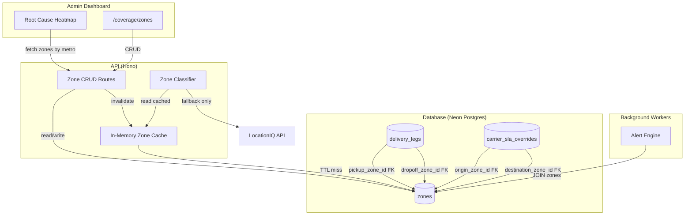

# Design Document: Dynamic Zones

## Overview

Replace the hardcoded `LAGOS_ZONES` constant and `LagosZone` type with a database-driven `zones` table that supports multi-city, multi-country expansion. This is a clean break — text zone columns are dropped entirely, not coexisted. The implementation introduces a `zones` table with full Nigeria seed data (~55–70 zones), a two-phase cached zone classifier, FK references from `delivery_legs` and `carrier_sla_overrides`, CRUD API endpoints, and an admin management UI under a new "Coverage" nav section.

**Scope:** Zone infrastructure only. Delivery leg creation (where the classifier is called) is a separate spec; this spec provides the classifier contract.

## Architecture



### Key Architecture Decisions

| Decision | Rationale |
|----------|-----------|
| Clean break (no dual-column coexistence) | Single atomic migration. No backfill scripts, no deprecation phases, no text column maintenance. Re-seed data instead of migrating. Simpler to reason about and fewer moving parts. |
| Two-phase classifier (local-first, remote fallback) | Primary match uses the address text already on the delivery leg — saves LocationIQ API quota. Remote geocode is the fallback path only when local matching fails. |
| ON DELETE RESTRICT for FKs | Prevents accidental hard-deletes of zones with historical references. Soft-delete (`is_active = false`) is the standard deactivation path. |
| Keyword uniqueness at application layer | On zone create/update, query all active zones in same (city, country), reject overlapping keywords. Avoids complex DB constraints on array columns while maintaining classification determinism. |
| Zone listing requires authentication | Prevents unauthenticated enumeration of coverage areas. Any authenticated user can read active zones (no role check). |
| No "Other" zone | Classifier returns `null` for unclassifiable coordinates. UI renders null as "Unclassified" or "—". No inert catchall zone polluting the data. |
| In-memory cache with TTL + invalidation | Zone definitions change rarely. 5-min cache avoids repeated DB hits. Invalidation on CRUD mutations ensures freshness. |
| SLA overrides accept zone UUIDs | Admin UI presents a zone picker dropdown. No text-based name resolution needed — cleaner data model. |

## Components and Interfaces

### 1. Database Schema (`packages/db/src/schema/zones.ts`)

```typescript
import { pgTable, uuid, text, real, boolean, timestamp, unique, index } from 'drizzle-orm/pg-core';

export const zones = pgTable(
  'zones',
  {
    id: uuid().defaultRandom().primaryKey().notNull(),
    name: text().notNull(),
    city: text().notNull(),
    country: text().notNull(),
    keywords: text().array().notNull().default([]),
    swLat: real('sw_lat'),
    swLng: real('sw_lng'),
    neLat: real('ne_lat'),
    neLng: real('ne_lng'),
    isActive: boolean('is_active').notNull().default(true),
    createdAt: timestamp('created_at', { withTimezone: true }).defaultNow().notNull(),
    updatedAt: timestamp('updated_at', { withTimezone: true }).defaultNow().notNull(),
  },
  (table) => [
    unique('zones_name_city_country_unique').on(table.name, table.city, table.country),
    index('idx_zones_city_active').on(table.city, table.isActive),
  ],
);
```

### 2. Schema Migrations — Drop text columns, add UUID FKs

**delivery_legs:**
```sql
-- Drop old text columns
ALTER TABLE delivery_legs DROP COLUMN pickup_zone;
ALTER TABLE delivery_legs DROP COLUMN dropoff_zone;

-- Add FK columns
ALTER TABLE delivery_legs
  ADD COLUMN pickup_zone_id UUID REFERENCES zones(id) ON DELETE RESTRICT,
  ADD COLUMN dropoff_zone_id UUID REFERENCES zones(id) ON DELETE RESTRICT;

CREATE INDEX idx_delivery_legs_pickup_zone_id ON delivery_legs(pickup_zone_id);
CREATE INDEX idx_delivery_legs_dropoff_zone_id ON delivery_legs(dropoff_zone_id);
```

**carrier_sla_overrides:**
```sql
-- Drop old text columns
ALTER TABLE carrier_sla_overrides DROP COLUMN origin_zone;
ALTER TABLE carrier_sla_overrides DROP COLUMN destination_zone;

-- Add FK columns (NOT NULL for SLA overrides)
ALTER TABLE carrier_sla_overrides
  ADD COLUMN origin_zone_id UUID NOT NULL REFERENCES zones(id) ON DELETE RESTRICT,
  ADD COLUMN destination_zone_id UUID NOT NULL REFERENCES zones(id) ON DELETE RESTRICT;

-- Replace old unique constraint
ALTER TABLE carrier_sla_overrides
  DROP CONSTRAINT carrier_sla_overrides_carrier_origin_dest_unique;
ALTER TABLE carrier_sla_overrides
  ADD CONSTRAINT carrier_sla_overrides_carrier_zones_unique
  UNIQUE (carrier_id, origin_zone_id, destination_zone_id);
```

### 3. Zone Classifier (`apps/api/src/lib/zone-classifier.ts`)

Two-phase classification with new signature:

```typescript
type ZoneDef = {
  id: string;
  name: string;
  city: string;
  keywords: string[];
  swLat: number | null;
  swLng: number | null;
  neLat: number | null;
  neLng: number | null;
};

type ClassifyResult = { id: string; name: string } | null;

// In-memory cache
let cachedZones: ZoneDef[] | null = null;
let cacheExpiry = 0;
const CACHE_TTL_MS = 5 * 60 * 1000; // 5 minutes

export function invalidateZoneCache(): void {
  cachedZones = null;
  cacheExpiry = 0;
}

async function getActiveZones(): Promise<ZoneDef[]> {
  if (cachedZones && Date.now() < cacheExpiry) return cachedZones;
  const rows = await db.select().from(zones).where(eq(zones.isActive, true));
  cachedZones = rows.map((r) => ({
    id: r.id,
    name: r.name,
    city: r.city,
    keywords: r.keywords ?? [],
    swLat: r.swLat,
    swLng: r.swLng,
    neLat: r.neLat,
    neLng: r.neLng,
  }));
  cacheExpiry = Date.now() + CACHE_TTL_MS;
  return cachedZones;
}

function isInBoundingBox(lat: number, lng: number, zone: ZoneDef): boolean {
  if (zone.swLat == null || zone.swLng == null || zone.neLat == null || zone.neLng == null) {
    return true; // No bounding box = no pre-filter
  }
  return lat >= zone.swLat && lat <= zone.neLat && lng >= zone.swLng && lng <= zone.neLng;
}

function matchZone(addressText: string, zoneDefs: ZoneDef[], lat: number, lng: number): ClassifyResult {
  const lower = addressText.toLowerCase();
  let bestMatch: ClassifyResult = null;
  let bestKeywordLen = 0;
  let bestIndex = Infinity;

  for (const zone of zoneDefs) {
    if (!isInBoundingBox(lat, lng, zone)) continue;
    for (const kw of zone.keywords) {
      const idx = lower.indexOf(kw.toLowerCase());
      if (idx === -1) continue;
      if (kw.length > bestKeywordLen || (kw.length === bestKeywordLen && idx < bestIndex)) {
        bestMatch = { id: zone.id, name: zone.name };
        bestKeywordLen = kw.length;
        bestIndex = idx;
      }
    }
  }

  return bestMatch;
}

/**
 * Two-phase zone classification:
 * 1. Local match — keyword match against provided addressText, filtered by bounding box
 * 2. Remote fallback — if no local match and skipRemote !== true, call LocationIQ reverse-geocode
 */
export async function classifyZone(
  addressText: string,
  lat: number,
  lng: number,
  opts?: { skipRemote?: boolean },
): Promise<ClassifyResult> {
  const zoneDefs = await getActiveZones();
  if (zoneDefs.length === 0) return null;

  // Phase 1: Local match using the provided address text
  const localResult = matchZone(addressText, zoneDefs, lat, lng);
  if (localResult) return localResult;

  // Phase 2: Remote fallback via LocationIQ
  if (opts?.skipRemote) return null;

  const apiKey = process.env.LOCATIONIQ_API_KEY;
  if (!apiKey) return null;

  try {
    const controller = new AbortController();
    const timeout = setTimeout(() => controller.abort(), 5000);

    const params = new URLSearchParams({
      key: apiKey,
      lat: String(lat),
      lon: String(lng),
      format: 'json',
      addressdetails: '1',
    });

    const res = await fetch(`https://api.locationiq.com/v1/reverse?${params}`, {
      signal: controller.signal,
    });
    clearTimeout(timeout);

    if (!res.ok) {
      console.error(`[zone-classifier] LocationIQ ${res.status} for (${lat}, ${lng})`);
      return null;
    }

    const data = (await res.json()) as { address?: Record<string, string> };
    const remoteAddressText = Object.values(data.address ?? {}).join(' ');
    return matchZone(remoteAddressText, zoneDefs, lat, lng);
  } catch (err) {
    console.error(`[zone-classifier] Failed for (${lat}, ${lng}):`, err);
    return null;
  }
}
```

### 4. Zone CRUD API

| Endpoint | Method | Auth | Description |
|----------|--------|------|-------------|
| `/api/v1/zones` | GET | `requireAuth` (any user) | List active zones with optional `city`, `country` filters, pagination |
| `/api/v1/admin/zones` | POST | `surewaka_admin` | Create zone |
| `/api/v1/admin/zones/:id` | PUT | `surewaka_admin` | Update zone |
| `/api/v1/admin/zones/:id` | PATCH | `surewaka_admin` | Partial update (e.g., toggle active) |

**Keyword uniqueness enforcement on create/update:**
```typescript
// Before insert/update, check for keyword overlap within same (city, country)
const siblings = await db.select().from(zones)
  .where(and(
    eq(zones.city, body.city),
    eq(zones.country, body.country),
    eq(zones.isActive, true),
    ne(zones.id, zoneId), // exclude self on update
  ));

for (const sibling of siblings) {
  for (const kw of body.keywords) {
    if (sibling.keywords.some((sk) => sk.toLowerCase() === kw.toLowerCase())) {
      return c.json({
        data: null,
        error: { code: 'KEYWORD_CONFLICT', message: `Keyword '${kw}' is already assigned to zone '${sibling.name}' in ${body.city}, ${body.country}` },
        meta: null,
      }, 409);
    }
  }
}
```

### 5. Shared Types and Validators

**Types (`packages/shared/src/types.ts`):**
```typescript
// New generic zone types (replaces LagosZone entirely)
export type Zone = {
  id: string;
  name: string;
  city: string;
  country: string;
  isActive: boolean;
};

export type ZoneName = string;

// Updated DeliveryLeg — text columns removed, only UUID FK
export type DeliveryLeg = {
  // ... existing fields ...
  pickupZoneId: string | null;
  dropoffZoneId: string | null;
  // pickupZone and dropoffZone text fields are GONE
  // ...
};

// Updated CarrierSlaOverride — UUID only, NOT NULL
export type CarrierSlaOverride = {
  id: string;
  carrierId: string;
  originZoneId: string;        // NOT NULL
  destinationZoneId: string;   // NOT NULL
  slaHours: number;
};
```

**Validators (`packages/shared/src/validators.ts`):**
```typescript
export const createZoneSchema = z.object({
  name: z.string().trim().min(1).max(100),
  city: z.string().trim().min(1).max(100),
  country: z.string().trim().min(1).max(100),
  keywords: z.array(z.string().trim().min(1).max(100)).min(1).max(50), // min(1) enforced
  swLat: z.number().min(-90).max(90).nullable().optional(),
  swLng: z.number().min(-180).max(180).nullable().optional(),
  neLat: z.number().min(-90).max(90).nullable().optional(),
  neLng: z.number().min(-180).max(180).nullable().optional(),
  isActive: z.boolean().default(true),
}).superRefine((data, ctx) => {
  const bbox = [data.swLat, data.swLng, data.neLat, data.neLng];
  const hasAny = bbox.some((v) => v != null);
  const hasAll = bbox.every((v) => v != null);
  if (hasAny && !hasAll) {
    ctx.addIssue({ code: 'custom', message: 'All four bounding box coordinates are required when any is provided' });
  }
  if (hasAll) {
    if (data.swLat! >= data.neLat!) ctx.addIssue({ code: 'custom', message: 'sw_lat must be less than ne_lat' });
    if (data.swLng! >= data.neLng!) ctx.addIssue({ code: 'custom', message: 'sw_lng must be less than ne_lng' });
  }
});

export const updateZoneSchema = createZoneSchema.partial();

// SLA override now takes UUIDs, not text names
export const createCarrierSlaOverrideSchema = z.object({
  carrierId: z.string().uuid(),
  originZoneId: z.string().uuid(),
  destinationZoneId: z.string().uuid(),
  slaHours: z.number().positive(),
});
```

### 6. Alert Engine Updates

**`driver-silent.ts` and `leg-overdue.ts` — JOIN via zone_id:**

```sql
-- driver-silent:
SELECT
  dl.id AS leg_id,
  dl.delivery_id,
  u.name AS driver_name,
  z.name AS zone,
  MAX(dloc.recorded_at) AS last_ping
FROM delivery_legs dl
JOIN drivers dr ON dr.id = dl.actor_id
JOIN users u ON u.id = dr.user_id
LEFT JOIN zones z ON z.id = dl.dropoff_zone_id
LEFT JOIN driver_locations dloc
  ON dloc.driver_id = dl.actor_id AND dloc.delivery_id = dl.delivery_id
WHERE dl.actor_type = 'driver'
  AND dl.status IN ('accepted', 'en_route_pickup', ...)
GROUP BY dl.id, dl.delivery_id, u.name, z.name
```

- `z.name` is null when `dropoff_zone_id` is null → omit `zone` key from alert context
- Inactive zones still resolve (LEFT JOIN doesn't filter by `is_active`)

### 7. Analytics — Metro-Scoped Dynamic Heatmap

The root-cause heatmap is now scoped to a single metro (city):

1. Frontend replaces the zone filter dropdown with a city/metro picker (defaults to "Lagos")
2. Analytics API endpoint accepts `city` query param, queries zones from DB for that city
3. Heatmap columns are dynamically generated from zones with data in the selected metro

**API response shape:**
```typescript
type HeatmapResponse = {
  metro: string;           // Selected city
  zones: string[];         // Dynamic list of zone names with data in this metro
  cells: Array<{ zone: string; timeOfDay: string; avgDelayMinutes: number }>;
};
```

### 8. Zone Admin UI (`apps/admin/app/routes/coverage/zones.tsx`)

- Route: `/coverage/zones` under new "Coverage" nav group
- Paginated table (20 per page): Name, City, Country, Active status, Keywords count
- Filter bar: city dropdown, country dropdown
- "Add Zone" button → modal form (requires at least 1 keyword)
- Inline active/inactive toggle per row
- Row click → detail panel for editing keywords and bounding box
- Error boundary, loading skeletons, empty state per frontend resilience standards
- Null zones in delivery views render as "Unclassified" or "—"

### 9. Classifier Integration Contract (for future leg-creation spec)

```typescript
import { classifyZone } from '../lib/zone-classifier';

// On leg INSERT:
const pickupResult = await classifyZone(pickupAddress, pickupLat, pickupLng);
const dropoffResult = await classifyZone(dropoffAddress, dropoffLat, dropoffLng);

// Write to leg:
// pickup_zone_id = pickupResult?.id ?? null
// dropoff_zone_id = dropoffResult?.id ?? null
```

## Data Models

### `zones` table

| Column | Type | Constraints |
|--------|------|-------------|
| `id` | UUID | PK, default `gen_random_uuid()` |
| `name` | text | NOT NULL, max 100 chars |
| `city` | text | NOT NULL, max 100 chars |
| `country` | text | NOT NULL, max 100 chars |
| `keywords` | text[] | NOT NULL, default `'{}'` |
| `sw_lat` | real | Nullable |
| `sw_lng` | real | Nullable |
| `ne_lat` | real | Nullable |
| `ne_lng` | real | Nullable |
| `is_active` | boolean | NOT NULL, default `true` |
| `created_at` | timestamptz | NOT NULL, default `now()` |
| `updated_at` | timestamptz | NOT NULL, default `now()` |

**Constraints:**
- UNIQUE on `(name, city, country)`

**Indexes:**
- Unique index on `(name, city, country)` (covers the constraint)
- Index on `(city, is_active)` for filtered lookups

### FK Constraints

| Table | Columns | Nullable | On Delete |
|-------|---------|----------|-----------|
| `delivery_legs` | `pickup_zone_id`, `dropoff_zone_id` | YES | RESTRICT |
| `carrier_sla_overrides` | `origin_zone_id`, `destination_zone_id` | NO (NOT NULL) | RESTRICT |

### Seed Data — Full Nigeria

| Tier | Metros | Zones per metro | Detail level |
|------|--------|-----------------|--------------|
| Tier 1 | Lagos | 6 zones | Full neighbourhood breakdown with bounding boxes + keywords |
| Tier 2 | Abuja, Port Harcourt, Ibadan, Kano | 4–6 zones each | Key areas with keywords |
| Tier 3 | All other state capitals (~30) | 1 zone each | City name + common area names as keywords |

**Tier 1 — Lagos (6 zones, no "Other"):**

| Name | Keywords |
|------|----------|
| Lekki | `['lekki', 'ajah', 'chevron', 'sangotedo', 'abraham adesanya', 'eleko']` |
| Victoria Island | `['victoria island', 'vi ', 'v.i', 'eko atlantic']` |
| Ikeja | `['ikeja', 'maryland', 'alausa', 'toyin', 'allen', 'oregun', 'agidingbi']` |
| Surulere | `['surulere', 'bode thomas', 'ojuelegba', 'itire', 'aguda', 'ijesha']` |
| Mainland | `['mainland', 'yaba', 'ebute metta', 'mushin', 'mile 12', 'ketu', 'ojota', 'ogudu']` |
| Island | `['island', 'ikoyi', 'oniru', 'banana island', 'lagos island', 'bar beach']` |

**Total estimated seed rows:** ~55–70

## Error Handling

| Scenario | Handling | Recovery |
|----------|----------|----------|
| Zone CRUD — duplicate name | Return HTTP 409 with conflict message | Client shows error, preserves form |
| Zone CRUD — keyword overlap | Return HTTP 409 with specific keyword + zone name | Client shows which keyword conflicts |
| Zone CRUD — not found | Return HTTP 404 | Client shows "zone not found" |
| Zone CRUD — validation failure | Return HTTP 400 with Zod error details | Client shows inline field errors |
| Classifier — local match found | Return immediately, skip remote call | No API quota used |
| Classifier — LocationIQ timeout (5s) | Return null, log lat/lng and status | Delivery leg saved with null zone |
| Classifier — empty zone cache | Fetch from DB (cache miss) | Subsequent calls use refreshed cache |
| Alert engine — null zone_id | Omit `zone` from alert context | Alert fires without zone info |
| Analytics — no zones with data in metro | Return empty heatmap array | UI shows empty state |
| SLA override — zone_id doesn't exist | FK constraint rejects INSERT → 400 | Client shows zone picker error |
| Zone deactivation — has active FKs | RESTRICT prevents delete → use soft-delete | Admin toggles `is_active = false` |

## Deletions (Clean Break)

The following are deleted outright in this spec (no deprecation):

| Item | Location | Replacement |
|------|----------|-------------|
| `LAGOS_ZONES` constant | `packages/shared/src/constants.ts` | `zones` table |
| `LagosZone` type | `packages/shared/src/types.ts` | `ZoneName` (string) or `Zone` type |
| `pickup_zone` column | `delivery_legs` table | `pickup_zone_id` UUID FK |
| `dropoff_zone` column | `delivery_legs` table | `dropoff_zone_id` UUID FK |
| `origin_zone` column | `carrier_sla_overrides` table | `origin_zone_id` UUID FK |
| `destination_zone` column | `carrier_sla_overrides` table | `destination_zone_id` UUID FK |
| `ZONE_KEYWORDS` hardcoded array | `zone-classifier.ts` | DB-stored keywords on zone records |
| Backfill scripts | `packages/db/src/scripts/backfill-*` | N/A (not needed) |
| Deprecation phases | design doc | Single atomic migration |

## Correctness Properties

### Property 1: Zone Uniqueness Invariant

*For any* two Zone_Records in the database, IF they share the same (name, city, country) combination, THEN the second INSERT or UPDATE SHALL be rejected by the unique constraint, and the API SHALL return HTTP 409.

**Validates: Requirements 1.2, 2.6**

### Property 2: Classifier Determinism

*For any* address text and any set of active Zone_Records, the `matchZone` function SHALL always return the same result — the zone with the longest matching keyword, with ties broken by earliest index position. The result is independent of zone insertion order in the database.

**Validates: Requirements 3.1, 3.2**

### Property 3: Bounding Box Pre-Filter Correctness

*For any* coordinate (lat, lng) and Zone_Record with a defined bounding box, the zone SHALL be excluded from keyword matching IF lat < sw_lat OR lat > ne_lat OR lng < sw_lng OR lng > ne_lng. Zones without bounding boxes SHALL always pass the pre-filter.

**Validates: Requirements 3.4**

### Property 4: Cache Coherence

*For any* zone CRUD mutation (create, update, deactivate), the first classification call after the mutation SHALL use zone definitions that reflect the mutation. No stale cached definition SHALL be used after invalidation.

**Validates: Requirements 3.7, 3.8**

### Property 5: Keyword Exclusivity Within Metro

*For any* keyword `k` and metro `(city, country)`, at most one active Zone_Record SHALL contain `k` in its keywords array. Attempting to add a duplicate keyword SHALL be rejected with HTTP 409.

**Validates: Requirements 2.6, 3.2**

### Property 6: Alert Context Zone Resolution

*For any* delivery leg with a non-null `dropoff_zone_id`, the alert engine SHALL include the corresponding zone name in the alert context. For legs with null `dropoff_zone_id`, the `zone` key SHALL be absent from context (not null, not "Unknown").

**Validates: Requirements 7.1, 7.2, 7.3**

### Property 7: Soft-Delete Referential Integrity

*For any* zone set to `is_active = false`, all existing foreign key references (delivery_legs, carrier_sla_overrides) SHALL remain valid and resolvable via JOIN. The zone name SHALL still be readable for historical data display. ON DELETE RESTRICT prevents hard deletion.

**Validates: Requirements 2.5, 7.4**

### Property 8: Two-Phase Classification Order

*For any* invocation of `classifyZone(addressText, lat, lng)`, Phase 1 (local keyword match) SHALL execute first. IF Phase 1 returns a result, Phase 2 (remote LocationIQ) SHALL NOT execute. Phase 2 only executes if Phase 1 returns null and `skipRemote` is not true.

**Validates: Requirements 3.1, 3.6**

## Testing Strategy

### Unit Tests

- Zone classifier: two-phase execution order (local match skips remote)
- Zone classifier: keyword matching priority (longest wins, earliest index breaks ties)
- Zone classifier: bounding box filtering (inside, outside, no bbox)
- Zone classifier: cache invalidation on CRUD
- Zone classifier: LocationIQ failure returns null
- Zone classifier: `skipRemote` option respected
- Zone CRUD validators: trim, min/max, bounding box all-or-nothing, keywords min(1)
- Keyword uniqueness: overlap detection within same (city, country)

### Integration Tests

- CRUD endpoints: create → list → update → deactivate flow
- Duplicate name+city+country constraint returns 409
- Keyword overlap returns 409 with specific conflict message
- Zone listing requires auth, returns active only
- SLA override creation with valid zone UUIDs succeeds
- SLA override creation with invalid UUID returns FK violation error
- Alert engine resolves zone name via JOIN, omits when null
- Analytics endpoint returns metro-scoped dynamic zone list

### UI Tests

- Zone table renders under `/coverage/zones`
- Add zone form requires at least 1 keyword
- Active toggle sends PATCH and updates row
- Filter by city/country works
- Metro picker in analytics heatmap scopes zones correctly
- Error and loading states render correctly
