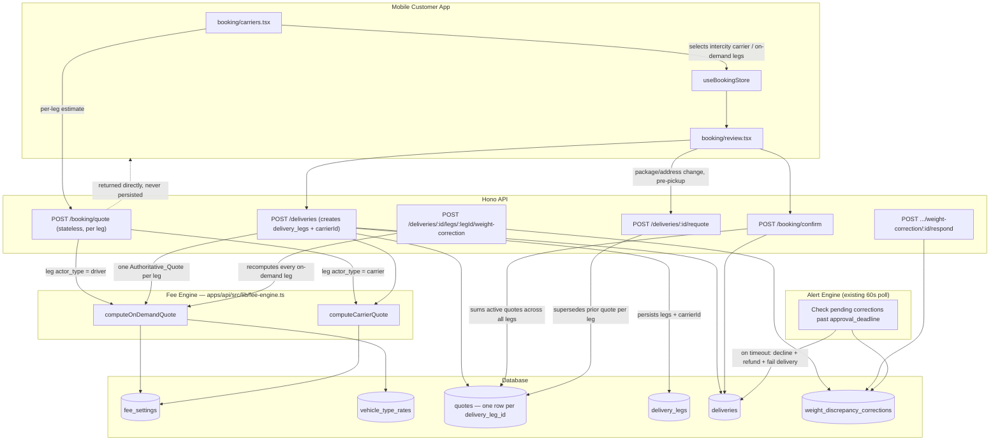

# Design Document: Pricing Transparency & Fee Engine

## Overview

Two separate, pure calculation functions — `computeOnDemandQuote` and `computeCarrierQuote` — price each `Delivery_Leg` independently, keyed off that leg's `actor_type` (see [ADR-009](../../docs/decisions/009-carrier-vs-ondemand-pricing-model.md)). A delivery's customer-facing Composite_Quote is the sum of its legs' quotes — any number of legs, in any combination, including more than one `intercity` leg for a multi-hop route. This spec doesn't decide *how many* legs a delivery has or *which* carrier serves each intercity hop — a future intercity-routing spec owns that (see Out of Scope). What this spec guarantees is that however that leg list is produced (a customer's explicit fixed-route choice, or eventually a routing engine's chosen path), it gets priced correctly and consistently. A quote is stateless and speculative until a real delivery (and its legs) exist, at which point each leg gets an Authoritative_Quote — persisted, expiring, and the sole source of truth `POST /api/v1/booking/confirm` validates against, closing the existing `// TODO(security)` gap in `apps/api/src/routes/booking-payment.ts` and removing the hardcoded `350000` placeholder in the mobile review screen.

A further mechanism, Weight_Discrepancy_Correction, handles the case where a driver on an on-demand leg discovers at physical pickup that the actual package weight doesn't match the declared weight — producing an approval-gated delta on top of the original, untouched, already-paid Composite_Quote.

Six components:

1. **Fee Settings** — a singleton config table (`fee_settings`), same pattern as `alert_settings`: on-demand rates, `carrier_commission_rate_pct` (separate from `COMMISSION_RATE`), `tax_rate_pct` (applies only to SureWaka's own revenue line), and `weight_correction_approval_window_min`.
2. **Fee Engine** — `apps/api/src/lib/fee-engine.ts`, exporting two independent pure functions, each operating on one leg's inputs. No DB writes, no side effects, no shared code beyond both reading the same `fee_settings` row. `computeOnDemandQuote` additionally takes the `vehicle_type_rates` lookup to apply the vehicle type multiplier before tax.
3. **Quote Service** — `apps/api/src/services/quote-service.ts`. Speculative quotes never touch this — they call the Fee Engine directly per leg and return. Authoritative quotes are created here, one row per `delivery_leg_id`, and summed into the Composite_Quote that `booking/confirm` reads.
4. **Carrier selection wiring** — a delivery's leg composition (which legs exist, and which carrier for any `intercity` leg) currently never leaves the mobile client's Zustand store. `POST /deliveries` gains the ability to create the right `delivery_legs` rows and accept a `carrierId` per intercity leg.
5. **Carrier Rate Maintenance** — `carriers.basePrice` becomes admin-editable; every change is logged to `carrier_rate_history`, mirroring the existing `role_audit_log` shape. Forward-looking only.
6. **Carrier Margin Reconciliation** — admin-entered `carrier_invoice_reconciliations` compared against the sum of quoted "Carrier rate" line items for confirmed Carrier_Legs in that window. Surfaced in the Carrier Performance analytics tab.
7. **Weight Discrepancy Correction** — a driver-reported correction at pickup, recomputing every On_Demand_Leg of the delivery, producing an approval-gated delta transaction. Expiry of the approval window is checked by the existing alert-engine's polling loop, reusing proven infrastructure rather than standing up a new worker.

## Architecture



### Key Architecture Decisions

| Decision | Rationale |
|---|---|
| Pricing split is per-leg (`delivery_leg.actor_type`), not per-delivery | Confirmed in alignment (ADR-009, amended) — a single delivery can combine an on-demand first-mile leg, a carrier intercity leg, and an on-demand last-mile leg; a booking-level flag can't represent that |
| No maximum leg count anywhere in this spec's logic or schema | Confirmed in alignment — a future intercity-routing spec may chain multiple `intercity` legs for a multi-hop path (e.g. no direct carrier route between two cities); this spec prices whatever leg list it's given rather than assuming at most one intercity leg. (Note: `delivery_legs.leg_number` from the already-built Spec 0 does assume this today — that's a prerequisite fix for the routing spec, not something this spec touches) |
| Two separate Fee Engine functions, not one with a branch | The two calculations share almost no logic: different inputs, different math direction (subtractive vs. additive), different line-item shapes |
| `quotes` anchors to `delivery_leg_id`, not `delivery_id` | One leg, one quote — a delivery's total is a sum, not a single row; also lets each leg supersede/expire independently (e.g. a last-mile re-quote doesn't touch the intercity leg's already-confirmed quote) |
| Speculative quotes are stateless; persistence starts only at `POST /deliveries` | The security-critical guarantee (price-lock, no stale replay) only matters once a real delivery/leg/escrow exists |
| `quotes.line_items` is `jsonb`, not fixed named columns | Differently-shaped leg breakdowns (base/weight/distance/tax vs. carrier-rate/service-fee) share one row shape |
| Composite_Quote paid as one upfront charge, no per-leg payment | Confirmed in alignment — matches the existing wallet-first escrow model (ADR-006), which pays before delivery work starts; not modified by this spec |
| Weight_Discrepancy_Correction recomputes every On_Demand_Leg, not just the reporting leg | Confirmed in alignment — weight is a package-level property; correcting only the discovered leg would leave other on-demand legs silently mispriced |
| Weight_Discrepancy_Correction is always approval-gated, never auto-debited | Confirmed in alignment — silence must never result in a charge the customer didn't actively agree to; this is the same principle Requirement 7 protects for the original quote |
| Correction timeout is treated as declined, not approved | Confirmed in alignment — a fail-safe default; the whole delivery fails at that point rather than proceeding on an un-agreed price |
| Correction expiry-check reuses the alert-engine's existing 60s poll rather than a new worker | The alert-engine is the only proven polling infrastructure in this codebase; standing up a second one for a single new check would duplicate that pattern for no reason. Distinct from the alert-engine's other 7 rules, this check actively resolves business state (refund + fail delivery) rather than only notifying — noted as a deliberate scope difference in the module structure below |
| `carrier_commission_rate_pct` separate from `COMMISSION_RATE` | Subtractive platform-set-price commission and additive partner-rate markup are different economic levers that may diverge per carrier partnership over time |
| Flat `Base_Rate`, no free-weight allowance; `per_kg_rate_kobo` applies from kg 0 | A free-allowance rule adds complexity with no cost justification |
| Vehicle_Type_Multiplier applied to on-demand subtotal before tax, not as a separate additive line | Multiplicative scaling naturally reflects that all cost components (base, weight, distance) increase with vehicle class; an additive fixed amount per vehicle type would under-charge heavy/long-distance shipments and over-charge short ones |
| New `quotes` row supersedes on re-quote rather than mutating in place | A quote's customer-visible history must be preserved for dispute-replay — matches the `driver_locations` append-only pattern |
| Haversine distance, reusing `eta-calculator.ts` math | No new routing-API dependency; consistent with how `system_eta_at` is already computed |
| `fee_settings` singleton, mirrors `alert_settings` | Proven pattern in this codebase |
| Tax applies only to SureWaka's own revenue line | SureWaka has no basis to tax a carrier's own rate it doesn't set |
| `carrier_rate_history` mirrors `role_audit_log` | Reuses a proven append-only audit shape rather than inventing a second one |
| Margin reconciliation is per-period (lump sum), not per-delivery | Real carrier invoices arrive as period statements, not itemized per parcel |
| Margin reconciliation never moves money | Bookkeeping/visibility only; actual carrier settlement stays out of scope |

## Data Models

### `fee_settings` (singleton, one row — same pattern as `alert_settings`)

```sql
CREATE TABLE fee_settings (
  id                       uuid PRIMARY KEY DEFAULT gen_random_uuid(),
  base_rate_kobo           integer NOT NULL DEFAULT 200000,  -- ₦2,000 on-demand base per leg, admin-tunable
  per_kg_rate_kobo         integer NOT NULL DEFAULT 20000,   -- ₦200/kg, applies from kg 0
  per_km_rate_kobo         integer NOT NULL DEFAULT 15000,   -- ₦150/km
  carrier_commission_rate_pct numeric(5,2) NOT NULL DEFAULT 15.00, -- additive markup on carrier basePrice
  tax_rate_pct             numeric(5,2) NOT NULL DEFAULT 0.00,     -- applies only to SureWaka's own revenue line
  min_price_kobo           integer NOT NULL DEFAULT 50000,   -- floor on the delivery's Composite_Quote total
  weight_correction_approval_window_min integer NOT NULL DEFAULT 10,
  updated_at               timestamptz NOT NULL DEFAULT now()
);
```

### `quotes` (one row per `delivery_leg_id`)

```sql
CREATE TABLE quotes (
  id                uuid PRIMARY KEY DEFAULT gen_random_uuid(),
  delivery_leg_id   uuid NOT NULL REFERENCES delivery_legs(id) ON DELETE CASCADE,
  delivery_id       uuid NOT NULL REFERENCES deliveries(id) ON DELETE CASCADE, -- denormalized for composite-quote sums
  carrier_id        uuid REFERENCES carriers(id),   -- set only for an intercity (Carrier_Leg) quote
  line_items        jsonb NOT NULL,                 -- [{ "label": "Base fee", "amountKobo": 200000 }, ...]
  total_kobo        integer NOT NULL,
  distance_km       real,                           -- on-demand legs only
  package_weight_kg real,                           -- on-demand legs only
  expires_at        timestamptz NOT NULL,
  superseded_at     timestamptz,
  confirmed_at      timestamptz,
  created_at        timestamptz NOT NULL DEFAULT now()
);

CREATE INDEX idx_quotes_leg_active ON quotes(delivery_leg_id)
  WHERE superseded_at IS NULL AND confirmed_at IS NULL;
CREATE INDEX idx_quotes_delivery ON quotes(delivery_id);
```

Speculative (pre-delivery) quotes are never written here — `delivery_leg_id` and `delivery_id` are both `NOT NULL` (Requirement 4.3).

### `weight_discrepancy_corrections`

```sql
CREATE TABLE weight_discrepancy_corrections (
  id                     uuid PRIMARY KEY DEFAULT gen_random_uuid(),
  delivery_id            uuid NOT NULL REFERENCES deliveries(id) ON DELETE CASCADE,
  reported_leg_id        uuid NOT NULL REFERENCES delivery_legs(id), -- the leg where the driver reported it
  declared_weight_kg     real NOT NULL,
  reported_weight_kg     real NOT NULL,
  delta_kobo             integer NOT NULL,   -- positive = additional charge, negative = refund
  status                 text NOT NULL DEFAULT 'pending_approval', -- pending_approval | approved | declined | expired
  approval_deadline      timestamptz NOT NULL,
  responded_at           timestamptz,
  wallet_transaction_ref text,               -- set once the approved delta is actually applied
  created_at             timestamptz NOT NULL DEFAULT now()
);

CREATE INDEX idx_weight_corrections_pending ON weight_discrepancy_corrections(approval_deadline)
  WHERE status = 'pending_approval';
```

The partial index on pending corrections is what the alert-engine's polling loop scans each tick.

### `carrier_rate_history`

```sql
CREATE TABLE carrier_rate_history (
  id                 uuid PRIMARY KEY DEFAULT gen_random_uuid(),
  carrier_id         uuid NOT NULL REFERENCES carriers(id),
  old_base_price_kobo integer,   -- null if this is the carrier's first-ever rate set
  new_base_price_kobo integer NOT NULL,
  changed_by         uuid REFERENCES users(id),
  reason             text,
  created_at         timestamptz NOT NULL DEFAULT now()
);
```

### `carrier_invoice_reconciliations`

```sql
CREATE TABLE carrier_invoice_reconciliations (
  id                 uuid PRIMARY KEY DEFAULT gen_random_uuid(),
  carrier_id         uuid NOT NULL REFERENCES carriers(id),
  period_start       date NOT NULL,
  period_end         date NOT NULL,
  invoiced_amount_kobo integer NOT NULL,
  quoted_carrier_total_kobo integer NOT NULL,  -- computed at entry time: sum of "Carrier rate" line items in [period_start, period_end)
  variance_kobo      integer NOT NULL,          -- quoted_carrier_total_kobo - invoiced_amount_kobo
  entered_by         uuid REFERENCES users(id),
  notes              text,
  created_at         timestamptz NOT NULL DEFAULT now(),
  UNIQUE (carrier_id, period_start, period_end)
);
```

Stored (not a live view) so a reconciliation record's numbers don't shift under it if new bookings are confirmed after the fact.

### `vehicle_type_rates` (one row per vehicle type)

```sql
CREATE TABLE vehicle_type_rates (
  id            uuid PRIMARY KEY DEFAULT gen_random_uuid(),
  vehicle_type  vehicle_type NOT NULL UNIQUE,  -- references the existing vehicle_type pgEnum
  multiplier    numeric(4,2) NOT NULL,         -- e.g. 1.00, 1.30, 1.60, 2.00
  updated_at    timestamptz NOT NULL DEFAULT now()
);
```

Seeded on first migration with default multipliers: `motorcycle = 1.0`, `car = 1.3`, `van = 1.6`, `truck = 2.0`. Admin-editable only by `surewaka_admin` role. The multiplier is applied to the on-demand subtotal (base + weight + distance) before tax.

### `deliveries` / `delivery_legs` changes

- `deliveries.carrier_id`: no longer the right place for carrier selection — a delivery can have an intercity leg with a carrier while also having on-demand first/last-mile legs. Carrier selection moves to `delivery_legs.actor_id` (already the existing FK-to-carrier-or-driver column per Spec 0's schema), keyed by that leg's `actor_type`.
- `deliveries.price`: dropped and recreated as `price_kobo integer`, now effectively a cached/denormalized sum of the delivery's leg quotes rather than an independently-set value (no backfill needed — pre-launch, test data only).
- `delivery_legs`: no schema change needed — `leg_type`, `actor_type`, `actor_id` already model everything this spec needs (Spec 0).

## API Surface

### `POST /api/v1/booking/quote` — stateless, Speculative_Quote only, per leg

Request:
```json
{
  "legs": [
    { "legType": "first_mile", "vehicleType": "car", "pickup": {"lat":6.52,"lng":3.37}, "dropoff": {"lat":6.50,"lng":3.38} },
    { "legType": "intercity", "carrierId": "uuid" },
    { "legType": "last_mile", "vehicleType": "car", "pickup": {"lat":9.05,"lng":7.38}, "dropoff": {"lat":9.06,"lng":7.40} }
  ],
  "packageWeight": 4.5
}
```
Response:
```json
{
  "data": {
    "legs": [
      { "legType": "first_mile", "lineItems": [ { "label": "Base fee", "amountKobo": 200000 }, { "label": "Weight surcharge (4.5kg)", "amountKobo": 90000 }, { "label": "Distance surcharge (8.2km)", "amountKobo": 123000 }, { "label": "Vehicle type (car × 1.3)", "amountKobo": 124000 } ], "totalKobo": 537000 },
      { "legType": "intercity", "lineItems": [ { "label": "Carrier rate (GIG Logistics)", "amountKobo": 350000 }, { "label": "SureWaka service fee", "amountKobo": 52500 } ], "totalKobo": 402500 },
      { "legType": "last_mile", "lineItems": [ { "label": "Base fee", "amountKobo": 200000 }, { "label": "Weight surcharge (4.5kg)", "amountKobo": 90000 }, { "label": "Distance surcharge (3.1km)", "amountKobo": 46500 }, { "label": "Vehicle type (car × 1.3)", "amountKobo": 101000 } ], "totalKobo": 437500 }
    ],
    "compositeTotalKobo": 1377000
  },
  "error": null,
  "meta": null
}
```
Auth required. Nothing is written to `quotes` (Requirement 4.3).

### `POST /api/v1/deliveries` (modified)

- Accepts the delivery's leg composition (which of `first_mile`/`intercity`/`last_mile` exist, and `carrierId` for any intercity leg).
- Creates the corresponding `delivery_legs` rows.
- For each leg, calls the matching Fee Engine function and persists the result as an Authoritative_Quote.
- Response includes each leg's `lineItems`/`totalKobo` plus the delivery's `compositeTotalKobo` — `review.tsx` never needs a second round-trip.

### `POST /api/v1/booking/confirm` (modified)

- Drops trust in the client `amount` field entirely.
- Looks up the active quote for every `delivery_leg_id` under `delivery_id`; if any is missing or expired, fails per Requirement 6.3 / 5.4.
- Sums all active quotes' `total_kobo` into the escrow `totalAmount`.
- Removes the `// TODO(security)` comment at `booking-payment.ts:28-29`.

### `POST /api/v1/deliveries/:id/requote`

- Only callable while `status` is `'draft'` or `'pending'` (pre-pickup, no leg yet started).
- Re-runs the Fee Engine for whichever leg(s) the change affects, supersedes those `quotes` rows only (not unaffected legs).

### `POST /api/v1/deliveries/:id/legs/:legId/weight-correction`

- Driver-app only (the driver assigned to that on-demand leg), callable only while that leg is at `arrived_pickup`.
- Body: `{ reportedWeightKg }`.
- Recomputes every On_Demand_Leg of the delivery with the new weight, computes the combined delta, inserts a `weight_discrepancy_corrections` row (`status: 'pending_approval'`, `approval_deadline: now() + weight_correction_approval_window_min`), and pushes an explanatory notification to the customer.

### `POST /api/v1/deliveries/:id/weight-correction/:correctionId/respond`

- Customer-only. Body: `{ decision: 'approved' | 'declined' }`.
- `approved`: applies the delta as a new wallet transaction (charge or refund), sets `wallet_transaction_ref`, allows the reporting leg to proceed to `picked_up`.
- `declined`: fails the whole delivery per Requirement 12.6, applies the `arrived_pickup` `REFUND_RATES` tier to the original escrow.

### Alert-engine addition: correction expiry

- A new check (not one of the original 7 alert rules, since it mutates business state rather than only notifying) scans `weight_discrepancy_corrections` where `status = 'pending_approval' AND approval_deadline < now()` each 60s tick, and executes the same decline path as an explicit customer decline.

## Components and Interfaces

### Fee Engine (`apps/api/src/lib/fee-engine.ts`)

Two independent pure functions — no DB writes, no side effects:

| Function | Input | Output | Responsibility |
|----------|-------|--------|----------------|
| `computeOnDemandQuote` | `{ packageWeight: number, distanceKm: number, vehicleType: VehicleType }`, `FeeSettings`, `VehicleTypeRates` | `LegQuote` | Prices an On_Demand_Leg (first_mile / last_mile) using `(base + weight + distance) × vehicle_type_multiplier + tax` formula |
| `computeCarrierQuote` | `{ carrierBasePrice: number }`, `FeeSettings` | `LegQuote` | Prices a Carrier_Leg (intercity) using carrier rate + additive commission markup |

```typescript
type VehicleType = 'motorcycle' | 'car' | 'van' | 'truck';
type LineItem = { label: string; amountKobo: number };
type LegQuote = { lineItems: LineItem[]; totalKobo: number };
type FeeSettings = {
  baseRateKobo: number;
  perKgRateKobo: number;
  perKmRateKobo: number;
  carrierCommissionRatePct: number;
  taxRatePct: number;
  minPriceKobo: number;
  weightCorrectionApprovalWindowMin: number;
};
type VehicleTypeRates = Record<VehicleType, { multiplier: number }>;
```

### Quote Service (`apps/api/src/services/quote-service.ts`)

Orchestrates quote lifecycle — persistence, supersession, expiry, and composite assembly:

| Method | Purpose |
|--------|---------|
| `createAuthoritativeQuotesForDelivery(deliveryId, legs, settings)` | Calls the appropriate Fee Engine function per leg, persists one `quotes` row per leg |
| `getActiveQuoteForLeg(deliveryLegId)` | Returns the non-superseded, non-expired quote for a leg |
| `getCompositeTotal(deliveryId)` | Sums all active leg quotes into the Composite_Quote total |
| `supersedeLeg(deliveryLegId, newQuote)` | Marks prior quote as superseded, inserts new quote |
| `confirmAll(deliveryId)` | Stamps `confirmed_at` on all active quotes for a delivery |

### Weight Correction Service (`apps/api/src/services/weight-correction-service.ts`)

Handles the driver-reported weight discrepancy flow:

| Method | Purpose |
|--------|---------|
| `reportDiscrepancy(deliveryId, legId, reportedWeightKg)` | Recomputes all On_Demand_Legs with corrected weight, computes delta, inserts `weight_discrepancy_corrections` row |
| `respondToCorrection(correctionId, decision)` | Applies approved delta as wallet transaction, or declines (fails delivery + refunds) |
| `resolveExpired()` | Called by alert-engine tick — auto-declines corrections past `approval_deadline` |

### API Route Interfaces

| Endpoint | Method | Auth | Purpose |
|----------|--------|------|---------|
| `/api/v1/booking/quote` | POST | Customer | Stateless Speculative_Quote per leg |
| `/api/v1/deliveries` | POST | Customer | Creates delivery + legs + Authoritative_Quotes |
| `/api/v1/booking/confirm` | POST | Customer | Validates quotes, sums total, creates escrow hold |
| `/api/v1/deliveries/:id/requote` | POST | Customer | Re-quotes after chargeable input change (pre-pickup) |
| `/api/v1/deliveries/:id/legs/:legId/weight-correction` | POST | Driver | Reports actual weight at pickup |
| `/api/v1/deliveries/:id/weight-correction/:correctionId/respond` | POST | Customer | Approves or declines the correction delta |
| `/api/v1/admin/fee-settings` | GET/PUT | Admin | Read/update fee parameters |
| `/api/v1/admin/carriers/:id/rate` | PATCH | Admin | Update carrier basePrice + audit log |
| `/api/v1/admin/carrier-reconciliations` | POST/GET | Admin | Enter/view margin reconciliation records |

## Module Structure

```
apps/api/src/lib/fee-engine.ts
  export function computeOnDemandQuote(input: { packageWeight, distanceKm, vehicleType }, settings: FeeSettings, vehicleTypeRates: VehicleTypeRates): LegQuote
  export function computeCarrierQuote(input: { carrierBasePrice }, settings: FeeSettings): LegQuote

apps/api/src/services/quote-service.ts
  # createAuthoritativeQuotesForDelivery, getActiveQuoteForLeg, getCompositeTotal, supersedeLeg, confirmAll

apps/api/src/services/weight-correction-service.ts
  # reportDiscrepancy, respondToCorrection, resolveExpired (called by both the respond route and the alert-engine tick)

apps/api/src/routes/booking-payment.ts        # confirm() rewritten to use quote-service
apps/api/src/routes/booking-quote.ts          # new: POST /booking/quote, stateless, per leg
apps/api/src/routes/deliveries.ts             # POST / creates legs + quotes; new weight-correction sub-routes
apps/api/src/routes/admin/fee-settings.ts     # GET/PUT, surewaka_admin only
apps/api/src/routes/admin/carrier-rates.ts    # PATCH rate + rate history; POST/GET reconciliations

packages/db/src/schema/fee-settings.ts
packages/db/src/schema/vehicle-type-rates.ts
packages/db/src/schema/quotes.ts
packages/db/src/schema/weight-discrepancy-corrections.ts
packages/db/src/schema/carrier-rate-history.ts
packages/db/src/schema/carrier-invoice-reconciliations.ts

workers/alert-engine/src/rules/                # new: weight-correction-expiry check, alongside (not among) the 7 existing rules
```

Mobile (`apps/mobile-customer/app`):
- `booking/carriers.tsx` — calls `POST /booking/quote` with the full leg set, replaces static `basePrice` display with the real per-leg itemized total.
- `booking/review.tsx` — renders `lineItems` grouped by leg from the delivery-creation response; removes the `350000` placeholder and the client-supplied `amount` in the `confirm` call body.
- New: a quote-expiry countdown/refresh prompt (Requirement 8.4), and a weight-correction approval screen/push-notification response flow.

Driver app (`apps/mobile-driver`):
- New: a "report actual weight" step at the `arrived_pickup` stage of an on-demand leg, calling the weight-correction endpoint.

Admin (`apps/admin/app`):
- Carrier detail/edit screen gains a rate-edit control wired to `PATCH /admin/carriers/:id/rate`, with `carrier_rate_history` shown as a changelog.
- `components/analytics/carrier-performance-tab.tsx` gains a reconciliation entry form and the three new per-period numbers (Requirement 11.4).

## Correctness Properties

*A property is a characteristic or behavior that should hold true across all valid executions of a system — essentially, a formal statement about what the system should do. Properties serve as the bridge between human-readable specifications and machine-verifiable correctness guarantees.*

### Property 1: On-demand quote formula correctness

*For any* valid `(packageWeight, distanceKm, vehicleType, FeeSettings, VehicleTypeRates)` input tuple where all values are non-negative and `vehicleType` is one of `motorcycle | car | van | truck`, `computeOnDemandQuote` SHALL produce a `LegQuote` where `totalKobo` equals `((base_rate_kobo + (packageWeight × per_kg_rate_kobo) + (distanceKm × per_km_rate_kobo)) × vehicle_type_multiplier) + tax` (tax applied to the multiplied subtotal which is SureWaka's revenue), and the per-kg surcharge applies from kg 0 with no free-weight allowance.

**Validates: Requirements 1.1, 1.2, 1.3**

### Property 2: Output integrity — integer kobo and line-item sum

*For any* valid input to either `computeOnDemandQuote` or `computeCarrierQuote`, every `amountKobo` in the output `lineItems` array and the output `totalKobo` SHALL be integers (no fractional kobo), and the sum of all `lineItems[].amountKobo` SHALL equal `totalKobo`. Additionally, every line item SHALL have a non-empty string `label`.

**Validates: Requirements 1.4, 4.5**

### Property 3: Minimum delivery price floor

*For any* set of `LegQuote` results composing a delivery's Composite_Quote, if their sum is below `fee_settings.min_price_kobo`, the customer-facing `compositeTotalKobo` SHALL be floored at `min_price_kobo` — never lower.

**Validates: Requirements 1.5**

### Property 4: Carrier quote formula correctness

*For any* valid `(carrierBasePrice, FeeSettings)` input where `carrierBasePrice > 0` and `carrier_commission_rate_pct >= 0`, `computeCarrierQuote` SHALL produce a `LegQuote` where: (a) `totalKobo` equals `carrierBasePrice + service_fee + tax_on_service_fee_only`, (b) no line item references weight or distance surcharges, and (c) tax is applied exclusively to SureWaka's service-fee line, never to the carrier's own rate.

**Validates: Requirements 2.1, 2.3, 2.4**

### Property 5: One authoritative quote per leg in composite assembly

*For any* delivery with N `delivery_legs` rows (any combination of `first_mile`, `intercity`, `last_mile`, including multiple `intercity` legs), creating authoritative quotes SHALL produce exactly N `quotes` rows — one per `delivery_leg_id`, each using the Fee Engine function matching that leg's `actor_type`.

**Validates: Requirements 3.1, 5.1**

### Property 6: Composite line items grouped by leg

*For any* Composite_Quote assembled from K legs, the customer-facing breakdown SHALL contain K distinct groups, each with a clear label identifying the leg (type + carrier name if applicable), and no line item shall appear ungrouped or under the wrong leg.

**Validates: Requirements 3.2**

### Property 7: Speculative quotes are stateless

*For any* call to `POST /api/v1/booking/quote` with valid inputs, the `quotes` table row count SHALL remain unchanged before and after the call — no rows are ever inserted, updated, or deleted by a speculative quote request.

**Validates: Requirements 4.3**

### Property 8: Quote expiry timestamp correctness

*For any* Authoritative_Quote created at time T, `expires_at` SHALL equal T + 15 minutes (within 1 second tolerance for clock drift), ensuring stale quotes cannot be replayed at confirmation time.

**Validates: Requirements 5.3**

### Property 9: At most one active quote per leg

*For any* `delivery_leg_id` at any point in time, there SHALL exist at most one `quotes` row where `superseded_at IS NULL AND confirmed_at IS NULL` — superseding a quote always marks the prior row, maintaining a single active quote invariant.

**Validates: Requirements 5.5**

### Property 10: Escrow total equals sum of active leg quotes

*For any* delivery with N legs at `POST /api/v1/booking/confirm`, the `totalAmount` placed into escrow SHALL equal the sum of `total_kobo` across all N active (non-superseded, non-expired) Authoritative_Quotes — never a client-supplied value, and never a partial sum.

**Validates: Requirements 6.1**

### Property 11: Price immutability after confirmation

*For any* delivery whose `paymentStatus` is `escrowed` or later, no API operation (including fee_settings changes, carrier rate changes, or re-quote attempts) SHALL modify the existing `escrow_holds.totalAmount` — changes require an explicit, customer-approved mechanism (Re-Quote or Weight_Discrepancy_Correction).

**Validates: Requirements 7.1**

### Property 12: Fee setting and rate changes are forward-only

*For any* change to `fee_settings` or `carriers.basePrice`, all Authoritative_Quotes issued before the change SHALL retain their original `line_items` and `total_kobo` values unchanged, and only quotes computed after the change SHALL reflect the new parameters. Additionally, every `carriers.basePrice` change SHALL produce exactly one `carrier_rate_history` row with correct `old_base_price_kobo` and `new_base_price_kobo`.

**Validates: Requirements 9.2, 10.2, 10.3**

### Property 13: Weight discrepancy recomputes all on-demand legs only

*For any* delivery with M on-demand legs and K carrier legs, when a weight discrepancy is reported, `computeOnDemandQuote` SHALL be re-invoked for all M on-demand legs with the corrected weight, and the resulting delta SHALL equal `(sum of M corrected on-demand totals) − (sum of M originally-confirmed on-demand totals)`. The K carrier legs' quotes SHALL remain completely untouched.

**Validates: Requirements 12.1, 12.2**

### Property 14: Weight correction delta is a separate transaction

*For any* approved Weight_Discrepancy_Correction with `delta_kobo ≠ 0`, the original `escrow_holds` row SHALL remain at its original `totalAmount`, and the delta SHALL be applied as a distinct wallet transaction (charge if positive, refund if negative) — never a mutation of the original escrow.

**Validates: Requirements 12.3**

### Property 15: Variance computation correctness

*For any* `carrier_invoice_reconciliations` entry with `carrier_id` C over `[period_start, period_end)`, `variance_kobo` SHALL equal `(sum of "Carrier rate" line items across all confirmed Carrier_Legs for C in that period) − invoiced_amount_kobo`, excluding SureWaka service-fee line items from the summed side.

**Validates: Requirements 11.2**

## Error Handling

### API Error Responses

All error responses follow the standard `{ data: null, error: { code, message, details? }, meta: null }` shape.

| Scenario | HTTP Status | Error Code | Details |
|----------|-------------|------------|---------|
| Missing/invalid fields on `POST /booking/quote` (no pickup, no weight, no vehicleType, etc.) | 400 | `INVALID_QUOTE_REQUEST` | Array of field names that are missing or invalid |
| Invalid vehicle type (not one of motorcycle/car/van/truck) | 400 | `INVALID_VEHICLE_TYPE` | `{ provided, allowed: ['motorcycle','car','van','truck'] }` |
| Carrier not found for given `carrierId` | 404 | `CARRIER_NOT_FOUND` | `{ carrierId }` |
| Quote expired at `POST /booking/confirm` | 409 | `QUOTE_EXPIRED` | `{ expiredLegIds, suggestedAction: 'requote' }` |
| Leg missing an active quote at `POST /booking/confirm` | 422 | `QUOTE_MISSING` | `{ legIds }` — must request quotes first |
| Delivery not in draft/pending state for re-quote | 409 | `DELIVERY_NOT_REQUOTABLE` | `{ currentStatus }` |
| Weight correction reported on non-on-demand leg | 400 | `INVALID_LEG_TYPE` | `{ legType, expected: 'first_mile or last_mile' }` |
| Weight correction reported when leg not at `arrived_pickup` | 409 | `INVALID_LEG_STATUS` | `{ currentStatus, expected: 'arrived_pickup' }` |
| Weight correction approval window elapsed | 410 | `CORRECTION_EXPIRED` | `{ correctionId, expiredAt }` |
| Weight correction already responded to | 409 | `CORRECTION_ALREADY_RESOLVED` | `{ correctionId, status }` |
| Insufficient wallet balance for approved weight correction charge | 402 | `INSUFFICIENT_BALANCE` | `{ required, available }` |
| Fee settings update by non-admin | 403 | `FORBIDDEN` | — |
| Carrier rate update by non-admin | 403 | `FORBIDDEN` | — |

### Failure Modes and Recovery

| Failure | Impact | Recovery |
|---------|--------|----------|
| Fee Engine computation error (e.g., NaN from bad settings) | Quote cannot be generated | Return 500 with `COMPUTATION_ERROR`; alert ops; settings validation on write prevents most cases |
| Database write failure during Authoritative_Quote creation | Delivery created without quotes | Transaction rollback — delivery creation and quote insertion are atomic (single DB transaction) |
| Escrow hold failure at confirm (wallet service down) | Confirmation blocked | Return 503 `SERVICE_UNAVAILABLE`; client retries; quote expiry prevents stale retry after 15 min |
| Alert-engine misses a correction expiry tick | Customer window slightly extended | Next tick (≤60s later) catches it; maximum overrun is one tick interval |
| Carrier basePrice set to 0 or negative | Carrier quotes compute incorrectly | Zod validation on admin PATCH rejects non-positive values before DB write |
| Concurrent re-quote and confirm race | Could confirm a stale quote | `superseded_at` check in confirm query uses `FOR UPDATE` row lock; stale quote detected, returns 409 |

### Input Validation

- `packageWeight`: must be > 0, max 500 kg (validated by Zod schema)
- `distanceKm`: computed server-side from coordinates (haversine) — never client-supplied
- `vehicleType`: must be one of `motorcycle | car | van | truck` (validated against the `vehicle_type` pgEnum values)
- `carrierBasePrice`: must be > 0 (enforced at admin rate-edit time)
- `fee_settings` values: all rates must be >= 0, `min_price_kobo` must be > 0, `weight_correction_approval_window_min` must be >= 1
- `vehicle_type_rates.multiplier`: must be > 0 (enforced at admin edit time)
- Coordinates: valid lat/lng ranges (-90/90, -180/180)

## Testing Strategy

### Unit Tests — Fee Engine (Pure Functions)

Both `computeOnDemandQuote` and `computeCarrierQuote` are pure functions with no side effects, making them ideal for exhaustive unit testing:

- **On-demand formula**: verify `(base + weight + distance) × vehicle_type_multiplier + tax` computation for known inputs across all four vehicle types
- **Carrier formula**: verify carrier_rate + commission + tax-on-service-fee for known inputs
- **Edge cases**: zero weight, zero distance, maximum weight (500kg), very short distances, zero tax rate, 100% commission rate, motorcycle multiplier (1.0× — no change), truck multiplier (2.0× — doubles subtotal)
- **Integer rounding**: verify no fractional kobo in outputs regardless of rate combinations
- **Minimum price floor**: verify floor applies when composite total is below threshold

### Property-Based Tests (Fee Engine + Quote Service)

Property-based testing library: **fast-check** (already available in the Node.js ecosystem, compatible with Vitest).

Configuration: minimum 100 iterations per property test.

Each property test references its design document property:

```
// Feature: pricing-transparency, Property 1: On-demand quote formula correctness
// Feature: pricing-transparency, Property 2: Output integrity — integer kobo and line-item sum
// Feature: pricing-transparency, Property 4: Carrier quote formula correctness
// Feature: pricing-transparency, Property 5: One authoritative quote per leg
// Feature: pricing-transparency, Property 9: At most one active quote per leg
// Feature: pricing-transparency, Property 10: Escrow total equals sum of active leg quotes
// Feature: pricing-transparency, Property 13: Weight discrepancy recomputes all on-demand legs only
```

Key generators:
- `arbFeeSettings`: generates valid `FeeSettings` objects with reasonable ranges
- `arbVehicleTypeRates`: generates valid `VehicleTypeRates` with multipliers in range 0.5 – 5.0
- `arbVehicleType`: picks one of `motorcycle | car | van | truck`
- `arbPackageWeight`: 0.1 – 500 kg (positive reals)
- `arbDistanceKm`: 0.1 – 2000 km (positive reals)
- `arbCarrierBasePrice`: 10000 – 50000000 kobo (positive integers)
- `arbLegComposition`: generates arrays of 1–6 legs with valid type/actor combinations and a vehicle type per on-demand leg

### Integration Tests — Quote Flow

- **Speculative quote round-trip**: call `POST /booking/quote` with valid inputs, verify response shape, verify no DB rows created
- **Delivery creation + authoritative quotes**: create a multi-leg delivery, verify one quote row per leg with correct expiry
- **Confirm with valid quotes**: verify escrow total matches sum of leg quotes
- **Confirm with expired quote**: verify 409 response
- **Confirm with missing quote**: verify 422 response
- **Re-quote flow**: change weight, call re-quote, verify old quote superseded and new quote active
- **Weight correction flow**: report discrepancy, verify correction row created with correct delta, approve, verify wallet transaction

### Integration Tests — Admin Operations

- **Fee settings CRUD**: verify admin can read/update settings, non-admin gets 403
- **Carrier rate update**: verify rate change creates history row, new quotes use new rate, old quotes unchanged
- **Reconciliation entry**: verify variance computation matches expected formula

### End-to-End Tests (Critical Paths)

- Full booking flow: carriers comparison (speculative) → delivery creation (authoritative) → confirm (escrow) → verify amounts match throughout
- Weight correction flow: create delivery → confirm → driver reports weight → customer approves → verify delta transaction
- Quote expiry flow: create delivery → wait 15+ minutes → attempt confirm → verify 409

### Test Organization

```
apps/api/src/lib/__tests__/fee-engine.test.ts          # Unit + property tests for both pure functions
apps/api/src/lib/__tests__/fee-engine.property.test.ts # Property-based tests (fast-check, 100+ iterations)
apps/api/src/services/__tests__/quote-service.test.ts  # Quote lifecycle unit tests
apps/api/src/services/__tests__/weight-correction-service.test.ts
apps/api/src/routes/__tests__/booking-quote.test.ts    # Integration: speculative quote endpoint
apps/api/src/routes/__tests__/booking-confirm.test.ts  # Integration: confirm with quote validation
apps/api/src/routes/__tests__/deliveries.test.ts       # Integration: delivery creation + quotes
apps/api/src/routes/__tests__/admin/fee-settings.test.ts
apps/api/src/routes/__tests__/admin/carrier-rates.test.ts
```

## Rollout Notes

- Since this is pre-launch with test data only, the `deliveries.price` → `price_kobo` column change and the `deliveries.carrierId` → `delivery_legs.actor_id` migration are straightforward `db:generate` + `db:migrate` with no backfill script.
- `fee_settings` needs one seed row — extend `pnpm --filter @surewaka/db seed:ops` or add `seed:fees`.
- `vehicle_type_rates` needs four seed rows (motorcycle=1.0, car=1.3, van=1.6, truck=2.0) — seed alongside `fee_settings` in the same script.
- **Dependency on Push Notifications:** the Weight_Discrepancy_Correction flow (Requirement 12) requires a real-time customer-facing notification to work at all — the customer has a fixed 10-minute window to respond, and there's no way to reach them in time without push. Push Notifications is already flagged as top-priority, blocking work in the operational-excellence-strategy doc; this spec adds a second, concrete reason it needs to ship first (or at least land in parallel).
- Sequencing: schema (`fee_settings`, `vehicle_type_rates`, `quotes`, `delivery_legs.actor_id` wiring, `weight_discrepancy_corrections`, `carrier_rate_history`, `carrier_invoice_reconciliations`) → Fee Engine unit tests (both functions, independently) → quote-service → API routes → mobile UI (customer + driver) → admin rate-edit/reconciliation UI → alert-engine expiry check. Rate maintenance and margin reconciliation have no dependency on the mobile UI work and can be built in parallel with it once the schema lands.
