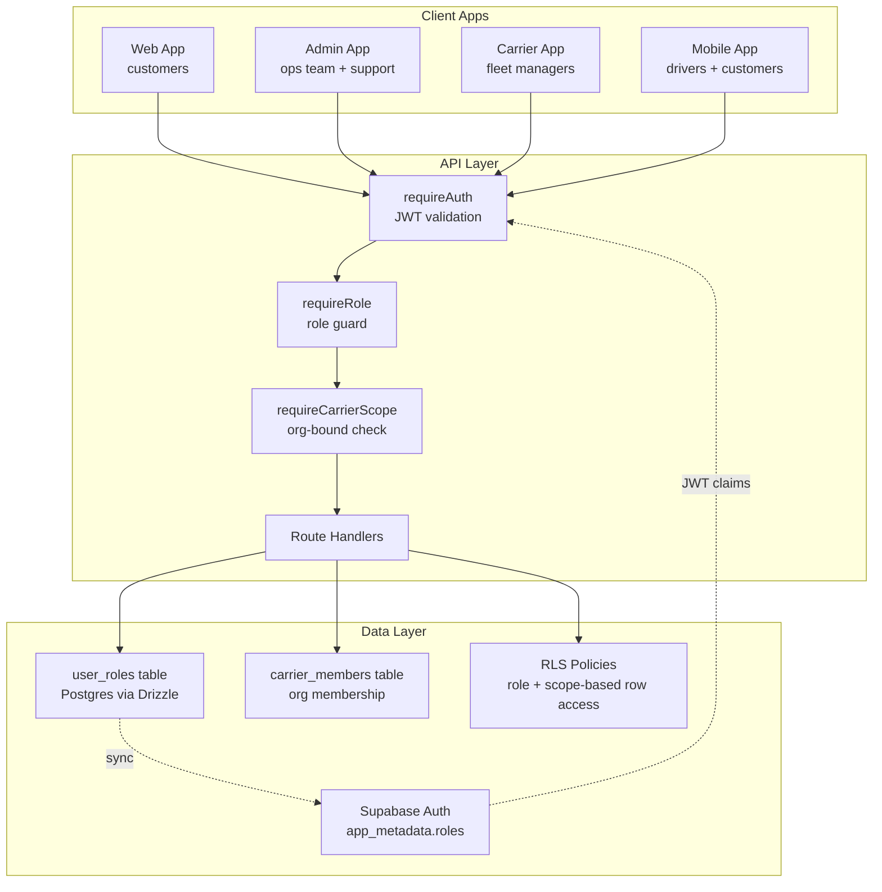
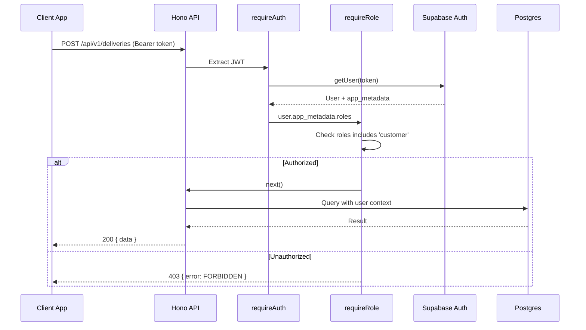
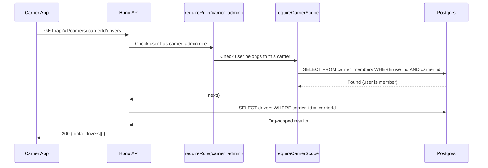
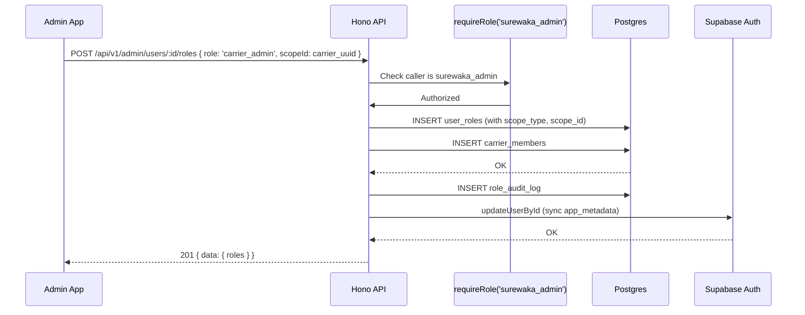
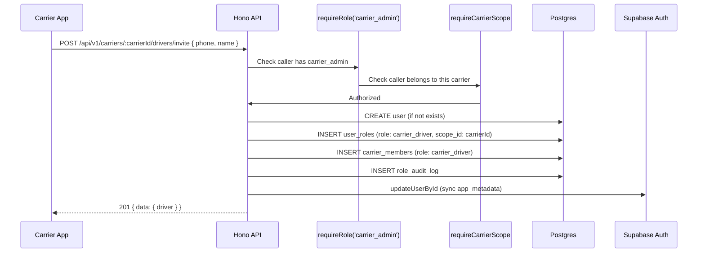

# Design Document: RBAC System

## Overview

The RBAC (Role-Based Access Control) system provides fine-grained authorization for SureWaka's multi-app logistics platform. It manages six distinct roles — `customer`, `driver`, `carrier_driver`, `carrier_admin`, `support_agent`, and `surewaka_admin` — across web, admin, carrier, and mobile applications.

The system uses a dual-storage strategy: roles are stored in Supabase `app_metadata` (for JWT claims and RLS) and mirrored in a Postgres `user_roles` table (for querying, auditing, and multi-role support). This gives us fast middleware checks via JWT claims while maintaining queryable role data for admin operations and analytics.

## Design Principles

1. **Defense in Depth** — Access control enforced at two layers: API middleware (application) AND Supabase RLS policies (database). Even if one layer is bypassed, the other protects data.
2. **Least Privilege** — Every route explicitly declares required roles. No route is open by default.
3. **Separation of Concerns** — Auth (identity) via Supabase; authorization (permissions) via our middleware + RLS.
4. **Fail Closed** — Missing/empty roles default to `['customer']` (lowest privilege). Never grants elevated access on ambiguity.
5. **Composability** — Middleware chains: `requireAuth` → `requireRole('driver')`. Roles combine freely.
6. **Scoped Roles** — Permissions are context-aware. `carrier_admin` and `carrier_driver` are org-bound (scoped to their carrier). Global roles (`customer`, `driver`, `support_agent`, `surewaka_admin`) apply platform-wide.
7. **Immutable Audit Trail** — Every role change logged with performer, timestamp, and reason. Append-only.
8. **Eventual Consistency with Safety** — Dual-storage (DB + JWT) may briefly diverge. Sensitive ops re-validate against DB. JWT expiry naturally resolves staleness.
9. **Backward Compatibility** — Migration preserves existing `users.role` column during transition.
10. **Single Source of Truth** — `user_roles` table is canonical. Supabase `app_metadata` is a derived cache.
11. **No Client-Side Trust** — Frontend role checks are UX-only. All enforcement is server-side.
12. **Multi-role Support** — A user can hold multiple roles simultaneously (e.g., a carrier_admin who is also a driver).

## Role Hierarchy

```
surewaka_admin (god mode — inherits ALL permissions)
    │
    ├── support_agent (read + resolve, no system changes)
    │
    ├── carrier_admin (org-scoped management)
    │       └── carrier_driver (org-scoped delivery only)
    │
    ├── driver (independent, full platform)
    │
    └── customer (base role, default for all users)
```

- `surewaka_admin` bypasses all role checks automatically
- `carrier_admin` and `carrier_driver` are scoped to their carrier organization
- `driver` and `customer` are peer global roles (neither inherits from the other)
- A `carrier_driver` can upgrade to `driver` after completing full platform KYC

## Roles Summary

| Role | Scope | Description |
|------|-------|-------------|
| `customer` | Global | Senders/receivers who book deliveries |
| `driver` | Global | Independent drivers — full platform access, accept jobs from anyone |
| `carrier_driver` | Org-scoped | Drivers onboarded by a carrier — limited to jobs from their carrier only |
| `carrier_admin` | Org-scoped | Fleet managers — manage their org's drivers, vehicles, pricing |
| `support_agent` | Global | Customer support staff — view/resolve issues, capped refunds |
| `surewaka_admin` | Global | God mode — full platform access |

## Permissions Matrix

| Permission | customer | driver | carrier_driver | carrier_admin | support_agent | surewaka_admin |
|-----------|----------|--------|----------------|---------------|---------------|----------------|
| **Deliveries** | | | | | | |
| Create delivery (book) | ✅ | ❌ | ❌ | ❌ | ❌ | ✅ |
| View own deliveries | ✅ | ✅ | ✅ | ✅ (org) | ✅ (read-only) | ✅ (all) |
| Cancel own delivery | ✅ | ❌ | ❌ | ❌ | ❌ | ✅ |
| Accept job (any) | ❌ | ✅ | ❌ | ❌ | ❌ | ✅ |
| Accept job (own carrier) | ❌ | ✅ | ✅ | ❌ | ❌ | ✅ |
| Update delivery status | ❌ | ✅ | ✅ | ❌ | ❌ | ✅ |
| View all deliveries | ❌ | ❌ | ❌ | ❌ | ✅ (read-only) | ✅ |
| **Drivers** | | | | | | |
| View own driver profile | ❌ | ✅ | ✅ | ❌ | ❌ | ✅ |
| Update own availability | ❌ | ✅ | ✅ | ❌ | ❌ | ✅ |
| Appear in matching pool | ❌ | ✅ | ❌ | ❌ | ❌ | — |
| Set own pricing | ❌ | ✅ | ❌ | ❌ | ❌ | ✅ |
| View org drivers | ❌ | ❌ | ❌ | ✅ (org) | ❌ | ✅ (all) |
| Onboard driver to org | ❌ | ❌ | ❌ | ✅ (org) | ❌ | ✅ |
| Verify/approve driver | ❌ | ❌ | ❌ | ❌ | ❌ | ✅ |
| Suspend/deactivate driver | ❌ | ❌ | ❌ | ✅ (org) | ❌ | ✅ (all) |
| **Carriers** | | | | | | |
| View carrier listings | ✅ | ✅ | ✅ | ✅ | ✅ | ✅ |
| Manage own carrier profile | ❌ | ❌ | ❌ | ✅ (org) | ❌ | ✅ |
| Add/remove vehicles | ❌ | ❌ | ❌ | ✅ (org) | ❌ | ✅ |
| Set pricing/service areas | ❌ | ❌ | ❌ | ✅ (org) | ❌ | ✅ |
| Approve/reject carrier | ❌ | ❌ | ❌ | ❌ | ❌ | ✅ |
| **Users & Roles** | | | | | | |
| View own profile | ✅ | ✅ | ✅ | ✅ | ✅ | ✅ |
| Update own profile | ✅ | ✅ | ✅ | ✅ | ✅ | ✅ |
| View user profiles | ❌ | ❌ | ❌ | ❌ | ✅ | ✅ |
| View all users | ❌ | ❌ | ❌ | ❌ | ❌ | ✅ |
| Suspend/activate user | ❌ | ❌ | ❌ | ❌ | ❌ | ✅ |
| Assign roles | ❌ | ❌ | ❌ | ❌ | ❌ | ✅ |
| Revoke roles | ❌ | ❌ | ❌ | ❌ | ❌ | ✅ |
| **Payments** | | | | | | |
| Make payment | ✅ | ❌ | ❌ | ❌ | ❌ | ✅ |
| View own earnings | ❌ | ✅ | ✅ | ✅ (org) | ❌ | ✅ |
| Request payout (direct) | ❌ | ✅ | ❌ | ✅ (org) | ❌ | ✅ |
| View all transactions | ❌ | ❌ | ❌ | ❌ | ❌ | ✅ |
| **Support** | | | | | | |
| Resolve disputes | ❌ | ❌ | ❌ | ❌ | ✅ | ✅ |
| Issue refunds (capped) | ❌ | ❌ | ❌ | ❌ | ✅ | ✅ |
| **Analytics** | | | | | | |
| View own stats | ✅ | ✅ | ✅ | ✅ | ✅ | ✅ |
| View org analytics | ❌ | ❌ | ❌ | ✅ (org) | ❌ | ✅ |
| View platform analytics | ❌ | ❌ | ❌ | ❌ | ❌ | ✅ |
| **KYC** | | | | | | |
| Submit KYC documents | ❌ | ✅ | ✅ | ✅ | ❌ | ❌ |
| Review/approve KYC | ❌ | ❌ | ❌ | ❌ | ❌ | ✅ |

**Legend:** ✅ = allowed, ❌ = denied, **(org)** = scoped to their carrier, **(all)** = platform-wide

## Driver Split: `driver` vs `carrier_driver`

| Capability | `driver` (independent) | `carrier_driver` (org-bound) |
|-----------|----------------------|------------------------------|
| Accept jobs from any customer | ✅ | ❌ |
| Accept jobs from their carrier only | ✅ | ✅ |
| Appear in on-demand matching pool | ✅ | ❌ |
| Set own availability/pricing | ✅ | ❌ (carrier sets it) |
| View own earnings | ✅ | ✅ |
| Request direct payout | ✅ | ❌ (paid via carrier) |
| Onboarded by | SureWaka (KYC verified) | Carrier admin (carrier vouches) |
| KYC required | Full (NIN, license, vehicle docs) | Lighter (carrier handles verification) |
| Can upgrade to independent driver | — | ✅ (after full KYC + surewaka_admin approval) |


## Architecture



## Sequence Diagrams

### Authentication + Authorization Flow



### Carrier-Scoped Authorization Flow



### Role Assignment Flow



### Carrier Admin Onboarding a Driver



## Data Models (Database Tables)

### Table 1: `users`

```typescript
export const users = pgTable('users', {
  id: uuid('id').primaryKey().defaultRandom(),
  email: text('email').unique(),
  phone: text('phone').unique(),
  fullName: text('full_name').notNull(),
  avatarUrl: text('avatar_url'),
  isActive: boolean('is_active').notNull().default(true),
  createdAt: timestamp('created_at').notNull().defaultNow(),
  updatedAt: timestamp('updated_at').notNull().defaultNow(),
});
```

### Table 2: `user_roles`

```typescript
export const userRoleEnum = pgEnum('user_role', [
  'customer',
  'driver',
  'carrier_driver',
  'carrier_admin',
  'support_agent',
  'surewaka_admin',
]);

export const userRoles = pgTable('user_roles', {
  id: uuid('id').primaryKey().defaultRandom(),
  userId: uuid('user_id').notNull().references(() => users.id, { onDelete: 'cascade' }),
  role: userRoleEnum('role').notNull(),
  scopeType: text('scope_type'),  // 'carrier' | null (global)
  scopeId: uuid('scope_id'),      // carrier_id when scope_type = 'carrier'
  assignedBy: uuid('assigned_by').references(() => users.id),
  assignedAt: timestamp('assigned_at').notNull().defaultNow(),
  revokedAt: timestamp('revoked_at'),
  isActive: boolean('is_active').notNull().default(true),
}, (table) => ({
  uniqueActiveRole: unique().on(table.userId, table.role, table.scopeId)
    .where(sql`is_active = true`),
  userActiveIdx: index('idx_user_roles_user_active')
    .on(table.userId, table.isActive),
}));
```

### Table 3: `role_audit_log`

```typescript
export const roleAuditLog = pgTable('role_audit_log', {
  id: uuid('id').primaryKey().defaultRandom(),
  userId: uuid('user_id').notNull().references(() => users.id),
  role: userRoleEnum('role').notNull(),
  action: text('action').notNull(), // 'assigned' | 'revoked' | 'upgraded'
  scopeType: text('scope_type'),
  scopeId: uuid('scope_id'),
  performedBy: uuid('performed_by').references(() => users.id),
  reason: text('reason'),
  createdAt: timestamp('created_at').notNull().defaultNow(),
});
```

### Table 4: `carriers`

```typescript
export const carriers = pgTable('carriers', {
  id: uuid('id').primaryKey().defaultRandom(),
  name: text('name').notNull(),
  slug: text('slug').notNull().unique(),
  logoUrl: text('logo_url'),
  isVerified: boolean('is_verified').notNull().default(false),
  isActive: boolean('is_active').notNull().default(true),
  verifiedAt: timestamp('verified_at'),
  verifiedBy: uuid('verified_by').references(() => users.id),
  createdAt: timestamp('created_at').notNull().defaultNow(),
  updatedAt: timestamp('updated_at').notNull().defaultNow(),
});
```

### Table 5: `carrier_members`

```typescript
export const carrierMemberRoleEnum = pgEnum('carrier_member_role', [
  'carrier_admin',
  'carrier_driver',
]);

export const carrierMembers = pgTable('carrier_members', {
  id: uuid('id').primaryKey().defaultRandom(),
  carrierId: uuid('carrier_id').notNull().references(() => carriers.id, { onDelete: 'cascade' }),
  userId: uuid('user_id').notNull().references(() => users.id, { onDelete: 'cascade' }),
  role: carrierMemberRoleEnum('role').notNull(),
  invitedBy: uuid('invited_by').references(() => users.id),
  joinedAt: timestamp('joined_at').notNull().defaultNow(),
  leftAt: timestamp('left_at'),
  isActive: boolean('is_active').notNull().default(true),
}, (table) => ({
  uniqueActiveMember: unique().on(table.carrierId, table.userId)
    .where(sql`is_active = true`),
}));
```

### Supabase app_metadata Shape

```typescript
type AppMetadata = {
  roles: UserRole[];           // ['customer', 'carrier_admin']
  primary_role: UserRole;      // Default app routing role
  carrier_id?: string;         // For org-scoped roles, the carrier they belong to
};
```

## Permissions (Code-Based)

Permissions are defined as a TypeScript constant map — not stored in the database. This keeps them type-safe, compile-time checked, and avoids unnecessary DB queries.

```typescript
// packages/shared/src/constants.ts

export const USER_ROLES = [
  'customer',
  'driver',
  'carrier_driver',
  'carrier_admin',
  'support_agent',
  'surewaka_admin',
] as const;

export type UserRole = (typeof USER_ROLES)[number];

export type Permission =
  | 'deliveries:create'
  | 'deliveries:read:own'
  | 'deliveries:read:org'
  | 'deliveries:read:all'
  | 'deliveries:accept:any'
  | 'deliveries:accept:org'
  | 'deliveries:update:status'
  | 'deliveries:cancel:own'
  | 'drivers:read:own'
  | 'drivers:read:org'
  | 'drivers:read:all'
  | 'drivers:onboard:org'
  | 'drivers:verify'
  | 'drivers:suspend:org'
  | 'drivers:suspend:all'
  | 'drivers:matching:pool'
  | 'drivers:pricing:own'
  | 'carriers:read:public'
  | 'carriers:manage:own'
  | 'carriers:approve'
  | 'users:read:own'
  | 'users:update:own'
  | 'users:read:all'
  | 'users:suspend'
  | 'roles:assign'
  | 'roles:revoke'
  | 'payments:make'
  | 'payments:earnings:own'
  | 'payments:earnings:org'
  | 'payments:payout:direct'
  | 'payments:payout:org'
  | 'payments:transactions:all'
  | 'support:resolve'
  | 'support:refund:capped'
  | 'analytics:own'
  | 'analytics:org'
  | 'analytics:platform'
  | 'kyc:submit'
  | 'kyc:review';

export const ROLE_PERMISSIONS: Record<UserRole, Permission[]> = {
  customer: [
    'deliveries:create',
    'deliveries:read:own',
    'deliveries:cancel:own',
    'carriers:read:public',
    'users:read:own',
    'users:update:own',
    'payments:make',
    'analytics:own',
  ],
  driver: [
    'deliveries:accept:any',
    'deliveries:accept:org',
    'deliveries:update:status',
    'deliveries:read:own',
    'drivers:read:own',
    'drivers:matching:pool',
    'drivers:pricing:own',
    'carriers:read:public',
    'users:read:own',
    'users:update:own',
    'payments:earnings:own',
    'payments:payout:direct',
    'analytics:own',
    'kyc:submit',
  ],
  carrier_driver: [
    'deliveries:accept:org',
    'deliveries:update:status',
    'deliveries:read:own',
    'drivers:read:own',
    'carriers:read:public',
    'users:read:own',
    'users:update:own',
    'payments:earnings:own',
    'analytics:own',
    'kyc:submit',
  ],
  carrier_admin: [
    'deliveries:read:org',
    'drivers:read:org',
    'drivers:onboard:org',
    'drivers:suspend:org',
    'carriers:read:public',
    'carriers:manage:own',
    'users:read:own',
    'users:update:own',
    'payments:earnings:org',
    'payments:payout:org',
    'analytics:org',
    'kyc:submit',
  ],
  support_agent: [
    'deliveries:read:all',
    'users:read:all',
    'users:read:own',
    'users:update:own',
    'support:resolve',
    'support:refund:capped',
    'analytics:own',
  ],
  surewaka_admin: [
    // All permissions (enforced via hierarchy bypass, but listed for documentation)
    'deliveries:create',
    'deliveries:read:all',
    'deliveries:accept:any',
    'deliveries:update:status',
    'deliveries:cancel:own',
    'drivers:read:all',
    'drivers:onboard:org',
    'drivers:verify',
    'drivers:suspend:all',
    'drivers:matching:pool',
    'drivers:pricing:own',
    'carriers:read:public',
    'carriers:manage:own',
    'carriers:approve',
    'users:read:all',
    'users:update:own',
    'users:suspend',
    'roles:assign',
    'roles:revoke',
    'payments:make',
    'payments:earnings:own',
    'payments:earnings:org',
    'payments:payout:direct',
    'payments:payout:org',
    'payments:transactions:all',
    'support:resolve',
    'support:refund:capped',
    'analytics:platform',
    'analytics:org',
    'analytics:own',
    'kyc:review',
  ],
};
```


## Components and Interfaces

### Component 1: Role Middleware (`requireRole`)

**Purpose**: Guards API routes by checking the authenticated user's roles against required roles.

```typescript
// apps/api/src/middleware/role.ts
import { createMiddleware } from 'hono/factory';
import type { UserRole } from '@surewaka/shared';

type RoleEnv = {
  Variables: {
    user: SupabaseUser;
    userRoles: UserRole[];
  };
};

export function requireRole(...roles: UserRole[]) {
  return createMiddleware<RoleEnv>(async (c, next) => {
    const user = c.get('user');
    const userRoles: UserRole[] = user.app_metadata?.roles ?? ['customer'];

    c.set('userRoles', userRoles);

    // Hierarchy: surewaka_admin bypasses all checks
    if (userRoles.includes('surewaka_admin')) {
      await next();
      return;
    }

    // Check if user has at least one required role
    const hasAccess = roles.some((role) => userRoles.includes(role));

    if (!hasAccess) {
      return c.json(
        {
          data: null,
          error: { code: 'FORBIDDEN', message: `Requires one of: ${roles.join(', ')}` },
          meta: null,
        },
        403
      );
    }

    await next();
  });
}
```

### Component 2: Carrier Scope Middleware (`requireCarrierScope`)

**Purpose**: For org-scoped routes, verifies the user belongs to the carrier specified in the URL.

```typescript
// apps/api/src/middleware/carrier-scope.ts
import { createMiddleware } from 'hono/factory';
import { db } from '@surewaka/db';
import { carrierMembers } from '@surewaka/db/schema';
import { and, eq } from 'drizzle-orm';

export const requireCarrierScope = createMiddleware(async (c, next) => {
  const user = c.get('user');
  const userRoles: UserRole[] = user.app_metadata?.roles ?? [];
  const carrierId = c.req.param('carrierId');

  // surewaka_admin bypasses scope check
  if (userRoles.includes('surewaka_admin')) {
    await next();
    return;
  }

  if (!carrierId) {
    return c.json(
      { data: null, error: { code: 'BAD_REQUEST', message: 'Missing carrierId' }, meta: null },
      400
    );
  }

  // Check user is an active member of this carrier
  const membership = await db
    .select()
    .from(carrierMembers)
    .where(
      and(
        eq(carrierMembers.userId, user.id),
        eq(carrierMembers.carrierId, carrierId),
        eq(carrierMembers.isActive, true)
      )
    )
    .limit(1);

  if (membership.length === 0) {
    return c.json(
      { data: null, error: { code: 'FORBIDDEN', message: 'Not a member of this carrier' }, meta: null },
      403
    );
  }

  c.set('carrierMembership', membership[0]);
  await next();
});
```

### Component 3: Role Service (`RoleService`)

**Purpose**: Business logic for role assignment, revocation, querying, and sync.

```typescript
// apps/api/src/services/role-service.ts

export interface RoleService {
  // Core operations
  assignRole(params: {
    userId: string;
    role: UserRole;
    assignedBy: string;
    scopeType?: 'carrier' | null;
    scopeId?: string | null;
    reason?: string;
  }): Promise<UserRoleRecord>;

  revokeRole(params: {
    userId: string;
    role: UserRole;
    revokedBy: string;
    scopeId?: string | null;
    reason: string;
  }): Promise<void>;

  upgradeRole(params: {
    userId: string;
    fromRole: UserRole;
    toRole: UserRole;
    performedBy: string;
    reason: string;
  }): Promise<UserRoleRecord>;

  // Queries
  getUserRoles(userId: string): Promise<UserRoleRecord[]>;
  getUsersByRole(role: UserRole, scopeId?: string): Promise<UserRoleRecord[]>;
  hasRole(userId: string, role: UserRole, scopeId?: string): Promise<boolean>;

  // Sync
  syncRolesToAuth(userId: string): Promise<void>;
}
```

**Assignment Rules**:
- `surewaka_admin` can only be assigned by another `surewaka_admin`
- `support_agent` can only be assigned by `surewaka_admin`
- `carrier_admin` can be assigned by `surewaka_admin` (must include `scopeId`)
- `carrier_driver` can be assigned by `carrier_admin` (within their org) or `surewaka_admin`
- `driver` can be assigned by `surewaka_admin` (after KYC approval)
- `customer` is auto-assigned on registration

### Component 4: Frontend Role Context

```typescript
// packages/ui/src/hooks/use-roles.ts
import type { UserRole } from '@surewaka/shared';

export type RoleContext = {
  roles: UserRole[];
  hasRole: (role: UserRole) => boolean;
  hasAnyRole: (...roles: UserRole[]) => boolean;
  isAdmin: boolean;
  isSupport: boolean;
  isDriver: boolean;
  isCarrierAdmin: boolean;
  isCarrierDriver: boolean;
  isCustomer: boolean;
  carrierId?: string;
};

// packages/ui/src/components/role-gate.tsx
export function RoleGate({
  roles,
  userRoles,
  children,
  fallback = null,
}: {
  roles: UserRole[];
  userRoles: UserRole[];
  children: ReactNode;
  fallback?: ReactNode;
}) {
  const hasAccess =
    userRoles.includes('surewaka_admin') ||
    roles.some((role) => userRoles.includes(role));

  return hasAccess ? <>{children}</> : <>{fallback}</>;
}
```

## Algorithmic Pseudocode

### Role Check Algorithm

```typescript
/**
 * PRECONDITIONS:
 * - user is authenticated (JWT validated)
 * - requiredRoles is non-empty
 *
 * POSTCONDITIONS:
 * - Returns true if user has sufficient roles
 * - surewaka_admin always returns true (hierarchy bypass)
 */
function checkRoleAccess(
  userRoles: UserRole[],
  requiredRoles: UserRole[],
  requireAll: boolean = false
): boolean {
  if (userRoles.includes('surewaka_admin')) return true;

  if (requireAll) {
    return requiredRoles.every((role) => userRoles.includes(role));
  }
  return requiredRoles.some((role) => userRoles.includes(role));
}
```

### Scoped Role Check Algorithm

```typescript
/**
 * PRECONDITIONS:
 * - user is authenticated
 * - carrierId is a valid UUID
 *
 * POSTCONDITIONS:
 * - Returns true if user has the role AND belongs to the carrier
 * - surewaka_admin bypasses scope check
 */
async function checkScopedAccess(
  userId: string,
  requiredRole: UserRole,
  carrierId: string,
  db: DrizzleClient
): Promise<boolean> {
  // Check role exists with matching scope
  const roleRecord = await db
    .select()
    .from(userRoles)
    .where(and(
      eq(userRoles.userId, userId),
      eq(userRoles.role, requiredRole),
      eq(userRoles.scopeId, carrierId),
      eq(userRoles.isActive, true)
    ))
    .limit(1);

  return roleRecord.length > 0;
}
```

### Role Sync Algorithm

```typescript
/**
 * POSTCONDITIONS:
 * - user.app_metadata.roles matches all active roles in user_roles table
 * - user.app_metadata.primary_role is set to highest-priority active role
 * - user.app_metadata.carrier_id is set if user has org-scoped role
 * - If no active roles exist, roles = ['customer'] (default)
 */
async function syncRolesToSupabaseAuth(
  userId: string,
  db: DrizzleClient,
  supabaseAdmin: SupabaseServiceClient
): Promise<void> {
  const activeRoles = await db
    .select({ role: userRoles.role, scopeId: userRoles.scopeId })
    .from(userRoles)
    .where(and(eq(userRoles.userId, userId), eq(userRoles.isActive, true)))
    .orderBy(asc(userRoles.assignedAt));

  const roles: UserRole[] = activeRoles.length > 0
    ? [...new Set(activeRoles.map((r) => r.role))]
    : ['customer'];

  // Find carrier_id from org-scoped roles
  const carrierRole = activeRoles.find(
    (r) => r.role === 'carrier_admin' || r.role === 'carrier_driver'
  );

  const { error } = await supabaseAdmin.auth.admin.updateUserById(userId, {
    app_metadata: {
      roles,
      primary_role: roles[0],
      ...(carrierRole?.scopeId && { carrier_id: carrierRole.scopeId }),
    },
  });

  if (error) {
    throw new RoleSyncError(`Failed to sync roles for user ${userId}: ${error.message}`);
  }
}
```

### Carrier Driver Onboarding Algorithm

```typescript
/**
 * PRECONDITIONS:
 * - caller has carrier_admin role for the specified carrier
 * - target user exists or will be created
 *
 * POSTCONDITIONS:
 * - User has carrier_driver role with scope_id = carrierId
 * - User is in carrier_members table
 * - Audit log entry created
 * - Supabase app_metadata synced
 */
async function onboardCarrierDriver(params: {
  carrierId: string;
  phone: string;
  fullName: string;
  invitedBy: string; // carrier_admin user id
}): Promise<{ user: User; role: UserRoleRecord }> {
  const { carrierId, phone, fullName, invitedBy } = params;

  return await db.transaction(async (tx) => {
    // Step 1: Find or create user
    let user = await tx.select().from(users).where(eq(users.phone, phone)).limit(1);
    if (user.length === 0) {
      [user] = await tx.insert(users).values({ phone, fullName }).returning();
    }

    // Step 2: Assign carrier_driver role (scoped)
    const [roleRecord] = await tx.insert(userRoles).values({
      userId: user.id,
      role: 'carrier_driver',
      scopeType: 'carrier',
      scopeId: carrierId,
      assignedBy: invitedBy,
    }).returning();

    // Step 3: Add to carrier_members
    await tx.insert(carrierMembers).values({
      carrierId,
      userId: user.id,
      role: 'carrier_driver',
      invitedBy,
    });

    // Step 4: Audit log
    await tx.insert(roleAuditLog).values({
      userId: user.id,
      role: 'carrier_driver',
      action: 'assigned',
      scopeType: 'carrier',
      scopeId: carrierId,
      performedBy: invitedBy,
      reason: 'Onboarded by carrier admin',
    });

    // Step 5: Sync to Supabase
    await syncRolesToSupabaseAuth(user.id, tx, supabaseAdmin);

    return { user, role: roleRecord };
  });
}
```

## Zod Validators

```typescript
// packages/shared/src/validators.ts additions

import { z } from 'zod';
import { USER_ROLES } from './constants';

export const userRoleSchema = z.enum(USER_ROLES);

export const assignRoleSchema = z.object({
  userId: z.string().uuid(),
  role: userRoleSchema,
  scopeType: z.enum(['carrier']).nullable().optional(),
  scopeId: z.string().uuid().nullable().optional(),
  reason: z.string().min(3).max(500).optional(),
}).refine(
  (data) => {
    // Org-scoped roles must have scopeId
    if (['carrier_admin', 'carrier_driver'].includes(data.role)) {
      return data.scopeType === 'carrier' && !!data.scopeId;
    }
    return true;
  },
  { message: 'Org-scoped roles require scopeType and scopeId' }
);

export const revokeRoleSchema = z.object({
  userId: z.string().uuid(),
  role: userRoleSchema,
  scopeId: z.string().uuid().nullable().optional(),
  reason: z.string().min(3).max(500),
});

export const onboardCarrierDriverSchema = z.object({
  phone: z.string().regex(/^\+234\d{10}$/, 'Must be a valid Nigerian phone number'),
  fullName: z.string().min(2).max(100),
});

export type AssignRoleInput = z.infer<typeof assignRoleSchema>;
export type RevokeRoleInput = z.infer<typeof revokeRoleSchema>;
export type OnboardCarrierDriverInput = z.infer<typeof onboardCarrierDriverSchema>;
```

## RLS Policies

```sql
-- Customers see only their own deliveries
CREATE POLICY "customers_own_deliveries" ON deliveries
FOR SELECT USING (
  customer_id = auth.uid()
  OR 'surewaka_admin' = ANY((auth.jwt()->'app_metadata'->'roles')::text[])
  OR 'support_agent' = ANY((auth.jwt()->'app_metadata'->'roles')::text[])
);

-- Drivers see deliveries assigned to them
CREATE POLICY "drivers_assigned_deliveries" ON deliveries
FOR SELECT USING (
  driver_id = auth.uid()
  OR 'surewaka_admin' = ANY((auth.jwt()->'app_metadata'->'roles')::text[])
);

-- Carrier members see deliveries for their carrier (scoped)
CREATE POLICY "carrier_org_deliveries" ON deliveries
FOR SELECT USING (
  carrier_id = (auth.jwt()->'app_metadata'->>'carrier_id')::uuid
  OR 'surewaka_admin' = ANY((auth.jwt()->'app_metadata'->'roles')::text[])
);

-- Carrier admins manage only their org's drivers
CREATE POLICY "carrier_admin_drivers" ON carrier_members
FOR ALL USING (
  carrier_id = (auth.jwt()->'app_metadata'->>'carrier_id')::uuid
  OR 'surewaka_admin' = ANY((auth.jwt()->'app_metadata'->'roles')::text[])
);

-- Support agents can read all user profiles (read-only)
CREATE POLICY "support_read_users" ON users
FOR SELECT USING (
  id = auth.uid()
  OR 'support_agent' = ANY((auth.jwt()->'app_metadata'->'roles')::text[])
  OR 'surewaka_admin' = ANY((auth.jwt()->'app_metadata'->'roles')::text[])
);
```

## Example API Routes

```typescript
// apps/api/src/routes/carriers.ts
const carriers = new Hono();

// Carrier admin manages their org's drivers
carriers.get(
  '/:carrierId/drivers',
  requireAuth,
  requireRole('carrier_admin'),
  requireCarrierScope,
  async (c) => { /* list org drivers */ }
);

// Carrier admin onboards a new driver to their org
carriers.post(
  '/:carrierId/drivers/invite',
  requireAuth,
  requireRole('carrier_admin'),
  requireCarrierScope,
  async (c) => { /* onboard carrier_driver */ }
);

// Carrier admin suspends a driver in their org
carriers.patch(
  '/:carrierId/drivers/:driverId/suspend',
  requireAuth,
  requireRole('carrier_admin'),
  requireCarrierScope,
  async (c) => { /* suspend carrier_driver */ }
);
```

## Correctness Properties

*A property is a characteristic or behavior that should hold true across all valid executions of a system — essentially, a formal statement about what the system should do. Properties serve as the bridge between human-readable specifications and machine-verifiable correctness guarantees.*

### Property 1: Role Hierarchy Bypass

*For any* API route with any combination of required roles, and *for any* user holding the `surewaka_admin` role, the role check SHALL always grant access regardless of what other roles are required.

**Validates: Requirements 2.3, 3.2, 8.4**

### Property 2: No Self-Elevation

*For any* user who does not hold the `surewaka_admin` role, attempting to assign `surewaka_admin` or `support_agent` to any user SHALL be rejected with a 403 error.

**Validates: Requirements 4.4, 9.2**

### Property 3: Scope Isolation

*For any* user with an org-scoped role (`carrier_admin` or `carrier_driver`) and *for any* carrier ID that does not match their active `carrier_members` record, the scope middleware SHALL deny access.

**Validates: Requirements 3.1, 3.4, 5.4**

### Property 4: Sync Consistency

*For any* sequence of role mutations (assign, revoke, upgrade), after the sync operation completes, `app_metadata.roles` SHALL equal the set of all active roles in the `user_roles` table, `app_metadata.carrier_id` SHALL match the `scope_id` of any org-scoped role, and if no active roles exist the result SHALL be `['customer']`.

**Validates: Requirements 1.3, 6.1, 6.3, 6.4, 9.5**

### Property 5: Unique Active Roles

*For any* user, role, and scope combination, there SHALL be at most one record in `user_roles` where `is_active = true`. Attempting to assign a duplicate active role SHALL result in a 409 Conflict.

**Validates: Requirements 1.6, 4.7**

### Property 6: Audit Completeness

*For any* role mutation (assign, revoke, or upgrade), exactly one `role_audit_log` entry SHALL be produced containing the performer's ID, the target user's ID, the action type, and for org-scoped changes the scope_type and scope_id.

**Validates: Requirements 7.1, 7.2, 7.3, 7.4, 7.6, 9.4**

### Property 7: Org-Scoped Role Validation

*For any* role assignment where the role is `carrier_admin` or `carrier_driver`, the request SHALL be rejected if `scope_type` is not `'carrier'` or `scope_id` is missing. Conversely, *for any* global role assignment, scope fields SHALL be null.

**Validates: Requirements 1.7, 1.8, 4.3**

### Property 8: Multi-Role Support

*For any* valid subset of the six defined roles, a user SHALL be able to hold all roles in that subset simultaneously, and `getUserRoles` SHALL return all of them.

**Validates: Requirements 1.5**

### Property 9: Carrier Driver Limitation

*For any* user holding only the `carrier_driver` role (without `driver`), attempting to accept a job that does not belong to their carrier SHALL be denied.

**Validates: Requirements 3.1, 3.4**

### Property 10: Onboarding Postconditions

*For any* valid carrier driver onboarding request, the operation SHALL atomically produce: a `carrier_driver` role record with `scope_id` matching the carrier, a `carrier_members` record linking the user to the carrier, and an audit log entry with action `'assigned'`.

**Validates: Requirements 5.2, 5.3, 7.1**

### Property 11: Role Query Correctness

*For any* user with a set of active roles R, `hasRole(role)` SHALL return true if and only if `role ∈ R`, and `hasAnyRole(...roles)` SHALL return true if and only if the intersection of `roles` and `R` is non-empty.

**Validates: Requirements 8.2, 8.3**

### Property 12: Access Denial Without Required Roles

*For any* user whose role set does not include any of the required roles for a route AND does not include `surewaka_admin`, the role middleware SHALL return HTTP 403.

**Validates: Requirements 2.4, 8.5**

### Property 13: Schema Validation Rejects Invalid Input

*For any* input that does not conform to `assignRoleSchema`, `revokeRoleSchema`, or `onboardCarrierDriverSchema`, the corresponding service operation SHALL reject the request before performing any database writes.

**Validates: Requirements 4.5, 4.6, 5.5**

## Error Handling

| Scenario | Response | Recovery |
|----------|----------|----------|
| Missing roles in JWT | Default to `['customer']` | Background sync job |
| Role sync failure (DB ok, Supabase fails) | Return success, queue retry | Cron reconciliation |
| Stale JWT (role revoked, token valid) | Sensitive ops re-validate against DB | JWT expiry (1hr) |
| Concurrent role assignment | DB unique constraint → 409 Conflict | Idempotent outcome |
| Carrier scope mismatch | 403 Forbidden | User must be added to carrier first |
| carrier_admin tries to assign surewaka_admin | 403 Forbidden | Only surewaka_admin can |

## Testing Strategy

**Unit Tests**: `checkRoleAccess`, `requireRole` middleware, `RoleService` methods, Zod validators
**Property-Based Tests** (fast-check):
- surewaka_admin always passes any role check
- carrier_driver never passes `deliveries:accept:any` check
- Role assignment always produces exactly one audit log entry
- Synced app_metadata.roles is always a valid subset of UserRole enum

**Integration Tests**: Full request flow with different role JWTs, RLS policy enforcement, concurrent operations

## Migration Strategy

1. Create `user_roles`, `role_audit_log`, `carriers`, `carrier_members` tables
2. Migrate existing `users.role` data into `user_roles`
3. Sync all users' roles to Supabase `app_metadata`
4. Deploy `requireRole` + `requireCarrierScope` middleware
5. Update routes to use new middleware
6. Deprecate `users.role` column (keep reading, stop writing)

## Performance Considerations

- JWT-based role checks: O(1), no DB query
- Scope checks: 1 DB query (indexed on `carrier_members(user_id, carrier_id, is_active)`)
- Role sync: async for non-critical paths, awaited for sensitive ops
- Redis cache (Upstash): 5-min TTL for admin role queries
- Composite indexes on `user_roles(user_id, is_active)` and `carrier_members(carrier_id, user_id, is_active)`


## Account Status Gate (Cross-Cutting Concern)

The RBAC system interacts with account lifecycle states but does not own them. A separate `requireActive` middleware runs before role checks to ensure the user's account is in a valid state.

**Middleware chain order:**
```
requireAuth → requireActive → requireRole → requireCarrierScope → route handler
```

**Account statuses** (implemented in the user registration/KYC task):
- `pending` — just registered, email not verified → blocked from all actions
- `active` — fully operational → all role-based permissions apply
- `suspended` — temporarily blocked → read-only access to own data
- `banned` — permanent → complete lockout

**KYC gate** (implemented in the KYC task):
- Certain permissions require `kyc_status = 'verified'` (e.g., `deliveries:create`, `deliveries:accept:any`)
- Drivers must complete onboarding before accepting jobs
- `carrier_driver` → `driver` upgrade requires full platform KYC

**This is NOT part of the RBAC implementation task.** It's documented here for architectural context. The RBAC middleware assumes the user is active — the `requireActive` middleware upstream handles the rest.
