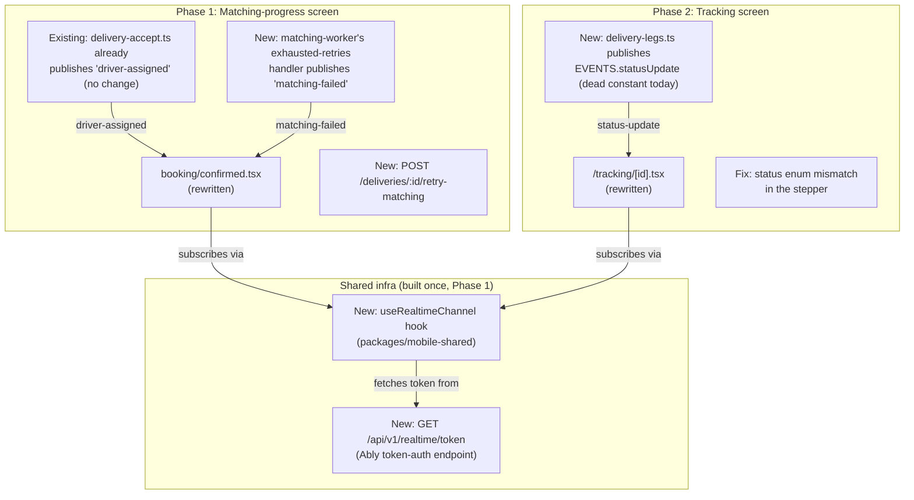

# Design Document: Realtime Delivery Tracking

## Overview

Two customer-facing screens get wired to real, live events instead of static content or polling: `booking/confirmed.tsx` becomes a live matching-progress experience ("Finding your driver…" → matched/redirect, or failed/retry), and `/tracking/[id].tsx` becomes genuinely realtime instead of 30-second polling. Both need the same underlying capability — the mobile app has no realtime/Ably wiring at all today, in either app — so that capability is built once and both phases consume it.

Phased because Phase 1 (the matching-progress screen) is materially smaller than it first looked: the "matched" transition reuses an event that **already exists and is already published** (`delivery-accept.ts`'s `'driver-assigned'` event), so the only new backend work for Phase 1 is one new publish call on failure and one new retry endpoint. Phase 2 (tracking-screen realtime + its status-enum fix) is independent, larger, and can ship separately once Phase 1's shared infra exists.

## Architecture

## Components

### Component 1: Ably Token-Auth Endpoint (new, `apps/api`)

`GET /api/v1/realtime/token?deliveryId=<id>` — mints a short-lived Ably token scoped to exactly `CHANNELS.deliveryTracking(deliveryId)` for that one delivery, after confirming the authenticated user owns it. Requested fresh per tracking session rather than a broad, long-lived capability — the mobile client never sees the raw Ably API key.

This is Ably-specific (token requests via `ably.auth.createTokenRequest(...)` with capability restrictions) and doesn't fit the existing `RealtimeProvider` abstraction (`packages/realtime/src/types.ts`), which only exposes `publish`/`subscribe`/`close` — deliberately provider-agnostic since a future Cloudflare DO implementation is noted as a possibility there. This endpoint talks to the Ably SDK directly rather than going through that abstraction, since client-side auth is inherently provider-specific regardless of which realtime backend is active. Worth a comment in the code noting this is the one place that breaks the abstraction, and why.

### Component 2: Client-side Realtime Hook (new, `packages/mobile-shared`)

A small reusable hook (e.g. `useRealtimeChannel(deliveryId, eventHandlers)`): fetches a token from Component 1, connects via the `ably` JS client, subscribes to the requested events on `CHANNELS.deliveryTracking(deliveryId)`, cleans up on unmount. Lives in the shared package so `mobile-driver` can reuse it later even though only `mobile-customer` consumes it in this spec. Given Nigerian mobile network conditions, reconnection/dropped-connection handling is not optional — the hook should re-subscribe on reconnect, and consumers (both screens) should treat a missed event as recoverable via a fallback fetch, not silently stale state.

### Component 3: `booking/confirmed.tsx` Rewrite (Phase 1)

Replaces the static success screen. State machine:

1. **Searching** (default on mount): "Finding your driver…" with one evolving animated hero illustration (radar/pulse style, per simplified scope — not per-tier text, not a distinct illustration per stage).
2. **Matched**: on receiving the *existing* `'driver-assigned'` event (no backend change needed for this transition), auto-redirect to `/tracking/:deliveryId`.
3. **Failed**: on receiving the *new* `'matching-failed'` event (Component 5), show a distinct end-state illustration + message + a "Try Again" button that calls Component 4.

Falls back to an initial REST fetch of the delivery's current state on mount (in case matching already resolved before the screen/subscription was ready — same race the existing tracking screen already has to handle), not purely event-driven from a blank slate.

### Component 4: Retry-Matching Endpoint (new, `apps/api`)

`POST /api/v1/deliveries/:id/retry-matching` — the in-app equivalent of the manual rescue script used repeatedly this session: verify the delivery belongs to the caller and is in a retryable state (`routing_failed`), reset its status to `pending`, remove any existing BullMQ job under the same deterministic `jobId` (a duplicate-id add is otherwise rejected), and enqueue a fresh `match-driver` job for its first leg. Reuses the same job-construction logic as `booking-payment.ts`'s initial trigger — worth factoring into a shared function during implementation rather than duplicating the `matchDriverJobDataSchema.parse(...)` block a third time.

### Component 5: Matching-Worker Failure Publish (new, `workers/matching-worker/src/index.ts`)

In the `matchingWorker.on('failed', ...)` handler's `isLastAttempt` branch (where it already sets `deliveries.status = 'routing_failed'` and sends a push), add one `realtime.publish(CHANNELS.deliveryTracking(deliveryId), 'matching-failed', { deliveryId })` call, using the same ad-hoc `createAblyProvider()` pattern already used elsewhere in this worker (`match-driver.ts`, `self-drop-fallback.ts`).

### Component 6: `/tracking/[id].tsx` Realtime Rewrite (Phase 2)

Replaces the 30-second `setInterval` poll with Component 2's hook, subscribing to `EVENTS.statusUpdate` on `CHANNELS.deliveryTracking(id)`. Initial REST fetch stays for first paint; pull-to-refresh stays as manual fallback; add a longer-interval poll (e.g. 60s) as a resilience safety net even while the realtime subscription is active, and re-sync on app foreground. Local state updates directly from the pushed event payload rather than re-fetching on every event (re-fetch only if the payload is insufficient to update state confidently).

### Component 7: `delivery-legs.ts` Status Publish (new, Phase 2)

After a successful leg status update (and after the delivery-level status advancement already implemented — see `.kiro/specs/actor-simulator/`), publish `EVENTS.statusUpdate` on `CHANNELS.deliveryTracking(deliveryId)` with the new leg status and, if it changed, the delivery's overall status. `EVENTS.statusUpdate` already exists as a constant in `packages/realtime/src/types.ts` — currently dead, never published or subscribed to anywhere in the codebase.

### Component 8: Status Enum Fix (Phase 2)

`/tracking/[id].tsx`'s local `Delivery['status']` type and `statusOrder`/`statusSteps` arrays currently use `pending/matched/picked_up/in_transit/delivered/cancelled`, which doesn't match the real backend `delivery_status` enum (`draft/pending/pending_routing/routing_failed/accepted/en_route_pickup/arrived_pickup/picked_up/en_route_dropoff/arrived_dropoff/delivered/cancelled/failed/returned`). Rework the stepper to the real values so it highlights correctly for actual delivery progress instead of silently mismatching (`indexOf` returning `-1`) for most real statuses.

## Illustration Assets

Per simplified scope: one animated "searching" hero illustration (stays on screen through the Searching state, text changes beneath it if at all) plus two static end-state illustrations (matched/success, failed). Smaller asset scope than a full per-stage illustration set — three assets total, not five. Sourcing/producing these follows the same constraints pattern as `.kiro/specs/custom-notification-sound/` (documented format/licensing requirements, blocks the relevant task, not something engineering produces unilaterally).

## Testing

- **Component 1 (token endpoint)**: test it requires auth, verifies delivery ownership, and returns a token scoped to the right channel.
- **Component 4 (retry endpoint)**: test it rejects non-owners and non-`routing_failed` deliveries, and enqueues correctly on the happy path — same mocking approach as `booking-payment-matching-trigger.test.ts` from this session.
- **Component 5 (failure publish)**: test the publish call happens in the exhausted-retries branch, mirroring how `delivery-legs-status.test.ts` verified a publish/update side effect this session.
- **Component 7 (leg status publish)**: same pattern.
- **Client-side (Components 2, 3, 6)**: manual verification — realtime UI over a websocket connection isn't practically unit-testable here, consistent with how push notifications were verified this session.

## Rollout

Pure JS/websocket work (`ably` client library, no native modules) — should ship without a new native build, unlike the FCM and custom-sound work. Confirm this holds once `ably`'s React Native compatibility is checked during implementation (worth an early spike given past sessions' pattern of "assumed working, wasn't" — see the location-store and reservation-layer init gaps found this session).
