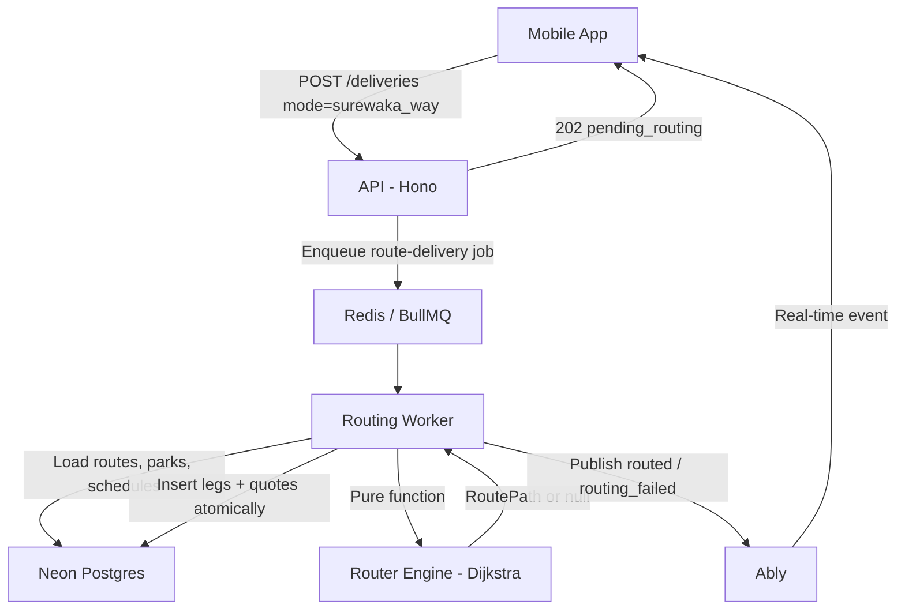

# Routing Worker — Design

## Overview

This design specifies the "SureWaka way" delivery mode — an asynchronous routing system that finds the cheapest intercity path across all active carrier routes. When a customer selects this mode, the system delegates carrier selection entirely to SureWaka: a BullMQ worker builds a weighted directed graph of carrier parks and routes, runs Dijkstra's algorithm to find the cheapest path (possibly multi-hop), and atomically creates delivery legs and quotes. The customer receives the result in real time via Ably.

Key capabilities:
- Carrier park and route catalogue with departure schedules
- Pure-function cheapest-path engine (multi-source Dijkstra with time propagation)
- Async BullMQ worker for route computation
- Real-time result delivery via Ably
- Cancellation policy enforcement with deadline-based fee structure
- Quote expiry and automatic re-routing

## Architecture



The system follows the existing worker pattern (`workers/payment-worker/`). The API is the entry point that validates the request and enqueues a job. The worker processes the job asynchronously, using a pure routing engine for path computation and the database for persistence. Results flow back to the client via Ably pub/sub on the `delivery:{deliveryId}` channel.

### City Slugs and Zones

The system has two geographic granularities:

| Level | Table | Purpose |
|---|---|---|
| City | `zones.city` (text) | Coarse — identifies which city a zone/park/delivery belongs to |
| Zone | `zones` (rows) | Fine — sub-city area (Lekki, Ikeja…) used for first/last mile dispatch, SLA, surcharges |

`zones.city` is the **authoritative city slug registry**. `carrier_parks.city` must use
the same values — seeded to match exactly. City slug normalisation for `surewaka_way`
deliveries follows the zone spec convention: `.trim().toLowerCase()` applied at the API
on delivery creation before storage.

First/last mile and transfer legs created by the routing worker must have
`pickup_zone_id` and `dropoff_zone_id` populated using the zone classifier. As a
prerequisite of this spec, the classifier is moved from `apps/api/src/lib/zone-classifier.ts`
to `packages/db/src/zone-classifier.ts` and exported from `packages/db` — so both the
API and the routing worker can import it without violating the no-cross-app-import rule.
The classifier takes coordinates + address text and returns `{ id, name } | null`.
If null, the zone FK is left null — same behaviour as the manual leg-creation path.

### Delivery Modes

Three explicit modes, now stored on the `deliveries` row:

| mode | legs at creation time | synchronous? |
|---|---|---|
| `on_demand` | 1 × `first_mile` | yes — returns 201 + quote |
| `carrier_direct` | N × explicit (first_mile + intercity + last_mile) | yes — returns 201 + quote |
| `surewaka_way` | none yet | no — returns 202 + `pending_routing` |

### Leg Types (full set after this spec)

| legType | actorType | description |
|---|---|---|
| `first_mile` | driver | customer address → origin park |
| `intercity` | carrier | origin park → destination park (carrier vehicle) |
| `transfer` | driver | intermediate park → next carrier's park within same city; trusted scheduled on-demand driver |
| `last_mile` | driver | destination park → recipient address |

`transfer` is a new type added by this spec. It appears only in multi-hop `surewaka_way` routes, between consecutive intercity legs. The routing engine inserts one `transfer` leg per intermediate city. Driver matching for `transfer` legs uses a "trusted" flag (matching system concern — out of scope here; placeholder NIL_UUID until matched).

Direct routes (1 intercity hop) are always preferred. Multi-hop paths are only selected when no direct route exists between the pickup and dropoff cities.

`deliveryMode` is a new text column on `deliveries` with a check constraint.
`delivery_mode` defaults to `NULL` for historical rows (backwards-compatible).

## Components and Interfaces

### Routing Engine (pure function)

Location: `workers/routing-worker/src/lib/router.ts`

Graph nodes are **park IDs** — not city slugs. This handles multiple parks per city
correctly: a carrier with Jibowu and Ojota parks in Lagos produces two distinct nodes;
Dijkstra evaluates paths through either.

```ts
type Park = {
  id: string;
  city: string;    // slug — for filtering sources/destinations
  name: string;
  address: string;
  lat: number;
  lng: number;
};

type DepartureSlot = {
  hour: number;         // WAT local time
  minute: number;
  daysOfWeek: number[]; // ISO weekday 1–7; empty = every day
};

type RouteEdge = {
  fromParkId: string;
  toParkId: string;
  carrierId: string;
  routeId: string;
  basePriceKobo: number;
  transitHours: number;        // drive time after departure
  schedule: DepartureSlot[];   // departure slots for this route
  originPark: Park;
  destPark: Park;
};

type ResolvedHop = RouteEdge & {
  nextDeparture: Date;         // next departure >= arrivalAtPark (after transfer if applicable)
  arrivalAtDest: Date;         // nextDeparture + transitHours
  transferMinutesBefore: number; // time needed to transfer from prev hop's destPark to this originPark (0 for first hop)
};

type RoutePath = {
  hops: ResolvedHop[];
  totalBasePriceKobo: number;
  estimatedDeliveryAt: Date;   // arrivalAtDest of last hop + last-mile ETA
};
```

#### `nextDeparture()` — pure helper

```ts
// Returns the next departure datetime on or after `notBefore` (WAT).
// daysOfWeek: ISO 1–7; empty = every day.
// Returns null if the schedule is empty.
function nextDeparture(
  slots: DepartureSlot[],
  notBefore: Date,
): Date | null
```

#### `findCheapestRoute()` — multi-source Dijkstra with time propagation

```ts
function findCheapestRoute(
  graph: Map<string, RouteEdge[]>,
  originParks: Park[],
  destParks: Park[],
  bookingTime: Date,        // when the delivery is booked (now)
  firstMileMinutes: number, // estimated time for on-demand driver to reach origin park
  lastMileMinutes: number,  // estimated time for on-demand driver from dest park to recipient
  maxHops: number,          // hard cap = 3
): RoutePath | null
```

Priority queue keyed on `totalBasePriceKobo`. **Direct routes (1 intercity hop) are always preferred** — a direct path is selected over any multi-hop path of equal or higher cost. Multi-hop is only evaluated when no direct route exists.

For each edge explored:
1. Compute transfer time from previous hop's `destPark` to this edge's `originPark` via haversine / 20 km/h (0 for the first hop)
2. `arrivalAtPark = prevArrivalAtDest + transferMinutes`
3. `nextDep = nextDeparture(edge.schedule, arrivalAtPark)` — if null, skip edge
4. `arrivalAtDest = nextDep + transitHours`
5. Propagate `arrivalAtDest` as input to next hop

Tie-break: fewer hops → earlier `estimatedDeliveryAt`.

No commission math inside the router. Pure function — no async, no DB.

All departure times are stored and computed in **WAT (UTC+1)**. Nigeria does not observe
daylight saving time so WAT = UTC+1 always. `nextDeparture()` converts `notBefore` to
WAT before comparing against slot `hour`/`minute`, then returns a UTC `Date`. Fixed
+1h offset — no DST logic needed.

### Routing Worker

New worker process: `workers/routing-worker/`

Structure mirrors `workers/payment-worker/`:

```
workers/routing-worker/
  src/
    index.ts            -- Worker instantiation, event listeners
    queue.ts            -- Queue export, job type definitions
    lib/
      router.ts         -- Pure Dijkstra engine
    jobs/
      route-delivery.ts -- Handles the route-delivery job
  package.json
  tsconfig.json
```

#### Job: `route-delivery`

```ts
type RouteDeliveryJobData = {
  deliveryId: string;
  pickupCity: string;
  dropoffCity: string;
  pickupAddress: string;  pickupLat: number;  pickupLng: number;
  dropoffAddress: string; dropoffLat: number; dropoffLng: number;
  packageWeight: number;
  vehicleType: VehicleType;    // for first/last mile legs
};
```

Execution steps inside `handleRouteDelivery`:

1. **Idempotency check**: load delivery status. If already `draft` or `routing_failed`, return immediately — job complete. Only proceed if `pending_routing`.
2. **Staleness check**: if `now - bookingTime > 2 hours`, the first departure the customer expected has passed due to a worker outage — auto-re-route: reset delivery → `pending_routing`, re-enqueue a fresh `route-delivery` job with `bookingTime = now`, send push notification "We're finding your route, this may take a moment", return (no throw — the new job handles success/failure). This is the same pattern as quote-expired re-route; `JOB_STALE` is a system failure, not a routing failure.
3. Load all active carrier routes (JOIN both parks + their active schedule slots) → `RouteEdge[]`
4. Load all active parks in `pickupCity` → `originParks[]`; all in `dropoffCity` → `destParks[]`
5. Load fee_settings + vehicle_type_rates
6. Estimate first-mile and last-mile minutes from haversine distances (customer→nearest park, nearest park→recipient) using a conservative avg speed (e.g. 20 km/h for Lagos traffic)
7. `findCheapestRoute(graph, originParks, destParks, bookingTime=now, firstMileMinutes, lastMileMinutes, maxHops=3)`
8. If null → update delivery status → `routing_failed`, publish Ably `routing_failed`, return (no throw)
9. Build leg plan from resolved hops. For a path with N intercity hops:
   - `first_mile` (driver, NIL_UUID): customer pickup → `hop[0].originPark`; `systemEtaAt = hop[0].nextDeparture`
   - `intercity` hop 0: `hop[0].originPark` → `hop[0].destPark`; `systemEtaAt = hop[0].arrivalAtDest`
   - If N > 1: for each i in 1..N-1:
     - `transfer` (driver, NIL_UUID): `hop[i-1].destPark` → `hop[i].originPark`; scheduled trusted on-demand driver; `systemEtaAt = hop[i].nextDeparture`
     - `intercity` hop i: `hop[i].originPark` → `hop[i].destPark`; `systemEtaAt = hop[i].arrivalAtDest`
   - `last_mile` (driver, NIL_UUID): `hop[last].destPark` → recipient; `systemEtaAt = path.estimatedDeliveryAt`
10. `db.transaction(tx => { insert delivery_legs; createAuthoritativeQuotesForDelivery(tx,...); update delivery status → draft + priceKobo + systemEtaAt = path.estimatedDeliveryAt })`
11. Publish Ably `routed` event — payload includes:
    - composite quote (price breakdown)
    - per-hop: carrier name, park names, next departure time, arrival at dest
    - `estimatedDeliveryAt` (ISO 8601)
12. Enqueue push notification job (`routing-complete` type) via push-worker — "Your route is ready, tap to confirm" — so customer is notified even if app is backgrounded
13. Return normally — BullMQ marks job completed

On `routing_failed` (any reason): after updating delivery status and publishing Ably event, also enqueue a push notification (`routing-failed` type) — "We couldn't find a route, tap to pick a carrier manually."

### API Changes

#### `POST /api/v1/deliveries` — mode: surewaka_way

New branch in the existing route handler:

```
if (mode === 'surewaka_way') {
  validate: pickup.city !== dropoff.city (else 422 SAME_CITY)
  validate: active park exists for pickup.city (else 422 NO_PARKS_IN_CITY)
  validate: active park exists for dropoff.city (else 422 NO_PARKS_IN_CITY)
  db.insert(deliveries, { status: 'pending_routing', deliveryMode: 'surewaka_way' })
  routingQueue.add('route-delivery', { deliveryId, ...coords, packageWeight, vehicleType, bookingTime: new Date().toISOString() })
  return 202 { data: { deliveryId, status: 'pending_routing' }, error: null, meta: null }
}
```

The queue client lives in `apps/api/src/lib/routing-queue.ts` (thin wrapper around BullMQ
Queue — same pattern as payment-worker's `paymentQueue` but imported into the API, not the
worker). Both API and worker share the same Redis connection string.

#### New admin endpoints

`POST   /api/v1/admin/carrier-routes`       — create route  
`PATCH  /api/v1/admin/carrier-routes/:id`   — update price / hours / active flag  
`GET    /api/v1/admin/carrier-routes`       — list (optional ?carrierId filter)  
`DELETE /api/v1/admin/carrier-routes/:id`   — soft-delete (sets is_active = false)

All gated by `requireRole('surewaka_admin')`.

#### Cancellation fee enforcement

The existing `POST /deliveries/:id/cancel` endpoint uses tiered refund rates by delivery
status. Two changes are needed for `surewaka_way` deliveries:

**1. `draft` removed from `NON_CANCELLABLE` for `surewaka_way` deliveries.**  
After routing completes the delivery moves to `draft` (route computed, not yet paid).
Currently `draft` is non-cancellable, but a customer must be able to walk away at this
point — no money has changed hands yet. Fix: check `deliveryMode` before throwing;
allow cancel on `draft` + `surewaka_way`, free cancel, 0 refund (nothing escrowed).

**2. `cancellationDeadlineAt` check inserted before the `REFUND_RATES` lookup for `pending` status.**

```
if delivery has cancellationDeadlineAt:
  if now < cancellationDeadlineAt:
    refundRate = 1.0  (full refund — within free-cancel window)
  else:
    // Late cancellation — fee = first intercity leg quote price
    load first active intercity leg quote → feeKobo
    refundAmount = max(0, amountPaid - feeKobo)
    write commission ledger event: feeKobo → platform (SureWaka keeps it; carrier settlement is a separate spec)
    write refund ledger event: refundAmount → customer wallet
    // skip the normal REFUND_RATES path
else:
  // on_demand or carrier_direct with no deadline — existing REFUND_RATES logic unchanged
```

`pending_routing` status is not in `NON_CANCELLABLE` and has no `REFUND_RATES` entry
(rate defaults to 0). Since no escrow exists at that point, `refundAmount = 0` and
cancel proceeds cleanly — the customer just aborts before payment.

#### Quote expiry and re-route

For routed deliveries, `quotes.expires_at` is set to `cancellationDeadlineAt`
(first intercity departure − 60 min) instead of the standard `now + 15 min`.
`createAuthoritativeQuotesForDelivery` accepts an optional `expiresAt` override for this.

If a customer attempts to confirm after the quote has expired (e.g. phone was off overnight):
1. `confirmAll` throws `QUOTE_EXPIRED`
2. The confirm endpoint catches it and, within a transaction:
   - Supersedes all existing leg quotes (`supersededAt = now`)
   - Soft-deactivates existing delivery legs (`isActive = false`) — preserves audit trail, consistent with the system's append-only pattern
   - Resets delivery status → `pending_routing`, clears `cancellationDeadlineAt` and `priceKobo`
3. Re-enqueues a `route-delivery` job with `bookingTime = now`
4. Returns 409 `QUOTE_EXPIRED` with `{ reroutingStarted: true }` so the mobile can navigate back to the routing-pending screen

#### New public endpoint

`GET /api/v1/carrier-routes?fromCity=&toCity=`  
Returns active routes for a city pair with their departure schedules.
No auth guard beyond `requireAuth`.

Response per route:
```ts
{
  routeId: string;
  carrierId: string;
  carrierName: string;
  originPark:  { id, name, address, lat, lng };
  destPark:    { id, name, address, lat, lng };
  basePriceKobo: number;
  estimatedTransitHours: number;
  schedule: Array<{ hour: number; minute: number; daysOfWeek: number[] }>;
  nextDepartureAt: string | null;   // ISO 8601, server-computed from schedule + now
}
```

`nextDepartureAt` is computed server-side at request time so the mobile app can display
"Next departure: today at 2:00 PM" without shipping schedule-parsing logic to the client.

### Ably Channel

Channel: `delivery:{deliveryId}` (already established for live tracking).

New events on that channel:

```ts
// routing succeeded
{ event: 'routed', data: {
    legs: Array<{ legType, legLabel, lineItems, totalKobo }>,
    compositeTotalKobo: number,
    expiresAt: string,   // ISO 8601, 15 min from now
  }
}

// routing failed
{ event: 'routing_failed', data: { reason: 'NO_ROUTE_FOUND' } }
```

Publisher: routing worker via `@surewaka/realtime`. No new Ably dependency.

### Mobile App

#### Carrier selection screen (`carriers.tsx`)

- Current: calls `POST /api/v1/booking/quote` per carrier with hardcoded/speculative data
- After this spec: calls `GET /api/v1/carrier-routes?fromCity=&toCity=` first, then
  `POST /api/v1/booking/quote` per returned route to get the full line-item breakdown
- Shows per carrier: price, origin park name, destination park name, next departure time,
  estimated arrival ("delivers by ~Wed 6PM")

#### New screen: `booking/routing-pending.tsx`

Shown when `POST /deliveries` returns 202.

```
[ Connecting to routes... ]    (spinner)
SureWaka is finding the best path for your delivery.
This usually takes a few seconds.

[    Cancel    ]
```

Subscribes to Ably `delivery:{deliveryId}` channel immediately.

On `routed` event: navigate to `booking/confirm` with quote data.  
On `routing_failed` event: show error modal with "Choose a carrier manually" CTA →
navigate to `booking/carriers`.

---

## Data Models

### New table: `carrier_parks`

Nigerian intercity carriers operate from fixed parks / terminals — not door-to-door.
Every carrier route is park-to-park. Parks carry the real coordinates used to compute
first/last-mile distances.

A city may have more than one park for the same carrier (e.g. GIG operates from both
Jibowu and Ojota in Lagos). The unique constraint is therefore on `(carrier_id, name)`,
not `(carrier_id, city)`. `city` is a label for grouping and graph lookup only.

```
carrier_parks
  id          uuid PK
  carrier_id  uuid FK → carriers.id (cascade delete)
  city        text NOT NULL     -- slug: "lagos", "abuja", "port_harcourt"
  name        text NOT NULL     -- e.g. "GIG Lagos Terminal, Jibowu"
  address     text NOT NULL
  lat         real NOT NULL
  lng         real NOT NULL
  is_active   boolean NOT NULL DEFAULT true
  created_at  timestamptz NOT NULL DEFAULT now()
  updated_at  timestamptz NOT NULL DEFAULT now()

  UNIQUE (carrier_id, name)
  INDEX on (carrier_id)
  INDEX on (city) WHERE is_active = true
```

### New table: `carrier_route_schedules`

Each departure slot for a route is a separate row. A route can have multiple slots
(e.g. 6AM and 2PM daily; 6AM Mon–Fri only). Storing as rows rather than JSONB makes
it easy to query the next departure across multiple routes in a single SQL call.

```
carrier_route_schedules
  id               uuid PK
  carrier_route_id uuid FK → carrier_routes.id (cascade delete)
  hour             smallint NOT NULL    -- 0–23 (local Nigerian time, WAT = UTC+1)
  minute           smallint NOT NULL DEFAULT 0
  days_of_week     smallint[] NOT NULL  -- ISO weekday: 1=Mon … 7=Sun
                                        -- empty array [] = runs every day
  is_active        boolean NOT NULL DEFAULT true
  created_at       timestamptz NOT NULL DEFAULT now()

  INDEX on (carrier_route_id) WHERE is_active = true
  CHECK hour BETWEEN 0 AND 23
  CHECK minute BETWEEN 0 AND 59
```

`days_of_week = []` means the slot runs every day of the week. A slot with
`days_of_week = [1,2,3,4,5]` runs Mon–Fri only. This is the "opt-in restriction"
semantic — the default (empty) is the permissive case.

### New table: `carrier_routes`

Routes reference parks, not raw city text. The city slug for graph nodes is derived
from the park row (`park.city`).

```
carrier_routes
  id                    uuid PK
  carrier_id            uuid FK → carriers.id (cascade delete)
  origin_park_id        uuid FK → carrier_parks.id (restrict)
  destination_park_id   uuid FK → carrier_parks.id (restrict)
  base_price_kobo       integer NOT NULL       -- carrier's raw rate, no commission
  estimated_transit_hrs real NOT NULL          -- drive/travel time after departure
  max_weight_kg         real                   -- NULL = no limit
  is_active             boolean NOT NULL DEFAULT true
  created_at            timestamptz NOT NULL DEFAULT now()
  updated_at            timestamptz NOT NULL DEFAULT now()

  UNIQUE (carrier_id, origin_park_id, destination_park_id)
  CHECK: origin_park_id ≠ destination_park_id
  INDEX on (origin_park_id, destination_park_id) WHERE is_active = true
```

`carrier_route_schedules` is a child of `carrier_routes` — each route owns its departure
slots. A route with no active schedule rows is treated as "schedule not yet configured"
and is excluded from routing until slots are added.

`carriers.base_price` (the existing global field) is superseded by route-specific pricing.
The routing engine will not use it.

### New enum values

Add to `deliveryStatus`:
- `pending_routing` — delivery created, route not yet computed
- `routing_failed` — no feasible route found or unrecoverable routing error

Add new columns on `deliveries`:
- `delivery_mode` text check (`on_demand | carrier_direct | surewaka_way`), nullable — backwards-compatible
- `cancellation_deadline_at` timestamptz, nullable — set by routing worker to `firstIntercityDeparture - 60 min`; enforced by the cancel endpoint; null for `on_demand` deliveries (no scheduled departure)

---

## Correctness Properties

*A property is a characteristic or behavior that should hold true across all valid executions of a system — essentially, a formal statement about what the system should do. Properties serve as the bridge between human-readable specifications and machine-verifiable correctness guarantees.*

### Property 1: Direct route preference

*For any* route graph where a direct route (single intercity hop) exists between the pickup and dropoff cities, `findCheapestRoute` SHALL return that direct route over any multi-hop path of equal or higher cost.

**Validates: Requirements 3.1**

### Property 2: Maximum hop count invariant

*For any* input graph and city pair, the `RoutePath` returned by `findCheapestRoute` SHALL contain at most 3 intercity hops (i.e., `path.hops.length <= 3`). If no path within this limit exists, the function returns null.

**Validates: Requirements 3.2**

### Property 3: Time propagation correctness

*For any* computed `RoutePath` with multiple hops, for each hop `i > 0`: `hop[i].nextDeparture >= hop[i-1].arrivalAtDest + transferMinutesBefore[i]`. That is, the next departure is always on or after the arrival at the origin park (including transfer time from the previous hop's destination park).

**Validates: Requirements 3.3, 3.4, 3.6**

### Property 4: Leg plan structure invariant

*For any* computed route with N intercity hops, the generated leg plan SHALL be exactly: 1 `first_mile` leg + N `intercity` legs + (N-1) `transfer` legs + 1 `last_mile` leg, with the first leg being `first_mile`, the last leg being `last_mile`, and transfer legs interleaved between consecutive intercity legs.

**Validates: Requirements 3.5, 3.8**

### Property 5: Schedule-less routes excluded from graph

*For any* route graph, routes with zero active departure slots SHALL never appear in any computed path. That is, for any `ResolvedHop` in the output, `hop.schedule.length > 0`.

**Validates: Requirements 2.4, 2.5**

### Property 6: WAT timezone correctness

*For any* `DepartureSlot` and `notBefore` Date, `nextDeparture()` SHALL return a Date whose WAT-local hour and minute match a slot in the schedule, and whose WAT-local weekday is either in the slot's `daysOfWeek` array or `daysOfWeek` is empty.

**Validates: Requirements 2.6**

### Property 7: Tie-breaking order

*For any* route graph with multiple paths of equal total cost between the same origin and destination, `findCheapestRoute` SHALL prefer the path with fewer hops; among paths with equal hops and cost, it SHALL prefer the path with the earliest `estimatedDeliveryAt`.

**Validates: Requirements 3.7**

### Property 8: Late cancellation fee equals first intercity leg quote

*For any* `surewaka_way` delivery cancelled after `cancellationDeadlineAt`, the cancellation fee SHALL equal the `totalKobo` of the first active intercity leg's quote, and the refund SHALL equal `max(0, amountPaid - feeKobo)`.

**Validates: Requirements 5.5**

---

## Error Handling

| Error | Source | Handling |
|---|---|---|
| `NoRouteFoundError` (no feasible path within hop limit) | Router engine returns `null` | Clean resolution: update delivery status → `routing_failed`, publish Ably event, enqueue push notification. **No BullMQ retry** — the result is deterministic. |
| Infrastructure error (DB down, Redis unavailable) | Worker job execution | BullMQ retry up to 3× with exponential backoff, then dead-letter queue. |
| `SAME_CITY` (pickup_city === dropoff_city for surewaka_way) | API validation | 422 response — rejected synchronously before job enqueue. |
| `NO_PARKS_IN_CITY` (no active park in pickup or dropoff city) | API validation | 422 response — rejected synchronously before job enqueue. |
| `QUOTE_EXPIRED` (customer confirms after quote expiry) | Confirm endpoint | 409 response with `{ reroutingStarted: true }`. Legs/quotes superseded, delivery re-enters `pending_routing`, new job enqueued. |
| `JOB_STALE` (bookingTime > 2 hours old) | Worker staleness check | Auto-re-route: re-enqueue fresh job with `bookingTime = now`, send push notification. Not a routing failure — it's a system recovery. |

**Idempotency**: The worker checks delivery status on entry. If already `draft` or `routing_failed`, the job returns immediately without side effects — safe for BullMQ's at-least-once delivery.

**Dead-letter queue**: Jobs that exhaust all retries land in a DLQ for manual investigation. Alerts should fire on DLQ depth > 0 (ops concern — monitoring spec separate).

---

## Testing Strategy

### Property-Based Tests (Vitest + fast-check)

The routing engine (`router.ts`) is a pure function with no I/O — ideal for property-based testing. Each property test runs a minimum of 100 iterations with randomly generated route graphs.

| Property | Test | Generator |
|---|---|---|
| 1: Direct route preference | Generate graphs with both direct and multi-hop paths; assert direct is always chosen when cost ≤ multi-hop | Random parks, random edges with controlled costs |
| 2: Max hop count | Generate deep graphs (5+ cities); assert output never exceeds 3 hops | Random graphs with varying depth |
| 3: Time propagation | Generate multi-hop paths; assert temporal ordering invariant holds | Random schedules, random arrival times |
| 4: Leg plan structure | Generate N-hop results; assert leg sequence matches formula | Random hop counts 1–3 |
| 5: Schedule-less exclusion | Generate graphs with some schedule-less routes; assert they never appear in output | Mix of routes with/without slots |
| 6: WAT correctness | Generate random dates and slots; assert output matches WAT rules | Random hours, minutes, daysOfWeek, dates |
| 7: Tie-breaking | Generate equal-cost paths with different hop counts and ETAs; assert ordering | Controlled cost graphs |
| 8: Cancellation fee | Generate random quote amounts and cancellation scenarios; assert fee = first intercity leg quote | Random kobo amounts |

Tag format: `Feature: routing-worker, Property {N}: {title}`

### Unit Tests (Vitest)

- `nextDeparture()`: specific examples — empty slots returns null, single daily slot, weekday-restricted slot, slot just passed (wraps to next day), slot on restricted weekday (wraps to next valid day)
- `findCheapestRoute()`: concrete graph scenarios — single direct route, two carriers same city pair (picks cheaper), no route exists (returns null), max hops boundary
- `handleRouteDelivery`: idempotency (already-draft returns early), staleness check triggers re-enqueue
- API validation: same-city rejection, no-parks rejection, successful 202 response shape
- Cancellation: free cancel on `draft` + surewaka_way, free cancel before deadline, fee after deadline, unaffected `on_demand` cancel

### Integration Tests

- Full job execution: enqueue → worker processes → legs + quotes created → Ably event published
- Quote expiry re-route flow: confirm after expiry → 409 → re-routing triggered
- Admin CRUD: create/update/list/soft-delete carrier routes with auth checks

---

## What this spec does NOT cover

- Admin UI for carrier route / park management (admin panel — separate spec)
- CSV bulk import of carrier parks / routes
- Multi-currency pricing (₦ only for now)
- Driver matching for first/last mile legs (unrelated to routing)
- SLA enforcement and penalties per intercity leg
- First/last mile cost factored into route selection (engine currently optimises intercity cost only; first/last mile is additive after the intercity path is chosen)
