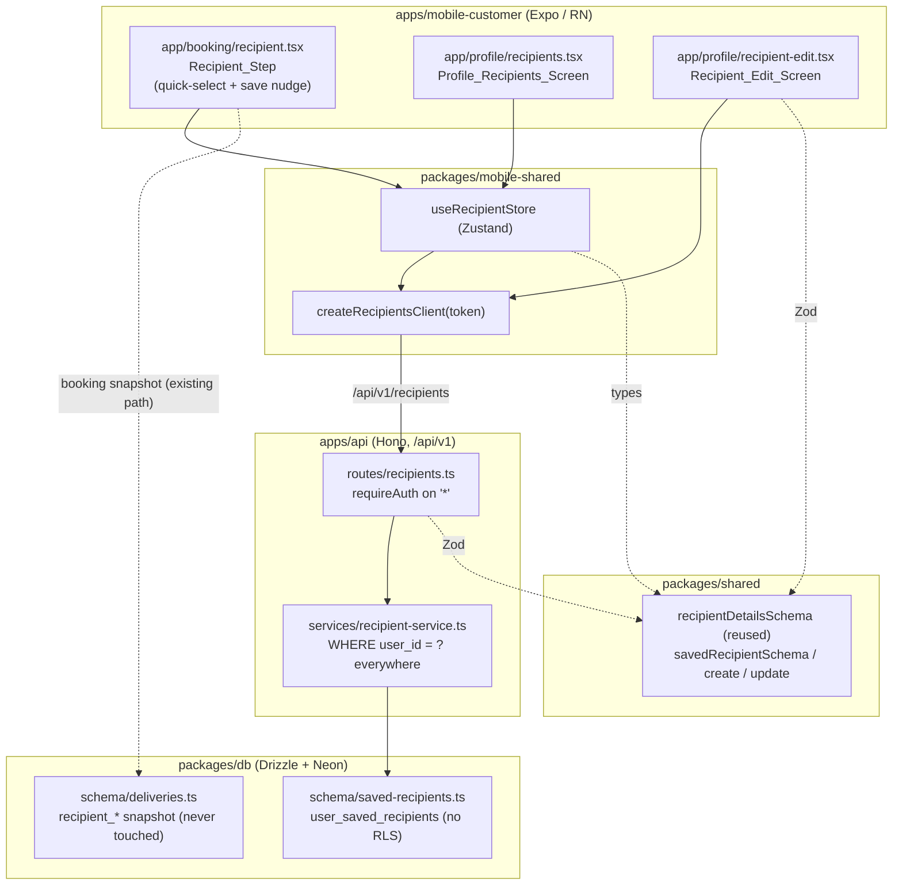

# Design Document

## Overview

The Saved Recipients Contact Book gives senders in `apps/mobile-customer` a reusable, owner-scoped address-book of delivery recipients. It extends the shipped `booking-recipient-contact` feature (which snapshots recipient name/phone/notes onto the `deliveries` row at booking time) by letting a sender **save** a recipient and **quick-select** it on future bookings, exactly mirroring how `mobile-address-lookup` made pickup/dropoff places reusable.

The contact book is a **convenience source** for pre-filling the existing Recipient booking step. It is **not** the system of record for a delivery: the delivery record continues to snapshot recipient details at booking time, and later edits or deletions of a Saved_Recipient never alter historical deliveries (Requirements 6.2, 6.3).

This design follows the `mobile-address-lookup` architecture template exactly, adapted for recipients. It is **additive** — no new packages are introduced. The layers, from bottom to top:

1. **DB** — a new owner-scoped table `user_saved_recipients` (`packages/db/src/schema/saved-recipients.ts`), no RLS.
2. **Shared validators** — reuse `recipientDetailsSchema` / `RecipientDetails`; add `savedRecipientSchema` / `createSavedRecipientSchema` / `updateSavedRecipientSchema` (`packages/shared`).
3. **API service** — `recipient-service.ts` mirroring `address-service.ts`, with an explicit `WHERE user_id = ?` on every query including the count.
4. **API routes** — `recipients.ts` mounted at `/api/v1/recipients` behind `requireAuth`, mirroring `addresses.ts`.
5. **mobile-shared** — `createRecipientsClient(token)` and `useRecipientStore`, mirroring `createAddressesClient` and `useAddressStore`.
6. **RN screens** — extend `app/booking/recipient.tsx` (quick-select chips + save nudge); add `app/profile/recipients.tsx` and `app/profile/recipient-edit.tsx` mirroring the address equivalents.

### Requirements coverage map

| Requirement | Where it is satisfied |
|---|---|
| Rel. 1–8 (boundaries) | Architecture: reuse `recipientDetailsSchema`, snapshot preserved, one-file-per-table, `/api/v1/recipients` behind `requireAuth`, additive UI |
| R1 Save from booking step | `recipient.tsx` Save_Nudge + `createRecipientsClient.create` |
| R2 Quick-select | `recipient.tsx` chip row + `useRecipientStore.fetch` |
| R3 Profile manage | `recipients.tsx` + `recipient-edit.tsx` + store |
| R4 Owner scoping / auth | `recipients.ts` (`requireAuth`) + `recipient-service.ts` (`WHERE user_id = ?`) |
| R5 Cap of 25 | `recipient-service.ts` `RECIPIENT_CAP` + `recipients.tsx` footer |
| R6 History untouched | Service never touches `deliveries`; booking snapshot unchanged |
| R7 Validation reuse | `recipientDetailsSchema` in route + edit screen; `label` max 50 |
| R8 Async/resilience | Loading/empty/error+retry states + Sentry tagging |

### Known deviation to standardize (address PATCH/PUT inconsistency)

The shipped `addresses` route registers **PUT** `/:id`, but `app/profile/address-edit.tsx` calls `apiClient.patch('/api/v1/addresses/:id', ...)` for updates. This mismatch works today only because the address update path is rarely exercised end-to-end; it is a latent bug. **For recipients we standardize on `PUT` in both the route and the client** (`recipient-edit.tsx` and `createRecipientsClient.update` both use `PUT`). This is called out here so the inconsistency is not copied forward.

## Architecture



**Data flow (create from booking step, R1):** Recipient_Step form is valid → Save_Nudge visible (unless at cap) → user taps → `createRecipientsClient.create({ recipientName, recipientPhone, deliveryNotes, label })` → `POST /api/v1/recipients` → `requireAuth` resolves `user.id` → route `.safeParse` with `createSavedRecipientSchema` → `recipient-service.createRecipient(userId, input)` runs count check (`WHERE user_id`), inserts with `user_id` from session → returns `SavedRecipient` → UI shows "Saved ✓" and booking continues uninterrupted.

**Authorization model:** No RLS. Every read/write/count/existence check is constrained by `WHERE user_id = <session user>` in the service layer (Requirement 4.3). `user_id` on create is always taken from the authenticated session, never the request body (Requirement 4.5). A recipient owned by another user is invisible → `NOT_FOUND` → HTTP 404 (Requirement 4.4).

**Snapshot independence:** The recipient service touches only `user_saved_recipients`. It never reads or writes `deliveries`. The booking flow's existing snapshot write in the delivery-creation path is unchanged, so editing/deleting a Saved_Recipient can never mutate a historical Delivery_Snapshot (Requirements 6.2, 6.3).

## Components and Interfaces

### 1. Database — `packages/db/src/schema/saved-recipients.ts`

New file, one table per file (Relationship boundary 8). Mirrors `userSavedAddresses` in `schema/addresses.ts`, with two intentional differences: `label` is **nullable** (recipient label is optional per Rel. 3 and R7.5) and there is an `updated_at` column (addresses lacked one; recipients need it for R3.4 updates). Exported via `schema/index.ts`.

```ts
import { pgTable, uuid, text, timestamp, foreignKey } from 'drizzle-orm/pg-core';
import { users } from './users';

export const userSavedRecipients = pgTable(
  'user_saved_recipients',
  {
    id: uuid().defaultRandom().primaryKey().notNull(),
    userId: uuid('user_id').notNull(),
    label: text(),                                   // nullable — optional
    recipientName: text('recipient_name').notNull(),
    recipientPhone: text('recipient_phone').notNull(),
    deliveryNotes: text('delivery_notes'),           // nullable
    createdAt: timestamp('created_at', { withTimezone: true }).defaultNow().notNull(),
    updatedAt: timestamp('updated_at', { withTimezone: true }).defaultNow().notNull(),
  },
  (table) => [
    foreignKey({
      columns: [table.userId],
      foreignColumns: [users.id],
      name: 'user_saved_recipients_user_id_fkey',
    }).onDelete('cascade'),
  ],
);
```

Add to `packages/db/src/schema/index.ts` under "User features": `export * from './saved-recipients';`

**Migration workflow:** `pnpm --filter @surewaka/db db:generate` then `pnpm --filter @surewaka/db db:migrate`.

### 2. Shared validators — `packages/shared`

**Reuse** `recipientDetailsSchema` and `RecipientDetails` (already in `validators.ts`, exported from the package index) for name/phone/notes validation (Relationship boundary 2, Requirements 7.1, 7.6). Do **not** redefine recipient validation.

**Add** new saved-recipient validators mirroring the saved-address validators' structure. A `SavedRecipient` = `RecipientDetails` + `id` (uuid) + optional `label` (≤50) + `created_at`.

```ts
// mirrors savedAddressSchema; composes the reused recipientDetailsSchema
export const savedRecipientSchema = recipientDetailsSchema.extend({
  id:         z.string().uuid(),
  label:      z.string().max(50).optional(),
  created_at: z.string(),
});

export const createSavedRecipientSchema = savedRecipientSchema.omit({ id: true, created_at: true });
export const updateSavedRecipientSchema = createSavedRecipientSchema.partial();

export type SavedRecipient = z.infer<typeof savedRecipientSchema>;
export type CreateSavedRecipient = z.infer<typeof createSavedRecipientSchema>;
export type UpdateSavedRecipient = z.infer<typeof updateSavedRecipientSchema>;
```

Because `savedRecipientSchema` extends `recipientDetailsSchema`, `createSavedRecipientSchema` and `updateSavedRecipientSchema` inherit the exact name (2–100), phone (`^(\+234|0)[789][01]\d{8}$`), and notes (≤200) rules — satisfying Requirements 7.2, 7.3, 7.4, and 7.7 (no carrier-specific digit validation) for free. `label` is validated as an optional string ≤50 (Requirement 7.5). Export all three schemas and three types from the package index.

### 3. API service — `apps/api/src/services/recipient-service.ts`

Mirrors `address-service.ts` **exactly** in structure. `ServiceResult<T> = { data: T | null; error: { code; message } | null; meta: null }`. Every query — including the count — carries an explicit `WHERE user_id = ?` (Requirement 4.3).

```ts
import { db, userSavedRecipients } from '@surewaka/db';
import { eq, and, asc, count } from 'drizzle-orm';
import type { CreateSavedRecipient, UpdateSavedRecipient, SavedRecipient } from '@surewaka/shared';
import { logger } from '../lib/logger';

const RECIPIENT_CAP = 25;

type ServiceResult<T> = { data: T | null; error: { code: string; message: string } | null; meta: null };

function toSavedRecipient(row: typeof userSavedRecipients.$inferSelect): SavedRecipient { /* map columns → SavedRecipient */ }

export async function listRecipients(userId: string): Promise<ServiceResult<SavedRecipient[]>>;   // WHERE user_id, ORDER BY createdAt asc
export async function getRecipient(userId: string, id: string): Promise<ServiceResult<SavedRecipient>>;   // WHERE id AND user_id → NOT_FOUND
export async function createRecipient(userId: string, input: CreateSavedRecipient): Promise<ServiceResult<SavedRecipient>>;   // count WHERE user_id ≥ cap → LIMIT_REACHED, else insert + returning
export async function updateRecipient(userId: string, id: string, input: UpdateSavedRecipient): Promise<ServiceResult<SavedRecipient>>;   // partial set + updatedAt, WHERE id AND user_id → NOT_FOUND
export async function deleteRecipient(userId: string, id: string): Promise<ServiceResult<null>>;   // WHERE id AND user_id → NOT_FOUND
```

Behavior detail per function:

- **`toSavedRecipient(row)`** — maps `recipientName`/`recipientPhone`/`deliveryNotes`/`label`/`id` and `created_at: row.createdAt?.toISOString() ?? new Date().toISOString()`. `label`/`deliveryNotes` mapped to `undefined` when null (to satisfy the optional Zod shape).
- **`listRecipients`** — `.where(eq(userSavedRecipients.userId, userId)).orderBy(asc(userSavedRecipients.createdAt))`.
- **`getRecipient`** — `.where(and(eq(id), eq(userId))).limit(1)`; returns `NOT_FOUND` when no row (covers R4.4 cross-owner access → 404).
- **`createRecipient`** — count query `select({ total: count() }).where(eq(userId))`; if `total >= RECIPIENT_CAP` return `LIMIT_REACHED` and **do not insert** (Requirements 5.2, 5.3, 5.5 — applies to any create, including bulk/import, because the cap gate precedes every insert); else insert with `userId` from the parameter (session), never from the body (Requirement 4.5).
- **`updateRecipient`** — builds a partial `updates` object (only defined fields), always sets `updatedAt: new Date()`, `.where(and(eq(id), eq(userId)))`; `NOT_FOUND` when no row.
- **`deleteRecipient`** — `.delete().where(and(eq(id), eq(userId))).returning()`; `NOT_FOUND` when no row.

**Validation-failure logging (Requirement 7.2):** Zod validation happens in the route (see below). When a create/update fails validation the route returns HTTP 400 and emits a structured log line for monitoring/analytics — `logger.warn({ event: 'recipient_validation_failed', userId, field, code })` — in addition to the API's automatic ≥400 error-log capture (`logs/api/error/YYYY-MM-DD.log`). No PII (no phone/name values) is logged, only the offending field name and issue code.

### 4. API routes — `apps/api/src/routes/recipients.ts`

Mirrors `addresses.ts`. A Hono sub-app with `requireAuth` on `'*'`, `{ data, error, meta }` responses, mounted at `/api/v1/recipients` in `apps/api/src/index.ts` (`app.route('/api/v1/recipients', recipientRoutes)`). There is **no** `/recent` sub-route (address-only), so the `/:id` ordering caveat does not apply.

| Method | Path | Body schema | Success | Error mapping |
|---|---|---|---|---|
| GET | `/` | — | 200 `SavedRecipient[]` | 500 INTERNAL_ERROR |
| GET | `/:id` | — | 200 `SavedRecipient` | 404 NOT_FOUND, 500 |
| POST | `/` | `createSavedRecipientSchema` | 201 `SavedRecipient` | 400 VALIDATION_ERROR, 400 LIMIT_REACHED, 500 |
| PUT | `/:id` | `updateSavedRecipientSchema` | 200 `SavedRecipient` | 400 VALIDATION_ERROR, 404 NOT_FOUND, 500 |
| DELETE | `/:id` | — | 200 `{ data: null }` | 404 NOT_FOUND, 500 |

- `requireAuth` rejects missing/invalid sessions with HTTP 401 and returns no data (Requirements 4.1, 4.2).
- POST/PUT `.safeParse` failures → `400 { code: 'VALIDATION_ERROR' }` and the service is never called, so nothing is persisted (Requirements 7.2–7.5). On failure the route also logs the structured validation-failure event.
- Service `LIMIT_REACHED` → **400**; `NOT_FOUND` → **404** (mirrors the address route's status mapping).
- The user id passed to the service is always `c.get('user').id` from `requireAuth` (Requirement 4.5).

### 5. mobile-shared — client + store

**`packages/mobile-shared/src/api/recipients.ts`** — mirrors `createAddressesClient`:

```ts
export function createRecipientsClient(token: string) {
  const client = createAuthClient(token);
  return {
    list:   ()                                   => client.get<SavedRecipient[]>('/api/v1/recipients'),
    get:    (id: string)                         => client.get<SavedRecipient>(`/api/v1/recipients/${id}`),
    create: (body: CreateSavedRecipient)         => client.post<SavedRecipient>('/api/v1/recipients', body),
    update: (id: string, body: UpdateSavedRecipient) => client.put<SavedRecipient>(`/api/v1/recipients/${id}`, body), // PUT — standardized
    remove: (id: string)                         => client.delete<void>(`/api/v1/recipients/${id}`),
  };
}
```

Exported from `packages/mobile-shared/src/index.ts` alongside `createAddressesClient`.

**`packages/mobile-shared/src/store/recipient-store.ts`** — mirrors `useAddressStore`:

```ts
type RecipientState = {
  recipients: SavedRecipient[];
  fetched: boolean;
  fetch: (token: string) => Promise<{ error: unknown }>;   // GET /api/v1/recipients
  add: (recipient: SavedRecipient) => void;
  update: (id: string, patch: Partial<SavedRecipient>) => void;
  remove: (id: string) => void;
};
export const useRecipientStore = create<RecipientState>(/* identical shape to useAddressStore */);
```

`fetch` calls `apiClient.get<SavedRecipient[]>('/api/v1/recipients', token)` and sets `{ recipients, fetched: true }` only on success (leaves state intact on error so the caller can show retry). Exported from the package index.

### 6. RN screens — `apps/mobile-customer/app`

**`app/booking/recipient.tsx` (extend, preserve existing submit/navigation).** Keep the existing react-hook-form + `zodResolver(recipientDetailsSchema)`, `useBookingStore` `recipientDetails`/`setRecipientDetails`, and `onSubmit → setStep(4) → push('/booking/carriers')` behavior verbatim. Add:

- **On mount:** load saved recipients via `useRecipientStore.fetch(token)` (or `createRecipientsClient.list`). While loading, render a small loading indicator **in place of** the chip row (Requirement 8.4). On failure, render an inline error affordance with a Retry action and **do not** block manual entry (Requirements 2.6, 8.5); report to Sentry when the retry affordance is presented.
- **Quick-select chip row (above the form):** one `Quick_Select_Chip` per saved recipient (Requirement 2.1); render nothing when there are zero recipients (Requirement 2.2). Tapping a chip pre-fills `recipientName`/`recipientPhone`/`deliveryNotes` via react-hook-form `reset()`/`setValue` (Requirement 2.3), leaves fields editable (2.4), and does **not** create a delivery or advance a step (2.5).
- **Save_Nudge (inline, below the form):** visible only WHILE the current form values pass `recipientDetailsSchema` **and** the saved-recipient count `< RECIPIENT_CAP` (Requirements 1.1, 1.3); hidden when invalid (1.2) or at cap (1.3). Watch form validity via RHF `formState.isValid` / `watch`. Activating it POSTs via `createRecipientsClient.create({ recipientName, recipientPhone, deliveryNotes, label })` (1.4), then on success shows a brief "Saved ✓" confirmation and lets the flow continue uninterrupted while updating `useRecipientStore.add` (1.5). On failure it shows a visible message, lets the flow continue, and reports to Sentry (1.6).

**`app/profile/recipients.tsx` (new, mirrors `app/profile/addresses.tsx`).** Reads `useRecipientStore`. States: skeleton loader matching the list shape while loading (Requirement 8.1); empty state prompting "add a recipient" when zero (Requirement 8.2); error message + Retry that re-requests (Requirement 8.3). `FlatList` renders each row showing **label, or recipient name when no label**, plus recipient phone (Requirement 3.2). Row delete uses an `Alert` confirmation before calling `createRecipientsClient.remove` (Requirement 3.5); on success removes from list via store (3.6); on failure keeps the row, shows a message, reports to Sentry (3.7). `ListFooter` shows "+ Add New Recipient" (→ `push('/profile/recipient-edit')`) unless count ≥ 25, in which case it hides the add action and shows "You've reached the maximum of 25 saved recipients" (Requirement 5.4). Tapping a row → `push('/profile/recipient-edit?id=<id>')`.

**`app/profile/recipient-edit.tsx` (new, mirrors `app/profile/address-edit.tsx`).** Reads optional `id` via `useLocalSearchParams`. In edit mode fetches the existing recipient via `createRecipientsClient.get(id)` and pre-populates recipientName, recipientPhone, deliveryNotes, and label (Requirement 3.3), gracefully falling back to empty strings for null fields. Label uses preset chips `Home / Office / Work / Other` + a custom field (mirrors address-edit's `PRESET_LABELS`), and label is optional. Validates form input against `recipientDetailsSchema` before submission (Requirement 7.6). Saves via `createRecipientsClient.create` (new) or `createRecipientsClient.update` (edit, **PUT**) (Requirement 3.4), updates `useRecipientStore` (`add`/`update`) on success, then `router.back()`. On failure shows a visible message and reports to Sentry.

## Data Models

### SQL (generated by Drizzle for `user_saved_recipients`)

```sql
CREATE TABLE "user_saved_recipients" (
  "id"             uuid PRIMARY KEY DEFAULT gen_random_uuid() NOT NULL,
  "user_id"        uuid NOT NULL,
  "label"          text,
  "recipient_name" text NOT NULL,
  "recipient_phone" text NOT NULL,
  "delivery_notes" text,
  "created_at"     timestamptz DEFAULT now() NOT NULL,
  "updated_at"     timestamptz DEFAULT now() NOT NULL,
  CONSTRAINT "user_saved_recipients_user_id_fkey"
    FOREIGN KEY ("user_id") REFERENCES "users"("id") ON DELETE CASCADE
);
```

No RLS — authorization lives in the API layer (Relationship boundary 8, Requirement 4.3).

### Zod schemas / types (`@surewaka/shared`)

| Symbol | Definition | Notes |
|---|---|---|
| `recipientDetailsSchema` | **existing, reused** | `recipientName` 2–100, `recipientPhone` `^(\+234\|0)[789][01]\d{8}$`, `deliveryNotes` ≤200 optional |
| `savedRecipientSchema` | `recipientDetailsSchema.extend({ id: uuid, label: string.max(50).optional(), created_at: string })` | wire shape returned by API |
| `createSavedRecipientSchema` | `savedRecipientSchema.omit({ id, created_at })` | POST body |
| `updateSavedRecipientSchema` | `createSavedRecipientSchema.partial()` | PUT body |
| `SavedRecipient` / `CreateSavedRecipient` / `UpdateSavedRecipient` | `z.infer<...>` | exported types |

### Field mapping (DB row ↔ API/wire shape)

| DB column | Wire field (`SavedRecipient`) | Type |
|---|---|---|
| `id` | `id` | uuid string |
| `user_id` | *(never serialized)* | — |
| `label` | `label` (omitted when null) | string ≤50 |
| `recipient_name` | `recipientName` | string 2–100 |
| `recipient_phone` | `recipientPhone` | Nigerian mobile |
| `delivery_notes` | `deliveryNotes` (omitted when null) | string ≤200 |
| `created_at` | `created_at` | ISO string |
| `updated_at` | *(not serialized; internal)* | — |

## Correctness Properties

*A property is a characteristic or behavior that should hold true across all valid executions of a system — essentially, a formal statement about what the system should do. Properties serve as the bridge between human-readable specifications and machine-verifiable correctness guarantees.*

This feature is amenable to property-based testing: the service layer is a set of near-pure functions over an in-memory/mocked datastore with clear input/output behavior, and there are strong universal invariants (owner isolation, a numeric cap, snapshot immutability, validation equivalence). UI-only rules (skeletons, empty states, navigation wiring, Sentry tagging) are covered by example-based tests in the Testing Strategy instead.

### Property 1: Owner isolation on every query

*For any* set of Saved_Recipients distributed across two or more distinct users, and *for any* service operation (`listRecipients`, `getRecipient`, `updateRecipient`, `deleteRecipient`, or the create count check) invoked with `userId = A`, the operation SHALL only ever read, count, modify, or return rows whose `user_id` equals `A`; a `getRecipient`/`updateRecipient`/`deleteRecipient` targeting an id owned by a different user SHALL return `NOT_FOUND`.

**Validates: Requirements 4.3, 4.4**

### Property 2: Create sets owner from the session

*For any* create input and *for any* authenticated `userId` — including an input that carries a different or bogus `user_id`-like field in its body — the persisted row's `user_id` SHALL equal the authenticated `userId`, never a value taken from the request body.

**Validates: Requirements 4.5**

### Property 3: Cap invariant (LIMIT_REACHED)

*For any* `userId` who already owns a number of Saved_Recipients greater than or equal to `RECIPIENT_CAP` (25), *any* `createRecipient` call — regardless of origin, including bulk or import flows — SHALL return an error with code `LIMIT_REACHED` and SHALL NOT insert a new row, leaving that user's recipient count unchanged.

**Validates: Requirements 5.2, 5.3, 5.5**

### Property 4: Snapshot immutability

*For any* existing delivery row with a recipient snapshot (`recipient_name`, `recipient_phone`, `delivery_notes`) and *for any* sequence of `updateRecipient` and/or `deleteRecipient` operations on Saved_Recipients, the delivery row's snapshot fields SHALL remain byte-identical before and after; the recipient service SHALL never read from or write to the `deliveries` table.

**Validates: Requirements 6.1, 6.2, 6.3**

### Property 5: Validation reuse

*For any* candidate create or update payload, the API's accept/reject decision SHALL equal the decision of `recipientDetailsSchema` from `@surewaka/shared` (name 2–100, phone `^(\+234|0)[789][01]\d{8}$`, notes ≤200) combined with the label rule (optional string ≤50): the payload is persisted iff that combined schema accepts it, and rejected payloads yield HTTP 400 and are never persisted. No carrier-specific digit-pattern validation is applied beyond the shared phone regex.

**Validates: Requirements 7.1, 7.2, 7.3, 7.4, 7.5, 7.7**

### Property 6: Save-nudge visibility

*For any* Recipient_Step form value and *any* current saved-recipient count, the Save_Nudge SHALL be visible if and only if the value passes `recipientDetailsSchema` **and** the count is strictly less than `RECIPIENT_CAP`.

**Validates: Requirements 1.1, 1.2, 1.3**

### Property 7: Quick-select prefill correctness

*For any* Saved_Recipient, selecting it via a Quick_Select_Chip SHALL populate the Recipient_Step form fields such that `recipientName`, `recipientPhone`, and `deliveryNotes` equal exactly the corresponding values of the selected Saved_Recipient, without creating a delivery or advancing the booking step.

**Validates: Requirements 2.3, 2.5**

### Property 8: Primary-label derivation

*For any* Saved_Recipient, the primary text shown on the Profile_Recipients_Screen row SHALL equal the recipient's `label` when a non-empty label is set, and SHALL equal the recipient's `recipientName` otherwise.

**Validates: Requirements 3.2**

## Error Handling

All mobile error reporting uses `@sentry/react-native`: `Sentry.captureException(error, { tags: { app: 'mobile-customer' }, extra: { route, op } })` per `.kiro/steering/frontend-resilience.md`. Extra context includes the route/component and operation name; never PII (no phone/name values). The API auto-captures every ≥400 response and thrown exception to `logs/api/error/YYYY-MM-DD.log`.

| Failure point | Detection | User-facing behavior | Sentry / logging | Requirements |
|---|---|---|---|---|
| Booking quick-select load fails | `store.fetch`/`client.list` returns `error` | Inline error affordance with **Retry**; manual entry still works | `captureException` tagged `app:mobile-customer` when retry affordance presented | 2.6, 8.5, 8.7 |
| Save_Nudge create fails | `client.create` returns `error` | Visible failure message; **booking flow continues** | `captureException` tagged `app:mobile-customer` | 1.6, 8.6, 8.7 |
| Profile list load fails | `store.fetch` returns `error` | Error message + **Retry** that re-requests | `captureException` tagged `app:mobile-customer` | 8.3, 8.6, 8.7 |
| Edit save fails (create/update) | `client.create`/`client.update` returns `error` | Visible message; item unchanged; stays on screen | `captureException` tagged `app:mobile-customer` | 3.7, 8.6, 8.7 |
| Delete fails | `client.remove` returns `error` | **Item remains visible**; failure message attempted | `captureException` tagged `app:mobile-customer` | 3.7, 8.6, 8.7 |
| Background/non-user-initiated op fails | op not triggered by explicit user action | **No** user-facing feedback required | may still `captureException` | 8.8 |
| Success or no attempt | — | **No** failure message, **no** Sentry report | none | 3.8 |
| API validation failure (name/phone/notes/label) | route `.safeParse` fails | 400 `VALIDATION_ERROR`; nothing persisted | structured `logger.warn({ event: 'recipient_validation_failed', userId, field, code })` + auto error-log; no PII | 7.2, 7.3, 7.4, 7.5 |
| API cap exceeded | service count ≥ 25 | 400 `LIMIT_REACHED`; nothing persisted | auto error-log | 5.2, 5.3, 5.5 |
| API not found / cross-owner | service `NOT_FOUND` | 404 | auto error-log | 4.4 |
| API unauthenticated | `requireAuth` rejects | 401; no data returned | auto error-log | 4.1, 4.2 |
| API unexpected exception | try/catch in route | 500 `INTERNAL_ERROR` | auto error-log + stack | all routes |

## Testing Strategy

A dual approach: **property-based tests** for the universal invariants above, and **example/unit/integration tests** for concrete interactions, edge cases, and UI states. Property tests catch general correctness; unit tests catch specific wiring bugs.

### Property-based tests

- Library: **fast-check** (already the ecosystem choice for TS). Do not hand-roll property testing.
- Minimum **100 iterations** per property.
- Each test is tagged with a comment: **Feature: saved-recipients-contact-book, Property {n}: {property text}**.
- Each correctness property is implemented by a **single** property-based test.
- The service-layer properties (1–5) run against the Drizzle query layer with the DB **mocked/in-memory** so 100+ iterations are cheap and isolated from Neon. Property 4 additionally asserts the `deliveries` table is never among the mocked DB's written tables.
- Generators: random `userId`s (uuid), random valid/invalid `RecipientDetails` (names of varied length incl. <2 and >100, phones matching and violating the regex incl. unicode/whitespace, notes incl. >200 and empty, labels incl. >50 and undefined), random collections spanning multiple owners, and random counts around the cap boundary (24, 25, 26).

| Property | Test focus |
|---|---|
| 1 Owner isolation | generate recipients across ≥2 users; assert every op with `userId=A` only touches `user_id=A` rows; cross-owner `get/update/delete` ⇒ `NOT_FOUND` |
| 2 Create sets owner | generate create inputs (some with a stray body `user_id`); assert persisted `user_id === session userId` |
| 3 Cap invariant | generate counts ≥25; assert `createRecipient` ⇒ `LIMIT_REACHED` and count unchanged |
| 4 Snapshot immutability | generate a delivery snapshot + random update/delete sequences on recipients; assert snapshot byte-identical and `deliveries` never written |
| 5 Validation reuse | generate arbitrary payloads; assert route accept/reject == `recipientDetailsSchema` + label≤50; rejected ⇒ never persisted |
| 6 Nudge visibility | generate form values × counts; assert visible iff `schema.safeParse(v).success && count < 25` |
| 7 Prefill correctness | generate a `SavedRecipient`; assert prefilled form fields equal its name/phone/notes; no nav/create side-effect |
| 8 Primary-label derivation | generate `SavedRecipient` with/without label; assert primary text == `label` when non-empty else `recipientName` |

### Unit / example tests

- **Service:** owner-scoped `NOT_FOUND` on cross-owner `get/update/delete`; `RECIPIENT_CAP === 25`; count query carries `WHERE user_id`; `updatedAt` set on update; validation-failure structured log emitted (asserts no PII fields).
- **Routes (behind `requireAuth`):** each of GET `/`, GET `/:id`, POST `/`, PUT `/:id`, DELETE `/:id` returns **401** with no session (4.1, 4.2) and no data; POST/PUT invalid body ⇒ **400 VALIDATION_ERROR**; create at cap ⇒ **400 LIMIT_REACHED**; cross-owner/unknown id ⇒ **404**; success statuses 200/201; `user_id` always from session.
- **Validators:** `savedRecipientSchema`/`createSavedRecipientSchema`/`updateSavedRecipientSchema` accept valid shapes and reject bad name/phone/notes/label; `create` omits id/created_at; `update` is fully partial.
- **Mobile — `recipient.tsx`:** on-mount load shows loader in place of chips (8.4); load failure shows retry, manual entry still works, Sentry tagged (2.6, 8.5); N recipients ⇒ N chips (2.1), zero ⇒ none (2.2); tapping chip pre-fills + stays editable (2.4) + no delivery/advance (2.5); nudge activate ⇒ `create` with fields+label (1.4); success ⇒ "Saved ✓" + flow continues (1.5); failure ⇒ message + continue + Sentry (1.6).
- **Mobile — `recipients.tsx`:** skeleton while loading (8.1); empty state (8.2); error+retry re-requests (8.3); row shows label-or-name + phone (3.2); delete Alert confirmation (3.5) then removes on success (3.6); failure keeps item + message + Sentry (3.7); no error on success/before attempt (3.8); footer hides add + shows max message at 25 (5.4).
- **Mobile — `recipient-edit.tsx`:** edit mode fetch pre-populates all four fields incl. label, null-safe (3.3); form validates against `recipientDetailsSchema` (7.6); save ⇒ `create` or `update` via **PUT** (3.4) + store update + `router.back()`; failure ⇒ message + Sentry.
- **Snapshot-immutability integration:** create a delivery (existing booking path) with recipient details, save the same recipient, then edit and delete it; assert the delivery row's `recipient_name`/`recipient_phone`/`delivery_notes` are unchanged (6.2, 6.3) and a delivery can be created with an empty recipient store (6.4, 6.1).
- **Background-op exemption:** a background refresh failure surfaces no user feedback (8.8).

### Type checking

`pnpm --filter @surewaka/api exec tsc --noEmit`, `pnpm --filter @surewaka/mobile-shared exec tsc --noEmit`, `pnpm --filter @surewaka/mobile-customer exec tsc --noEmit`, plus `pnpm --filter @surewaka/db db:generate` to confirm the schema compiles into a migration.
