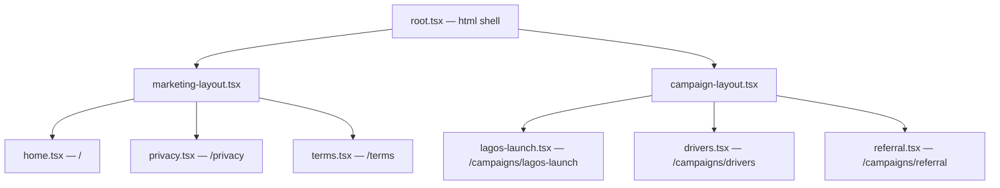

# Design Document: SureWaka Landing Page

## Overview

The SureWaka landing page is a server-side rendered marketing site built with React Router v7 (framework mode) inside the existing `apps/landing` app. It communicates SureWaka's value proposition to three audience segments (senders, businesses, drivers), captures waitlist signups via Supabase, and supports focused campaign pages for paid traffic.

The design prioritizes:
- **Performance on Nigerian mobile networks** — SSR, minimal JS, lazy-loaded images
- **Conversion** — clear CTAs, short copy, audience-specific messaging
- **Developer velocity** — campaign pages are single-file additions, shared components from `@surewaka/ui`
- **Pre-launch security** — env-controlled basic auth middleware

## Architecture

### High-Level System Diagram

```mermaid
graph TD
    subgraph Vercel Edge
        MW[Basic Auth Middleware]
    end

    subgraph apps/landing
        MW --> RR[React Router v7 SSR]
        RR --> ML[Marketing Layout]
        RR --> CL[Campaign Layout]
        ML --> HP[Home Page]
        CL --> CP[Campaign Pages]
        HP --> WF[Waitlist Form]
        CP --> WF
    end

    subgraph packages
        WF --> SH[@surewaka/shared validators]
        WF --> UI[@surewaka/ui components]
    end

    subgraph Supabase
        WF -->|action POST| DB[(waitlist_signups table)]
    end
```

### Route Architecture

React Router v7 uses a flat `routes.ts` file to define the route tree. We use layout routes to separate the marketing site (nav + footer) from campaign pages (minimal layout).



### Request Flow

1. **Vercel receives request** → runs `@react-router/serve` entry
2. **Basic auth middleware** checks `BASIC_AUTH_ENABLED` env var; if enabled, validates credentials via `Authorization` header
3. **React Router** matches route, runs `loader` (SSR data fetch), renders component to HTML
4. **Waitlist form submission** → `action` function validates with Zod, inserts into Supabase `waitlist_signups` table, returns success/error

## Components and Interfaces

### Route Structure (`apps/landing/app/routes.ts`)

```typescript
import { type RouteConfig, index, layout, route } from '@react-router/dev/routes';

export default [
  layout('layouts/marketing-layout.tsx', [
    index('routes/home.tsx'),
    route('privacy', 'routes/privacy.tsx'),
    route('terms', 'routes/terms.tsx'),
  ]),
  layout('layouts/campaign-layout.tsx', [
    route('campaigns/lagos-launch', 'routes/campaigns/lagos-launch.tsx'),
    route('campaigns/drivers', 'routes/campaigns/drivers.tsx'),
    route('campaigns/referral', 'routes/campaigns/referral.tsx'),
  ]),
] satisfies RouteConfig;
```

### Layout Components

#### Marketing Layout (`app/layouts/marketing-layout.tsx`)

Wraps the main site with sticky nav and footer.

```typescript
type MarketingLayoutProps = {
  children: React.ReactNode;
};

// Exports: default component (renders Outlet)
// Contains: <Navbar />, <Outlet />, <Footer />
```

#### Campaign Layout (`app/layouts/campaign-layout.tsx`)

Minimal wrapper — no nav, no footer. Just the SureWaka logo and page content.

```typescript
// Exports: default component (renders Outlet)
// Contains: <CampaignHeader /> (logo only), <Outlet />
```

### Page Sections (Home Page)

| Section | Component | Description |
|---------|-----------|-------------|
| Hero | `HeroSection` | Headline, subheadline, primary CTA |
| Value Props | `ValuePropsSection` | 3+ benefit cards with icons |
| How It Works | `HowItWorksSection` | 3 numbered steps |
| Audience Segments | `AudienceSection` | Cards for senders/businesses and drivers |
| Trust/Social Proof | `TrustSection` | Team intro, trust indicators |
| Waitlist | `WaitlistSection` | Form with name, email, user type |

### Shared Components

#### Navbar (`app/components/navbar.tsx`)

```typescript
type NavbarProps = {
  links: Array<{ label: string; href: string }>;
};

// Behavior:
// - Sticky positioning (top-0, z-50)
// - Logo links to top of page
// - Desktop: horizontal link list + CTA button
// - Mobile (<768px): hamburger icon → slide-down menu
// - Smooth scroll on anchor click
```

#### Footer (`app/components/footer.tsx`)

```typescript
type FooterProps = {
  // No props — content is static
};

// Contains:
// - SureWaka logo + tagline
// - Navigation links (How It Works, Benefits, Join Waitlist)
// - Social links (Twitter/X, LinkedIn, Instagram)
// - Legal links (Privacy Policy, Terms of Service)
// - Contact email
// - Copyright © {currentYear} SureWaka
```

#### WaitlistForm (`app/components/waitlist-form.tsx`)

```typescript
type WaitlistFormProps = {
  source?: string; // tracks where the form was submitted from (e.g., 'home', 'campaign-lagos')
};

// Uses React Router's <Form> component for progressive enhancement
// Fields: fullName (text), email (email), userType (select)
// Validation: client-side via Zod, server-side in action
// Success state: shows confirmation message, hides form
// Error state: inline field errors
```

### Basic Auth Middleware (`app/middleware/basic-auth.server.ts`)

```typescript
export function requireBasicAuth(request: Request): Response | null;
// Returns null if auth passes or is disabled
// Returns 401 Response with WWW-Authenticate header if auth fails
// Checks: BASIC_AUTH_ENABLED, BASIC_AUTH_USER, BASIC_AUTH_PASSWORD env vars
```

This middleware is called in `root.tsx`'s loader (or a parent layout loader) so it applies to all routes. Static assets served by Vercel's CDN bypass the middleware naturally since they don't hit the SSR function.

### Supabase Integration (`app/lib/supabase.server.ts`)

```typescript
import { createServiceClient } from '@surewaka/supabase';

export function getSupabaseAdmin() {
  return createServiceClient();
}

// Used in waitlist form action to insert signups
// Service client is appropriate here — no user auth context for anonymous visitors
```

## Data Models

### Waitlist Signups Table

New table added to `packages/db/src/schema.ts`:

```typescript
export const waitlistUserTypeEnum = pgEnum('waitlist_user_type', [
  'sender',
  'business',
  'driver',
]);

export const waitlistSignups = pgTable('waitlist_signups', {
  id: uuid('id').primaryKey().defaultRandom(),
  fullName: text('full_name').notNull(),
  email: text('email').notNull().unique(),
  userType: waitlistUserTypeEnum('user_type').notNull(),
  source: text('source').default('home'), // tracks which page/campaign
  createdAt: timestamp('created_at').notNull().defaultNow(),
  updatedAt: timestamp('updated_at').notNull().defaultNow(),
});
```

### Waitlist Form Validation Schema

Added to `packages/shared/src/validators.ts`:

```typescript
export const waitlistSignupSchema = z.object({
  fullName: z.string().min(2, 'Name must be at least 2 characters').max(100),
  email: z.string().email('Please enter a valid email address'),
  userType: z.enum(['sender', 'business', 'driver']),
  source: z.string().optional().default('home'),
});

export type WaitlistSignup = z.infer<typeof waitlistSignupSchema>;
```

### Environment Variables

| Variable | Required | Description |
|----------|----------|-------------|
| `SUPABASE_URL` | Yes | Supabase project URL |
| `SUPABASE_SERVICE_ROLE_KEY` | Yes | Service role key for server-side inserts |
| `BASIC_AUTH_ENABLED` | No | Set to `"true"` to enable basic auth |
| `BASIC_AUTH_USER` | Conditional | Username (required if auth enabled) |
| `BASIC_AUTH_PASSWORD` | Conditional | Password (required if auth enabled) |


## Correctness Properties

*A property is a characteristic or behavior that should hold true across all valid executions of a system — essentially, a formal statement about what the system should do. Properties serve as the bridge between human-readable specifications and machine-verifiable correctness guarantees.*

### Property 1: Waitlist signup data persistence round-trip

*For any* valid waitlist signup (fullName of 2–100 chars, well-formed email, userType in {sender, business, driver}), submitting the form action SHALL successfully store the data in Supabase and the stored record SHALL contain the same fullName, email, and userType that were submitted.

**Validates: Requirements 5.3, 5.6**

### Property 2: Invalid email rejection

*For any* string that does not conform to a valid email format (missing @, missing domain, consecutive dots, trailing dots, etc.), submitting the waitlist form SHALL be rejected with a validation error specifically indicating the email field is invalid, and no data SHALL be persisted.

**Validates: Requirements 5.4**

### Property 3: Missing required fields produce per-field errors

*For any* subset of required fields (fullName, email, userType) that are omitted or empty, validating the waitlist form SHALL produce an error message for each missing field, and the set of error field names SHALL exactly equal the set of missing field names.

**Validates: Requirements 5.5**

### Property 4: Basic auth middleware correctly gates access

*For any* HTTP request, WHEN `BASIC_AUTH_ENABLED` is `"true"`, the middleware SHALL return a 401 response with `WWW-Authenticate: Basic` header if and only if the request does not contain a valid `Authorization: Basic` header matching the configured credentials. WHEN `BASIC_AUTH_ENABLED` is not `"true"`, the middleware SHALL allow all requests through regardless of credentials.

**Validates: Requirements 13.1, 13.2, 13.4**

## Error Handling

### Form Validation Errors

| Scenario | Behavior |
|----------|----------|
| Invalid email format | Inline error below email field: "Please enter a valid email address" |
| Missing full name | Inline error below name field: "Name must be at least 2 characters" |
| Missing user type | Inline error below select: "Please select how you'll use SureWaka" |
| Duplicate email | Server returns error; display: "This email is already on the waitlist" |
| Supabase insert failure | Generic error: "Something went wrong. Please try again." + log server-side |

### Implementation Pattern

The action function uses Zod's `safeParse` and returns field errors in a structured format compatible with React Router's `useActionData`:

```typescript
type ActionData = {
  success: boolean;
  errors?: Record<string, string[]>;
  message?: string;
};
```

On the client, `useActionData()` provides the errors object. Each form field checks for its own errors and renders them inline. The form uses React Router's `<Form>` component for progressive enhancement — works without JS, enhanced with JS.

### Network/Server Errors

- Supabase connection failure → catch in action, return generic error message, log to console (Vercel logs)
- Basic auth middleware errors → return 401 with `WWW-Authenticate: Basic realm="SureWaka"` header
- 404 routes → React Router's default error boundary with a "Page not found" message and link home

### Error Boundary

A root-level `ErrorBoundary` export in `root.tsx` catches unhandled errors and renders a minimal error page with the SureWaka logo and a "Something went wrong" message. This ensures the page never shows a raw stack trace to visitors.

## Testing Strategy

### Unit Tests (Vitest)

Focus on specific examples and edge cases for component rendering and static content:

| Test Area | What to Verify |
|-----------|---------------|
| Hero section | Headline, subheadline, CTA button present |
| Value props | At least 3 benefits rendered with titles |
| How it works | 3 sequential steps with numbers |
| Audience segments | 2+ segments with CTAs |
| Footer | Email, social links, copyright year, legal links |
| Navbar | Logo, section links, hamburger at mobile viewport |
| Campaign layout | No nav/footer rendered |
| Waitlist form | All fields present, required attributes set |

### Property-Based Tests (fast-check + Vitest)

Each correctness property is implemented as a property-based test with minimum 100 iterations:

| Property | Test Description | Generator Strategy |
|----------|-----------------|-------------------|
| Property 1 | Valid signup → persisted correctly | Generate random names (2–100 chars), valid emails, random userType. Mock Supabase insert to capture args. |
| Property 2 | Invalid emails → rejected | Generate strings without valid email structure (fc.string filtered to exclude valid emails, plus targeted invalid patterns). |
| Property 3 | Missing fields → per-field errors | Generate random subsets of {fullName, email, userType} to omit. Verify error keys match omitted fields. |
| Property 4 | Auth middleware gating | Generate random (enabled: bool, credentials: string, configured: {user, pass}) tuples. Verify 401 iff enabled AND credentials don't match. |

**Library**: `fast-check` (already widely used in the JS ecosystem, works with Vitest)

**Configuration**:
- Minimum 100 iterations per property (`numRuns: 100`)
- Each test tagged with: `// Feature: surewaka-landing-page, Property {N}: {title}`

### Integration Tests

| Test | What to Verify |
|------|---------------|
| SSR smoke test | Fetch `/` without JS, verify HTML contains hero content |
| Waitlist form E2E | Submit form via HTTP POST, verify Supabase receives data |
| Basic auth E2E | Request with/without credentials when enabled |
| Campaign page routing | `/campaigns/lagos-launch` renders without nav/footer |

### Performance Testing

- Lighthouse CI in GitHub Actions on every PR
- Thresholds: LCP ≤ 2.5s, CLS ≤ 0.1, Performance score ≥ 90
- Bundle size monitoring via Vite's `build --report`

### Test Commands

```bash
pnpm --filter @surewaka/landing test        # Run all tests (Vitest)
pnpm --filter @surewaka/landing test:prop   # Run property tests only
pnpm --filter @surewaka/landing test:e2e    # Run integration tests
```
