# Payment & Wallet Sequence Diagrams

Covers the full payment lifecycle: wallet funding, booking escrow, delivery release, cancellation refunds, and driver payouts.

```mermaid
sequenceDiagram
    autonumber
    actor User as Customer
    actor Driver
    participant App as Mobile App
    participant API as API (Hono)
    participant PS as Paystack
    participant DB as Database
    participant PW as Payment Worker

    %% ─────────────────────────────────────────
    %% 1. WALLET TOP-UP — Card (Paystack Checkout)
    %% ─────────────────────────────────────────
    rect rgb(230, 245, 230)
        Note over User,DB: Flow 1 · Wallet Top-up via Card
        User->>App: Tap "Add Money" → enter amount
        App->>API: POST /wallet/fund { amount, topup_type }
        API->>PS: initializeTransaction(amount, email, { user_id })
        PS-->>API: { authorization_url, reference }
        API-->>App: { data: { authorization_url, reference } }
        App->>PS: Open Paystack checkout (WebView / browser)
        User->>PS: Enters card details, completes payment
        PS-->>App: Redirect to callback URL
        App->>API: GET /wallet/fund/:reference  (poll verify)
        API->>PS: verifyTransaction(reference)
        PS-->>API: { status: "success", amount }
        API->>DB: creditWallet(walletId, amount, "fund", reference) [idempotent]
        API-->>App: { data: { status: "success", amount } }
        App-->>User: "Wallet funded ✓"

        Note over PS,DB: Paystack also fires webhook in parallel
        PS->>API: POST /webhook/paystack { event: "charge.success" }
        API->>API: verifyWebhookSignature(HMAC)
        API->>DB: check existing walletTransaction by reference
        alt reference not yet processed
            API->>DB: creditWallet(walletId, amount, "fund", reference)
        end
        API-->>PS: 200 { ok: true }
    end

    %% ─────────────────────────────────────────
    %% 2. WALLET TOP-UP — DVA (Bank Transfer)
    %% ─────────────────────────────────────────
    rect rgb(230, 240, 255)
        Note over User,DB: Flow 2 · Wallet Top-up via Dedicated Virtual Account
        User->>App: Tap "Bank Transfer"
        App->>API: GET /wallet/dva
        alt DVA already provisioned
            API->>DB: read dvaAccountNo / dvaBank
        else First time
            API->>PS: createCustomer(email, firstName, lastName)
            PS-->>API: { customer_code }
            API->>PS: createDedicatedVirtualAccount(customer_code)
            PS-->>API: { bank.name, account_number }
            API->>DB: update wallets SET dvaBank, dvaAccountNo, dvaCustomerCode
        end
        API-->>App: { data: { bank, account_number } }
        App-->>User: Shows bank + account number to transfer to
        User->>User: Transfers money via banking app
        PS->>API: POST /webhook/paystack { event: "charge.success" }
        API->>DB: creditWallet(walletId, amount, "fund", reference) [idempotent]
        API-->>PS: 200 { ok: true }
    end

    %% ─────────────────────────────────────────
    %% 3. BOOKING — Escrow Hold (Pay with Wallet)
    %% ─────────────────────────────────────────
    rect rgb(255, 248, 220)
        Note over User,DB: Flow 3 · Booking Confirmation (Escrow Hold)
        User->>App: Select carrier / quote, tap "Confirm Booking"
        App->>API: POST /wallet/check { amount }
        API->>DB: getOrCreateWallet(userId)
        API->>DB: SELECT balance FOR UPDATE
        DB-->>API: { sufficient, balance, shortfall }
        alt Insufficient balance
            API-->>App: { sufficient: false, shortfall }
            App-->>User: "Top up ₦X to continue" → redirects to Flow 1
        end
        App->>API: POST /booking/confirm { delivery_id, amount }
        API->>DB: BEGIN TRANSACTION
        API->>DB: SELECT deliveries FOR UPDATE (ownership + status check)
        API->>DB: debitWallet(walletId, amount, "escrow_hold", reference)
        API->>DB: INSERT escrowHolds { status: "held", heldAt }
        API->>DB: UPDATE deliveries SET status="pending", paymentStatus="escrowed"
        API->>DB: COMMIT
        API-->>App: { data: { delivery_id, status: "confirmed" } }
        App-->>User: "Booking confirmed ✓"
    end

    %% ─────────────────────────────────────────
    %% 4. DELIVERY COMPLETE — Escrow Release
    %% ─────────────────────────────────────────
    rect rgb(255, 235, 235)
        Note over Driver,PW: Flow 4 · Delivery Completed → Escrow Release
        Driver->>API: PATCH /deliveries/:id  status="delivered"
        API->>PW: Enqueue escrow-release job { escrowHoldId, deliveryId, driverWalletId }
        PW->>DB: SELECT escrowHolds (status must be "held")
        PW->>DB: BEGIN TRANSACTION
        PW->>DB: UPDATE wallets balance += driverAmount  (escrow minus commission)
        PW->>DB: INSERT walletTransactions { type: "escrow_release" }
        PW->>DB: UPDATE escrowHolds SET status="released", commissionAmount, driverAmount
        PW->>DB: UPDATE deliveries SET paymentStatus="released"
        PW->>DB: COMMIT
        Driver-->>Driver: Wallet credited (delivery amount minus platform fee)
    end

    %% ─────────────────────────────────────────
    %% 5. CANCELLATION — Tiered Refund
    %% ─────────────────────────────────────────
    rect rgb(245, 230, 255)
        Note over User,DB: Flow 5 · Customer Cancellation (Tiered Refund)
        User->>App: Tap "Cancel Delivery"
        App->>API: POST /deliveries/:id/cancel { reason }
        API->>DB: BEGIN TRANSACTION
        API->>DB: SELECT deliveries FOR UPDATE
        Note right of DB: Refund rates by status:<br/>pending/accepted → 100%<br/>en_route/arrived_pickup → 85%<br/>picked_up/en_route_dropoff → 50%<br/>delivered/cancelled → 0% (non-cancellable)
        API->>API: refundAmount = amountPaid × rate
        API->>DB: UPDATE deliveries SET status="cancelled"
        API->>DB: UPDATE escrowHolds SET status="refunded" | "partially_refunded"
        alt refundAmount > 0
            API->>DB: creditWallet(walletId, refundAmount, "refund", "refund_<id>")
        end
        API->>DB: COMMIT
        API-->>App: { data: { delivery_id, refund_amount } }
        App-->>User: "Cancelled — ₦X refunded to wallet"
    end

    %% ─────────────────────────────────────────
    %% 6. DRIVER PAYOUT — Withdraw to Bank
    %% ─────────────────────────────────────────
    rect rgb(230, 255, 245)
        Note over Driver,DB: Flow 6 · Driver Payout (Wallet → Bank)
        Driver->>App: Tap "Withdraw", enter bank details + amount
        App->>API: POST /payouts/request { amount, bank_code, account_number, account_name }
        API->>DB: getWalletByUserId(driverId)
        API->>DB: BEGIN TRANSACTION
        API->>DB: debitWallet(walletId, amount, "payout", reference)
        API->>DB: INSERT payoutRequests { status: "pending" }
        API->>DB: COMMIT
        API-->>App: 201 { data: payoutRequest }
        App-->>Driver: "Withdrawal request submitted"
        Note over DB,PW: Admin/worker processes pending<br/>payoutRequests via Paystack Transfer API<br/>(not yet implemented)
    end
```

## Flow Summary

| # | Flow | Endpoint(s) | Key mechanism |
|---|------|-------------|---------------|
| 1 | Card top-up | `POST /wallet/fund` → `GET /wallet/fund/:ref` | Paystack checkout → verify poll + webhook (both idempotent on `(reference, wallet_id)`) |
| 2 | DVA bank transfer | `GET /wallet/dva` | Paystack Dedicated Virtual Account → webhook credits wallet |
| 3 | Booking confirm | `POST /wallet/check` → `POST /booking/confirm` | Debits wallet into escrow in single DB transaction with row lock |
| 4 | Escrow release | Payment Worker job | Splits total into driver amount + commission; atomic DB transaction |
| 5 | Cancellation refund | `POST /deliveries/:id/cancel` | Tiered rate (100% → 85% → 50%) back to customer wallet; deterministic reference prevents double-refund |
| 6 | Driver payout | `POST /payouts/request` | Debits wallet, queues `payoutRequest` for bank transfer (Paystack Transfer API — pending) |

## Idempotency Notes

- **Webhook + poll race**: both `GET /wallet/fund/:reference` and `POST /webhook/paystack` can credit a wallet. The `(reference, wallet_id)` unique constraint on `wallet_transactions` ensures only one write succeeds.
- **Double-cancel**: refund reference is `refund_<deliveryId>` — deterministic, so a duplicate cancel attempt hits the UNIQUE constraint before any money moves.
- **Escrow re-confirmation**: `POST /booking/confirm` checks `escrowHoldId IS NULL` inside a `FOR UPDATE` lock, preventing a second escrow on the same delivery.
